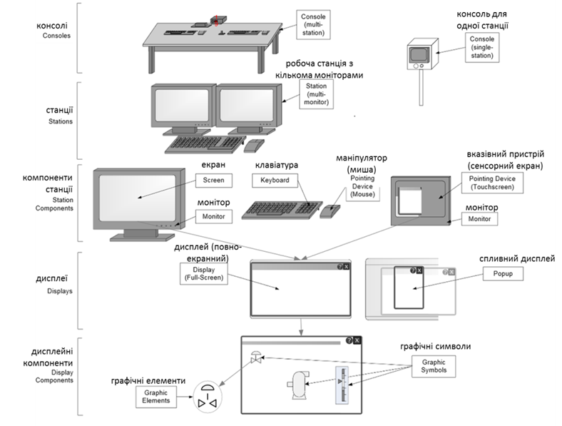
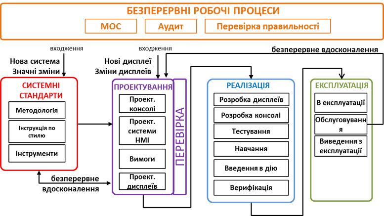

[Головна](README.md) > [10.Життєвий цикл SCADA/HMI](10.md)

# 10.2. Керування життєвим циклом HMI   відповідно до стандарту ISA-101 

У посібнику вже неодноразово згадувався стандарт ISA-101 зокрема в контексті рекомендацій щодо побудови та використання засобів HMI. У цьому підрозділі розглядаються рекомендації щодо керування життєвим циклом систем HMI.  

## 10.2.1. Засоби системи HMI

Перед тим як розглянути модель життєвого циклу відповідно до ISA-101, варто зупинитися на термінології, яка використовується в цьому стандарті для позначення засобів, способів та методів в HMI. Деякі з них згадувалися вже в розділі 5. Для позначення частин компонентів HMI у стандарті ISA-101 використовуються такі терміни (рис. 10.1).

***Людино-машинний інтерфейс*** (Human machine interface, ***HMI***, HMI system) – набір апаратного та програмного забезпечення, яке використовується оператором та іншими користувачами для моніторингу та взаємодії із системою керування та процесом через систему керування.

***Супервізорне керування та збирання даних*** (***SCADA***, Supervisory control and data acquisition) – система моніторингу та керування за процесами, які розподілені географічно. Сюди входить усе обладнання та функції для отримання, оброблення, передачі та відображення необхідної інформації про процес. 

***Control room*** (Пункт керування) – приміщення, що має щонайменше одну консоль HMI, за якою контролюється та/або керується процес, і, можливо, містить інше обладнання системи керування та/або інші засоби для операторів.

***Консоль*** (Console) – апаратне, програмне забезпечення та меблі або панель, за яким користувачі контролюють і/або керують процесом. Консоль може включати в себе кілька станцій, пристроїв зв'язку та інших пристроїв (наприклад, камери, пристрої штрих-коду, кнопкові станції). 

***Робоча станція*** (Station) – первинний користувальницький інтерфейс, що включає один або більше моніторів, а також допоміжне програмне забезпечення, пристрої введення (наприклад, клавіатура, вказівний пристрій) та пристрої виведення (наприклад, динамік, принтер). До HMI-компонентів робочої станції можуть входити монітор, клавіатура, маніпулятор "миша", сенсорний екран. 

***Екран*** (Screen) – частина монітора, яка показує зображення. Хоч деякі комп'ютерні операційні системи підтримують програмний "екран" (робочий стіл), що охоплює декілька моніторів, для цілей стандарту ISA-101 екран є частиною єдиного монітора, на якому відображаються дисплеї. 

***Вказівні пристрої*** (Pointing device) – це пристрої введення, які переводить фізичні рухи на переміщення вказівника, курсору чи іншого індикатора по екрану (наприклад, миша, трекбол або сенсорний екран). 

***Дисплей*** (Display) – візуальне зображення процесу та пов'язаної з ним інформації, що використовується оператором для моніторингу та керування. Дисплеї можуть відображатися на весь екран або бути спливними. ***Спливний дисплей*** (Popup) з’являється (спливає) на передньому плані екрана, можливо, затемнюючи частину або повністю інші дисплеї. 

Дисплейні компоненти (Display components) включають у себе графічні символи та елементи. ***Графічний символ*** (Graphic symbol) – візуальне зображення компонента процесу, інструменту або стану на дисплеї, що складається з комбінації простих ***графічних елементів*** (Graphic elements). 

<a href="media10/10_1.png" target="_blank"></a> 

*Рис. 10.1*. Засоби HMI та їх взаємозв’язки відповідно до стандарту ISA-101 

Під ***платформою*** (Platform) в ISA-101 розуміється окреме сімейство продуктів HMI, здатне використовувати загальний набір інструментів, наприклад, конкретна SCADA/HMI-програма. У цьому посібнику використовуються поняття SCADA/HMI-програма, яка може включати середовище розроблення та середовище виконання або мати окремі режими. Також до платформи належать конкретні апаратні засоби, наприклад, операторські панелі від конкретного виробника. 

***Ергономіка*** (інженерія з урахуванням людських факторів, Human factors engineering, HFE, ergonomics) – наукова дисципліна, що стосується розуміння взаємодії між людьми та іншими елементами системи, яка застосовує теорію, принципи, дані та методи для проектування з метою оптимізації добробуту людини та загальної роботи системи.

## 10.2.2. Загальна модель життєвого циклу HMI

Стандарт передбачає, що HMI має розроблюватися та керуватися з використанням моделі життєвого циклу. Зокрема, в стандарті наведено модель життєвого циклу (рис. 10.2). Основними стадіями життєвого циклу HMI є розроблення системних стандартів, проектування (design), перевірка (review), впровадження (implement) та експлуатація (operate). При цьому можливі дві точки входу в життєвий цикл. Точка входу через "Системні стандарти" є характерною для нової системи. Ця точка входу може бути і для існуючої системи, в тому випадку, якщо необхідно робити значні зміни до неї, що можуть включати міграцію із застарілої платформи HMI. При створенні нових дисплеїв або їх зміни, передбачається точка входу через стадію проектування.

<a href="media10/10_2.png" target="_blank"></a> 

*Рис.10.2.* Спрощена модель життєвого циклу HMI відповідно до стандарту ISA-101

Основою, на яку спирається весь життєвий циклу HMI, є ***системні стандарти*** (System standards), для створення яких передбачається окрема стадія. Слід ще раз наголосити, що під словом "стандарти" розуміються не регуляційні правові акти, а певні документи з описом загальних правил. Ці стандарти включають у себе: Методологію, Інструкцію по стилю та інструментарій HMI. Методологія HMI (HMI philosophy) – це стратегічний документ, що стосується керівних принципів, якими керуються при розробленні кількох або всіх HMI на виробничому майданчику або підприємстві. Інструкція по стилю HMI (HMI style guide) – це документ, що містить стандарти та вказівки щодо проектування та впровадження систем HMI відповідно до вибраної платформи.  Інструментарій HMI (набір інструментів HMI, HMI toolkits) – це колекція від постачальника платформи або заздалегідь створених елементів для конфігурування HMI, які скорочують час і зусилля для створення системи керування. Наведені системні документи повинні зберігатися протягом усього терміну експлуатації установок, для яких вони використовувалися. Після створення і затвердження документів вони можуть змінюватися тільки при значній зміні Методології або платформи. Тим не менше, іноді зміна вимог до проекту можуть також потребувати створення нових стандартів або привести до значних змін до існуючих стандартів системи.

Стадія проектування (Design) включає в себе етапи: 

- користувацькі, функціональні вимоги та вимоги до задач (User, Task, Functional Requirements);

- проектування консолі (Console Design); 

- проектування системи HMI (HMI Sytem design);

- проектування дисплеїв (Display Design). 

Стадія реалізація (Implement) включає в себе етапи: 

- розроблення дисплеїв (Build Displays); 

- розроблення консолі (Build Console);

- тестування (Test);

- навчання (Train);

- уведення в дію (Commission); 

- верифікацію (Verification). 

Стадія експлуатації (функціонування, Operate) включає в себе етапи: 

- в експлуатації (In Service);

- обслуговування (Maintain); 

- виведення з експлуатації (Decommission). 

Сучасні підходи до розроблення ПЗ передбачають ***безперервне вдосконалення*** (continuous improvement). Згідно зі стандартом ISA-101, у життєвому циклі HMI передбачено принаймні два кроки безперервного вдосконалення. Перший показує зв’язок між проектуванням та системними стандартами, що передбачає постійне вдосконалення в проектуванні за зміни стандартів. У свою чергу, проектування може впливати на зміну системних стандартів. Другий процес безперервного вдосконалення йде між експлуатацією та проектуванням, що передбачає внесення змін у систему, що вже функціонує. Процеси безперервного вдосконалення можуть відбуватися також між іншими стадіями та етапами життєвого циклу.      

Керування життєвим циклом передбачає ***безперервні робочі процеси*** (Continuous work processes), які проводяться протягом усього життєвого циклу: керування змінами (Management of Change (MOC)), аудит (Audit) та перевірка правильності (Validation).

## 10.2.3. Стадія розроблення системних стандартів

Як уже зазначено системні стандарти повинні бути створені для формування основи для інших стадій життєвого циклу HMI. Методологія HMI розроблюється, як правило, для всього виробничого майданчика або навіть підприємства, на якому може бути розміщено багато систем керування та HMI, що побудовані з використанням різних платформ та для різних типів об’єктів. На противагу ньому, Інструкція по стилю HMI розроблюється для систем, що побудовані на конкретній платформі, але з використанням основних принципів, викладених у методології. Інструментарій HMI – по суті набір компонентів, з яких будується людино-машинний інтерфейс із використанням конкретної платформи. Слід також розуміти, що системні стандарти варто розроблювати не для однієї HMI, а для всього виробничого майданчику, або навіть підприємства (корпоративні стандарти). Проте на українських підприємствах подібна практика трапляється вкрай рідко.    

Таким чином, першим етапом стадії системних стандартів є розроблення ***методології*** ***HMI*** (HMI philosophy), яка є стратегічним документом, що стосується принципів проектування, розроблення та експлуатації  HMI, які є максимально незалежними від використовуваної платформи. Процеси на цьому етапі базуються на попередньому досвіді користувачів, представленні про користувачів системи, вимоги до завдань та функцій, на кращих практиках, стандартах, вказівках, ергономічних міркуваннях, робочих процесах розроблення та моделі безпеки HMI.

Зокрема, ці керівні принципи включають:

- узгодження з людськими факторами, ергономічні міркування;

- користувацькі вимоги, вимоги до задач та функцій стосовно всіх режимів роботи, які вимагаються для підтримки HMI;

- стандарти та настанови проектування; 

- робочі практики з розроблення та керування HMI, включаючи ескізний проект консолі, кількість екранів, кількість клавіатур/вказівних пристроїв тощо;

- кольорову палітру з призначенням кольорів (може міститися в Інструкції по стилю);

- модель безпеки HMI.

Методологія HMI повинна забезпечити основу концепцій, відповідно до яких нові розробники та користувачі можуть зрозуміти основні принципи та технічні обґрунтування, що дозволить їм ефективно створювати та підтримувати роботу HMI. Методологія не повинна містити конкретних платформозалежних деталей щодо впровадження. Ці деталі описані в Інструкції по стилю та інструментарії. Хоч стандарт дозволяє об’єднувати в єдиний проектний документ Методологію та Інструкцію по стилю, але на певних етапах життєвого циклу це може призвести до ряду незручностей. Тому рекомендується робити обидва стандарти. По-перше, при зміні в технології, устаткованні, використовуваних засобах автоматизації (платформи) Методологія може не потребувати оновлень, тому зміни потрібно вносити тільки в Інструкцію по стилю. По-друге, на підприємствах із різноманітними платформами Методологія може бути спільним документом для всіх систем, тоді як Інструкція по стилю HMI – для кожної платформи окремо. У свою чергу, Методологія повинна бути достатньо універсальною, щоб бути застосовною для Інструкцій по стилю для всіх платформ. 

У Методології наводяться загальні вказівки щодо моделі безпеки HMI. Зокрема, тут означується, як групи користувачів будуть взаємодіяти із системою, якої функціональності потребує кожна група та яких дозволів. Цей високорівневий опис потім використовується для створення Інструкції по стилю HMI та розробленого кінцевого інструментарію, забезпечуючи таким чином запропоновану модель безпеки для системи. Опис безпеки може також включати процеси реєстрації в журналах змін у системі, перелік груп користувачів, які можуть змінити систему, та те, яким чином зміни керуються на системному рівні HMI.

У праці [[5](https://www.amazon.com/High-Performance-HMI-Handbook-Comprehensive-ebook/dp/B00CELQJU8)] можна знайти приклад змісту документа методології HMI. Наводимо його  адаптацію.

```
1. Вступ.
	1.1. Призначення та використання Методології HMI.
	1.2. Призначення та функції людино-машинних інтерфейсів.
	1.3. Опис функцій елементів HMI.
		1.3.1. Наповнення дисплея.
		1.3.2. Розташування компонентів на дисплеї.
		1.3.3. Ієрархія дисплеїв.
		1.3.4. Навігація по дисплеях.
		1.3.5. Відображення тривог та керування тривожною сигналізацією.
2. Процеси проектування HMI.
	2.1. Крок 1 – Перетворення Методології HMI в Інструкцію по стилю.
	2.2. Крок 2 – Оцінювання та атестація існуючої графіки відповідно щодо задоволення вимог, визначених у Методології.
	2.3. Крок 3 – Визначення конкретних необхідних робочих характеристик та цільових показників для керування процесами для всіх операційних режимів.
	2.4. Крок 4 – Проведення аналізу завдань для визначення керівних діяльностей, що необхідні для досягнення робочих характеристик та цільових показників.
	2.5. Крок 5 – Проектування та побудова графіки, використовуючи принципи проектування в методології HMI та елементів для Інструкції по стилю, для вирішення поставлених завдань.
	2.6. Крок 6 – установлення, введення в дію та періодична перевірка показників ефективності HMI.
3. Призначення та використання Інструкцій по стилю та Інструментарію HMI.
	3.1. Специфіка платформи.
	3.2. Зміст і принципи використання Інструкцій по стилю.
4. Контроль та перевірка ефективності HMI.
5. Керування змінами (MOC.
6. Диспетчерський пункт.
	6.1. Фактори проектування диспетчерського пункту.
	6.2. Практики для роботи в диспетчерському пункті.
	6.3. Проектування консолі.
	6.4. Робочі практики для оператора .  
```

Після розроблення Методології розробляють ***Інструкції по стилю HMI*** (HMI style guide) – документ, що містить заводські та/або корпоративні стандарти та вказівки щодо проектування та впровадження систем HMI з використанням конкретної платформи. Інструкція повинна містити загальні принципи проектування дисплеїв та пов'язаних із ними застосунків і слугувати стандартом для реалізації. Вона має деталізувати керівні принципи, що дані в Методології, включаючи людські фактори (ергономіку), стандарти проектування, вимоги до завдання та функцій, а також користувацькі вимоги. Тут можуть бути детально означені рекомендовані для керування HMI робочі практики, що попередньо були окреслені в Методології HMI. Вказівки щодо впровадження повинні включати показники ефективності HMI.

В Інструкцію необхідно також включити керівництво щодо типів дисплеїв та їх переважного використання, кольорову палітру та призначення кольорів, якщо це не вказано в Методології. Тут відображаються усі аспекти щодо дисплеїв – компонування, ієрархія, фон, використання ліній, тексту, об’єктів, трендів, навігації і т. д. Для  основних динамічних графічних об'єктів інструкція зі стилю HMI повинна містити опис поведінки об'єкта, його представлення (розмір, колір тощо) та ілюстрації можливих станів. Оскільки інструкція розробляється для конкретної платформи, то вона враховує її можливості та обмеження.

У праці [[5](https://www.amazon.com/High-Performance-HMI-Handbook-Comprehensive-ebook/dp/B00CELQJU8)] можна знайти приклад змісту документа Інструкції по стилю HMI. Наводимо його адаптацію.

```
1. Призначення та використання Інструкції по стилю.
2. Специфіка платформи.
3. Робочі процеси розроблення HMI.
4. Опис та використання Інструментарію 
5. Концепції, цілі та зміст дисплеїв різних рівнів.
	5.1. Дисплей рівня 1 – огляд технологічного процесу.
	5.2. Дисплеї рівня 2 – технологічні процеси функціонування установок.
	5.3. Дисплеї рівня 3 – деталізація технологічного процесу.
	5.4. Дисплеї рівня 4 – підтримка та діагностика. 
6. Типові глобальні системні дисплеї.
7. Методології взаємодії оператора з HMI.
	7.1. Використання стандартної функціональності платформи.
	7.2. Змінні області та лицьові панелі.
	7.3. Засоби керування.
	7.4. Керування вікнами.
8. Компонування дисплея.
9. Методи та практики навігації.
	9.1. Програмовані кнопки та комбінації клавіш.
	9.2. Використання клавіатури, меню та навігація табуляцією.
	9.3. Предметно-орієнтована навігація.
	9.4. Використання вказівних пристроїв. 
10. Базові принципи зображення технологічних процесів.
	10.1.   Правила графічного представлення технологічних процесів.
	10.2.   Високоефективні елементи дисплеїв.
11. Правила використання та реалізації і важливість трендів.
12. Використання кольору.
	12.1.   Означення та налаштування кольору.
	12.2.   Роль кольору в ситуаційній обізнаності.
	12.3.   Проектування тлумачення кольорів.
13. Детальна специфікація та функціональність дисплейних елементів.
	13.1. Відображення ліній.
	13.2. Відображення статичних текстів, списків, таблиць та структур.
	13.3. Ємності та інші статичні зображення устатковання.
	13.4. Бібліотека динамічного устатковання.
	13.5. Відображення аналогових та дискретних значень.
	13.6. Відображення показників ефективності.
	13.7. Відображення регуляторів.
	13.8. Бібліотека динамічних форм та елементів.
	13.9. Механізми введення даних та обмеження.
	13.10.  Елементи увімкнення/вимкнення електричного устатковання.
	13.11.  Відображення клапанів та інших регулюючих органів.
	13.12.  Логічні елементи та елементи блокування, дисплеї з логічними схемами.
14. Правила найменування дисплеїв, файлів та шляхів для збереження.
15. Функціональність тривожної сигналізації.
    15.1. Правила налаштування дисплея зведення тривог.
    15.2. Правила графічного зображення тривог.
    15.3. Правила налаштування для звукового оповіщення тривог.
    15.4. Відображення ненормальних умов.
    15.5. Функціональність керування тривожною сигналізацією.
    15.6. Зв'язок станів тривог з графічними компонентами.
    15.7. Реагування оператора на тривогу. 
    15.8. Відображення та сигналізування системних тривог. 
    15.9. Відображення та функціональність відтермінування тривог. 
    15.10.  Стано-орієнтовані тривоги.
    15.11.  Боротьба з переповненням тривог.
    15.12.  Система сповіщення оператора.
16. Графічні компоненти та дисплеї спеціального призначення.
    16.1.   Помічники запуску установки/устатковання.
    16.2.   Помічники зупинки установки/устатковання.
    16.3.   Дисплеї керування для очікуваних ненормальних ситуацій.
    16.4.   Дисплеї керування зміни типу продукту.
17. Відображення програмної функціональності (процедур).
18. Вимоги до швидкості виклику та оброблення дисплеїв.
19. Застосування, функціональність та відображення розширеного керування технологічними процесами (APC).
20. Список стандартизованих абревіатур та позначень одиниць вимірювання.
21. Стандартні інструменти та методології створення дисплеїв.
22. Резервне копіювання системних файлів. 
23. Керування змінами (MOC).
```

Для прикладу інструкції по стилю можна ознайомитися з білою книгою від Rockwell Automation [[6](https://literature.rockwellautomation.com/idc/groups/literature/documents/wp/proces-wp023_-en-p.pdf)] та з корпоративними стандартами ITER [[7](https://static.iter.org/codac/pcdh7/Folder%201/12-HMI_Style_Guide_and_Toolkit_3XLESZ_v3_7.pdf?fbclid=IwAR3TKlTsbbLirsz8xm7Azyn9q9YnDk5hiQFrv4jmJCJQtBuCgtCSCoub0Ws)].  

   Розроблені правила та рекомендації в Інструкції по стилю реалізуються через ***Інструментарій HMI*** (HMI toolkits) – сукупність елементів проектування HMI для використання в межах конкретної платформи. Елементи інструментарію розроблені таким чином, щоб відповідати вимогам інструкції по стилю. Набори інструментів можуть поставлятися з HMI від постачальника системи керування, інших третіх сторін, може бути розроблений для платформи на замовлення або комбінуватися.

Інструментарій HMI може створюватися та модифікуватися як окрема бібліотека або бути розподілена на окремі набори інструментів. Основний набір інструментів включає шаблони відображення, спливаючі вікна, лицьові панелі, а також статичні та динамічні графічні символи та компоненти. Для різних платформ, їх версій та/або підтримуючих застосунків можуть підтримуватися окремі набори інструментів, які розроблені на підтримку концепцій Методології та Інструкції по стилю. Інструментарій HMI повинен бути задокументований або в межах платформи HMI, або в окремих документах.

   Кожен елемент проектування створений для забезпечення вимог до завдань або функцій, а також користувацьких вимог. У міру зміни цих вимог та технологічних процесів змінюються і набори інструментів. Це повинно здійснюватися в процесах керування змінами (MOC). Область керування змінами може включати також різні версії операційної системи та програмного забезпечення платформи. У складніших випадках для керування набором інструментів HMI можуть бути ефективними системи керування версіями (СКВ).

У якості прикладу Інструкції по стилю можна подивитися праці [[6](https://literature.rockwellautomation.com/idc/groups/literature/documents/wp/proces-wp023_-en-p.pdf)] та [[8](https://literature.rockwellautomation.com/idc/groups/literature/documents/rm/proces-rm002-en-p.pdf)].  

## 10.2.4. Стадія проектування

Стадія проектування передбачає роботи, які передують реалізації, та як правило включає в себе етапи: 

- проектування консолі; 

- проектування системи HMI;

- аналіз та розроблення користувацьких, функціональних вимог та вимог до завдань;

- проектування дисплеїв. 

Створена на цій стадії проектна документація HMI повинна зберігатися протягом усього життєвого циклу системи (від реалізації до виведення з експлуатації). 

Етап ***проектування консолі*** (Console Design) передбачає діяльності щодо визначення та створення відповідних документів щодо забезпечення мікросередовища для оператора. У область діяльності етапу, зокрема, входять роботи по комплектації консолі необхідними меблями, забезпечення операторів необхідними умовами роботи (освітлення, температура, звук тощо) та відповідними робочими засобами (телефони, вимикачі, панелі оповіщування, радіо, комунікатори тощо). Сюди також входить фізична підтримка ***робочого місця*** (***workspace***) оператора, яке може бути розміщене в пункті керування офісного типу або безпосередньо біля установки. Залежно від місця розташування та функціональних вимог це робоче місце може включати в себе техніку офісного виконання та/або інше обладнання спеціального призначення. При фізичному розташуванні та проектуванні інструментарію може потребуватися врахування використання декількох розмірів екрану.

Вхідною інформацією для етапу проектування консолі є користувацькі вимоги, вимоги до функцій та завдань, специфікації постачальника засобів та стандарти ергономіки (Human Factors Engineering). Результати етапу відображаються в документах проекту консолі.  

Якщо у розробників немає досвіду розроблення консолі для подібних технологічних процесів, то для визначення необхідної кількості операторів може бути корисним аналіз робочого навантаження на кожного з них. Для розрахування розміру та кількості моніторів, необхідних у конструкції консолі, після визначення кількості операторів та сфери їхньої діяльності, слід розробити попередню (ескізну) версію ієрархії дисплеїв. Кількість та розміри моніторів впливають на фізичну конструкцію обладнання та меблів консолі. Кількість моніторів також впливає на рішення щодо розроблення в ПЗ, зокрема розміру різних компонентів екрана, типів дисплеїв (оглядові, робочі та деталізовані дисплеї), методи взаємодії з оператором та загальні підходи щодо навігації. При оцінюванні конструкції монітора та консолі слід враховувати особливості роботи в нештатних режимах. Якщо в одному пункті керування наявні кілька консолей, слід визначити їх оптимальне розміщення з точки зору суміжної роботи кількох операторів. При розташуванні обчислювальної техніки слід також враховувати вплив на рівень шуму та тепла навколишнього середовища та доступність для обслуговування. Комп'ютери, пов’язані з робочими станціями, можуть бути розташовані віддалено, що дає змогу усунути шум і теплові навантаження в робочому місці оператора. Це віддалене місце може полегшити обслуговування та підтримку комп'ютера.

Важливо розуміти, що деякі галузі мають додаткові вимоги, які впливають на конструкцію консолі, залежно від типу галузі та/або нормативних вимог. Слід обережно інтегрувати це обладнання з обладнанням станції оператора, щоб підтримувати очікувані завдання оператора та враховувати людські фактори та ергономічні стандарти проектування. Зокрема для отримання додаткової інформації про конструкцію консолі та керування в ISA-101 посилаються на ANSI/HFES 100-2007 “Human Factors Engineering of Computer Workstation” та ISO 11064 “Ergonomic design of control centres”.

Етап ***проектування системи HMI*** (HMI system design) включає в себе роботи по вибору платформи для системи керування (інструментального ПЗ), відповідної операційної системи, а також вибору для використання в системі інструментарію HMI, що є складовою системних стандартів. Дані рішення фіксуються в однойменних документах. Вхідною інформацією для цього етапу є користувацькі вимоги, вимоги до функцій та завдань, стандарти проектування системи керування, стандарти проектування мережі, попередній проект мережі, модель безпеки.  На цьому етапі необхідно враховувати концепції проектування мережі, роль користувачів, безпеку та комунікаційні інтерфейси засобів третіх фірм (що не є частиною платформи), які інтегруються в систему. Ці рішення впливають на проект та функціональність HMI.

Етап ***аналізу та*** ***розроблення користувацьких вимог, вимог до функцій та завдань*** (User, task and functional requirements) передбачає визначення та документування вимог цього типу, включаючи зв’язані з ними функції та користувачів (як первинних, так і вторинних). До первинних користувачів належать ті, хто безпосередньо відповідає за роботу устатковання, керованого з HMI. До вторинних користувачів належать ті, хто підтримує операційну діяльність, зокрема обслуговування, інженерію та організаційне керування. Вхідними даними для цього етапу є Методологія HMI, Інструкція по стилю, попередній проект консолі, попередні функціональні вимоги та вимоги до завдань. Результатом є однойменний до назви етапу документ.

Після того як визначені основні ролі та вимоги користувачів, фіксуються, переглядаються та оптимізуються фактичні завдання, які повинні виконувати користувачі. При цьому враховують:

- нормальні та ненормальні умови експлуатації;

- потребу в інформаційній довідці для конкретного типу користувача (онлайн або офлайн);

- вимоги, що стосуються ролей користувача та привілеїв облікового запису;

- термінологію, що використовується користувачем, та модель (представлення) установки та/або процесу з точки зору користувача;

- функціональні потреби HMI для користувачів. 

Задоволення потреб вторинних користувачів не повинно перешкоджати виконанню вимог первинних. У випадках, коли ці потреби сильно відрізняються, і не можуть ефективно використовуватися на одному дисплеї або їх наборі, варто створити окремі дисплеї для забезпечення потреб вторинних користувачів.

Для означення вимог до завдань у стандарті приводяться кілька методів:

- ієрархічний аналіз завдань (Hierarchical Task Analysis): завдання з усього переліку, що складають роботу чи функцію, кластеризують/групують навколо спільного характеру; потім ці завдання для цілей навчання та прийняття рішень організовуються в межах кожної групи таким чином, щоб показати ієрархічні зв’язки між ними;

- аналіз часової шкали (Timeline analysis): завдання розбиваються на події та відображаються на графіку за часовим горизонтом;

- аналіз зв’язку (Link analysis): показує частоту зв’язку між завданнями; корисний для упорядкування завдань, а також може бути використаний для визначення того, як часто користувачеві доводиться переходити з одного дисплея на інший;

- інші, більш досконалі методи, але які потребують експертизи ергономіки, зокрема: абстрактний ієрархічний аналіз (abstraction hierarchical analysis), когнітивний аналіз робіт (cognitive work analysis), екологічний аналіз (ecological analysis) та інші.

У випадках, коли для підтримки потреб користувачів потрібні складні користувацькі програми, слід розробити функціональні вимоги специфікації для розроблення спеціальних застосунків.

Вимоги до HMI можуть бути означені як частина системи керування або функціональних вимог керуючих застосунків. У цьому випадку ця документація є входом для їхнього етапу проектування (в ISA-101 посилаються на стандарт ANSI/ISA-5.06.01-2007).

На етапі ***проектування дисплеїв*** (Display design) розробляють концепції побудови дисплеїв та навігації по них. Для складних застосунків або процесів це може також включати деяке попереднє прототипування дисплеїв. Вхідними даними для етапу є Методологія, Інструкція по стилю HMI, користувацькі вимоги, вимоги до функцій та завдань, дані від користувача в процесі перевірки.   

Після означення вимог варто розробити концептуальний проект HMI із задіянням до процесів розроблення первинних та вторинних користувачів. Це підтверджує, що вимоги були адекватно враховані ще до початку детального проектування. Спочатку може відбуватися перша перевірка "макета", де відображається основний вміст, після чого проводиться остаточна перевірка з усією інформацією та взаємодією між пристроями.

Для більш складних систем ефективний HMI може потребувати вдосконалення документів специфікації користувача в ітераційному процесі, гарантуючи, що кінцевий HMI ефективно підтримує вимоги. Стадія перевірки (review) показана як паралельний процес до проектування, щоб підкреслити неперервний характер цієї частини життєвого циклу HMI.

Для регульованих галузей ця стадія життєвого циклу може потребувати перевірки щодо правильності (валідацію). Це досягається і підтримується завдяки прийняттю безперервних діяльностей протягом життєвого циклу. Цей крок перевірки показаний як безперервний робочий процес у життєвому циклі, оскільки впливає на різні стадії життєвого циклу (наприклад, проектування, реалізацію, експлуатацію) і може включати конкретні процедури та звіти а також відповідну документацію.

## 10.2.5. Стадія реалізації

HMI розробляють на стадії реалізації. При цьому використовується програмне та апаратне забезпечення конкретної платформи та вихідні документи з попередніх стадій (системні стандарти та проектування).

Вхідними даними для етапу ***розроблення дисплеїв*** (Build Displays) є документи проектування дисплеїв, вихідними – розроблені дисплеї та навчальні матеріали. Розроблення дисплеїв передбачає їх створення з використанням графічних об’єктів та елементів з інструментарію HMI та при необхідності з використанням спеціальних налаштувань та сценаріїв. У системі розроблення може бути доступним як створення, так і тестування дисплеїв. 

На етапі ***розроблення консолі*** (Build Console) розробляють апаратне та програмне забезпечення консолі, перевіряють кути огляду, піднесення екрана на потрібній висоті, розташовують клавіатуру та пристрої введення та розміщують інші елементи. Вхідними даними для етапу є документи проектування консолі. Для нових систем консоль може знадобитися для побудови тимчасових дисплеїв тестування та навчання. Розроблення консолі включає встановлення та конфігурування програмного забезпечення операційної системи та системи керування. Вона також може включати систему тестування з використанням кінцевого обладнання та відповідних меблів. Для існуючих систем побудова та тестування дисплеїв можуть потребувати змін у програмному забезпеченні консолі, тобто змін в існуючій системі.

На етапі ***тестування*** (Test) проводяться комплексні випробування HMI та консолі. Вхідними даними для етапу є документи з вимогами (користувацькими, до функцій та завдань), критерії використовності (usability) та робочі характеристики (performance). Після проходження тестування система готова до етапу введення в дію. Вихідними документами для етапу є документи по проходженню тестування.   

Тест – це комплексне випробування системи на вимоги як щодо зручності використання, так і загальних робочих характеристик. Зазвичай до інтегрування, або одночасно з нею в живу систему проводиться початкове функціональне випробування. Це робиться в середовищі розроблення або виконання в режимі відключення від об’єкта. До етапу введення в дію може знадобитися ще комплексне випробування фактично впровадженої системи (див. ANSI/ISA-62381 для вказівки та вимог щодо приймальних випробувань). Виправлення помилок та подолання проблем, виявлених у процесі розроблення та випробування, повинні мінімізувати витрати та зусилля на етапі введення в дію. 

Для цієї стадії життєвого циклу в деяких галузях промисловості може знадобитися план випробування та документування. Випробування може бути частиною аудиторського контролю. Керування змінами (MOC), перевірка правильності та аудит відображаються в ЖЦ як безперервні робочі процеси.

Якщо для навчання операторів передбачено використання тренажерів, то вони можуть бути корисними для випробувань з наявними операторами. Під час випробувань оператори виконують відповідні завдання в системі, в якій вони працюватимуть у майбутньому. Такі випробування підтверджують або спростовують задоволення вимог у більш реальних умовах. За доступності, для перевірки ефективності HMI в різних режимах роботи можуть бути імітовані збої та інші ненормальні умови роботи.

Для перевірки випробуваннями повинні бути сформовані план, звіт про перевірку правильності та введення в дію HMI. Окремі регульовані галузі можуть мати конкретні вимоги до цих документів. Ці документи включають теми:

- плани випробувань;

- методика випробувань;

- вимоги до плану перевірки, специфічні для цього кроку перевірки;

- система відстеження недоліків;

- інженерні критерії людських факторів;

- керування змінами.

Вхідними даними для етапу ***навчання*** (Train) є Методологія HMI, інструкція по стилю, документи по проектуванню дисплеїв, інструкції для користувача та онлайн документація (за необхідності), навчальні матеріали. Навчання проводиться за розробленими дисплеями на консолі. Результати навчання фіксуються в журналах. За результатами проходження навчальних курсів може оновлюватися навчальний матеріал.    

Залежно від складності застосунку HMI та поточних знань оператора, це може бути досягнуто шляхом навчання на робочій установці або бути частиною більш формального навчального процесу. Навчання може проводитися в аудиторії, на електронній самостійній системі, на тренажері для навчання, в системі розроблення або на реальній системі. Навчання може знадобитися також для членів груп вторинних користувачів, включаючи технічне обслуговування та інженерний персонал.

У багатьох випадках HMI будується виключно з елементів інструментарію HMI. Якщо усі дисплеї використовують лише такі елементи, може бути прийнятним детальне навчання по інструментарію HMI та обмежене навчання на окремих дисплеях. 

У стандарті для проведення навчання виділено окремий пункт, який розглянуто в параграфі 10.2.8. 

Етап ***введення в дію*** (Commission) призначений для фінального тестування HMI у виробничому середовищі. Вхідними даними для цього етапу є інструкції користувача та файли онлайн-допомоги (за необхідності). Після введення в дію HMI готова до верифікації (за необхідності). За результатами етапу складаються відповідні документи та виноситься результат щодо прийняття HMI до верифікації.   

Введення в дію – це остаточне тестування з підключеннями даних процесу, а також перевірка на місцях та документування (якщо потрібно) для підтвердження всіх вимог. Для деяких високорегульованих галузей необхідний спеціальний план перевірки правильності, який може включати вимоги, пов'язані з проведенням випробувань. Слід установити план введення в експлуатацію. Під час введення в дію усі передбачені посібники користувача та онлайн-довідникові системи повинні бути на місці для можливості їх використання.

Регульовані галузі можуть потребувати конкретних планів верифікації з відповідною документацією та затвердженнями, перш ніж система перейде до стадії експлуатації. Етап ***верифікації***  (Verification) базується на плані верифікації та документах по введенню в дію. Верифікація передбачає перевірку конкретних показників, які повинні забезпечити таку ситуацію, щоб система була прийнята в експлуатацію. За результатами верифікації складається документ та виноситься результат щодо прийняття HMI в експлуатацію. 

## 10.2.6. Стадія експлуатації

Після завершення введення в дію (та верифікації, якщо потрібно) HMI переходить на етап ***експлуатації*** (In Service). 

Зміни до HMI слід вносити в процесі керування змінами (MOC). Це робиться на етапі ***обслуговування*** (Maintain), під час якого можуть проходити такі дії: модифікації (оновлення) операційної системи; модифікація (оновлення) програмного забезпечення системи безпеки або платформи; виправлення наявних помилок та модифікації, що відображають зміни в самому процесі або підтримки нових функціональних можливостей. Це частина циклу безперервного вдосконалення, показаного на рис.10.2. Проведення обслуговування може ініціюватися запитом на зміни від MOC для виправлення помилок, вдосконалення чи оновлення.    

Під час стадії експлуатації з регулярним плановим інтервалом має проводитися резервне копіювання. Резервні копії повинні включати не тільки файли, необхідні для відновлення HMI, а й усі необхідні файли системи керування, щоб мінімізувати час і зусилля на відновлення в разі втрати. Це може включати такі елементи:

- вбудовані програми;

- конфігурацію системи керування;

- будь-який інший код системи керування, необхідний для роботи програми HMI.

Повинна існувати технічна документація з інструкціями щодо відновлення системи за допомогою цих резервних копій. Щоб забезпечити успішне відновлення, цей процес повинен бути перевірений.

Етап ***виведення з експлуатації*** (Decommission) – це діяльність, яка видаляє всю або частину засобу HMI з експлуатації. Це включає оновлення будь-якої пов’язаної документації і може потребувати випробувань та навчання, особливо якщо якась частина HMI залишається в експлуатації.

## 10.2.7. Безперервні робочі процеси

Безперервні робочі процеси проводяться протягом усього життєвого циклу системи. До цих процесів належать керування змінами (MOC – Management of Change), аудит та перевірка правильності (валідація).

Як тільки життєвий цикл HMI перейшов на етап експлуатації, усі зміни до системи рекомендується оброблювати за допомогою ***процесу керування змінами*** (MOC, Management of Change), який включає в себе означення частин HMI, які підлягають цим змінам. Цей процес повинен включати в себе виконання та дотримання системних стандартів (Методології HMI, інструкції по стилю та компоненти інструментарію HMI). Установлені стандарти допоможе підтримувати керування версіями інструментарію HMI з акцентом на підтримку системних стандартів. У деяких галузях промисловості для керування змінами в користувацьких дисплеях та інших частинах системи керування може бути доцільним використовувати механізм керування документами.

***Аудит*** (Audit) – це робочий процес, що забезпечує керування HMI відповідно до життєвого циклу та системних стандартів. Періодичні аудити повинні проводитися для перевірки відповідності системи цим стандартам. Регульовані галузі можуть потребувати документування аудиту з визначеною періодичністю та конкретних планів ***перевірки відповідності*** (Validation) протягом усього життєвого циклу.

## 10.2.8. Проведення навчання

Для забезпечення ефективного використання HMI необхідне навчання корис­тувачів. Це може бути пов’язано з різними аспектами, зокрема із впровадженням нової системи або появи нового оператора. Користувачі повинні пройти навчання щодо основної роботи застосунку платформи, зокрема в таких діяльностях, як:

- інтерпретації графічних символів;

- маніпулювання елементами відображення (наприклад, відкривання/закриття клапанів або зміна заданих значень);

- виявлення та взаємодія з тривожними сигналами, подіями процесу та послідовностями;

- навігація по екранах.

Хоч Методологія, Інструкція по стилю, інструментарій HMI та документація на розроблення системи включають цю інформацію, ці документи можуть бути недостатніми для навчання користувачів. Тому повинні бути означені вимоги щодо розроблення будь-яких додаткових навчальних матеріалів для користувачів HMI.

Нижче наводиться перелік типових тем, що висвітлюються в навчальному процесі для використання HMI. Одні й ті самі теми можуть бути використані для різних користувачів і повинні бути висвітлені тією чи іншою мірою відповідно до конкретного рівня відповідальності.

**Операційний персонал (оператори процесу, технологи).** Навчання по операційній частині (Operations) повинно включати теми щодо використання HMI для виконання необхідних оперативних завдань, зокрема:

- взаємодія із системою керування в усіх режимах роботи;

- використання тривожної сигналізації;

- розпізнавання ненормальних умов керування, таких як форсовані значення;

- реагування на збої в процесі або системі керування;

- розуміння організації навігації по дисплеям;

- пошук історичних даних;

- коригування заданих значень;

- коригування параметрів, таких як режими та виходи;

- запуск партії або ініціювання попередньо запрограмованої послідовності;

- запуск або припинення складного неперервного процесу;

- розпізнавання спеціальних умов роботи устатковання або пристрою, наприклад таких, як режим обслуговування;

- ознайомлення з Методологією  HMI.

Прийнятним та ефективним методом навчання оперативного персоналу є використання тренажерів, ідентичних фактичному HMI на установці.

**Обслуговуючий персонал (відділ КВПіА, механіки, електрики, мехатронники і т. п.)**. Навчання персоналу з обслуговування установок, відповідального за технологічне обладнання, а також HMI та систему керування повинно включати теми:

- використання HMI для виконання необхідних завдань з обслуговування;

- документація постачальника на компоненти обладнання HMI;

- документація постачальника для інструментів конфігурування HMI;

- ознайомлення з функціональністю операційної частини;

- ознайомлення з HMI, системою керування та інструментарієм діагностики процесу;

- процеси керування змінами (MOC), що охоплюють HMI;

- ознайомлення з Методологією HMI.

**Інжиніринговий персонал та адміністратори.** Навчання інженерів та адміністраторів, відповідальних за впровадження та модифікацію HMI, повинно включати:

- використання HMI та інструментів платформи для виконання завдань інженерії (розроблення, змінювання);

- документація постачальника на компоненти обладнання HMI;

- документація постачальника для інструментів конфігурування HMI;

- ознайомлення з функціональністю операційної частини;

- ознайомлення з діагностичними інструментами;

- процедури резервного копіювання та відновлення системи;

- безпека HMI та спосіб користування обліковими записами та привілеями користувачів HMI;

- процеси керування змінами (MOC), що охоплюють HMI;

- ознайомлення з Методологією HMI, інструкціями по стилям та інструментарієм;

- будь-які необхідні періодичні зміни або оновлення операційних систем, інструменти безпеки тощо.

**Менеджмент**. Для цього типу користувачів навчання повинно включати використання HMI для виконання необхідних завдань організаційного керування. Ці завдання, як правило, включають доступ до інформації про виробництво та експлуатацію, яка може бути як доступною так і не доступною поза середовищем HMI. Якщо для доступу до цієї інформації призначений тільки HMI, то навчання цих користувачів обов’язкове.

[<-- 10.1. Загальні процеси життєвого циклу SCADA/HMI](10_1.md)

[--> 10.3. Модель життєвого циклу систем тривожної сигналізації   відповідно до ISA-18.2 ](10_3.md)