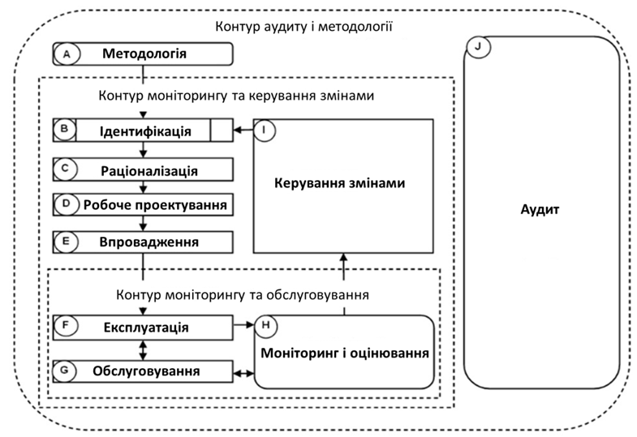

[Головна](README.md) > [10.Життєвий цикл SCADA/HMI](10.md)

# 10.3. Модель життєвого циклу систем тривожної сигналізації   відповідно до ISA-18.2 

Усі процеси життєвого циклу систем тривожної сигналізації входять до ***організації систем тривожної сигналізації*** (Alarm management, або керування тривогами). До цих процесів входить означення, документування, проектування, експлуатація, моніторинг та обслуговування систем тривожної сигналізації.

Аналогічно ISA-101, згідно зі стандартом ISA-18.2, усім зацікавленим особам (stakeholders) у системах тривожної сигналізації слід розглядати її з точки зору життєвого циклу. Важливість саме такого підходу відмічається як у стандарті ISA-18.2, так і в ряді статей. У цьому підрозділі коротко описано основні дії, які необхідно проводити на стадіях життєвого циклу системи тривожної сигналізації. За необхідності детального розгляду зверніться до стандарту ISA-18.2.   

## 10.3.1. Життєвий цикл організації функціонування тривог 

На рис. 10.3 показано взаємозв'язок між стадіями життєвого циклу ***організації систем тривожної сигналізації*** (***ОСТС***), описаних у стандарті. Життєвий цикл ОСТС охоплює такі стадії:

- A – Alarm Philosophy: Методологія системи тривожної сигналізації;

- B – Identification: ідентифікація;

- C – Rationalization: раціоналізація;

- D – Detailed Design: робочий проект;

- E – Implementation: впровадження;

- F – Operation: експлуатація;

- G – Maintenance: обслуговування;

- H – Monitoring and Assessment: моніторинг і оцінювання; 

- I – Management of Change (MOC): керування змінами;

- J – Audit: Аудит.

Модель життєвого циклу є корисною у визначенні вимог для впровадження системи функціонування тривог. Цей життєвий цикл можна застосовувати для впровадження нових систем тривожної сигналізації або вдосконалення існуючих. Вимоги і рекомендації до кожної стадії описані нижче.

Діаграма життєвого циклу, яка показана на рис.10.3, відображає послідовність стадій. На ній видно кілька стадій, які проходять одночасно, вони відображені вертикально поруч одна відносно одної. Також є стадії, які охоплюють діяльність інших стадій. Стадія моніторингу і оцінювання (H) проходить одночасно зі стадіями експлуатації (F) та технічного обслуговування (G). Стадія керування змінами (I) відображає початок процесу внесення змін, який має проходити через усі відповідні стадії життєвого циклу. Стадія аудиту (J) є всеохоплюючою вона може втручатися в будь-яку стадію життєвого циклу і включає в себе огляд (перевірку) діяльності інших стадій.

                               

*Рис.10.3.* Життєвий цикл організації функціонування тривог. Стадія В відображає процес, що означений поза даним стандартом. Незалежна стадія J відображає процес, який пов’язаний з усіма іншими стадіями. Стадії A, H, J (показані округленими прямокутниками) означають, що дані стадій можуть бути вхідними в життєвому циклі. Пунктирними лініями показані контури життєвих циклів

Окрім стадій життєвого циклу, виділяються три контури, кожен з яких виконує певну функцію протягом циклу. Контур моніторингу та обслуговування (експлуатація -> моніторинг і оцінювання -> обслуговування) виконує функцію регулярного моніторингу, щоб визначати проблемні тривоги для їх наступного технічного обслуговування. Виправлені тривоги повертаються в експлуатацію.

Контур моніторингу та керування змінами (експлуатація –> моніторинг і оцінювання -> керування змінами) виконується, коли за регулярного моніторингу виявляється тривога, яка працює, як спроектовано, але є несумісною з документом Методології тривог. Можливо, необхідно внести деякі зміни до системи тривожної сигналізації або ж застосувати прогресивні техніки організації тривог. Тривога може залишатися в експлуатації, поки ініціюються внесення змін і поки проходить повторне проходження всіх стадій. 

Контур аудиту і Методології є життєвим циклом у цілому і є процесом неперервного вдосконалення системи тривожної сигналізації. Аудит визначає методи для зміцнення поліпшення системи.

## 10.3.2. Методологія тривог 

Як правило, першим кроком при розробленні нової системи тривожної сигналізації чи модернізації існуючої є розроблення загального документа ***Методології тривог*** (Alarm Philosophy), що документує цілі функціонування системи тривожної сигналізації і методи досягнення цих цілей. Для нових систем Методологія тривог слугує основою для специфікації технічних вимог системи тривожної сигналізації.

Методологія тривог розробляється з метою забезпечення злагодженої організації функціонування тривог на всьому життєвому циклі системи тривожної сигналізації. Цей документ починається з основних означень і розширює їх до потрібних функцій. На основі завдань, означень і принципів визначаються необхідні пріоритети тривог, класи, показники ефективності роботи та їх граничні значення, а також вимоги до звітності. Означуються не тільки переліки, а й вимоги щодо відношення тривоги до того чи іншого класу, пріоритету і т. п. У цьому документі також оговорюються схеми індикації тривог за допомогою людино-машинного інтерфейсу, які включають і використання пріоритетів. При розробленні систем керування для нових об’єктів, тобто таких, що розробляються, методологія тривог є частиною всього проекту.

Методологія тривог має таку саму роль у життєвому циклі системи тривожної сигналізації, як і Методологія HMI в системах людино-машинного інтерфейсу. У більшості систем це дві підсистеми єдиної системи SCADA/HMI, тому, можливо, їх варто об’єднувати в один документ. Методологія тривог може використовуватися для всього виробничого майданчика або навіть підприємства.    

Згідно зі стандартом, Методологія повинна містити певні обов’язкові розділи. Залежно від особливостей об’єкта зміст методології тривог може змінюватись. Обов’язковими вважаються такі розділи:

1. Мета функціонування системи тривожної сигналізації. 

2. Перелік означень.

3. Ролі і відповідальності за ОСТС. 

4. Принципи проектування системи.      

5. Принципи раціоналізації тривог   (перерахунок та опис критеріїв).

6. Означення класів тривог. 

7. Керівництво для розроблення HMI.    

8. Методи пріоритизації тривог.   

9. Моніторинг ефективності системи тривожної сигналізації.   

10. Обслуговування системи.       

11. Перевірка роботи тривог.       

12. Настанова з реалізації.    

13. Керування змінами (MOC).     

14. Навчання.

15. Збереження історії тривог.      

Наведемо короткий зміст цих розділів. 

У розділі "Принципи проектування" повинно бути вказане означення тривоги з наведенням прикладів того, що підпадає і не підпадає під це означення. Критерії, які використовуватимуться для вибору та проектування тривог, повинні відповідати цьому означенню. У цьому розділі також наводяться:

- роль системи тривожної сигналізації у підходах до визначення небезпечної або неоптимальної роботи, запобігання несправностям, і допомоги оператору у виконанні ефективних заходів для зміни процесу;

- методи ідентифікації тривог;

- стани тривог, які будуть використані в системі.

Як було описано в розділі 6, класи тривог використовуються для встановлення загальних характеристик та вимог до організації функціонування конкретних тривог (тестуванні, обслуговуванні). Одна тривога може належати до кількох класів. У розділі "Означення класів тривог" вказуються правила та критерії для призначення тривог конкретному класові. Також до цього розділу для кожного класу включено вимоги до:

1) документації на тривоги;

2) підготовки оператора та документації на підготовку;

3) операцій (дій) оператора при виникненні тривог;

4) обслуговування тривог;

5) перевірки роботи тривог (тестування);

6) контролю та оцінювання роботи тривог;

7) керування змінами тривог;

8) збереження історії тривог;

9) аудиту тривог (періодична перевірка);

10) пріоритизації тривог;

11) розроблення HMI;

12) функціонування тривог (експлуатація).

На підприємстві може передбачатись використання окремого класу ***тривог*** ***з особливими вимогами до керування*** (Highly Managed Alarms, HMA) – тривоги, які потребують більшого адміністрування та документування, ніж інші. При віднесенні тривог до цього класу можуть використовуватися один або кілька з наведених критеріїв:

- критичні тривоги з безпеки ТП або захисту життя людини (наприклад, тривоги функціональної безпеки);

-    тривоги для безпеки і захисту персоналу;

- тривоги, що відповідають вимогам GMP (good manufacturing practice) [[9](https://en.wikipedia.org/wiki/Good_manufacturing_practice)];

- тривоги для захисту навколишнього середовища;

- тривоги для якості продукції;

- тривоги, що вимагаються умовами сертифікації;

- тривоги, що є важливими для політики компанії.

У розділі "Керівництво для розроблення HMI" вказуються методи, формат та кодування (наприклад, кольором, графічним зображенням, букво-цифровим позначенням) для подання тривоги операторові, тобто встановлюються вказівки щодо відображення та оповіщення, з урахуванням прийнятих правил для всієї установки або виробничого майданчика. У цьому розділі описуються:

- механізм, що використовується для сповіщення оператора про тривогу та взаємодії з ним (операторська панель, екрани консолі тощо);

- рекомендації до індикації кожного використовуваного стану тривог (активні, підтверджені і т. п.) за допомогою HMI;

- типи дисплеїв, які будуть використовуватись для відображення тривог (зведення тривог, оглядова і т. п.);

- функції, які будуть доступні в ЛМІ, включаючи відкладення і подавлення тривог.

У розділі "Методи пріоритизації" наводяться критерії пріоритизації, зокрема вказуються: основи для визначення пріоритетів тривог (наприклад, час відгуку, тяжкість наслідків тощо); показники (метрики) конфігурування тривог (кількість виникнення тривог, розподіл пріоритетів); будь-який вплив класифікації на визначення пріоритетів.

Розділ "Моніторинг ефективності системи тривожної сигналізації" повинен наводити основи для оцінювання ефективності роботи системи, що проводиться на стадії "Моніторинг і оцінювання". Сюди входять: цілі моніторингу і оцінювання; показники (метрики) моніторингу та їх цільові значення; керівництво щодо підходу для поліпшення ефективності відповідно до показників. 

Розділ "Обслуговування системи тривожної сигналізації" призначений для вказівки необхідних заходів для технічного обслуговування. Зокрема сюди відносяться: порядок ведення журналу обслуговування тривог; вимоги щодо виведення тривог з обслуговування; політика щодо використання тимчасових тривог. 

У розділі "Перевірка роботи тривог" визначаються процедури для забезпечення послідовного та належного тестування системи тривожної сигналізації протягом усього життєвого циклу. Зокрема це стосується критеріїв, методів, частоти проведення перевірки. 

У розділі "Настанова з реалізації" означується базовий підхід щодо введення системи тривожної сигналізації в експлуатацію та її налагодження. Це повинно забезпечити ефективне розгортання системи на етапі впровадження.

У розділі "Керування змінами" (Management of Change, MOC) визначаються типи змін і застосовуваних при цьому процедур. Можуть бути такі типи змін:

- тимчасові зміни тривог (виведення тривоги з обслуговування);

- тимчасові зміни параметрів (атрибутів) тривоги в поєднанні з розширеними та прогресивними методами;

- постійні зміни в головній базі даних тривог, атрибутів тривог та проектно-блокованих тривог.

Для забезпечення належного оцінювання і затвердження змін, зроблених протягом періоду розроблення, впровадження, експлуатації чи обслуговування уповноваженими сторонами, а також їх документування, ці зміни слідують відповідній процедурі керування. Вона як правило включає задокументовану оцінку кожної зміни, записування системних модифікацій і авторизацію.

У розділі "Навчання" вказується, як слід проводити навчання персоналу заводу з приводу використання, керування та проектування системи тривожної сигналізації. Це включено для того, щоб інструктори, відповідальні за навчання, усвідомлювали необхідність та відповідальність за проведення відповідних тренувань по системі та будь-яких змін, внесених у неї. Цей розділ також повинен означувати вимоги до навчальної документації. Тут вказується: особи чи робочий персонал, який потребує підготовки, що стосується використання системи; коротка анотація навчання; умови та час проведення навчання.

У розділі "Збереження історії тривог" вказується, які аспекти історії тривоги (наприклад, повідомлення, підтвердження, повернення до нормальних дій, дії оператора) слід зберігати та як довго реагувати на конкретні події (наприклад, інциденти, порушення безпечних лімітів експлуатації). У деяких галузях та регіонах регуляторні органи або місцевий закон можуть вимагати збереження цієї інформації.

Персонал, який застосовує Методологію, має бути залучений до її розроблення. Персонал, який бере участь, повинен бути забезпечений детальними знаннями та розумінням проектування, експлуатації та обслуговування процесу, пов’язаного із виробничим майданчиком. Конкретні сфери експертизи включають:

- технологічні операції (оператори);

- технічні засоби (обслуговуючий персонал);

- системи керування (КВПіА, АСКТП);

- технологічні процеси (технологи);

- конструювання;

- безпека, здоров'я та екологія;

- керування системою тривожної сигналізації (ОСТС);

- керування змінами.

До стадії розроблення Методології тривог також входить етап ***розроблення специфікації технічних вимог системи тривожної сигналізації*** (alarm system requirements specification (ASRS)). Більша частина специфікації вимог не має відношення до конкретної системи і може бути основою для визначення того, які системи найбільше відповідають вимогам. Специфікація викладається докладніше (деталізованіше), ніж документ Методології тривог, і може давати конкретні вказівки для проектування систем. До специфікації вимог можуть бути включені:

1) перелік та призначення пріоритетів тривог;

2) вимоги до візуальної індикації тривог (наприклад колір, символи);

3) вимоги до звукового оповіщення тривог;

4) вимоги до функціональних можливостей дисплеїв зведення тривог;

5) вимоги до функціональних можливостей відтермінованих тривог;

6) вимоги до функціональних можливостей блокування тривог;

7) вимоги до функціональних можливостей конфігурування тривог (наприклад, зона нечутливості, час затримки);

8) вимоги до функціональних можливостей ведення журналу тривог (наприклад, записування приміток оператором);

9) вимоги до функціональних можливостей моніторингу та оцінювання тривог;

10) вимоги до функціональних можливостей аудиту системи тривожної сигналізації;

11) вимоги до функціональних можливостей розширених тривог.

При виборі системи керування функціональність підсистеми тривожної сигналізації слід оцінювати виходячи з наведених вище вимог. Ця функціональність варіює від дуже обмеженої (наприклад, у простих операторських панелях) до дуже просунутої. Специфікація технічних вимог системи тривожної сигналізації містить перелік конкретних критеріїв, які можуть внести свій вклад у порівняльній оцінці різних систем. Якщо важливі системні вимоги в специфікації не реалізовані у вибраній або доступних платформах, то, можливо, виникне необхідність у розробленні окремого доповнення або навіть застосунку, або виникне необхідність у ретельному перегляді специфікації. Компоненти, розроблені спеціально за замовленням клієнта (за його вимогами), можуть потребувати більших витрат при їх розробленні та експлуатації порівняно з використанням доступних засобів. 

## 10.3.3. Стадії проектування та розроблення

***Ідентифікація*** (Identification)  є стадією збирання інформації для визначення і складання переліку потенційних тривог. Методи визначення потенційних тривог виходять за рамки стандарту, хоч там перераховуються деякі з них, зокрема: "process hazards analysis", "safety requirements specifications", "recommendations from an incident investigation", "good manufacturing practice", "environmental permits", "P&ID development or operating procedure reviews". Потребу в тривогах і їх змінах можуть спричиняти модифікації (зміни) технологічного процесу та експлуатаційні перевірки. Деякі необхідні зміни в означенні тривог можуть бути визначені внаслідок регулярного моніторингу ефективності роботи системи тривожної сигналізації. Таким чином, на цьому етапі ідентифікуються (визначаються) потенційні тривоги відповідно до потреб, і цей перелік є вхідним для етапу раціоналізації.

***Раціоналізація*** (Rationalization) узгоджує (урегульовує) ідентифіковані тривоги чи зміни до системи тривожної сигналізації з принципами, які зазначені у Методології тривог. Раціоналізація може бути виконана за один крок (підхід) або через послідовність певних кроків. Результатом раціоналізації є чіткий задокументований перелік тривог, включаючи будь-які просунуті прийоми організації функціонування тривог, які можуть бути використані для завершення проектування системи тривожної сигналізації. 

Раціоналізація – це процес застосування вимог до тривог і формування допоміжної документацій, до якої включаються уставки тривог, наслідки, умови спрацювання тривоги та необхідні дії у відповідь оператора на тривогу. Існуючі або потенційно означені на стадії ідентифікації тривоги, які не відповідають критеріям Методики тривог, повинні бути задокументовані з обґрунтуванням для видалення. Ці тривоги потім мають бути предметом подальшого розгляду на стадії керування змінами, щоб видалити їх атрибути із системи.

Раціоналізація включає етап пріоритизації тривог на основі методів, означених у Методології тривог. Часто пріоритет тривог обирається відповідно до наслідків, які вони спричинюють, і відповідно до допустимого часу відгуку. Більшість тривог повинні мати низький пріоритет, і чим вищий пріоритет – тим менша кількість тривог йому відповідає.

Раціоналізація також містить у собі етап класифікації, під час якого тривоги відносять до одного чи більше класів, що відповідають вимогам (наприклад вимогам до розроблення, перевірки, підготовки чи звітності). Для розподілення тривог на класи може бути використаний тип наслідків раціоналізованої тривоги чи інший критерій, відповідно до того, як це зазначено в Методології тривог.

Раціоналізація означує і документує, як мінімум, такі пункти для кожної тривоги:

- тип тривоги;

- пріоритет;

- клас;

- уставка тривоги або логічна умова (поза нормою);

- відповідна дія оператора на тривогу;

- можливі наслідки бездіяльності або некоректних дій оператора;

- потреба в просунутих техніках організації роботи тривог, якщо це необхідно. 

Результати раціоналізації є задокументованими, як правило, в ***головній проектній базі даних тривог*** (master alarm database) у вигляді затвердженого документа чи файлу, який зберігається (підтримується, супроводжується) протягом усього життєвого циклу системи тривожної сигналізації.

На стадії ***робочого проектування*** (Detailed Design) визначаються та проектуються атрибути тривог, спираючись на вимоги, що були означені під час раціоналізації. Є три області проектування тривог: основне проектування тривог, проектування HMI і проектування тривог з використанням прогресивних технік (advanced alarming techniques). При основному проектуванні кожної тривоги слідують вказівкам, заснованим на типі тривог та конкретної системи керування. Умовно ця частина проектування належить до серверної частини підсистеми. Проектування HMI включає означення дисплейних сторінок тривог і елементів оповіщення, включаючи спосіб індикації і пріоритети тривог. Умовно ця частина належить до клієнтської частини підсистеми і може деталізуватися в документах відповідно до ISA-101. Тривоги з використанням прогресивних технік (Advanced alarming techniques) є додатковими функціями, що покращують ефективність системи тривожної сигналізації за межами основної розроблення тривог та розроблення HMI. Такі методи включають стано-орієнтовані тривоги та динамічну пріоритизацію.

На стадії ***впровадження*** (Implementation) проводяться дії з реалізації окремих тривог чи всієї системи тривожної сигналізації, внаслідок яких відбувається перехід до стадії експлуатації. Впровадження нових тривог чи нових систем тривожної сигналізації включає фізичну і логічну реалізацію та функціональну верифікацію системи.

Оскільки оператори є невід'ємною частиною системи тривожної сигналізації, під час впровадження важливим етапом є навчання обслуговуючого персоналу. Вимогою до стадії впровадження є тестування (перевірка) нових тривог. Документація для навчання, тестування (перевірки) і введення в експлуатацію може змінюватися залежно від класифікації, як це означено в Методології тривог.

## 10.3.4. Експлуатаційні стадії  

На стадії ***експлуатації*** (Operation) тривоги або система тривожної сигналізації виконують свою функцію. До цієї стадії включаються також курси перепідготовки по Методології тривог і цілей кожної з тривог.

На стадії ***технічного обслуговування*** (Maintenance) окрема тривога або система тривожної сигналізації не експлуатується, але перевіряється (тестується) чи виправляється. Для забезпечення функціоналу системи тривожної сигналізації необхідно проводити періодичне обслуговування (наприклад, тестування засобів), як це означується в проекті.

На стадії ***моніторингу та оцінювання*** (Monitoring and Assessment) постійно контролюється загальна ефективність роботи системи тривожної сигналізації та окремих тривог, щоб їх робота відповідала цілям, зазначеним у Методології тривог. Моніторинг та оцінювання даних на стадії експлуатації може спричинити необхідність у технічному обслуговуванні або навіть у внесенні змін у систему тривожної сигналізації або операційних процедур. Моніторинг і оцінювання даних після стадії технічного обслуговування забезпечує також індикацію ефективності цього технічного обслуговування. Щоб система відповідала вимогам, зазначеним у документі Методології тривог, також контролюється та оцінюється узагальнена ефективність системи тривожної сигналізації. Без моніторингу системи тривожної сигналізації її ефективність може бути сумнівною.

На стадії ***керування змінами*** (Management of Change) пропонуються і затверджуються зміни до системи тривожної сигналізації. При внесенні змін необхідно пройти всі стадії життєвого циклу від ідентифікації до впровадження.

На стадії ***аудиту*** (перевірки, Audit), проводяться періодичні перевірки з метою підтримки цілісності системи тривожної сигналізації і процесів організації функціонування тривог. Аудит ефективності системи може виявити прогалини, що є не очевидними при регулярному моніторингу. Для того щоб ідентифікувати необхідні внесення в систему для покращення її роботи, наприклад, у Методологію тривог, проводиться аудит. Аудит також можна проводити, щоб зрозуміти, чи необхідно покращити порядок організації розроблення системи, щоб слідувати Методології тривог.

## 10.3.5. Вхідні точки до життєвого циклу та стадій системи тривожної сигналізації

Відповідно до стандарту ISA-18.2, є три вхідні точки до циклу організації роботи тривог:

- Методологія тривог;

- моніторинг та оцінювання;

- перевірка (аудит).

Ці вхідні точки (стадії) до циклу представленні округлими прямокутниками на діаграмі (див. рис. 10.3). Вхідні стадії є лише початковими кроками у створені системи тривожної сигналізації. Для завершеної системи керування тривогами необхідно пройти всі стадії життєвого циклу.

Перша можлива стартова точка – це розроблення документа Методології тривог, який установлює (означує) цілі функціонування системи тривожної сигналізації і може бути використаний як основа для специфікації технічних вимог до неї. Впровадження нової системи відбувається саме з стартової точки. 

Друга можлива стартова точка – це моніторинг існуючої системи тривожної сигналізації та оцінювання її ефективності. Можуть бути виявлені проблеми в тривогах, які можна усунути за допомогою технічного обслуговування або внесенням змін до системи тривожної сигналізації (стадія керування змінами). У порівняльній оцінці можуть бути використані дані моніторингу.

Третя можлива початкова точка – це первинний аудит усіх аспектів керування тривогами відповідно до набору задокументованих практик, таких як ті, що перераховані в цьому стандарті. Результати первинної перевірки можуть бути використані у розробленні Методології тривог.

Часто виходи однієї стадії є входами іншої, як це показано на діаграмі з рис.10.3. Але на цій діаграмі відображенні не всі зв’язки. У табл. 10.15 показано більше інформації про взаємозв’язки між входами та виходами стадій життєвого циклу.

*Таблиця 10.15.* 

**Входи та виходи стадій життєвого циклу керування тривогами** 

| **Стадія життєвого циклу  керування тривогами** | **Діяльності**                            | **Входи**                                                    | **Виходи**                                                   |                                                              |
| ----------------------------------------------- | ----------------------------------------- | ------------------------------------------------------------ | ------------------------------------------------------------ | ------------------------------------------------------------ |
| **Стадія**                                      | **Опис**                                  |                                                              |                                                              |                                                              |
| A                                               | Розроблення документа Методології  тривог | Означує методи (процеси) для  організації роботи тривог і СТВТС (ASRS) | Цілі, стандарти, критерії                                    | Документ Методології тривог  СТВТС                           |
| B                                               | Ідентифікація                             | Визначає потенційні тривоги                                  | PHA report, SRS, P&IDs, operating procedures, і т.д.         | Перелік потенційних тривог                                   |
| C                                               | Раціоналізація                            | Раціоналізація,  класифікація, пріоритизація і документація  | Документ Методології тривог,  потенційні тривоги             | Головна проектна база даних  тривог, проектні вимоги до тривог |
| D                                               | Робочий проект                            | Основне розроблення, розроблення  ЛМІ та розроблення за допомогою просунутих прийомів | Головна проектна база даних  тривог, проектні вимоги до тривог | Завершений проект системи  тривожної сигналізації або зміни в проекті для окремих тривог |

*Придовження табл. 10.15.*

| E    | Впровадження            | Реалізація тривог, первинна  перевірка (тестування) та первинне навчання | Головна проектна база даних  тривог, завершений проект системи тривожної сигналізації | Працююча система тривожної сигналізації  (тривоги в обслуговуванні), відповідні дії-відповіді на тривоги |
| ---- | ----------------------- | ------------------------------------------------------------ | ------------------------------------------------------------ | ------------------------------------------------------------ |
| F    | Експлуатація            | Оператор реагує на тривоги,  перепідготовка персоналу        | Працююча система тривожної сигналізації  (тривоги в обслуговування), відповідні дії-відповіді на тривоги | Дані тривог                                                  |
| G    | Технічне обслуговування | Обслуговуюче налагоджування  та заміна, періодичне тестування | Звіти по контролю за тривогами і документ Методології тривог | Дані тривог                                                  |
| H    | Контроль та оцінювання  | Дані по контролю за  тривогами та звіт про продуктивність роботи | Дані тривог і документ  Методології тривог                   | Звіти по контролю за тривогами, пропоновані зміни            |
| I    | Керування тривогами     | Процес санкціонування  додавання, змін та видалення тривог   | Документ Методології тривог  та пропоновані зміни            | Дозволені (санкціоновані)  зміни тривог                      |
| J    | Аудит (перевірка)       | Періодична перевірка  процесів організації роботи тривог     | Стандарти , критерії ,  документ Методології тривог, протокол аудиту | Рекомендації для покращення                                  |

[<-- 10.2. Керування життєвим циклом HMI   відповідно до стандарту ISA-101 ](10_2.md)

[--> 10.4. Життєвий цикл проекту](10_4.md)