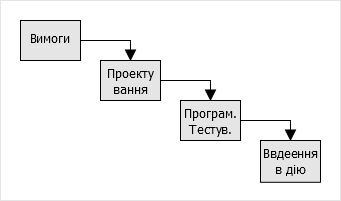
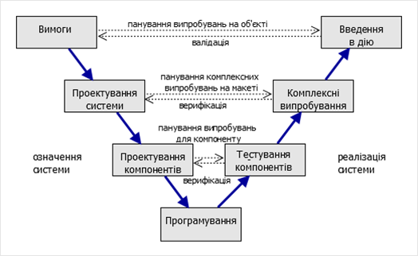
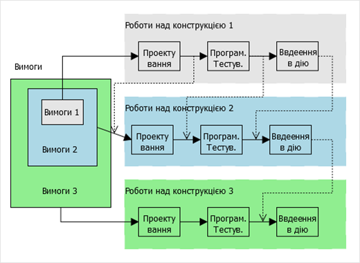
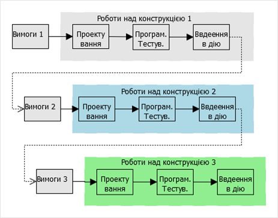
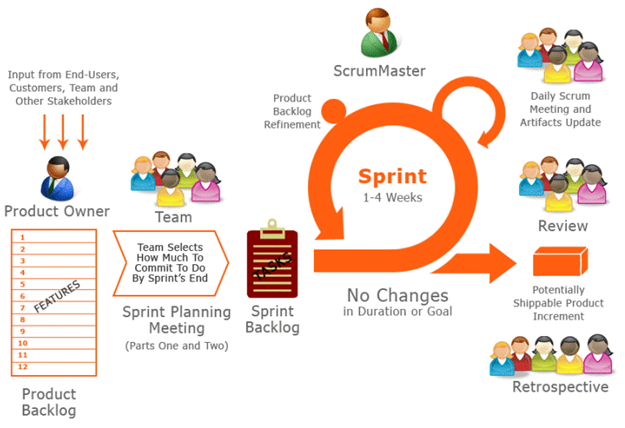
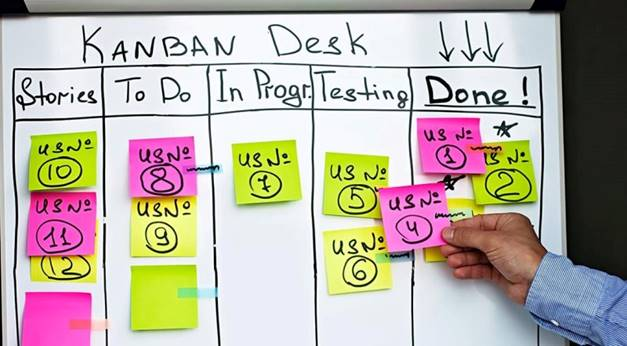
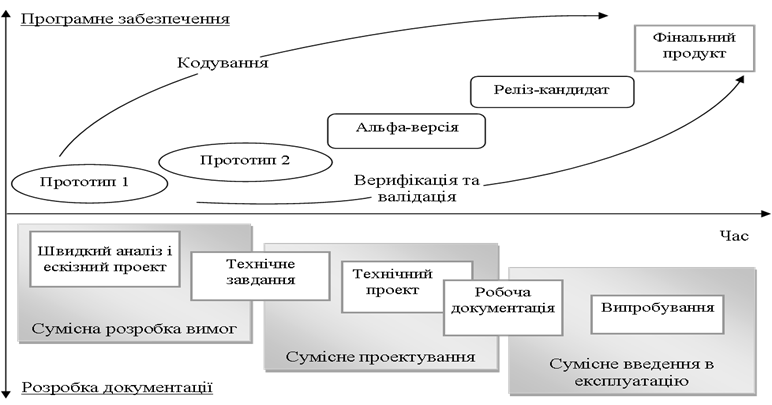

[Головна](README.md) > [10.Життєвий цикл SCADA/HMI](10.md)

# 10.4. Життєвий цикл проекту 

## 10.4.1. Життєвий цикл систем

Для кращого розуміння керування життєвими циклами систем та ПЗ коротко зупинимося на основах системної інженерії.  

Розглянемо систему з точки зору стандарту ДСТУ ISO/IEC 15288 "Інформаційні технології. Системна інженерія. Процеси життєвого циклу системи". ***Система*** (system) – це комбінація взаємодіючих елементів, організованих для досягнення однієї або декількох поставлених цілей. Сприйняття та означення конкретної системи, її архітектури та системних елементів залежить від інтересів і обов'язків спостерігача. Іншими словами, виділення серед інших та представлення системи залежить від точки зору спостерігача.

Умовна особа (людина або організація), роль якої по відношенню до системи означується її інтересами, називається ***зацікавленою особою*** (***stakeholder***). Щоб відрізняти ту систему, яка цікавить спостерігача, від інших систем, її прийнято називати ***цільовою системою*** (***system-of-interest***). Роль інших систем у зовнішньому світі відносно цільової системи можуть бути також уточнені: 

- забезпечуюча система: яка забезпечує просування системи по її життєвому циклі; наприклад, системи проектування, виробництво складових цільової системи, організації які проектують чи налагоджують і т. п.

- системи в середовищі функціонування: які взаємодіють з цільовою системою.

Відповідно до ISO/IEC/IEEE 15288:2015, ***життєвий цикл*** (***ЖЦ***, life cycle) – це розвиток системи, продукції, послуги, проекту або іншої, створюваної людиною ***сутності*** від задумки до списання. Життєвий цикл (ЖЦ) систем у тому числі програмних включає в себе усі стадії від виникнення потреби в системі певного цільового призначення до повного завершення її використання, у зв’язку з моральним старінням або за втрати необхідності. 

Як вже було сказано, у життєвому циклі будь-якої системи беруть участь багато інших систем. Деякі організації, як забзепечуючі системи, беруть участь тільки на певних відрізках часу життєвого циклу цільової системи. Тому для них роботи по просуванню цільової системи по життєвому циклу можуть початися пізніше і закінчитися раніше, ніж це відбувається в життєвому циклі цієї системи. Вони розглядають цю частину робіт і часу, як ***проект***, для якого виділяються ресурси та час відповідно до вимог. Цей проект також описується в термінах життєвого циклу. Тому слід розуміти, що життєвий цикл проекту та цільової системи – це різні життєві цикли, але взаємопов'язані між собою. 

Так, розроблення SCADA/HMI для підрядної організації є проектом, життєвий цикл якого починається з означення вимог і завершується гарантійним терміном експлуатації. У той же час життєвий цикл SCADA/HMI починається ще на стадії формування вимог для всієї системи АСКТП або навіть для всього технологічного комплексу і завершується після зняття її з експлуатації, наприклад, внаслідок демонтажу системи або її модернізації. Надалі будемо розглядати життєвий більше в контексті проекту, а не системи, якщо не буде сказано інше. 

Життєвий цикл традиційно поділяють на ***стадії***, кожна з яких розглядається як роботи над системою, що приводять до зміни її стану. У 10.1.1 були означені такі стадії  

- розроблення технічних вимог; 

- проектування; 

- реалізація (програмування, тестування);

- уведення в дію; 

- експлуатація. 

За результатами цих робіт з’являються якісь артефакти (документи, програми, системні компоненти тощо) і приймають якісь важливі рішення щодо інших стадій. Стадії відрізняються за характером робіт. Наприклад, стадія "проектування" зосереджена на розробленні певного типу документації, за яким проводять роботи на стадії "реалізація". Поділ життєвого циклу системи на стадії залежить від її типу та прийнятих правилах у тих організаціях, що її розроблюють. Стадії, як правило, йдуть послідовно в часі, хоч можуть перекриватися. У сучасних методологіях розроблення ПЗ поділ на стадії є досить умовним, і відноситься більше не до часу проведення робіт, а характеру діяльностей, які там виконуються. Послідовність стадій та процесів залежить від обраної моделі життєвого циклу. 

##                                  10.4.2. Процеси життєвого циклу

***Модель життєвого циклу*** – структурна основа процесів і діяльностей, яка належить до життєвого циклу, що слугує в якості загального посилання для встановлення зв’язків та взаєморозуміння сторін. Процеси життєвого циклу для розроблення систем описані в стандарті ДСТУ ISO/IEC/IEEE 15288:2016 [10], а для програмного забезпечення – в ISO/IEC12207 [11]. 

   Стандарт ISO/IEC 15288 [10] означує множину процесів, названих процесами життєвого циклу, за допомогою яких може бути змодельований життєвий цикл системи. Термін ***процес*** (process) взятий із ISO 9000 і значить сукупність взаємозв'язаних ресурсів і діяльностей, яка перетворює вхідні елементи на вихідні задля досягнення певної цілі. 

Результатами процесу, згідно з [10] та [11], може бути ***продукт*** (product), послуга (service), інформація, ***артефакт*** (наприклад, документи, схеми). Для того щоб досягнути один або кілька виходів процесу, формують вимогу, рекомендацію або дозволену дію, яка називається ***задачею (task)***. Множина пов'язаних задач процесу називається ***дією*** або діяльністю (activity). 

Процеси життєвого циклу системи поділяються на чотири групи:

1) угоди: процеси придбання, використовувані організаціями для придбання продукції або отримання послуг; процеси постачання, використовувані організаціями для постачання продукції або надання послуг;

2) підприємства (забезпечення проектів), куди входять процеси керування: середовищем підприємства, інвестиціями, процесами життєвого циклу системи, ресурсами та якістю;

3) проектні, куди входять процеси: планування проекту; оцінювання проекту; контролю проекту; прийняття рішень; керування ризиками; керування конфігурацією; керування інформацією;

4) технічні, куди входять процеси: визначення вимог зацікавлених осіб; аналізу вимог; проектування архітектури; реалізації елементів системи; комплектації; верифікації; передачі; валідації; функціонування; технічного обслуговування; вилучення та списання.

Наведені процеси описані детально в стандарті ISO/IEC 15288 і можуть функціонувати на будь-якій стадії життєвого циклу. Таким чином, життєвий цикл системи є **керування процесами**, які можуть виконуватися паралельно в часі, бути ітеративними (повторюватися), рекурсивними (ініціювати запуск таких самих процесів на нижньому рівні) і мати залежні від часу характеристики. 

Спосіб керування цими процесами означується прийнятою в організаціях методологією розроблення. Під методологією розроблення ПЗ (Software development methodology) розуміють сукупність методів, які використовуються для розроблення програмного продукту. Методології часто включають загальний філософський підхід, означення життєвого циклу, передбачають набір практик, які будуть використовуватися, та організацію робіт. Під практиками розуміють процеси, способи та технології для їх виконання. 

Основою методології є прийнята модель життєвого циклу проекту, яким займається організація. Нагадаємо, що проект може охоплювати певні стадії життєвого циклу системи. Серед великої кількості моделей життєвого циклу можна умовно виділити три фундаментальних: водоспадна (каскадна), інкрементна та еволюційна. Кожна з цих моделей може використовуватися самостійно або в комбінації з іншими. 

Проте це не єдина класифікація моделей життєвого циклу. Наприклад, 
 М. Савельєв у своїй праці [13] поділяє моделі життєвих циклів на три основні категорії: послідовні (лінійні), де стадії (фази) життєвого циклу послідовно змінюють одна одну; циклічні (ітеративні), де в життєвому циклі закладено циклічне повторення деяких стадій (фаз); синтетичні, – які являють собою комбінацію попередніх двох.  

Надалі розглянемо деякі з моделей, але не в контексті життєвих циклів систем, а як програмних проектів, враховуючи, що стадії експлуатації та виведення з обслуговування не використовується. 

## 10.4.3. Водоспадна модель (Waterfall Model) 

***Водоспадна*** (каскадна) модель життєвого циклу передбачає, що всі процеси виконуються в межах певних стадій, здійснення яких означено в часі. Весь цикл передбачає одноразове поступове проходження стадій від означення вимог до експлуатації. Для розроблення ПЗ цю модель можна представити, як на рис. 10.4. Після кожної стадії приймаються важливі рішення (так звані gate) про перехід до іншої, після чого повернення назад не передбачається. Можливе паралельне виконання робіт (етапів) але в рамках однієї стадії.

Типовим ЖЦ подібного плану є описаний в ГОСТ 34.601-90, який до недавнього часу діяв і в Україні. Згідно з цим стандартом весь життєвий цикл автоматизованої системи (АС) поділяється на стадії, кожна з яких у свою чергу поділяється на етапи. Склад і правила виконання робіт на стадіях та етапах означують у відповідній документації організацій, які беруть участь у створенні конкретних видів автоматизованих систем. Згідно з ГОСТ 34.601-90, в загальному випадку створення автоматизованих систем складається з таких стадій:

1. Формування вимог до АС: дослідження об'єкта, техніко-економічне оцінювання доцільності створення, підготовка вихідних даних для формування вимог до АС, формування тактико-технічного завдання. 

 

*Рис.10.4.* Приклад каскадної моделі

2. Розроблення концепції АС: детальне вивчення об’єкта автоматизації, науково-дослідні роботи (НДР), розроблення альтернативних варіантів концепції створюваної АС . 

3. Технічне завдання: розроблення, оформлення, узгодження та затвердження технічного завдання.

4. Ескізний проект: визначаються функції, задачі АС та підсистем, концепція інформаційної бази, СУБД та ПЗ. 

5. Технічний проект: розроблення основних проектних рішень для формування деталізованих ТЗ на підсистеми та формування замовлень для постачальників.

6. Робоча документація: розроблення документації на апаратну частину та ПЗ.

7. Уведення в дію: підготовка об'єкта автоматизації та персоналу, комплектація, будівельно-монтажні роботи, пуско-налагоджувальні роботи, проведення випробувань. 

8. Супроводження. Гарантійне та післягарантійне обслуговування. 

Стадії та етапи, встановлюються в договорах і технічному завданні. Допускається виключати стадію "Ескізний проект" та окремі етапи робіт на всіх стадіях, об’єднувати стадії "Технічний проект" та "Робоча документація" в єдину стадію "Техно-робочий проект". Залежно від специфіки АС та умов їх створення допускається виконувати окремі етапи робіт до завершення попередніх стадій, паралельне в часі виконання етапів робіт, включення нових етапів робіт.

Водоспадна модель дуже зручна для розрахунку ресурсів, але в чистому вигляді мало коли здійснена. Вона має ряд недоліків:

- передбачається, що всі стадії виконуються ідеально, помилки на ранніх стадіях однозначно приводять до важких наслідків на наступних, які неможливо усунути, не повернувшись назад;

- неможливо внести зміни у вимоги, які з'являються після стадії "Формування вимог", бо це суперечить послідовності стадійності;

- продукт (систему, ПЗ) можна використовувати тільки в кінці життєвого циклу проекту;

- потребують залучення певного виду ресурсу у великих кількостях тільки на певних етапах стадій. 

При розробленні проекту SCADA/HMI використання водоспадної моделі значило б таке. Спочатку формується повний перелік вимог до SCADA/HMI, як це, наприклад, писалося підрозділі 10.1. Вимоги оформлюються у вигляді переліку або стають частиною ТЗ. Далі проводиться проектування і реалізація, уведення в дію. На стадії уведення в дію замовник перевіряє відповідність вимогам. Протягом усього ЖЦ проекту SCADA/HMI нові вимоги не формуються.    

Водоспадну модель використовують тоді, коли є великий досвід розроблення подібних систем і напрацьовані практики. Вона популярна при розробленні фізичних систем, в яких практично важко вносити зміни "в залізі", якщо вони не були передбачені на ранніх стадіях. Цю модель використовують з певними модифікаціями, зокрема V-model. 

## 10.4.4. V-model 

Класична каскадна модель погано справляється з проблемами, що виникають на заключних стадіях життєвого циклу. Наслідком таких проблем стає зниження якості поставленого товару, причому часто не так з позицій якості виготовлення (наприклад, стабільності і безвідмовності роботи), а більше в частині невідповідності очікувань замовника щодо вирішення його завдань. Саме ця особливість підштовхувала практиків до модифікації каскадної моделі, з метою уникнення відриву рішень, виконаних на початкових стадіях аналізу і проектування від заключних стадій випробувань, впровадження та супроводу програмного продукту. Однією з таких модифікацій стала V-подібна модель життєвого циклу – ***V-model***.

Назва моделі пішла від форми латинської букви V, яка показує форму лінії часу, що перегнута навпіл у точці, де стадії означення систем переходять у стадії реалізації та впровадження. Для програмних систем цю модель можна представити, як на рис.10.5. У даному випадку час вважається логічним, тобто не по ходу виконання робіт, а по ходу проходження процесів, які використовуються. Перелом потрібен для того, щоб показати суть верифікації і валідації: виготовлення частин та системи проводить перевірку через механізм верифікації (перевірки відповідності формальних вимог), а впровадження – через валідацію (задоволення вимог замовника). 

Враховуючи, що перевірка (тестування) передбачає чіткішу формалізацію вимог, які потрібно використовувати при верифікації та валідації, помилки виявляються та виправляються на ранніх стадіях реалізації системи. Крім того, в результаті більш чіткого постановлення вимог зменшується ступінь невизначеності на стадіях означення системи. 

Для SCADA/HMI робота над проектом по V-моделі може мати такий вигляд. Після формування вимог до системи проводиться проектування системи, в результаті чого виконавець разом із замовником формують порядок і процедури проведення комплексних випробувань системи на макеті (імітаторі) з детальною вказівкою послідовності та критеріїв перевірки. Після декомпозиції функцій на компоненти (окремі компоненти HMI, повторювані функції SCADA/HMI) формується процедура перевірки окремих компонентів. Зрештою, дані стадії можуть проходити ітераційно, до формування узгоджених детальних процедур. Стадій проектування і тестування компонентів може й не бути. Розроблені процедури використовуються виконавцем для тестування розробленого проекту SCADA/HMI. Це також може проходити в кілька стадій, наприклад, тестування компонентів та комплексні випробування. Кожна стадія передбачає виконання процесів програмування. Після формальних перевірок (верифікації) проводять введення в дію, що передбачає валідацію. 

 

*Рис. 10.5.*Приклад V-моделі

## 10.4.5. Інкрементні моделі (Incremental Model) 

***Інкрементні*** моделі життєвого циклу передбачають заплановане нарощування продукту (конструкції). Життєвий цикл проекту починається з видачі повного набору вимог, після чого йде розроблення першої конструкції по всіх стадіях, яка реалізовує тільки частину з вимог (рис.10.6). Далі виконують роботи над іншою конструкцією, в якій реалізовують іншу частину вимог і т. д., поки буде не завершено створення задуманої системи, яка б задовольняла усім вимогам. Кожна конструкція включає реалізацію вимог попередньої і нових, таким чином нарощуючи свій функціонал.

Для кожної конструкції виконують необхідні процеси, роботи і задачі. Наприклад, аналіз вимог і створення архітектури можуть бути виконані відразу для всіх конструкцій, тоді як розроблення технічного проекту програмного засобу, його програмування і тестування, введення в дію (розгортання) і кваліфікаційні випробування (валідацію) виконують при створенні кожної з наступних конструкцій. 

У цій моделі при розробленні кожної конструкції роботи і задачі процесів виконують послідовно, або частково паралельно з перекриттям. Тобто роботи над різними конструкціями можуть виконуватися паралельно, при цьому вихідна інформація якихось процесів розроблення для однієї конструкції може виконуватися як вхідна для іншої (на рис.10.6 показано пунктирними лініями).  

 

*Рис.10.6.* Інкрементна модель

Процеси супроводу та експлуатації можуть бути реалізовані паралельно з процесом розроблення. Процеси замовлення і постачання, а також допоміжні та організаційні процеси зазвичай виконують паралельно з процесом розроблення.

Серед переваг інкрементної моделі можна виділити:

- чітке розуміння усіх вимог на всіх ітераціях, оскільки вони не змінюються;

- придатність для використання проміжного продукту (конструкції) за короткий час;

- природний поділ системи на нарощувані компоненти (інкремент);

- можливості виділення ресурсів на кожній ітерації за необхідності;

- простіше навчання персоналу;

- можливість внесення невеликих змін та виправлення помилок в уже працюючу систему на наступних ітераціях.

З іншого боку, чітке означення усіх вимог та можливостей, які передбачає модель, не дає можливості вносити в них зміни. 

Одним із видів інкрементальних моделей можна виділити RAD, в якій вимоги реалізовуються паралельно кількома командами розробників, після чого відбувається їх інтеграція. 

Один із прикладів використання інкрементальної моделі розроблення SCADA/HMI наведений в 10.1.10. Для першої конструкції можуть реалізувати мінімально необхідний функціонал, який дає можливість робити налагодження та проводити ручні операції. На другій ітерації можна розроблювати дисплеї 3-го рівня, на наступних – 2-го та 1-го рівнів.  

## 10.4.6. Еволюційні моделі (Iterative Model)

В ***еволюційних*** (ітеративних, Iterative) моделях систему також розроблюють у вигляді окремих конструкцій, але, на відміну від інкрементних, вимоги означуються на кожній ітерації. Тобто на початковій ітерації формують тільки частину вимог, які відомі на той час. Після розроблення конструкції, яка задовольняє цим вимогам, повертаються знову до етапу означення вимог для нової конструкції, і т. д. Графічно ця модель для ПЗ представлена на рис. 10.7. 

 

*Рис. 10.7.* Еволюційна модель

При такому методі для кожної конструкції роботу і задачі процесу розроблення виконують послідовно або паралельно з частковим перекриванням. 

Переваги використання цієї моделі:

- придатність для використання проміжного продукту за короткий час;

- можливості виділення ресурсів на кожній ітерації за необхідності;

- простіше навчання персоналу;

- задіяння замовника у формування вимог перед кожною ітерацією;

- можливість внесення змін при зміні в технологіях;

- можливість внесення невеликих змін та виправлення помилок в уже працюючу систему на наступних ітераціях.

Серед можливих недоліків можна назвати підвищені вимоги до замовника, що передбачає постійне задіяння його в процесах. Крім того, не маючи повного переліку вимог, практично не можливо розрахувати необхідний час розроблення всього проекту та потрібних для цього ресурсів (час, бюджету). 

Одним із видів еволюційної моделі є ***спіральна***. У ній після кожної ітерації (витка спіралі) проводиться аналіз ризиків для створення нової конструкції. Тобто на кожній ітерації проводиться аналіз і приймається рішення, чи варто взагалі робити наступний виток (ітерацію). Для аналізу ризиків може використовуватися модель (прототип). 

Використання еволюційної моделі розроблення дуже актуальне для багатьох проектів SCADA/HMI. Особливо це стосується ситуації, коли замовник і виконавець взагалі не знають, який матиме вигляд система, наприклад, за причини відсутності досвіду реалізації для подібних об’єктів. У цьому випадку замовнику можна запропонувати і узгодити з ним необхідний мінімум вимог, щоб увести систему в дію на першій ітерації. Це можуть бути, наприклад, типові дисплеї 4-го рівня. На наступній ітерації можна означити список трендів, потім тривог і повідомлень і т. д. Таким чином, замовник завжди отримуватиме версію з новими функціями, які будуть узгоджуватися перед кожною ітерацією. У будь-якому випадку для такого варіанта реалізації питання фінансування і термінів усіх робіт залишається відкритим. Як варіант, це може бути реалізовано через окремі договори або лімітовано людино-годинами.      

## 10.4.7. Методології розроблення Agile

На сьогоднішній день для більшості невеликих ІТ-компаній характерне використання неформальних методологій розроблення ІТ-продуктів, що відомі під загальною назвою ***Agile development***, або "гнучкі методи розроблення". Вони базуються на так званому "Маніфесті Agile", який звучить так:

- люди і взаємодія важливіші від процесів та інструментів;

- працюючий продукт важливіший за вичерпну документацію;

- співпраця із замовником важливіша за узгодження умов контракту;

- готовність до змін важливіша від проходження за попереднім планом.

Цей маніфест розкривається за такими принципами:

1. Найвищим пріоритетом є задоволення потреб замовника, завдяки регулярному і ранньому постачанню готового програмного забезпечення.

2. Зміна вимог вітається, навіть на пізніх стадіях розроблення.

3. Agile-процеси дають змогу використовувати зміни для забезпечення замовникові конкурентної переваги.

4. Працюючий продукт слід випускати якомога частіше (з періодичністю від кількох тижнів до кількох місяців).

5. Працюючий продукт – основний показник прогресу.

6. Протягом усього проекту розробники і представники бізнесу повинні щодня працювати разом.

7. Над проектом повинні працювати мотивовані професіонали.

8. Щоб робота була зроблена, необхідно створити для професіоналів умови, забезпечити підтримку і повністю довіритися їм.

9. Безпосереднє спілкування є найбільш практичним та ефективним способом обміну інформацією як із самою командою, так і всередині команди.

10. Інвестори, розробники і користувачі повинні мати можливість підтримувати постійний ритм нескінченно. Agile допомагає налагодити такий стійкий процес розроблення.

11. Постійна увага до технічної досконалості і якості проектування підвищує гнучкість проекту.

12. Простота – мистецтво мінімізації зайвого клопоту – вкрай необхідна.

13. Найкращі вимоги, архітектурні та технічні рішення народжуються у самоорганізованих командах.

14. Команда повинна систематично аналізувати можливі способи поліпшення ефективності й відповідно коригувати стиль своєї роботи.

У випадку Agile складно говорити про проходженні компанією будь-якої певної моделі ЖЦ розроблення ПЗ. Хоча, по суті, таке розроблення потрапляє в клас еволюційних моделей, що характеризуються розробленням продукту в ході декількох ітерацій, де безперервно і паралельно йдуть процеси аналізу і коригування результатів роботи.

Серед ризиків може бути створений у результаті постійної взаємодії всіх учасників хаос, що впливає на всі сфери розроблення. Тому, використовуючи Agile, слід розуміти обмеження: команди повинні бути невеликі, учасники мають бути компетентні та мотивовані, ітерації – короткі з максимально зрозумілими цілями, встановлені чіткі обмеження за часом і кінцевий результат повинен бути очевидним. 

Невизначеністю вирішується шляхом планування на короткі періоди. Правило таке: чим вища невизначеність – тим коротша ітерація. На початку кожної ітерації неминуче виконується контроль, ретроспектива, оцінювання та аналіз результатів, планування наступної ітерації.

До Agile відносять ряд практик, підходів і методологій, зокрема:

- Extreme Programming, XP – екстремальне програмування;

- Lean – бережлиеа розроблення програмного забезпечення;

- Scrum – каркас для керування проектами;

- Feature-driven development, FDD – розроблення, кероване функціональністю ;

- розроблення через тестування (Test-driven development, TDD);

- методологія "чистої кімнати" (Cleanroom Software Engineering);

- OpenUP – інкрементний метод розроблення;

- методологія розроблення Microsoft Solutions Framework (MSF) ;

- метод розроблення динамічних систем Dynamic Systems Development Method, DSDM;

- метод керування розробленням Kanban.

Останнім часом найбільш відомим і популярним методом такого "швидкого" розроблення є методологія ***Scrum***. Творці методології відзначають, що ключовим принципом Scrum є прийняття розробником факту можливості змін вимог замовника в ході роботи, зміни його розуміння цілей проекту в ході його виконання. Тому за такої методології замість того, щоб на початкових стадіях зануритися в розуміння проблеми замовника, команда, що виконує проект, фокусується на можливостях надати продукт або, як мінімум, його частини, якнайшвидше, а потім терміново відреагувати на уточнені вимоги, які з'явилися знову.

На відміну від основних моделей життєвого циклу розроблення ПЗ, методологія Scrum не наполягає на певній послідовності розроблення продукту і не означує складу робіт. Замість цього вона жорстко фіксує час ітерації ("спринту"), за який повинні бути отримані конкретні результати – так званий "інкремент продукту" (Potentially shippable increments, PSIs). При цьому склад необхідних компонентів і функціональності "інкремент продукту" означується командою безпосередньо перед початком "спринту" за допомогою інструменту, який називається "беглогом проекту" – переліку вимог, що підтримує їх пріоритизації за важливістю для стейкхолдерів проекту. Самі вимоги до продукту записуються у вигляді "користувацьких історій" (User stories) – спеціального шаблону, який застосовується і в інших методологіях Agile:

Як <роль> я хочу <мета/дія>, щоб отримати <цінність>

Методологія Scrum має на увазі повторення "спринтів" до того, поки всі вимоги, описані в "беглозі проекту", не будуть реалізовані в продукт, що поставляється.

У Методології Scrum існують три ключових ролі:

1. Власник продукту (Product owner) – це людина, яка представляє в проекті зацікавлених осіб (Stakeholders). Він висловлює команді вимоги і побажання замовника і саме він здійснює документування вимог до майбутнього продукту.

2. Команда розробників (Scrum Team) – це система, що самоорганізується з групи осіб, відповідальних за розроблення і постачання інкрементів продукту до кінця кожного завершення ітерації розроблення – спринту.

3. Скрам-майстер (Scrum master) – це людина, відповідальна за усунення перешкод для можливостей команди виконати завдання в строк. При цьому Скрам-майстер не є керівником команди/проекту в традиційному розумінні функції керівництва, але в той же час є буфером між командою та її зовнішнім оточенням.

Графічно методологію Scrum представлено на рис. 10.8.

 

*Рис.10.8.* Методологія Scrum

Метод ***Kanban*** передбачає керування роботами за допомогою віртуальної дошки, яка розбита на колонки, що вказує на стан виконання певного завдання (рис.10.9). При необхідності виконання завдання воно виставляється в ліву колонку. Потім виконавець або відповідальна особа в міру виконання завдання переносить його з колонки в колонку, поки воно не досягне правої крайньої колонки, що буде вказувати на завершення виконання завдання. 

 

*Рис.10.9.* Використання Kanban

Для успішної реалізації Kanban рекомендується користуватися практиками:

1. *Візуалізуйте*. Візуалізація процесів роботи допомагає в правильному розумінні змін, що плануються, і допомагає впроваджувати їх згідно з планом. Типовим способом візуалізувати процес роботи є використання дошки з колонками і картками. Колонки на дошці позначають різні кроки процесу роботи.

2. *Обмежуйте завдання в процесі виконання*. Використовується система "витягування" на частинах, або на всьому процесі роботи. Враховується, що робота, котра перебуває в стані виконання на кожному кроці робочого процесу (колонці), є обмеженою, і що нова робота "витягується" на крок тільки тоді, коли з'являється місце в цій колонці кроку.

3. *Керуйте потоком*. Кожен перехід між станами в потоці моніториться, вимірюється і звітується. Активне керування потоком дає змогу оцінити позитивні та негативні ефекти змін у системі.

4. *Зробіть правила явними*. Поки механізм чи процес не стане явним, часто важко чи неможливо здійснювати обговорення щодо його вдосконалення. Без явного розуміння, як усе працює, будь-які обговорення проблем стають емоційними та суб'єктивними. З явним розумінням можливо перейти до більш раціональних, емпіричних та об'єктивних обговорень проблем.

5. *Створіть для процесів зворотній зв'язок*. Організації, що не створили другого рівня зворотного зв'язку — перегляд операцій, — зазвичай не бачать удосконалення процесу поза локалізованим рівнем команди.

6. *Удосконалюйте співпрацюючи, розвивайтесь експериментально* використовуючи моделі та науковий метод. Метод Канбан пропагує малі поступові, постійні та еволюційні зміни, які приживаються. Коли команди мають спільне розуміння теорій про роботу, процес, ризики, вони, більш імовірно, будуть здатними виробити спільне розуміння проблем та запропонувати вдосконалення, які будуть результатом консенсусу.

Kanban може використовуватися для керування будь-якими роботами, а не тільки розробленням систем чи ПЗ. Є багато безкоштовних або частково-безкоштовних застосунків з інтуїтивно зрозумілим інтерфейсом, наприклад Trello (https://trello.com). 

## 10.4.8. Синтетична модель створення автоматизованих систем з формальними вимогами 

Розробники можуть використовувати свої методології та моделі життєвих циклів проектів, відповідно до прийнятих практик та підвищення ефективності проекту й системи. Так, у 2013 р. на Х міжнародній конференції "Управління проектами у розвитку суспільства" і потім у лютому 2015 р. на Форумі лідерів АСУ "Нова країна — Новий ландшафт" у м. Києві Максим Савельєв представив синтетичну модель створення автоматизованих систем із формальними вимогами ГОСТ 34. У цьому параграфі йдеться саме про цю модель.

 Зокрема, М. Савельєв зазначив, що методологія Agile розроблена для проектів, де цілі і завдання проекту з якоїсь причини погано формалізовані. Розкритися в області АСКТП він може лише після впровадження візуальних систем проектування з використанням віртуального устатковання та обов'язкової імітаційної моделі виробничих процесів (прототипування). Найбільш близькі до цього компанії орієнтовані на рішення Siemens або DASSAULT SYSTÈMES з їх концепцією Virtual Commissioning. Крім того, відмова від класичних методів можлива там, де всі учасники проекту досить компетентні й досвідчені для дій у стилі Agile. У великих проектах методи Agile розумно застосовувати лише для деяких підсистем і в доповнення до класичних методів.

   Тому Савельєв запропонував синтетичну модель, яка враховує інженерну практику на пострадянському просторі, що дає можливість усунути протиріччя між традиційними методами керування проектами (водоспадна модель ГОСТ 34.601-90) та ітеративними способами розроблення ІТ-продуктів і сервісів, у тому числі SCADA/HMI. У своїй дисертаційній роботі [12] він довів, що така модель дає змогу поєднати ітеративне розроблення, властиву молодим незрілим колективам, і освоєння організаційних процесів, які забезпечують якість кінцевого продукту. Графічне представлення моделі наведено на рис. 10.10.

В якості основної ідеї було взято факт, що базові звітні документи ГОСТ 34, як, наприклад, "Ескізний" і "Технічний проекти", "Технічне завдання", містять розділи, які послідовно деталізуються по ходу реалізації проекту від документа до документа. А це означає, що при створенні кожного такого документа розробник проходить повний цикл розроблення: аналіз – проектування – верифікація – приймання. У той же час стандарт означує безпосереднє розроблення програмно-технічного рішення на стадії "Робочої документації", що не відповідає сучасним вимогам до термінів виконання проектів. Усунути цей недолік можливо шляхом поєднання початкових стадій формування вимог і розроблення концепції з інкрементним розробленням системи, шляхом руху від прототипів (пілотної моделі системи) до готового продукту, при цьому усвідомлюючи, що фінальний продукт може не містити нічого з розробленого первинного прототипу.

 

*Рис.10.10.* Синтетична модель ЖЦ, запропонована М. Савельєвим 

Таким чином, в основу моделі покладено дві паралельні групи процесів: розроблення проектно-технічної документації та ітеративне розроблення програмно-технічних рішень. Тут, на відміну від ГОСТ 34.601-90, стадії "Формування вимог" і "Розроблення концепції" замінюються на стадію "Ескізний проект", який, таким чином, стане передувати розробленню "Технічного завдання".

Окремо виділяється роль замовника у створенні продукту, який безпосередньо повинен брати участь у створенні системи. Випуск кожного прототипу та версії ПЗ не тільки повинен бути синхронізований з випуском документації, а й розгортається на майданчику замовника і повинен розглядатися ним паралельно з наданою документацією. Цим досягається зниження ризиків, пов’язаних з невірною інтерпретацією вимог замовника – головною причиною невдачі більшості IT-проектів. Крім того, такий підхід дає змогу керувати зміною вимог у ході проекту.
