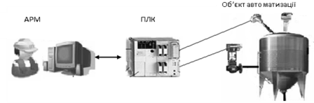
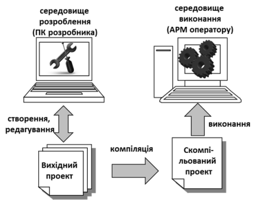

[Головна](README.md) > [1.Призначення та можливості людино-машинних інтерфейсів та збирання даних в автоматизованих системах керування](1.md)

# 1.1. Місце засобів SCADA/HMI в структурі керування

## 1.1.1. Способи реалізації людино-машинного інтерфейсу

Більшість систем керування технологічними процесами автоматизовані, тобто такі, що потребують участі людини в процесі керування. Це зумовлено рядом факторів. Насамперед тим, що не завжди можна розробити алгоритм керування, за допомогою якого можна було б реалізувати повністю автоматичну систему керування. Для цього або недостатньо інформації про стан об’єкта керування, або в процесі керування можуть виникати непередбачувані ситуації, з якими не може впоратись існуюча система автоматизації. Крім того, навіть для традиційних і добре вивчених і відпрацьованих завдань автоматичного регулювання (стабілізуюче, програмне і слідкуюче) та завдань дискретного керування періодичними процесами, для яких існують надійні алгоритми і програми керування, виникає необхідність коригувати їх роботу. 

У будь-якому випадку необхідно налагодити зв'язок, який би, з одного боку, давав можливість людині контролювати стан процесу та системи, а з іншого – забезпечував можливість втрутитися в процес керування. Тобто необхідно в системі керування передбачити людино-машинний інтерфейс (HMI – Human-Machine Interface). Під "машиною" в цьому випадку розуміється система з усіх технічних засобів, що бере участь у процесі вимірювання, контролю, сигналізації та керуванні, а під "людиною" – оператор-технолог, який бере безпосередню участь у процесі керування. Отже, людина задіяна у процесі керування, тому вона є частиною цієї системи (автоматизованої системи керування технологічними процесами, АСКТП). Саме людина приймає найвідповідальніші рішення в процесі керування. Людино-машинний інтерфейс є частиною автоматизованого робочого місця (АРМ) оператора. 

На відміну від прямого візуального контролю та безпосереднього керування регулюючими органами, в АСКТП процес отримання людиною інформації та ручне керування проходить опосередковано через засоби людино-машинного інтерфейсу, обчислювальні машини різного рівня складності (наприклад ПЛК), виконавчі механізми та датчики (рис. 1.1). Такий процес отримав назву супервізорного керування. 

Для невеликих процесів людино-машинний інтерфейс може бути реалізований з використанням кнопок, перемикачів, різного типу індикаторів. Однак більшість технологічних процесів потребує значної кількості елементів відображення та ручного керування, а також різного типу самописців та елементів сигналізації. У цьому випадку для реалізації людино-машинного інтерфейсу використовують операторські панелі (ще називають панелі оператора). Це невеликі мікропроцесорні засоби з текстовим або графічним дисплеєм для відображення інформації та елементами керування – кнопками або/та сенсорним екраном. Передня частина таких панелей захищена від пилу, бруду, вологи, що дає змогу оператору керувати процесом безпосередньо біля об’єкта. Для захисту іншої частини панелі її розміщують у спеціальному щиті.

                              

Рис. 1.1. Супервізорне керування об’єктом

Для великих АСКТП панель оператора не забезпечує можливості контролю за всім процесом, архівування великої кількості параметрів, зв’язку з іншими системами керування процесами та виробництвом у цілому. Ці функції можуть бути реалізовані засобами людино-машинного інтерфейсу, побудованим на базі комп’ютерів зі спеціалізованим програмним забезпеченням. На виробництві такі автоматизовані робочі місця оператора-технолога розміщуються, як правило, в спеціально обладнаних диспетчерських, які захищають комп’ютери від пагубного впливу виробничих умов та надають можливість нормально працювати операторам. У диспетчерських приміщеннях для керування об’єктами з великим обсягом інформації застосовують також настінні екрани, інколи комбінуючи їх з пультами та щитами керування.

Для реалізації роботи людино-машинного інтерфейсу необхідно забезпечити двосторонній обмін даними:

‒     збирати інформацію про стан технологічного устатковання і значень технологічних параметрів;

‒     передавати команди оператора в зворотному напрямку. 

При побудові комплексної АСКТП на базі програмованих контролерів цими процесами займаються SCADA (Supervisory Control And Data Acquisition – супервізорне керування і збирання даних). Тобто організація роботи АРМ складається, як мінімум, з двох складових: SCADA – для збирання даних та керування; HMI – для реалізації людино-машинного інтерфейсу. 

У АСКТП, побудованих на базі DCS (Distributed control system – системи розподіленого керування), концептуальна база даних процесу є єдиною як для керування процесом у реальному часі, так і для візуалізації. Тому окремо функція SCADA не виділяється, але процес створення людино-машинного інтерфейсу практично такий самий. Надалі будемо розглядати тільки системи, побудовані за принципом: контролери+SCADA+HMI.

## 1.1.2. Засоби розроблення автоматизованих робочих місць

Програмне забезпечення для комп’ютерів АРМ можна створити на базі універсальних середовищ та мов програмування. Такий підхід дає змогу створити систему з будь-яким функціоналом за бажанням замовника, однак він має ряд недоліків. По-перше, розроблення проектів займає багато часу і потребує залучення спеціалістів з комп’ютерного програмування. По-друге, відлагодження такого проекту триває досить довго, а помилки в роботі програм нерідко проявляються протягом усього життєвого циклу системи. По-третє, такі програми важко супроводжувати і вносити туди зміни, оскільки це потребує постійного контакту з людиною-розробником. 

Альтернативою наведеному вище підходу є використання спеціального програмного забезпечення, яке значно спрощує розроблення прикладного програмного забезпечення для реалізації АРМів різного призначення. Таке інструментальне програмне забезпечення належить до класу SCADA/HMI. Основний принцип розроблення з використанням цих інструментів – "Конфігурування замість програмування", що різко зменшує витрачений час та вірогідність помилок, адже функціональність АРМів у своїй базовій частині мало залежить від особливостей виробництва. Програмні пакети для розроблення АРМів на базі комп'ютерів прийнято називати "SCADA-програмами", або просто "SCADA", а для панелей оператора – "HMI-програмами", або просто "HMI". Надалі ми будемо використовувати загальний термін, який об’єднує ці поняття – програми SCADA/HMI. У світі налічуються сотні компаній, що активно займаються розробленням і розповсюдженням програм SCADA/HMI. 

Необхідно розрізняти програмне забезпечення SCADA/HMI, яке функціонує на автоматизованому робочому місці оператора, і набір інструментальних програмних засобів, призначених для розроблення такого прикладного програмного забезпечення (рис. 1.2). Середовище розроблення (Design-Time) використовується на стадії створення системи і містить набір різних редакторів. Як правило, ця програма виконується тільки на комп’ютері розробника ( так званій інженерній робочій станції). Середовище виконання (Run-Time) містить усі виконавчі підсистеми для реалізації функцій, розроблених виробником SCADA/HMI. Воно слугує для запуску і виконання створеного проекту на комп’ютері автоматизованого робочого місця в режимі м’якого реального часу. На самому підприємстві обов’язковим є наявність середовища виконання проекту. 

Результат розроблення – набір пов’язаних файлів, які називають проектом. За аналогією із середовищем розроблення і виконання у більшості SCADA/HMI проект може бути в 2-х варіантах (див. рис. 1.2):

‒    вихідний проект, де зберігаються проектні дані у формі, доступній для редагування;

‒    скомпільований проект, який вміщує код, який може інтерпретувати середовище виконання і недоступний для редагування людиною.

Рис. 1.2. Порядок створення, компіляції та виконання проекту

Для функціонування автоматизованої системи в режимі операційної роботи необхідне тільки середовище виконання та скомпільований проект. Однак, якщо в майбутньому планується вводити зміни в проект, підприємство повинно домовитися з розробниками про передачу також вихідного проекту. 

Слід зазначити, що середовище виконання для комп’ютерів є платним і ліцензується залежно від функціональних можливостей та кількості змінних процесу, які задіяні в контролі та керуванні. Середовище виконання для панелей оператора вже вбудоване в неї і входить у вартість устатковання. Середовище розроблення може бути як платним так і безкоштовним, залежно від особливості фінансової політики виробника SCADA/HMI.

Розділення SCADA/HMI на два середовища є загальноприйнятою практикою, але не правилом. Ряд продуктів підтримує різні режими роботи одного середовища. Деякі базуються на WEB-технологіях, де середовищем виконання по суті є ВЕБ-сервер (серверна частина) і браузер (клієнтська). Тим не менше, надалі в посібнику дотримується саме таке розділення, як найбільш вживане. 

## 1.1.3. Функціональні можливості середовищ виконання SCADA/HMI

Більшість програм SCADA/HMI має типовий набір функціональних можливостей для реалізації завдань АРМів:

–    збирання інформації про контрольовані технологічні параметри (даних реального часу) з контролерів та засобів віддаленого введення/виведення;

–    графічне представлення стану технологічного процесу і устатковання в зручній для сприйняття формі у вигляді мнемосхем;

–    вторинне оброблення інформації (масштабування, обмеження вводу, перевірка коректності тощо); 

–    приймання команд оператора і передача їх на контролер, або засіб віддаленого виведення;

–    збереження даних реального часу в архівах даних і графічне представлення історичної інформації в зручній для сприйняття формі у вигляді графіків, гістограм тощо;

–    сповіщення експлуатаційного і обслуговуючого персоналу про виявлені аварійні події в технологічному процесі і програмно-апаратних засобах;

–    фіксація в електронних журналах виникнення аварійних подій у контрольованому технологічному процесі та дій експлуатаційного персоналу; 

–    формування звітів на основі архівної інформації, тривог та даних реального часу;

–    обмін інформацією з автоматизованими системами керування виробництвом та підприємством у складі інтегрованих систем керування; 

–    виконання певної логіки оброблення даних з використанням вбудованих мов, наприклад, VBA;

–    захист від несанкціонованого доступу до компонентів і файлів;

–    формування, записування, читання та збереження даних у вигляді рецептів;

–    створення оперативних календарних планів керування устаткованням.

Налаштування та робота цих функцій розглянуті в розділах 2 – 9 даного посібника. У цьому розділі наведено тільки основні характеристики, які варто знати як розробникам, так і користувачам SCADA/HMI. 