[Головна](README.md) > [1.Призначення та можливості людино-машинних інтерфейсів та збирання даних в автоматизованих системах керування](1.md)

# 1.2. Людино-машинний інтерфейс (HMI)

У цьому підрозділі HMI розглядається з точки зору оператора. Детальніше особливості розроблення HMI розглянуто в розділі 5. 

## 1.2.1. Загальний вигляд графічного HMI

Загальний вигляд графічного людино-машинного інтерфейсу (HMI) суттєво залежить від характеру технологічного процесу, прийнятих стандартів (корпоративних, галузевих) на побудову автоматизованих систем та індивідуальних потреб замовника (наприклад, технологів, інженерного персоналу). Сьогодні найбільш передові досягнення у області HMI знайшли відображення у стандарті ISA-101, який детально розглядається 5-му розділі цього посібника. Далі у цьому підрозділі наводяться приклади найбільш типових підходів до побудови графічного інтерфейсу АРМа. 

**Графічна підсистема** АРМа оператора має багатовіконний інтерфейс з можливістю відображення у вікнах **дисплеїв** (**display**) процесу, трендів, тривог та іншої службової інформації. Враховуючи, що вся доступна інформація не може вміститися в одному вікні, в один момент відображається тільки один дисплей процесу. Такі дисплеї можуть називатися по-різному, залежно від термінології прийнятої для вибраної SCADA/HMI, наприклад **сторінки** (**pages**), **екрани** (**screens**) або відображення (view). Дисплеї, які призначені для відображення технологічного процесу або його частини, часто називають дисплейними **мнемосхемами** (mimic diagram, mimic, mnemonic) або дисплеями процесу (process display). На рис. 1.3 показано приклад загального вигляду дисплея, де мнемосхема процесу займає більшу його частину. 

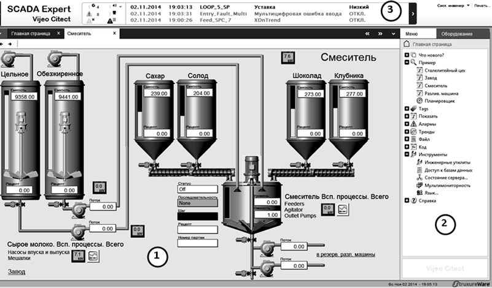                               

Рис. 1.3. Приклад загального вигляду дисплея людино-машинного інтерфейсу 
 (SCADA Citect): 1 – дисплейна мнемосхема процесу; 2 – панель(меню) доступу 
 до інших сторінок та команд; 3 – вікно відображення активних тривог та подій

Такий спрощений вигляд установки з відображенням значень технологічних параметрів у плинний момент часу дає оператору інформацію про стан цієї частини процесу. Для перегляду інших частин процесу оператор повинен відкрити інший дисплей, наприклад, за допомогою панелі керування, меню або інших елементів керування. Таким чином, використовуючи меню або панель навігації, оператор може переглянути детально будь-яку частину процесу.

Для введення дій, перегляду уточнювальної інформації чи тимчасового відображення ряду параметрів також використовують спливаючі вікна. Вони відкриваються поверх основного вікна і не заважають перегляду його вмісту. 

Хоча кількість дисплеїв процесу, як правило, не обмежується системою, оператор не може вчасно зреагувати на зміни в системі, постійно їх перемикаючи. Тому в більшості випадків в графічній підсистемі є головна мнемосхема, де відображається найбільш загальна інформація про весь процес. Крім того, всі технологічні параметри, що потребують підвищеного контролю з боку оператора, повинні відслідковуватися підсистемою тривожної сигналізації (наприклад, вихід значення змінної за аварійні межі). Графічна підсистема повинна бути розроблена таким чином, щоб тривоги, які з’явилися, відразу привертали увагу оператора. Останні тривоги, як правило, показуються у вигляді постійно видимого **вікна активних тривог** (див. рис. 1.3) або окремого підсвічуваного елемента, що вказує на наявність нештатної ситуації в системі. 

Графічний людино-машинний інтерфейс реалізується через:

- елементи відображення, які надають операторові інформацію про стан змінних процесу;

- елементи введення, що надають можливість впливати на процес шляхом зміни значень змінних або відправки команд.

Часто функції відображення та введення комбінуються в одному елементі. Далі розглянемо детальніше способи відображення та введення, а також типові елементи, які використовуються для цього.

## 1.2.2. Способи та елементи відображення стану процесу

Інформація про значення технологічних параметрів повинна бути надана в такому вигляді, щоб оператор швидко визначив загальний стан процесу. Для цього, окрім відображення значення величини у вигляді тексту, можна використовувати різного типу зміни властивостей графічного об’єкта, зокрема:

- кольору;

- тексту;

- видимості;

- вигляду зображення;

- геометричних розмірів;

- заповнення;

- позиції на екрані;

- кута повороту. 

Зміну якоїсь властивості графічного елемента залежно від значення змінної часто називають **анімацією**. 

Анімація кольору використовується для показу стану змінної процесу або устатковання чи агрегату. Яскраві червоні та жовті кольори прийнято використовувати для сигналізації відповідно аварійного та передаварійного стану, а всі інші – для уточнення діапазону нормального стану. Останнім часом передові організації-розробники рекомендують використовувати відтінки сірого кольору а також білі та чорні кольори. Інші кольори рекомендуються використовувати для виділення станів елементів, на які особливо треба звернути увагу, або для розрізнення елементів між собою (трубопроводи з різною рідиною, графіки на трендах тощо).

Для відображення стану дискретної змінної (типу "увімкнено"/"вимкнено") можна використати два кольори. Наприклад, зелений може вказувати на стан "увімкнений", а сірий – для стану "вимкнений". Згідно з останніми дослідженнями, бажано використовувати чорно-білу гаму кольорів, для даного прикладу – пару білий/темно-сірий, як показано на рис. 1.4. У будь-якому випадку призначення кольорів необхідно заздалегідь узгодити між розробниками та замовниками.

 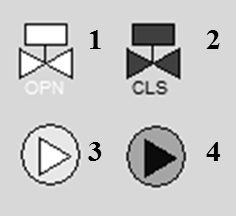

Рис. 1.4. Приклад зображення стану дискретної змінної: 1– клапан відкритий; 2 – клапан закритий; 3 – насос увімкнений; 4 – насос вимкнений

Стан аналогової змінної теж можна показати у вигляді зміни кольору елемента або його частини. У цьому випадку колір може вказувати на діапазон, в якому знаходиться значення змінної (рис. 1.5). У такий спосіб оператор швидко може зорієнтуватися, чи знаходиться змінна в нормі, або в якому технологічному режимі знаходиться установка. У підрозділі 5.8 показано вади такого підходу і альтернативу йому. 

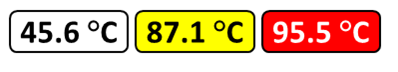 

Рис.1.5. Приклад зображення різного стану аналогової змінної шляхом
 зміни кольору фону та тексту

Зміна кольору елемента часто використовується для сигналізації. 

Стан періодичного процесу також може відображатися у вигляді різних кольорів або відтінків. Так, стани "ПУСК", "СТОП", "БЛОКУВАННЯ", "ПАУЗА" можуть відображатися на одному й тому самому елементі у вигляді однойменних написів з різним кольоровим підсвічуванням. Крім того, активний крок (етап) процесу можна показати на діаграмі станів у вигляді яскравого елемента. Так, на рис. 1.6 показано діаграму стану 4-х танків, один погляд на яку відразу вказує на активні кроки.

 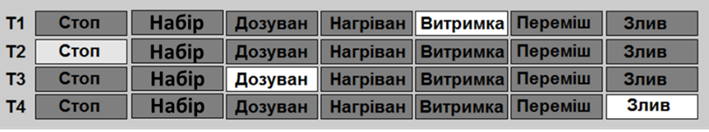

Рис.1.6. Приклад зображення активних кроків (етапів)

Поряд з кольором та текстом нерідко використовується миготіння. Цей тип анімації в основному призначений для привертання уваги оператора до події, що виникла й потребує його реакції. Найчастіше миготіння використовується в підсистемі тривог, де оператор повинен підтвердити факт, що він побачив тривогу, шляхом її квитування – активної дії (наприклад, натискання кнопки). Таким чином, миготіння може тривати доти, поки оператор не зверне уваги і не підтвердить тривогу.

Зміна видимості елементів може використовуватися для різних функцій. Наприклад, на рис. 1.7(2) поява зображення руки вказує на ручний (дистанційний) режим роботи клапана, а на рис. 1.7(4) поява трикутника із символом "W" – на наявність попереджувальної тривоги, пов’язаної з даним насосом. Крім того, властивість видимості може бути використана для виведення на екран операторові тільки тих елементів, які використовуються в цей момент.

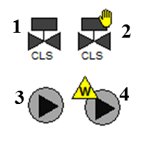 

Рис.1.7. Приклад зображення стану устатковання шляхом зміни видимості

Одним із наглядніших способів представлення аналогової величини є показ ступеня наповненості фігури у відсотковому відношенні (заливки). На рис. 1.8 наведено декілька прикладів заливки в якості відображення рівня в збірниках та наповнення трубопроводу (додаткові рекомендації – в підрозділі 5.8). 

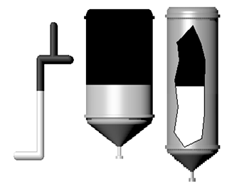 

Рис.1.8. Приклади використання вертикальної заливки

Хоч інтуїтивно заливка підходить для відображення рівня (ступеня заповнення), анімацію заповнення використовують для будь-яких аналогових змінних процесу. Як правило, для цього в засобах SCADA/HMI доступні стандартні елементи, які прийнято називати **стовпчикові діаграми**, або **гістограми**. На рис. 1.9 наведено приклади стовпчикових діаграм, на яких, окрім самого стовпчика, показано вимірювальну шкалу, а також відображено аварійні та попереджувальні межі, щоб оператор бачив, у якому діапазоні зараз знаходиться величина. Стовпчикові діаграми також можуть змінювати колір заповнення стовпчика залежно від значення та показувати бажане значення величини.

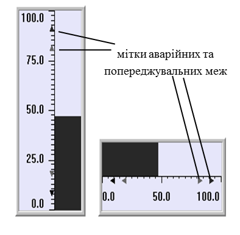 

Рис. 1.9. Стовпчикові діаграми (гістограми): ліворуч – вертикальні; праворуч – горизонтальні

Крім стовпчикових діаграм, для відображення значення аналогових величин можна використовувати **кругові діаграми**. Так, на рис. 1.10 кругова діаграма показує плинну витрату речовини. Так само можна показувати ступінь відкриття регулюючого органу. На рис. 1.13 у нижній частині фільтра F3 за допомогою кругової діаграми показано, скільки часу пройшло з початку етапу фільтрації відносно заданого.

        

Рис.1.10. Фрагмент мнемосхеми з різними типами діаграм

За допомогою анімації руху по вертикалі чи по горизонталі можна показувати як значення вимірюваної величини, так і значення уставки (заданого або бажаного значення). Так, на рис. 1.10 (праворуч) показано стовпчикові діаграми з відміткою заданих значень (вказані трикутними стрілками). 

Анімація обертання (зміна кута повороту), як правило, використовується в **стрілочних індикаторах** (рис. 1.11). Цей тип графічних елементів інтуїтивно зрозумілий оператору, а інформація з нього швидко сприймається. Комбінація з анімацією кольору поліпшує процес сприйняття.

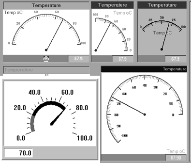        

Рис.1.11. Стрілочні індикатори

Крім цього, анімацію руху застосовують, щоб показати залежність однієї змінної від іншої або розподіл (градієнт) параметрів у просторі. Наприклад, на рис. 1.12 показано значення температур на контрольних тарілках колони у вигляді точок, розміщених на горизонтальних лініях. Поєднавши ці точки, можна показати градієнт розподілу температур по висоті колони. Застосувавши такий підхід разом з анімацією кольору, можна одним поглядом оцінити стан роботи колони.

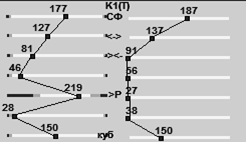 

Рис. 1.12. Приклад відображення градієнта температур по висоті колон

Для відображення тенденції зміни значення технологічних змінних використовуються **самописці**, які також називають **трендами реального часу**.

Наприклад, у мнемосхемі на рис. 1.10 самописець дає операторові уявлення про поведінку тиску, оскільки різке його підвищення може вказувати на забитість фільтраційного матеріалу. Слід зазначити, що в такому випадку абсолютна величина тиску не має такого значення, як його зміна в часі. А на рис. 1.13 самописець показує тенденцію відхилення дійсного значення витрати від заданого, що значно інформативніше, аніж бачити тільки їхні плинні значення.

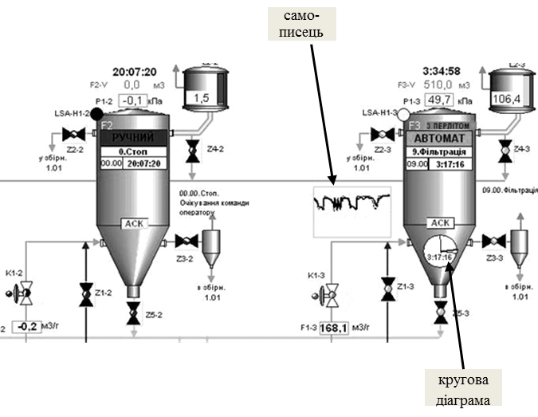

Рис.1.13. Приклад мнемосхеми з використанням самописців і кругової діаграми

Крім того, на мнемосхемі рис. 1.13 задіяно функцію видимості, оскільки самописець і кругова діаграма показані тільки для працюючого фільтра, тому що в іншому випадку вони не мають ніякого значення і тільки заплутують оператора надлишковою непотрібною інформацією.

Як видно з рис. 1.14, самописець часто використовується у вікнах налаштування регулятора, оскільки саме вигляд перехідного процесу дає наладчикові інформацію про вдалий підбір його настройок. 

Сучасні програми SCADA/HMI дають можливість залежно від значення змінних керувати активністю мультимедійного контенту, наприклад фільмів, аудіо або різного типу анімації GIF, Flash і т. д. Однак не слід зловживати цими засобами, тому що їхнє надмірне використання тільки погіршує процес сприйняття інформації та адекватну оцінку стану процесу. 

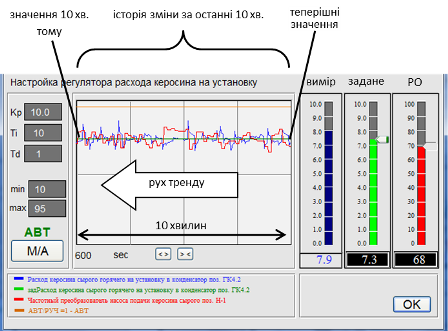 

Рис. 1.14. Приклад використання самописця

## 1.2.3. Способи та елементи введення (зміни значення змінних)

Графічні елементи, які використовуються для зміни значення змінних або відправки команд, називають **елементами керування**. Впливати на ці елементи можна, використовуючи один з доступних елементів введення:

- маніпулятор "миша";

- сенсорний екран;

- клавіатура. 

Для виконання команд для зміни значення дискретних змінних типу "увімкнути"/"вимкнути" використовуються кнопки, перемикачі або графічні еле­менти з цими функціями. Графічний вигляд таких елементів може бути дуже різним (рис. 1.15). Тим не менше, можна виділити два типи команд для таких елементів:

- перемикання, яке приводить до зміни значення ВКЛ на ОТКЛ, та навпаки;

- записування константи, яка відповідає одному зі станів: "ВКЛ" або "ОТКЛ".

Можна здогадатися, що на рис. 1.15 показано перемикачі, оскільки команди (наприклад по кліку миші) приводять до зміни значення на обернене. Однак функціональність таких елементів не обов’язково збігається із зображенням, тому слід заздалегідь обговорювати їх із розробником.

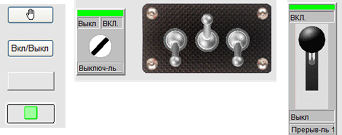

Рис.1.15. Приклади зображення перемикачів

На рис. 1.16 наведено приклади використання кнопок із командами записування константи. В обох прикладах для включення та виключення установки/двигуна необхідно використати різні кнопки: "Начать" та "ВКЛ" для включення і "СТОП" та "ОТКЛ" для відключення. 

 

Рис. 1.16. Приклади використання

Аналогічним способом можна записати значення константи для аналогової або текстової змінної. Однак цей спосіб не такий вживаний, тому що є необхідність у записувані будь-яких значень з дозволеного діапазону введення. Один з найбільш універсальних способів – ввести значення з клавіатури в полі для введення. Для цього елемент введення отримує курсор введення, який називають **фокусом**. У більшості засобів SCADA/HMI по отриманні фокуса значення вводиться безпосередньо в поле для введення (рис. 1.17). Бувають і інші способи введення значення, як, наприклад, набір значення під елементом, що отримав фокус.

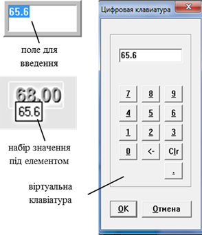

Рис.1.17. Різні способи введення значення аналогової змінної.

Враховуючи, що у зв’язку з виробничими умовами чи наявністю сенсорного екрана клавіатури на АРМі може не бути, для введення значення можна використати віртуальну клавіатуру (див. рис. 1.17). 

Більшість SCADA/HMI обмежують введене значення в дозволених межах, що зменшує ймовірність помилкової дії оператора. 

Введення з клавіатури надає змогу записати вказане значення з дозволеного діапазону, однак часто операторові необхідно змінити його відносно плинного стану. Крім того, оператор при керуванні користується нечіткими більш інтуїтивними поняттями, на кшталт "трохи збільшити" чи "сильно зменшити", або "відкрити десь наполовину". Для такого типу керування більш підходять "аналогові" засоби керування типу повзуна чи кнопки "більше/ менше".

**Повзуни** (slider) призначені для зміни значення змінної шляхом пересування "ручки" по шкалі від мінімального до максимального значення. Повзуни бувають вертикальними, горизонтальними та круговими (рис. 1.18).

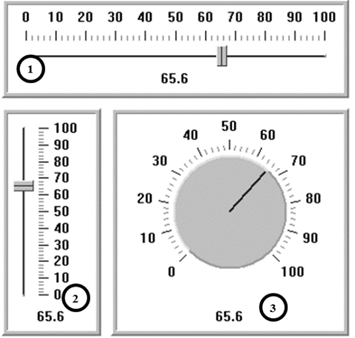 

Рис. 1.18. Приклади повзунів.

Приклад використання вертикального повзуна показано на рис.1.19 для завдання заданого значення та ручного виходу на виконавчий механізм. Серед усіх елементів введення повзун виділяється найшвидшим способом зміни значення змінної. 

Для зміни значення змінної на кшталт "трохи більше" чи "трохи менше" найкраще використовувати кнопки ступеневої зміни. На рис.1.19 кнопки "більше" та "менше" поряд з повзунами відповідно збільшують та зменшують значення на 1%. Іноді крок зміни параметра залежить від тривалості натиснення відповідної кнопки. Чим більша тривалість натиснення кнопки, тим більша величина кроку і з більшою швидкістю змінюється параметр.

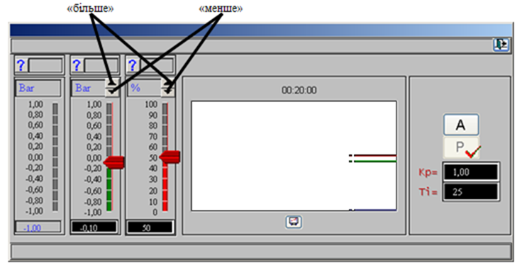

Рис.1.19. Приклади використання кнопок "більше" та "менше" .

Це не весь перелік способів та елементів відображення та зміни, які можуть використовуватися в засобах HMI. У підрозділі 5.8 наводяться деякі елементи високоефективних людино-машинних інтерфейсів, які можуть значно покращити ситуаційну обізнаність.

[<-- 1.1. Місце засобів SCADA/HMI в структурі керування](1_1.md)

[--> 1.3. Підсистема тривожної сигналізації та подій](1_3.md)