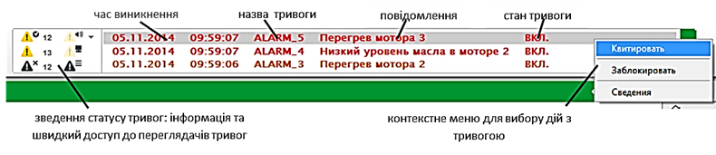
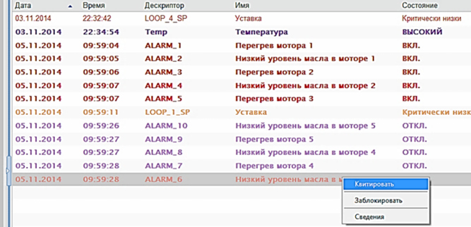
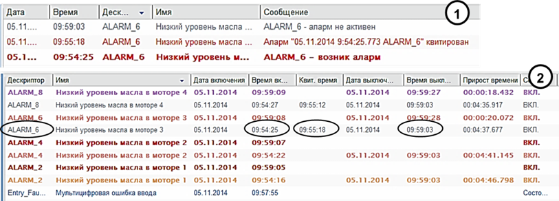
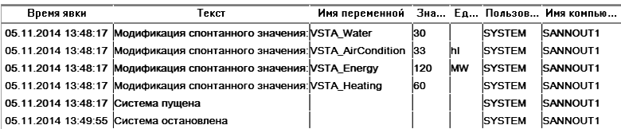

[Головна](README.md) > [1.Призначення та можливості людино-машинних інтерфейсів та збирання даних в автоматизованих системах керування](1.md)

# 1.3. Підсистема тривожної сигналізації та подій

У цьому підрозділі тривожна сигналізація розглядається з точки зору оператора. Детальніше особливості розроблення подано в розділі 6. 

## 1.3.1. Загальні принципи функціонування

Кількість параметрів, які контролює один оператор, може вимірюватися сотнями, при цьому кількість мнемосхем може перевищувати десяток. При таких обставинах навіть найуважніший і досвідчений оператор не зможе вчасно зреагувати на вихід за регламентні межі значення однієї з контрольованих величин. Тому для кращого моніторингу процесу в SCADA/HMI використовуються підсистеми **тривожної сигналізації** (**Alarms Management**). Основна ідея її функціонування – відслідковування виходу змінної процесу за нормовані межі. Тобто, коли всі технологічні параметри процесу перебувають в регламентних межах, оператор може не слідкувати за всіма значеннями контрольованих параметрів, оскільки за ними слідкує підсистема тривожної сигналізації. Як тільки значення хоча б однієї зі змінних переходить у ненормований стан (за межі нормованих значень), то підсистема оповіщає про це оператора, щоб той звернув на це увагу і, за можливості, усунув причину тривоги. Факт появи тривоги може сигналізуватися зміною кольору елемента (наприклад, яскраво-червоним чи жовтим), миготінням, звуковим сигналом, спливаючим вікном та іншими способами, які привертають увагу оператора. Тобто перша функція підсистеми тривожної сигналізації – виявити тривожну подію та сповістити про неї оператора. Сама нештатна подія називається **тривогою**.

Як уже зазначалося, тривога повинна сигналізуватися таким чином, щоб привертати увагу оператора незалежно від відкритого дисплею  на даний момент часу. Після виявлення оператором тривожного факту такі засоби сигналізації як звук, чи миготіння можуть заважати його адекватній роботі, через додатковий психологічний тиск. Тому оператор може дати команду **підтвердження**, що він помітив тривогу (**квитування**, acknowledge alarm). Після цього тривога переходить у стан активної (оскільки умова тривоги продовжує виконуватись), але підтвердженої (заквітованої), а отже, і по-іншому буде відображатися (наприклад, без звуку та миготіння). При створенні системи розробники повинні узгодити з технологами, які саме тривоги повинні бути з підтвердженням, а які – без, а також яким чином будуть себе вести при цьому елементи HMI.

У будь-якому випадку тривога відключається тоді, коли перестає виконуватись умова її появи та було зроблене її підтвердження (якщо таке вимагалось). Елементи сигналізації відповідно до станів тривог можуть мати чотири варіанти кольорів, миготінь, звуків тощо. 

У деяких ситуаціях, наприклад, коли частина устатковання вийшла з ладу, або у випадках тимчасової відсутності деяких датчиків, тривоги, пов’язані з цими процесами, варто перевести в стан **заборонених**, або **заблокованих** (suppress). Це потрібно для того, щоб вони не сигналізувалися. В іншому випаду до постійно включеної сигналізації оператори поступово звикають, і з часом вся підсистема втрачає своє функціональне призначення, оскільки нові тривожні повідомлення не виділяються на фоні постійно діючих. Це ще одна з причин, чому до розроблення системи тривожної сигналізації необхідно підходити скрупульозно. Додатково до цього, система може передбачати відтермінування тривог, тобто блокування на певний час.  

## 1.3.2. Ведення журналу тривог та його перегляд

Для підвищення якості виробництва та запобігання аваріям в перспективі всі тривожні події, що виникли в технологічному процесі, повинні аналізуватися. Для цього вони заносяться в **журнал тривог**, який зберігається в постійно-запам’ятовуючій пам’яті (наприклад, на жорсткому диску) протягом указаного часу (наприклад, одного місяця). Таким чином, друга функція підсистеми тривог – ведення архівного журналу тривог з можливістю його подальшого перегляду. У журнал автоматично заносяться: відмітка часу появи тривоги, її підтвердження та зникнення, а також **повідомлення тривоги** (alarm message або текст тривоги – alarm text). Крім того, в журнал може також вноситися інша додаткова інформація про тривогу. Переглядаючи журнал тривог, можна отримати послідовність проходження тривоги через усі стани. Так, за відмітками часу можна визначити час, коли виникла тривога, наскільки швидко зреагував на неї оператор (час підтвердження) та в який термін тривога була усунута (час зникнення тривоги).

Для перегляду включених (активних) та непідтверджених тривог, а також архівного журналу засоби SCADA/HMI надають спеціальні інструменти, які називають **переглядачами тривог** (alarm viewer). Функціональні можливості таких переглядачів відрізняються залежно від середовища, але в більшості випадків вони надають такі можливості:

-     перегляду станів включених (активних) на даний момент тривог;

-     перегляду архівного журналу тривог за вказаний проміжок часу;

-     перегляду відміток часу появи, підтвердження, зникнення тривог;

-     перегляду повідомлення та додаткових властивостей тривоги;

-     налаштування різних способів відображення, наприклад, у вигляді списку тривог;

-     налаштування фільтрів для виведення в переглядач тільки тих тривог, які відповідають заданим критеріям (наприклад, по імені змінної чи пріоритету)

Як правило, переглядач останніх трьох-чотирьох тривог завжди видимий на екрані (див. поз. 3 на рис. 1.3). Приклад такого переглядача показано на рис. 1.20. В ідеальному варіанті, коли немає тривог, список повинен бути порожнім. Нове повідомлення появляється в ньому на вершині списку, повідомляючи операторові про наявність нової тривоги.
<a href="media1/1_20.png" target="_blank"></a>                            
Рис. 1.20. Приклад переглядача останніх тривог

Крім найважливішої інформації про тривогу (назва, повідомлення, час виникнення та стан тривоги), операторові можуть бути доступні такі дії, як підтвердження тривоги, заборона (блокування) тривоги та доступ до інших властивостей. У наведеному прикладі на рис. 1.20 переглядач дає можливість перейти до повного списку тривог різної категорії. Число біля піктограми вказує на кількість тривог у списку.

Тривоги можуть мати властивість **пріоритетності**. У цьому випадку найбільш пріоритетні тривоги будуть розміщені в переглядачі на першому місці (на вершині списку). У випадку великої кількості активних тривог (у цьому випадку – більше 3-х) повний перелік доступний через дисплей зведення тривог (переглядач усіх тривог), який відкривається на окремій сторінці. Дисплей показує список усіх тривог з їх активним станом, аналогічно до того, який показаний на рис. 1.21. Повідомлення про тривоги можуть підсвічуватися та/або миготіти відповідно до їхнього стану.

 

Рис. 1.21. Приклад зведення тривог у вигляді списку

Для аналізу історії тривог переглядачі можуть відображати інформацію з журналу тривог (історичний режим). Операторові може бути зручно переглядати історію у вигляді списку, де кожна дія відображається окремим повідомленням, або у вигляді зведення, де окремий рядок представляє повну історію появи, підтвердження і зникнення тривоги. Так, на рис. 1.22(1) показано, як змінювався стан тривоги з дескриптором (назвою) ALARM_6, яка відповідає за зниження рівня масла у двигуні 3. Кожна нова зміна стану показана в списку у вигляді окремого запису:

```
9:54:25 – тривога включилась;
9:55:18 – оператор її підтвердив (квитував);
9:59:03 – тривога відключилась. 
```
<a href="media1/1_22.png" target="_blank"></a> 

Рис. 1.22. Приклад переглядача журналу тривог у вигляді: 1 – списку; 2 – зведення

На рис. 1.22(2) овалами виділено відмітки часу зміни стану ALARM_6 на переглядачі журналу у вигляді зведення тривог. 

Переглядачі тривог, як правило, надають можливість сортувати повідомлення за різними полями, наприклад, за ім’ям (дескриптора), часом виникнення тривоги тощо. Для відображення тільки необхідних записів можна налаштувати фільтри; приклади:

- відображати тільки непідтверджені записи за вказаний період часу;

- відображати тільки тривоги з указаною категорією;

- відображати всі тривоги з указаним дескриптором (назвою). 

## 1.3.3. Типи тривог

Тривоги можуть виникати за різних причин. Більшість засобів SCADA/HMI надають можливості генерувати тривоги за такими подіями:

- зміна значення дискретної змінної (**дискретні тривоги**);

- зміна значення аналогової змінної (**аналогові тривоги**);

- збій роботи зв’язку середовища виконання SCADA/HMI з джерелом даних (наприклад, контролером) або неполадки в роботі самої системи (**системні тривоги**).

Умову виникнення дискретних тривог можна налаштувати як на ВКЛючення (ON, 1), так і на ВИКЛючення (OFF, 0). Яке саме значення є тривогою, визначається залежно від завдання. 

Для аналогових тривог умовою спрацювання може бути:

- вихід значення за попереджувальну верхню межу (англійською позначається як HI)

- вихід значення за аварійну верхню межу (HIHI); 

- вихід значення за попереджувальну нижню межу (LO)

- вихід значення за аварійну нижню межу (LOLO).

- відхилення величини від заданого значення (deviation).

Для зручності фільтрації повідомлень у переглядачі тривог, а також групового налаштування можуть використовуватись додаткові властивості тривог, такі як номер групи, зона дії (наприклад, цех, відділення), категорія (наприклад, критичні, некритичні, системні) та ін. 

## 1.3.4. Події та журнал подій

Подібно до фіксування тривог, засоби SCADA/HMI мають можливість вести **журнал подій**. На відміну від тривоги, **подія** – це штатна зміна значення змінної, виконання команди або системної дії. Необхідність у фіксуванні таких подій може бути пов’язана з:

- включенням насоса, установки, відкриття клапана;

- запуском програми приготування продукту, перехід до етапу, закінчення її;

- запуском та зупинкою SCADA системи чи її частини;

- реєстрацією користувача в системі (оператор зайшов під своїм іменем та паролем);

- введення оператором значення змінної.

З наведених прикладів видно, що ці ситуації є штатними і в більшості випадків не потребують підтвердження. Тим не менше, вони можуть бути зафіксовані в журналі подій для подальшого аналізу або звітності. Деякі події потребують реакції оператора і повинні при активації відображатися на екрані. Для виведення списку та журналу подій використовуються переглядачі подій, функції яких дуже схожі до переглядачів тривог. На рис. 1.23 показано приклад зовнішнього вигляду переглядача журналу, де видно події останнього запуску та зупинки системи, модифікацію значення змінних оператором ("Модификация спонтанного значения") з іменем “SYSTEM” на конкретному комп’ютері системи.

  

Рис. 1.23. Приклад переглядача журналу подій. 

Враховуючи схожість функцій оброблення подій та тривог, у деяких засобах SCADA/HMI вони поєднуються в єдиній підсистемі (Alarms and Events), яка також може бути реалізована як окремий **сервер тривог та подій** (Alarms and Events Server). Слід зауважити, що архівні журнали подій та тривог можуть використовуватися при формуванні звітів.

[<-- 1.2. Людино-машинний інтерфейс (HMI)](1_2.md)

[--> 1.4. Підсистема трендів](1_4.md)