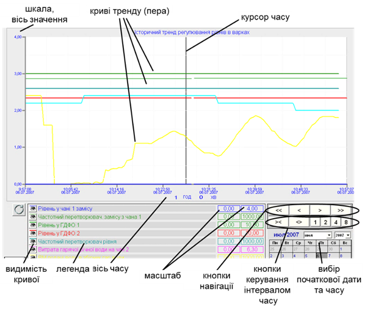
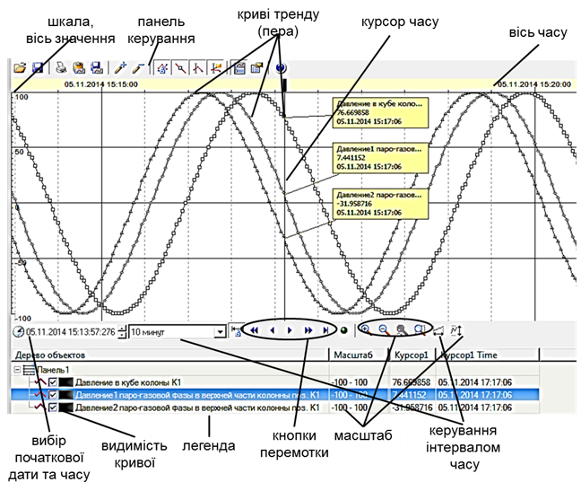

[Головна](README.md) > [1.Призначення та можливості людино-машинних інтерфейсів та збирання даних в автоматизованих системах керування](1.md)

# 1.4. Підсистема трендів

У цьому підрозділі підсистема трендів розглядається з точки зору оператора. Детальніше особливості розроблення розглянуто в розділі 7. 

## 1.4.1. Загальні принципи функціонування

У підрозділі 1.2 показано, які можливості для аналізу динаміки надають самописці. Кожна точка на самописці – це значення змінної в конкретний момент часу в минулому, а їх взаємне поєднання показує тенденцію її зміни в часі. Таке представлення прийнято називати ***трендом***. Самописці являють собою ***тренди реального часу*** (Real-Time Trend), оскільки зміна змінної показується, починаючи з плинного часу (див. рис. 1.14) в крайній правій точці графіка за певний невеликий відрізок часу (як правило, до однієї години). Причому це зображення постійно оновлюється новими значеннями, а крайні ліві значення (найстаріші) зникають.

Тренди реального часу призначені тільки для перегляду тенденції змінної в даний момент часу, для кращого оцінювання поведінки процесу саме зараз. Тим не менше, для таких трендів все одно необхідно зберігати (буферизувати) попередні значення. Буфер тренду розрахований тільки на певний час, а отже, старі значення завжди будуть зникати. Для можливості аналізу тенденції зміни значень змінних, що відбувалися в минулому, їх треба зберігати на постійному запам’ятовуючому пристрої (наприклад, жорсткому диску). Такі тренди прийнято називати ***історичними*** (Historical Trend). На відміну від трендів реального часу, підсистема керування історичними трендами виконує два окремі завдання:

- записує дані в архів (історію);

- вибирає дані з архіву для відображення на елементах людино-машинного інтерфейсу або у звітах.

На відміну від трендів реального часу, в яких значення на самописці оновлюється разом з оновленням змінної, записування даних в архів, як правило, проводиться рідше, ніж їх зчитування з джерела даних (контролера). Слід розуміти, що надмірно часте записування даних призводить до значних затрат ресурсів комп’ютера. Тому разом з ***періодичністю записування*** визначається ***глибина історії*** (архіву) – діапазон часу, протягом якого зберігаються архівні дані. Таким чином, чим частіше проводиться записування і чим довше зберігається історія, тим більше дискового простору буде виділятися під файли архіву і тим довше доведеться системі відшукувати потрібні значення. Продемонструємо це на прикладі.

Припустимо, кожний запис в архіві займає 100 байт. Якщо змінну записувати з періодичністю один раз за секунду, за місяць архів для даної змінної буде займати:

```
100 × 60 с × 60 хв × 24 години × 30 діб = 259200000 байт ≈ 247 Мбайт
```

Якщо кількість змінних становитиме декілька сотень, то архів займатиме десятки, а то й сотні Гігабайт. Якщо ж змінну записувати один раз за 10 с, то об’єм архіву буде вже в 10 разів менший. Навіть при великих об’ємах дискового простору залишається проблема швидкого доступу до архівних даних для читання. Тому при проектуванні SCADA/HMI розробникам разом з технологами необхідно визначитися з глибиною та періодичністю записування. При виборі періодичності записування треба враховувати швидкість зміни параметра, а при виборі глибини – необхідність аналізу історичних даних у майбутньому. Для детального аналізу одну й ту саму змінну можуть записувати в архівні тренди різної глибини. Наприклад, у добові тренди (глибиною 24 год) можуть писати змінну один раз за 1 с, а в місячні (глибина один місяць) – один раз за 1 хв.

Окрім трендів, особливості конфігурування яких в SCADA/HMI розглянуто в розділі 7, для збирання та збереження великої кількості даних використовують спеціалізовані програмні засоби – Historian. Цей тип ПЗ дає накопичувати історичні дані та події за великий проміжок часу з малою періодичністю та відмітками часу до мілісекунд і менше. Детальніше про Historian йдеться в підрозділі 9.3 посібника.  

Більшість SCADA/HMI, окрім періодичного способу записування, підтримують записування за зміни значення. Цей спосіб дає можливість економити дисковий простір, оскільки в більшості часу технологічні параметри не змінюються. При цьому для аналогових змінних також треба визначити зону (поріг) нечутливості, переходячи через який відбуватиметься записування.

Деякі SCADA/HMI підтримують записування по тригеру**.** Це дає можливість записувати дані в архів тільки при спрацюванні певних умов. Комбінація записування по тригеру з іншими типами дає можливість вести ***порційні архіви*** (batch archive), коли дані пишуться тільки на певних етапах процесу. Це може бути актуально для періодичного процесу приготування продукту в танках, де записування значень параметрів (температур, тисків, рівнів і т.п.) необхідно робити тільки на стадіях участі танка в процесі. 

Підсистема трендів може бути реалізована у вигляді окремого програмного забезпечення, яке у багатьох випадках називають ***сервером трендів*** (Trend Server).

## 1.4.2. Переглядання трендів

Вибірка даних з історичного тренду, як правило, проводиться спеціальними елементами відображення або підсистемою звітів. Для відображення трендів можна використати табличний вигляд, однак частіше для цього застосовуються самописці, які також називають ***переглядачами трендів*** (Trend Viewer), а ще частіше – трендами. Ці елементи відображення, часто, можуть працювати як у режимі перегляду трендів реального часу, так і історичних. Розглянемо найбільш вживані можливості переглядачів трендів на прикладах рис. 1.24 та 1.25.

Сукупність взаємопов’язаних точок на тренді для однієї змінної прийнято називати ***кривими*** (curves), або ***перами*** (pens). Для того щоб відрізняти пера на тренді, їм призначають свій колір або/та тип лінії (суцільна, пунктирна, штрихова тощо), які пов’язують точки. Крім того, самі точки можна показувати різними геометричними фігурами (див. рис. 1.25).

Криві показуються у вибраному діапазоні часу (***інтервалі***), який може налаштовуватися спеціальними кнопками типу "розтягування" ("<>"), "звуження" ("> <") або вибору з ряду заданих (див. рис. 1.24). Початкове значення дати та часу перегляду вибирається за допомогою календаря або вказується шляхом введення. Швидка навігація доступна через кнопки:

" < " – на половину інтервалу назад; 

" << " – на один інтервал назад;

" > " – на половину інтервалу вперед; 

" >> " – на один інтервал уперед.

                               

*Рис. 1.24.* Приклад переглядача трендів.

 

*Рис.1.25.* Приклад переглядача трендів з розширеними можливостями.

За допомогою ***легенди*** оператор може подивитися призначення кожної кривої тренду відповідно до кольору, налаштувати масштаб відображення, показувати чи ховати пера на графіку. Крім того, більшість переглядачів мають можливість показати ***курсор часу***, що дає можливість відобразити числове значення трендів у потрібній точці часу. Так, на рис. 1.25 видно, що 05.11.2014 о 15:17:06 значення тиску внизу колони К1 було 76,7 Па.

Наведені вище можливості – це не повний перелік тих, які надаються переглядачами трендів. Наприклад, за допомогою панелі керування (див. рис. 1.25) можна добавляти/видаляти пера, налаштовувати особливості відображення, створювати незалежні панелі зі своїми осями та багато чого іншого. 