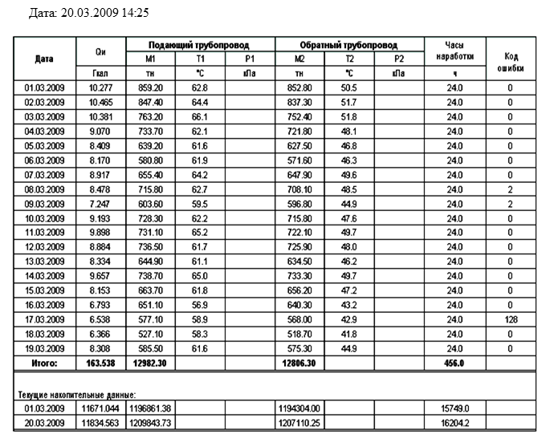
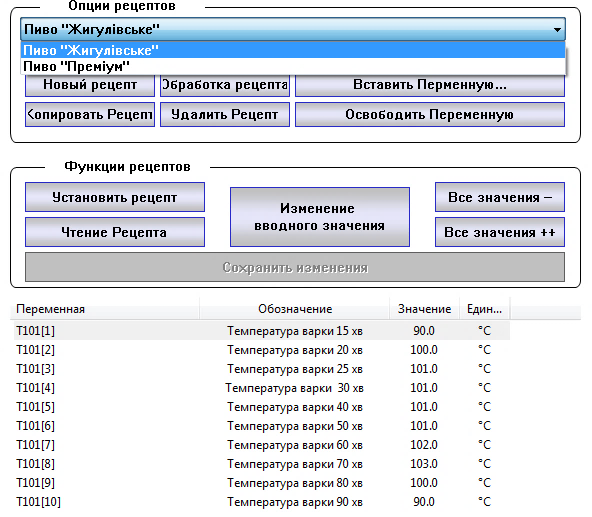
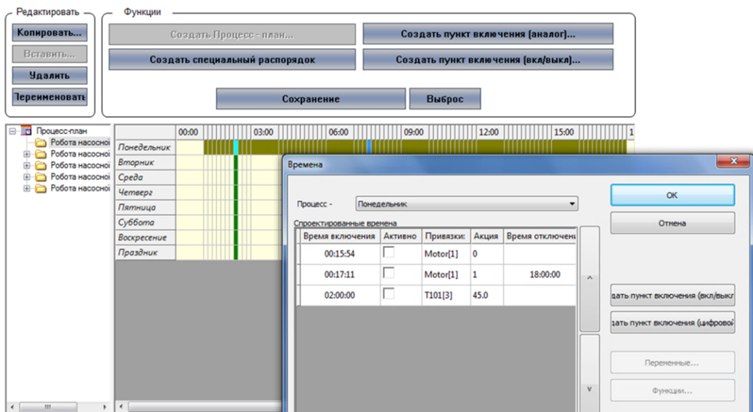

[Головна](README.md) > [1.Призначення та можливості людино-машинних інтерфейсів та збирання даних в автоматизованих системах керування](1.md)

# 1.5. Додаткові підсистеми SCADA/HMI

У цьому підрозділі додаткові підсистеми розглядаються з точки зору оператора. Детальніше особливості розроблення подано в розділі 8.

## 1.5.1. Формування звітів

Для аналізу подій і тривог, тенденції зміни технологічних параметрів протягом певного часу можна скористатися відповідними переглядачами. Крім виведення на екран, вони дають змогу виводити тренди та журнали на принтер. Не дивлячись на те, що в цей спосіб можна вивести багато потрібної й детальної інформації, вона недостатньо оброблена для отримання загальних показників ефективності роботи процесу чи установки. Для виведення загальних показників використовують звіти. 

***Звіт*** (Report) – це документ, сформований на основі визначеної для нього форми та статистично оброблених активних чи історичних даних. У ***формі звіту*** означується розміщення та призначення полів, а при генеруванні звіту ці поля заповнюються конкретними значеннями. Крім полів, вміст яких залежить від даних, форма звіту може вміщувати статичну графічну та текстову інформацію. 

На рис. 1.26 показано приклад звіту, в якому, починаючи з початку місяця, вказуються сумарні добові та місячні величини споживання теплоенергії, середньодобові значення температур та кількість годин напрацювання за добу. Слід звернути увагу, що у звітах, у більшості випадків, використовуються не миттєві значення параметрів (які дають тренди чи журнали), а статистично оброблені за певний звітний період дані (наприклад, за добу, місяць, рік). Тому для звіту необхідне серйозне статистичне оброблення історичних даних, що потребує від розробника високої кваліфікації програміста, а від середовища розроблення – додаткових функціональних можливостей. Як правило, засоби SCADA/HMI мають досить обмежені можливості для роботи зі звітами, тому для складних звітів потрібне додаткове спеціалізоване програмне забезпечення або модулі класу MES/MOM. 

                               

*Рис. 1.26.* Приклад звіту

Звіти можуть генеруватися автоматично (в разі виникнення події чи тривоги або періодично в зазначений астрономічний час) або за запитом оператора. Це може бути віддрукований документ, файл формату PDF, RTF, TXT, CSV, HTML сторінка або таблиця Excel чи якоїсь бази даних. Звіти у вигляді текстових документів насамперед цікавлять керівний персонал, якому вони потрібні для аналізу технологічного процесу. Електронні таблиці потрібні для ведення автоматизованого загальновиробничого обліку (наприклад, передача на рівень керування виробництвом та підприємством). Наприклад, кількість спожитої теплоенергії може бути використано для розрахунку собівартості продукції. 

## 1.5.2. Керування рецептами

***Рецепт*** (recipe) – це сукупність технологічних параметрів, які зчитуються, записуються, зберігаються як єдине ціле. Рецепти дають можливість оператору зберегти в системі задані значення певних технологічних параметрів для приготування конкретного продукту. Враховуючи, що одне й те саме устатковання може використовуватись для приготування різного виду продукту, ***підсистема керування рецептами*** може значно допомогти в цьому.

Наприклад, технолог може змінити значення уставок температур у програмі варіння пива і зберегти його в системі під новим ім'ям рецепта (рис. 1.27). Якщо виникає необхідність зварити пиво за певним рецептом, то оператор вибирає його і відправляє на записування у контролер. Іншими словами, в контролер будуть записані всі значення змінних, які вказані у вибраному рецепті. 

 

*Рис. 1.27.* Приклад дисплея керування рецептами (SCADA zenon)

Підсистема керування рецептами, як правило, надає такі можливості:

- створювати нові рецепти, добавляти в них технологічні параметри (змінні), вказувати їхнє значення;

- редагувати існуючі рецепти;

- відправляти рецепт на записування у контролер;

- зчитувати значення параметрів рецепта з контролера;

- зберігати рецепти на диску.

Рецепти можуть також використовуватися для збереження конфігураційних параметрів механізмів, налаштувань регуляторів тощо. Слід зауважити, що підсистема керування рецептами не є обов’язковою складовою SCADA/HMI, тому це треба мати на увазі при виборі середовища розроблення та виконання. 

У пакеті SCADA може бути наявний модуль керування порційними виробництвами (Batch Control), який може передбачати створення та зміну процедури рецепту відповідно до стандартів ISA-88 та його аналогу IEC 61512. 

## 1.5.3. Планувальники

Для ряду об’єктів має бути передбачене керування установками згідно з календарним графіком та астрономічним часом. Наприклад, у ряді систем керування водо- та теплопостачання необхідно забезпечити вмикання та вимикання насосів згідно з установленим графіком. У цьому випадку можна скористатися спеціальними підсистемами SCADA/HMI, які називаються ***планувальниками*** (Scheduler). На рис. 1.28 наведено приклад дисплея налаштування планувальника, де оператор може створювати нові плани (процес-плани). У цих процес-планах на заданий час кожного дня тижня можна добавляти дії над дискретними змінними (включення/відключення), аналоговими змінними (записування вказаного значення) та виконувати функції (наприклад, запуск скрипту). 

 

*Рис.1.28.* Приклад дисплея налаштування планувальника (SCADA zenon)

Слід розуміти, що логіка керування процесом, у тому числі включення та відключення устатковання, формування завдань залежно від часу тощо, як правило, реалізується в контролері. Однак у випадку, якщо необхідна гнучкість у таких налаш­туваннях, як зміна часу, добавка нового устатковання в план керування, створення нового плану, реалізувати це без планувальника можна тільки через ручне керування. 

Функції планувальника доступні не в усіх системах SCADA/HMI, а отже розроблення її потребує додаткових фінансових затрат, більше часу та вищої компетенції розробника. 

## 1.5.4. Система розмежування доступу

Доступ до автоматизованої системи керування технологічним процесом можуть мати:

- оператори процесу, до функцій яких входить контроль за процесом, зміна уставок, внесення керуючих дій у ручному режимі;

- технологи, до функцій яких входить визначення технологічних параметрів процесу, аналіз; 

- працівники служб експлуатації, до функцій яких входить контроль за правильністю роботи устатковання, налаштування контурів керування, діагностування та конфігурування пристроїв;

- інші працівники підприємства, яким потрібна певна інформація про стан процесу.

Це означає, що автоматизованим робочим місцем можуть користуватися декілька операторів для виконання різних функцій. Треба чітко розуміти, що, згідно з організаційною структурою, працівник служби КВПіА, як правило, не має права змінювати уставку чи закривати клапани, оскільки за це відповідає оператор. З іншого боку, оператор не має права змінювати налаштування регуляторів, бо це не в його компетенції. Таким чином, виникає завдання розмежування доступу до сторінок та елементів SCADA/HMI. У більшості випадків для цього використовуються механізми, що ґрунтуються на системі ***аутентифікації*** (визначення дійсності входу конкретного оператора) та ***авторизації*** (визначення прав доступу для конкретного користувача). Для кожного користувача створюється ім’я входу (login) та пароль (password) і визначаються права доступу до сторінок та елементів. Якщо користувач хоче доступитися до елементів з обмеженим доступом, то система потребує від нього зайти під своїм ім’ям. 

При проектуванні системи керування технологи разом з розробниками повинні визначитися з кількістю користувачів та їх правами доступу.

[<-- 1.4. Підсистема трендів](1_4.md)

[--> 1.6. Мережні архітектури](1_6.md)