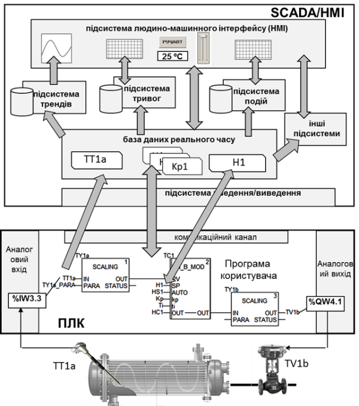
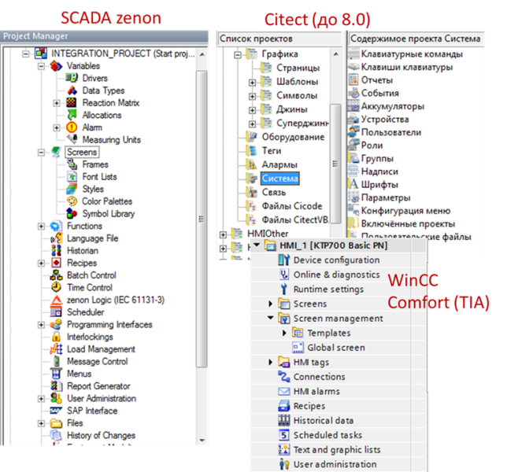
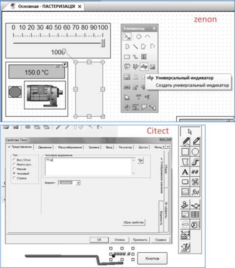

[Головна](README.md) > [2.Загальні принципи розроблення SCADA/HMI](2.md)

# 2.2. Розроблення проекту

## 2.2.1. Узагальнена функціональна структура SCADA системи

Як уже зазначалося, загальна концепція розроблення на базі програм SCADA/HMI – це "конфігурування замість програмування". Тобто вся або більша частина проекту розроблюються шляхом заповнення полів, таблиць, розміщення готових елементів. Тільки в деяких випадках, коли немає готового рішення, використовують вбудовані в SCADA/HMI мови та середовища програмування. 

Розробник проекту повинен розуміти внутрішню функціональну структуру SCADA/HMI. Але довідникова система програмних засобів не завжди включає схему та опис такої структури. Набір сутностей та їх взаємозв’язки можуть відрізнятися в різних SCADA/HMI і розробникові без загального "системного" представлення інколи важко зрозуміти, як функціонує середовище виконання і як побудоване середовище розроблення. Тим не менше, враховуючи ринкові вимоги та історичне підґрунтя розвитку SCADA/HMI, перелік функцій середовища виконання для них спільні (вони наведені в попередньому розділі). Це дає можливість зробити певне узагальнення функціональної структури і саме через нього розглядати спільні риси більшості середовищ розроблення та виконання. На рис. 2.1 наведено спрощену модель функціонування SCADA-системи. Вона може відрізнятися для конкретного програмного пакета в той чи інший бік, тим не менше в цьому посібнику вона є базисною: саме в контексті цієї моделі будуть розглядатися всі діяльності по розробленню.  

Центральне місце в системі збирання та диспетчерського керування займає база даних реального часу (БДРЧ) – сукупність змінних процесу, на базі значень яких функціонують інші підсистеми. Ці змінні часто називають тегами (Tag), і завдання SCADA – слідкувати за їхнім оновленням. З одного боку, теги зв’язуються з джерелом даних, а з іншого – з іншими підсистемами SCADA/HMI. Джерелом даних для тегів можуть слугувати зовнішні пристрої (наприклад контролери), системна інформація (наприклад плинна дата та час, або ім’я оператора, що ввійшов у систему), внутрішня або дискова пам’ять. При створенні та конфігуруванні тегу вказується його унікальне ім’я, тип, джерело даних, періодичність оновлення (зчитування), межі зміни та інші настройки. Наприклад, на рис. 2.1 показано, що зовнішній тег з ім'ям “TT1a” через підсистему введення/виведення зв’язується з однойменною змінною на ПЛК, яка має за джерело даних датчик температури, що підключений до вхідного аналогового каналу (%IW3.3). Детальніше конфігурування бази даних реального часу розглядається в третьому розділі посібника. 

Як правило, теги в базах даних реального часу оновлюються періодично. Це робиться для того, щоб отримувати свіжу інформацію від пристроїв введення/виведення, наприклад контролера. Ці значення потрібні іншим підсистемам, наприклад, людино-машинному інтерфейсу. З іншого боку, деякі підсистеми SCADA теж можуть змінювати значення тегів, і при цьому це значення повинно записуватися в контролер. Таким чином реалізується двосторонній обмін. Наприклад, на рис. 2.1 за допомогою повзуна в підсистемі HMI змінюється значення тегу "H1", що прив’язаний до нього. При зміні "H1" підсистема введення/виведення змінює значення однойменної змінної в контролері, яка формує завдання для регулятора "TC1".

 

*Рис. 2.1.* Спрощена модель функціонування SCADA-системи

Одні й ті самі теги з бази даних реального часу можуть використовуватись одночасно в декількох підсистемах: для відображення та диспетчерського керування (в підсистемі HMI), ведення трендового архіву (підсистема трендів), контролю за значенням (підсистема тривожної сигналізації) та ін. Таким чином, конфігурування кожної з цих підсистем можна розглядати як окреме підзавдання. Однак слід розуміти, що в багатьох випадках зміна налаштувань однієї підсистеми може проводитися через ті самі сутності, що й іншої, а розділення підсистем в SCADA/HMI може не бути.  

Для розроблення, редагування та тестування програмного проекту використовують програмні засоби, які прийнято відносити до середовища розроблення. Середовище розроблення SCADA/HMI – це комплекс інструментального програмного забезпечення, куди входять різноманітні редактори, компілятори, імітаційні засоби, засоби налагодження та утиліти. Хоч не в усіх SCADA/HMI середовище розроблення явно виділяється від середовища виконання, як мінімум режим розроблення повинен бути. Тим не менше, надалі будемо розглядати SCADA/HMI саме в контексті їх розділення на 2 складові: розроблення та виконання, як це було зазначено в 1-му розділі. Також будемо вважати, що проект у середовищі розроблення (вихідний) шляхом компілювання перетворюється на проект середовища виконання, хоч не в усіх SCADA/HMI необхідно проводити компілювання. 

Процес створення проекту SCADA/HMI, як правило, проходить у трьох площинах: 

- конфігурування проектних даних; 

- створення графічної частини проекту(HMI); 

- написання невеликих програм (скриптів), якщо в таких є  необхідність. 

Таке розділення пов’язано з різним характером процесів розроблення. Конфігурування проектних даних, як правило, пов’язане із заповненням різноманітних полів таблиць або/та властивостей об’єктів. Графічна частина передбачає створення безпосередньо людино-машинного інтерфейсу, тому включає роботи по рисуванню та налаштуванню анімації. Написання скриптів передбачає програмування на одній або кількох мовах. Хоч ці діяльності пов’язані між собою і переплітаються, для них існують різні редактори. Інтегроване середовище розроблення може включати в себе ці редактори або посилатися на них.

Деякі середовища розроблення за проектними даними можуть автоматично формувати необхідну супроводжувальну для розробників документацію.   

## 2.2.2. Структура та принципи побудови середовища розроблення

Можливості середовища розроблення значно впливають на швидкість та зручність розроблення проекту, кількість можливих помилок, допущених при розробленні. 

Проект середовища розроблення містить дані, необхідні для редагування та зв’язування даних у середині проекту. Так, для відображення числового значення тегу в полі необхідно в конкретній властивості цього поля вказати його ім'я, яке є атрибутом цього тегу. Для того щоб при компіляції проекту відбулося таке поєднання, записування про цей тег повинен десь існувати. Той же тег повинен в якості джерела даних отримати змінну з ПЛК, і ці налаштування також десь мають бути записані. Цей ланцюжок зав’язків можна продовжувати, однак очевидно, що проект – це своєрідна база даних. У різних середовищах розроблення SCADA/HMI ця база даних має своє представлення. Наприклад, проект SCADA Citect являє собою папку переважно з файлами Dbase (DBF) та іншими файлами (як правило для опису графічних сторінок). У SCADA zenon проектні дані зберігаються в базі даних MS SQL Server Express. Таким чином, окрім створення, редагування та видалення проектів, для різних середовищ можуть бути доступні різні можливості, зокрема:

- створення та редагування декількох проектів в одному середовищі одночасно;

- створення резервної копії з можливістю її відновлення на іншому робочому місці;

- одночасна робота з проектом з декількох робочих місць;

- імпорт/експорт усього проекту або його частини в/з інші проекти;

- імпорт/експорт проектних даних з інших систем, наприклад через текстові файли CSV, XML або таблиці Excel, тощо; 

- автоматизація роботи з проектом через вбудовані мови та середовища або через спеціалізований програмний інтерфейс;

- засоби налагодження;

- засоби завантаження проекту на цільовий засіб із середовищем виконання;

- засоби кіберзахисту;

- засоби керування версіями; 

- інші засоби.  

Як вже зазначалося, середовища розроблення SCADA/HMI включають кілька редакторів. Як правило, серед них є редактор проектних даних, редактор графіки та редактор коду. Редактор даних призначений для редагування усієї неграфічної частини, а графічна частина проекту виконується в редакторі графіки. У багатьох SCADA/HMI є єдине інтегроване середовище розроблення IDE (Integrated development environment), де редактори графічних сторінок відкриваються в тому самому вікні.   

Сучасні SCADA/HMI як правило мають навігатор проекту або проектів, через який можна швидко доступитися до всіх розділів проекту. На рис. 2.2 показано приклади таких навігаторів, різних за підходами SCADA/HMI. Тим не менше, при детальному розгляді цих структур можна знайти відповідності. Так, в наведених на прикладі середовищах можна знайти розділи:

- теги/змінні;

- налаштування драйверів введення/виведення;

- екрани/сторінки; 

- бібліотечні статичні та динамічні символи; 

- налаштування архівування трендів (Historian);

- налаштування підсистеми тривог та подій (Alarms); 

- планувальники (Scheduler);

- рецепти;

- налаштування користувачів;

- налаштування мов.

*Рис. 2.2.* Приклади навігаторів проекту

Середовища розроблення можуть дозволяти гнучко керувати робочим простором для зручності розробника, зокрема розміщувати вікна, панелі інструментів, підключати інші редактори тощо. Сучасні підходи передбачають можливість одночасно працювати з одним проектом кільком розробникам, що дуже важливо для великих проектів. Для перенесення проектів та керування версіями доступні засоби створення та відновлення резервних копій.  

У різних SCADA/HMI можуть використовуватися принципово різні підходи до використання зв’язків між елементами. Так, у SCADA Citect зв’язки властивостей проводяться під час компіляції. Тобто якщо на якомусь етапі розроблення необхідно буде змінити ім'я тегу, то в усіх полях графічної підсистеми залишиться стара назва, що приведе до прив’язки до неіснуючого тегу. Це у багатьох випадках незручно і призводить до помилок, тим не менше компілятор показує місця цих помилок. Слід відмітити, що у нових версіях SCADA Citect підтримується так звана "каскадна" заміна, коли пов’язані поля за зміни змінюється по всьому проекту. У SCADA zenon принципово інший підхід. Там практично усі зв’язки між елементами формуються не за ім'ям, а за внутрішньо-проектним посиланням. Тобто, якщо зміниться ім'я тегу (змінної), то в усіх місцях, де він до цього використовувався також зміниться назва прив’язки. Хоч це здається завжди зручнішим, інколи бувають випадки, де 1-й спосіб має свої переваги.

Нині усі постачальники намагаються запозичити кращі практики один в одного, що значно спрощує роботу програміста АСКТП. Серед можливостей редакторів можна виділити такі:

- використання фільтрів у табличних редакторах, коли в таблиці відображаються тільки ті записи, що задовольняють умови фільтру;

- одночасне редагування декількох записів, що виділені разом;

- підсвічування різних значень у виділених разом записах. 

Важливим моментом при розробленні великих проектів є можливість імпортувати дані з інших редакторів. Як правило, підтримуються текстові формати даних типу CSV (Comma Separated Value) та XML (eXtensible Markup Language). Файли CSV являють собою текстові записи, в яких поля розділені якимось знаком (";", ",", "TAB" тощо). Такий формат досить зручно використовувати при імпортуванні таблиць з інших редакторів. Враховуючи, що до редакторів, які вміють експортувати CSV, входить Excel, то можливості автоматизації створення SCADA/HMI значно зростають. Навіть якщо формат файлів, що приймає редактор SCADA/HMI, відрізняється від CSV в Excel, то звичайний блокнот з функціями пошуку та заміни легко виправить цей недолік. 

Нині найбільш популярним форматом представлення даних є XML. Він може представити будь-які ієрархічні структури. Тим не менше, в ряді випадків для автоматизації створення великої кількості записів зручнішим видається CSV. 

Для автоматизації розроблення проекту середовище розроблення може мати відкритий програмний інтерфейс API (Application Program Interface). У цьому випадку проектними даними можна оперувати ззовні з використанням різних середовищ програмування. У ряді випадків в IDE SCADA/HMI можуть бути наявні також і засоби такого програмування. Наявність API дає можливість використовувати сучасні підходи автоматизації розроблення та DEVOPS. 

## 2.2.3. Створення графічної частини проекту

Графічна частина проекту створюється у вбудованих в SCADA/HMI редакторах. Цей процес полягає у виборі елемента з палітри доступних (рис. 2.3) та конфігурування його властивостей. Властивості елементів, які повинні анімуватися, вказують на той тег, який використовується в анімації. Так, на рис. 2.3 властивість "Числовое выражение" елемента "Текст" вказує на тег "ТТ1а", що в режимі виконання приведе до показу значення цього тегу в цьому елементі.         

Більшість середовищ розроблення SCADA/HMI мають у своєму складі значну кількість бібліотек готових графічних елементів, що дає змогу значно прискорити процес створення проекту. У ряді випадків розробники рисують готову підкладку, яку розміщують на задньому фоні дисплейної мнемосхеми, а вже не неї накладають елементи анімації.  

Використання готових програмних інструментів SCADA/HMI значно прискорює процес розроблення, зменшує кількість проектних помилок, та дає можливість внести зміни в проект у будь-який момент, навіть без зупинки технологічного процесу. Графічна частина стосується практично всіх основних функцій SCADA/HMI. (Основні підходи розроблення людино-машинного інтерфейсу розглядаються в 5-му розділі посібника.) 

*Рис.2.3*. Приклади інструментів для створення людино-машинного інтерфейсу
 в різних SCADA

[<-- 2.1. Загальний опис процесів життєвого циклу програмного проекту SCADA/HMI](2_1.md)

[--> 2.3. Виконання та налагодження ](2_3.md)