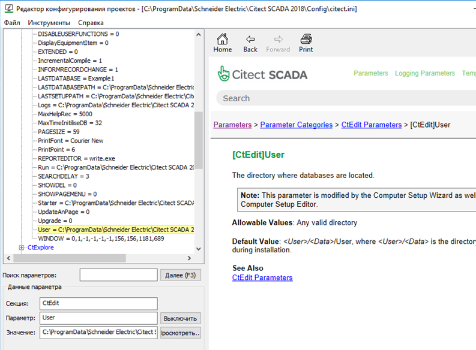
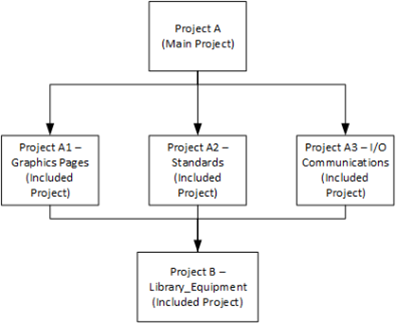
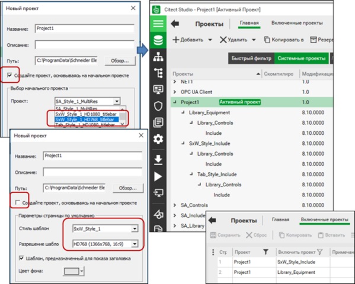
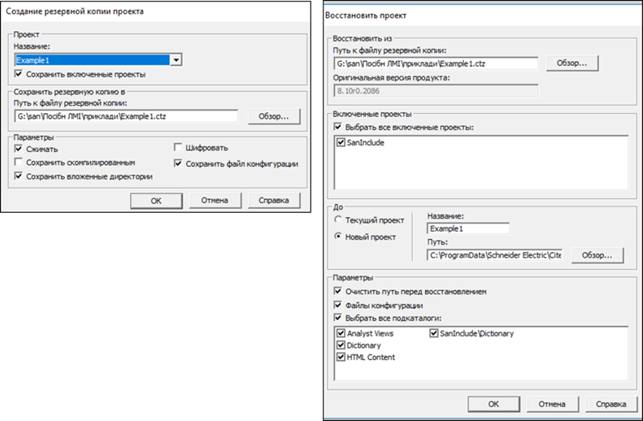
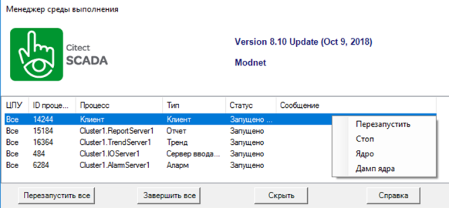
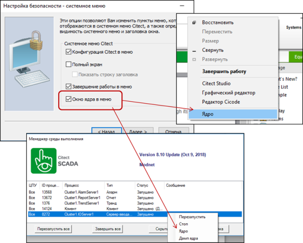
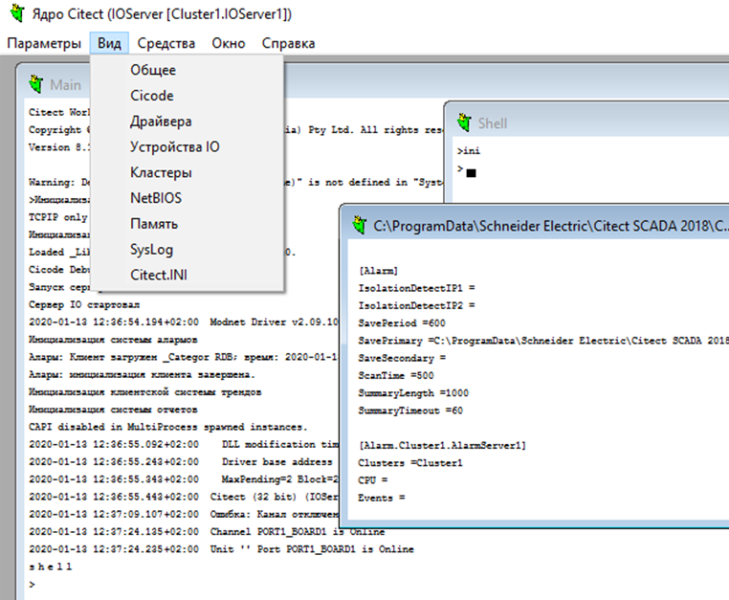
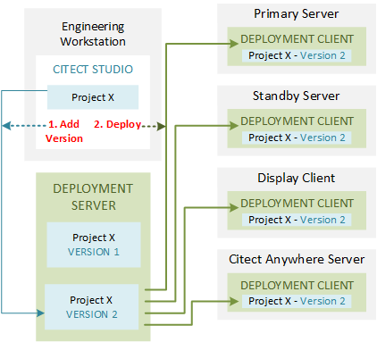
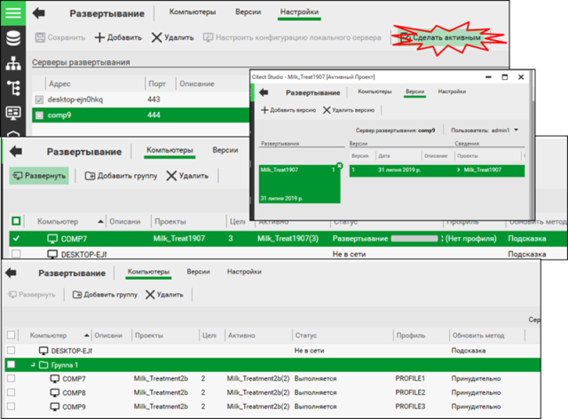

[Головна](README.md) > [2.Загальні принципи розроблення SCADA/HMI](2.md)

# 2.5. Приклад організації проектів у Citect

## 2.5.1. Основні компоненти середовищ розроблення та виконання 

Citect SCADA включає в себе комплект ПЗ середовища розроблення і комплект середовища виконання. При інсталяції SCADA Citect вибирається, що саме необхідно встановити. На робочій станції оператора та серверах SCADA необхідне тільки ПЗ комплекту середовища виконання, а на інженерній робочій станції потрібні обидва комплекти. 

Проект середовища розроблення Citect – це набір різноманітних файлів, які розміщуються в папці проекту. Для їх редагування передбачено кілька окремих редакторів, для версії Citect SCADA 2018 це:

- Citect Studio – для створення і налаштовування логічної частини проекту; 

- Graphics Builder – для створення і редагування графічних сторінок, а також бібліотечних елементів;

- Cicode Editor – редактор файлів мов Cicode та VBA;

- Computer Setup Editor – редактор файлу з параметрами citect.ini;

- Equipment Editor – редактор устатковання.

Таким чином, щоб створювати або редагувати проект в SCADA 2018, необхідно запустити Citect Studio, а він автоматично відкриє реактор Graphics Builder. Додатково також у наявності є помічники (Wizard), які в інтерактивному режимі допомагають створювати чи налаштовувати проектні дані. Основним редактором є Citect Studio, який є навігатором по проектах і дає змогу не тільки редагувати логічну частину проекту, а й переходити на інші розділи проекту та відкривати відповідні редактори. 

Середовище виконання представлене одним основним файлом Citect.exe, який виконує стартовий проект, але може виконуватися в кількох екземплярах (процесах) для кожного сервера і клієнтів. Для керування середовищем виконання є Runtime Manger, за допомогою якого запускають, зупиняють і перезапускають проекти.

Практично усі редактори та середовище виконання орієнтуються на параметри проекту та системи Citect. ***Параметр*** – це поіменована змінна середовища, за допомогою якої можна змінювати налаштування середовища розроблення та середовища виконання. Параметри можуть бути частиною проекту (Project Database Parameters) або стосуватися конкретного комп’ютера, де запускається Citect (Citect.ini File Parameters). Перші стосуються тільки поведінки конкретного проекту в середовищі виконання і їх конфігурують у відповідному розділі проекту. Параметри, які записані в Citect.ini, стосуються як середовища розроблення, так і виконання, і мають найвищий пріоритет.

Параметр має ім’я та значення і є частиною якоїсь секції. Параметрами можуть користуватися система Citect (умовно називатимемо системні параметри), драйвери введення/виведення Citect (параметри драйверу) або розробник для власних цілей (користувацькі параметри). Системні та драйверні параметри мають наперед визначені імена та набір значень у певних секціях. Якщо їх не задавати, вони матимуть значення за замовчуванням.      

Файл Citect.ini є типовим текстовим ini-файлом, який містить розділи, назви та значення параметрів. За замовчуванням він інсталюється в папку "C:\ProgramData\...\Citect…\Config". Для його зміни можна користуватися будь-яким текстовим редактором або спеціалізованою утилітою Computer Setup Editor (рос. лок."Редактор конфигурирования компьютера"), що поставляється разом з Citect. На рис. 2.4 показаний зовнішній вигляд цього редактору. Він дає можливість знайти наперед визначені параметри і за необхідності їх змінити. Якщо параметра у файлі немає, то вважається що він має значення за замовченням. 

При запуску Citect Studio він повинен дізнатися про розміщення папок з файлами середовища розроблення. Шлях до папки з проектними даними вказано в параметрі “User” (див. рис. 2.4), за замовченням це "C:\ProgramData\...\Citect …\User". Там знаходиться файл MASTER.DBF, який вказує на проекти, що будуть видимі в редакторі. Слід сказати, що проект може знаходитися в папці User, але якщо його немає в MASTER.DBF, він не буде видимий в Citect Studio. Проект може бути підключений або відключений через добавлення/видалення посилання на проект в Citect Studio.

Середовище виконання – це, по суті, виконавчий файл (або файли) Citect.exe, який може виконувати проект, створений та скомпільований у середовищі розроблення Citect. При запуску середовище виконання повинно знати про те, який саме проект необхідно запустити, а також з якими налаштуваннями (наприклад, де зберігати файли для трендів та тривог, якою буде стартова сторінка і т. д.). Назва та розміщення проекту зберігаються в параметрі “RUN” Citect.ini. Параметр "RUN" може змінювати розробник виділивши в Citect Studio потрібний проект для виконання. 

Як видно, для налаштування параметрів середовища розроблення і виконання розробник повинен володіти достатньо великою кількістю знань. Для спрощення налаштування основних параметрів виконавчої системи краще користуватися помічником налаштування комп’ютера, Computer Setup Wizard (рос. лок. "Мастер конфигурирования компьютера"). Цей помічник в інтерактивному режимі налаштовує найнеобхідніші параметри для середовища виконання. Редактор параметрів та помічник налаштування комп’ютера доступні як з меню Windows, так і з Citect Studio.   

*Рис.2.4.* Редактор Citect.ini

Роботи в Citect SCADA передбачають такі основні проектні діяльності.

- розроблення: конфігурування проектів Citect, означення топології, створення системної моделі, створення графічних сторінок, налаштування захисту системи;

- налагодження: компілювання та налагодження проекту на інженерній робочій станції;

- введення в дію: розгортання проекту на реальній системі.

## 2.5.2. Розроблення проекту

Усе що створюється і конфігурується в середовищі розроблення Citect, зберігається в проекті. Це можуть бути графічні сторінки, теги, тривоги, налаштування комунікацій, скрипти і т.ін. Усі необхідні файли для середовища розроблення зберігаються в одній папці. Після компіляції в цю саму папку переміщуються і файли для виконання. Властивості проекту дають змогу змінювати його версію, що може допомогти при контролі версій.

Інтегроване середовище розроблення Citect Studio дає можливість відкривати та редагувати кілька проектів. Citect передбачає механізм включення одних проектів, відкритих у Citect Studio, в інші. Це механізм, при якому кілька проектів (Included Projects) включаються в один загальний проект. Тобто розроблення кожного проекту ведеться індивідуально, а основний проект може включати ці проекти шляхом посилання на них. При компілюванні основного проекту будуть компілюватися і файли виконання включених проектів, і вони будуть перенесені в папку основного проекту.

Механізм включення проектів дає змогу:

- розбити один великий проект на кілька частин, наприклад за принципом: система (основний проект) – підсистеми (включені проекти); кожен із включених проектів може редагуватися і налагоджуватися окремими розробниками як у той самий час, так і в різні моменти часу, основний проект буде слугувати для їх об’єднання на верхньому рівні (див. параграф 9.1.6);

- використовувати у включених проектах шаблони та бібліотечні елементи, які можна таким чином переносити між різними проектами.   

*Рис. 2.5*. Включення проектів

Окремим типом включених проектів є системні проекти (System Projects). Це проекти, що постачаються разом з Citect, які передбачені для включення в інші проекти для перенесення туди шаблонів та бібліотек відповідно до обраного стилю. Системні проекти за замовченням не відображаються в переліку Citect Studio, щоб розробник випадкового не міг змінити їх. Для активації їх відображення є відповідна опція "Системні проекти". 

При створенні нового проекту вибирається стиль проекту (див. рис. 2.6). Вибір стилю вказує редактору, які саме системні проекти треба включити в новий проект. Розробник також може вибрати два варіанти створення нового проекту в Citect Studio (див. рис. 2.6): 

- пустий проект: проект не буде містити жодного компоненту і навіть не зможе компілюватися;

- на базі початкового проекту: передбачає створення базового набору компонентів (серверів, пристроїв введення/виведення, сторінок, користувачів тощо) на основі стилю початкового проекту.

*Рис. 2.6.* Включення системних проектів при створенні стартового проекту

Наприклад, у результаті вибору стилю SxW_Style_1 в стартовий проект Project1 буде включено два системні проекти (див. рис. 2.6). Ці проекти, у свою чергу, включатимуть у себе інші системні проекти. 

Для редагування проекту Citect Studio його необхідно зробити активним. Після створення проекту типово проводиться конфігурування серверів, введення/виведення, добавлення тегів, розроблення графічної частини і т. п. (див. наступні розділи посібника). Усі зміни в проекті приводять до зміни проектних файлів. Для Citect Studio більшість даних зберігається у файлах *.dbf, які можна редагувати в Excel з використанням Excel AddOn, який поставляється разом з дистрибутивом Citect. Видалення записів у редакторі не приводить до їх вилучення з бази даних, а тільки до відповідної помітки в ній. Тому інколи необхідно робити пакування через відповідний пункт меню проекту, яке видалить усі помічені для цього записи.   

Для перенесення проекту на інший ПК або збереження плинної версії Citect Studio надає можливість створити резервну архівну копію проекту. Резервна копія – це архів .zip, який включає усі необхідні файли проекту. Створювати та відновлювати резервну копію можна як в Citect Studio, так і через меню Windows, що дає можливість робити ці операції на робочій станції оператора, на якій не встановлено середовище розроблення. У налаштуваннях майстра можна вибрати проект, який необхідно архівувати, місце розміщення архіву, та різноманітні опції (рис. 2.7). Відновлювати проект можна в папку активного проекту або в нову.  

*Рис. 2.7.* Створення резервної копії проекту та відновлення 

## 2.5.3. Виконання та налагодження проекту

Для перевірки працездатності проекту його необхідно скомпілювати через відповідний пункт меню. При невдалому компілюванні у відповідному вікні з’являться повідомлення:

- помилки (Error): компіляція завершена, але проект не може бути запущений на виконання до їх виправлення;

- критичні помилки (Fatal): компіляція не завершилася через критичну помилку;

- попередження (Warning): компіляція завершена з помилками, але проект може бути виконаний.  

В опціях проекту можна задати режим інкрементної компіляції, при якій буде проводитися компіляція тільки змінених файлів.

Компілювання приводить до створення файлів виконання, серед яких є база даних режиму виконання (RDB, runtime databases), на які перетворюються конфігураційні таблиці. 

Після компілювання проекту його необхідно запустити на виконання для перевірки та налагодження. Запуск виконання можна проводити як із середовища розроблення Citect Studio, так і з меню програм Windows. У першому випадку попередньо буде зроблено компілювання проекту, якщо в цьому є необхідність, і проект буде вибраний як стартовий. В обох випадках буде запущений стартовий проект (шлях вказаний у параметрі [Ctedit]RUN файлу Citect.ini).

Для керування середовищем виконання в Citect є спеціальний менеджер (Runtime Manager), який дозволяє запускати, зупиняти, контролювати стан та зупиняти процеси середовища виконання (рис. 2.8). Менеджер запускається автоматично при запуску середовища виконання, його вікно можна відкрити через контекстне меню піктограми в панелі статусу. Враховуючи, що Citect може виконуватися в кількох процесах (див. параграф 9.1.6), кожен з них може керуватися окремо. 

*Рис. 2.8*. Вікно менеджера середовища виконання

Для перевірки та зміни тегів в Citect є шаблон DataBrowse, який виводить значення усіх тегів у вигляді таблиці. Крім того, є функції TagDebug та TagDebugForm, які виводять вікна читання/записування значень тегів.

Теги введення/виведення беруть значення з I/O Device (див. підрозділ 3.11), для яких, виставивши властивість Memory (рос.лок "Память") в значення TRUE, можна вказати на необхідність "відключення" від зовнішнього джерела. Цей механізм можна використовувати при налагодженні для тимчасового відключення від джерела.

Для налагодження необхідно збирати та аналізувати діагностичну інформацію. Ця інформація може бути отримана такими чином:

- файли журналів: файли з повідомленнями про помилки роботи Citect;

- апаратні тривоги: тривоги середовища виконання, що показують системні помилки. 

Цю інформацію можна аналізувати безпосередньо (журнали зберігаються в папці Logs, наприклад, "C:\ProgramData\Schneider Electric\Citect SCADA 2018\Logs") або з використанням спеціального інструмента Citect SCADA Kernel. Kernel (надалі "Ядро") може виконувати низько-рівневу діагностику та налагодження, аналіз середовища виконання. Він може відображати структури даних нижнього рівня, бази даних реального часу, статистику, мережний трафік, трафік введення/виведення тощо.   

Ядро можна викликати, виставивши параметр [Debug]Kernel=1, що передбачає автоматичний запуск Ядра при старті середовища виконання або через контекстне меню (вікно керування) середовища виконання (через вікно клієнта або менеджера виконання), виставивши в налаштуваннях "Computer Setup Wizard" відповідну опцію (рис. 2.9). Вікно Ядра також можна викликати через Cicode-функцію DspKernel. Слід зазначити, що Ядро працює в контексті процесу, з якого він був викликаний. Наприклад, для налагодження підсистеми введення/виведення треба відкривати Ядро через контекстне меню необхідного сервера введення/виведення менеджера середовища виконання. 

Вікно Ядра є консольними і передбачає діалоговий режим через інтерфейс командного рядка. Основні команди і повідомлення виконуються через вікно Main. Для доступу до команд керування кешем (Cache) та Cicode необхідно ввести пароль, попередньо зареєстрованого користувача з ім'ям "kernel". Детально про налаштування користувачів у Citect Ви можете ознайомитися в параграфі 8.7.6. 

У версії 2018 доступні такі команди Ядра:

- Shell – відкриває нове командне вікно shell, яке дозволяє вводити команди з нього;

- Exit – закриває вікно Cicode або Shell.

- Help – відображає список деяких команд, доступних в Kernel;

- Cls – очищає текст у вікнах Main або Cicode;

- Cache – змінює тайм-аути кешів для кожного I/O Device;

- Cicode – відкриває дочірнє вікно, в якому можна викликати функції Cicode в контексті вказаного процесу Серверу Citect або імені комп’ютера клієнта;

- Debug – активує журналювання в файл SysLog.DAT пересилання запитів від Citect SCADA до драйвера відповідно до вказаного I/O Port; наприклад debug port1_board1 read – виводить запити на читання змінних через порт "port1_board1";

*Рис. 2.9*. Налаштування та виклик опції Ядра в меню керування

- DriverTrace – виводить driver control blocks (DCBs) що є на I/O Server, які очікують доставки на  driver;

- INI – відображає локальний файл citect.ini;

- Log – активує або деактивує журналювання звіту читання та записування для вибраного I/O Device; наприклад *log plc1 all* – виводить звіт по кожному читанню та записуванню для пристрою “plc1”;  

- Page General – відкриває вікно із загальною статистичною інформацією.

- Page Driver – відкриває вікно з інформацією про кожен драйвер у Citect.

- Page Memory – відкриває вікно з інформацією про пам'ять; 

- Page Table – відкриває вікно з інформацією про внутрішні структури даних Citect;

- Page RDB – відкриває вікно з інформацією про всі конфігураційні таблиці режиму виконання RDB (Citect runtime databases);

- Page Unit – відкриває вікно з інформацією про кожний I/O Device в Citect.

- Pause – пауза виведення в журнал;

- Profile – "profile 1" активує профайлера Cicode, "profile 0" – деактивує.

- Stats – скидає системну статистику;

- SysLog – відображає файл syslog.dat.

Вікна, що виводять списки таблиць, передбачають їх прогортання через команди PgUp та PgDwn. Зовнішній вигляд вікна Ядра, яке запущене в контексті сервера введення/виведення показаний на рис. 2.10. 

*Рис.2.10.* Зовнішній вигляд вікна Citect Kernel (Ядро)

## 2.5.4. Введення в дію

Файли проекту виконання для Citect задаються в Citect.ini параметром [RUN] (повний шлях [CtEdit]Run). Після компіляції проекту на інженерній робочій станції шлях розміщення автоматично вказує на папку з файлами проекту режиму розроб­лення. Для встановлення параметру [RUN] на цільовому комп’ютері рекомендується використовувати Computer Setup Wizard (рос. лок. "Мастер конфигурирования компьютера"). Папку проекту виконання [RUN] бажано розміщувати за тим самим шляхом, де розміщуються включені проекти, тобто в [USER]. Перед цим необхідно туди якимось способом переписати файли з інженерної станції. Після компіляції та налагодження проекту на інженерній робочій станції файли середовища виконання можна передати на цільову систему кількома способами:

- ручне копіювання файлів в директорію запуску;

- через створення резервної копії (Backup) та її відновлення (Restore Projects) ;

- використовуючи автоматичну передачу файлів з інженерної станції на сервер проектів, налаштувавши параметри [CtEdit]Run та [CtEdit]Copy;

- використовуючи функціональність системи розгортання Deployment (рекомендований варіант);

- зробивши директорію середовища виконання доступною з мережі та скопіювавши туди файли (не рекомендується для серверних компонентів середовища виконання Citect).

Перший варіант є класичним для всіх SCADA/HMI, але незручний і може використовуватися тоді, коли інші варіанти недоступні. Альтернативним близьким варіантом є створення резервної копії з опцією включення скомпільованих файлів та відновлення через майстер, який доступний у меню програм Windows. Зрештою, цей варіант має ті самі результати – копіювання файлів з однієї системи в іншу. 

Останній варіант передбачає, що папка проекту виконання відкрита для доступу з мережі і файли туди можна переписати. Цей варіант можна використовувати для клієнтських станцій. 

Для мережних архітектур можна використовувати функціональність автоматичного копіювання файлів з папки, вказаної параметром [Copy] ([CtEdit]Copy). Якщо цей параметр містить посилання на директорію, середовище виконання Citect періодично перевірятиме її на наявність файлів, відмітка часу для яких не збігається з однойменними файлами в папці [Run] (навіть якщо вони будуть старіші). Якщо такі файли мають місце бути, вони будуть скопійовані в директорію [Run] із заміною попередніх файлів. Таким чином, на одному з ПК в мережі може бути відкрита для мережного доступу папка з найсвіжішим проектом, куди розробник копіюватиме файли виконання. Усі робочі станції із середовищем виконання будуть посилатися на неї через параметр [Copy]. Слід зауважити, що для коректної роботи слід робити мережний доступ до всієї папки [USER] на файловому сервері і завантажувати туди всі необхідні включені проекти. Таким чином, при необхідності додаткових проектів вони також будуть завантажені на цільову станцію автоматично.

Наразі в Citect для пересилання фалів виконання та їх запуску рекомендується використовувати механізм розгортання – поширення проектів з одного місця на всі необхідні робочі станції та перезапуск середовища виконання. У комплекті дистрибутиву Citect постачається Сервер Розгортання (Deployment Server) – спеціальне ПЗ в мережі, яке зберігає версії проектів виконання і видає їх Клієнтам Розгортання (Deployment Client) за необхідності (рис. 2.11). Інженерна станція завантажує проект на Сервер (Add version), і за необхідності відбувається розгортання (Deploy) потрібної версії на робочі станції, які також є Клієнтами Розгортання.   

Така система дає можливість:

- зберігати кілька версій проектів середовища виконання в одному централізованому місці;

*Рис. 2.11.* Принципи функціонування системи з Deployment Server

- керувати розгортанням як на одну робочу станцію так і на групу;

- відкочуватися до попередньої версії;

- керувати опціями рестарту на віддаленому комп’ютері при отримуванні нової версії проекту;

- керувати мережними каналами, через які йде розгортання;

- відправляти тільки змінену частину;

- використовувати протоколи шифрування при передачі проектів.    

Для функціонування такої системи на одному з ПК, яким є Deployment Server, використовуючи ПЗ Configurator, налаштовується порт доступу, користувачі, створюється файл автентифікації. Далі, використовуючи Configurator на кожному комп’ютері Клієнтів Розгортання, вказується файл сертифікату, який вміщує усю необхідну інформацію для доступу до Серверу. Налаштування Клієнтів і Серверів Розгортання може робити тільки користувач з правами адміністратора (визначається при першому конфігуруванні Сервера Розгортання).  Доступ до можливостей адміністрування, завантаження проектів на сервер, розгортання на робочих станціях, читання версій базується на  ролях, що означені робочими групами користувачів Windows. Після налаштування Клієнтів і Серверів Розгортання на кожній з робочих станцій в ПЗ Configurator задаються налаштування середовища виконання.

*Рис. 2.12.* Процедура вибору Серверу Розгортання, створення нової версії на інженерній станції та ініціювання розгортання 

Інженерна станція і, відповідно, Citect Studio, можуть бути налаштовані на кілька Серверів Розгортання. У меню керування розгортанням у вкладці "налаштування" можна вибрати Сервер Розгортання (рис. 2.12), в вкладці "версії" зробити нову версію, у вкладці "комп’ютери" зробити розгортання на комп’ютері або групі комп’ютерів. При цьому для кожного комп’ютера можна налаштувати різні методи розгортання: Prompt (рос. лок. "подсказка") – розгортання підтверджується користувачем за місцем, Notify (рос. лок. "уведомление") – з’являється тільки повідомлення про наявність нової версії, Force (рос. лок. "принудительно") – розгортання відбувається автоматично. 

[<-- 2.4. Введення в дію](2_4.md)

[--> 2.6. Приклад організації проектів в SCADA zenon](2_6.md)