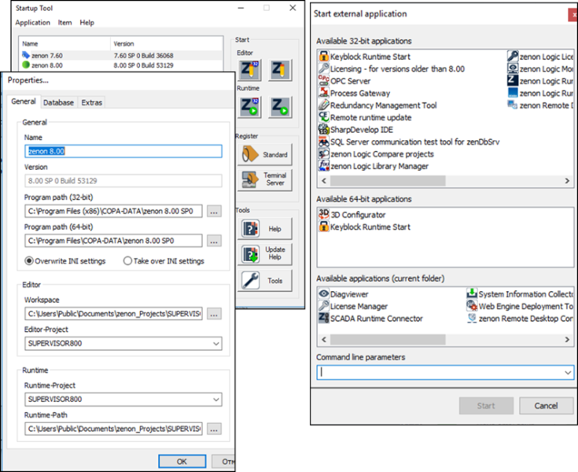
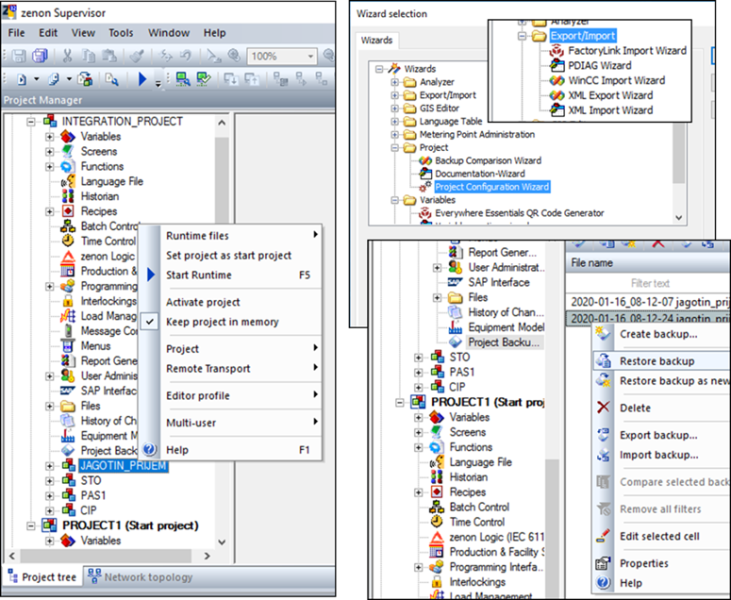
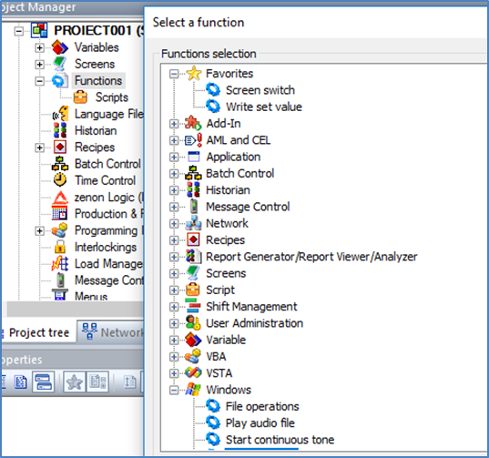
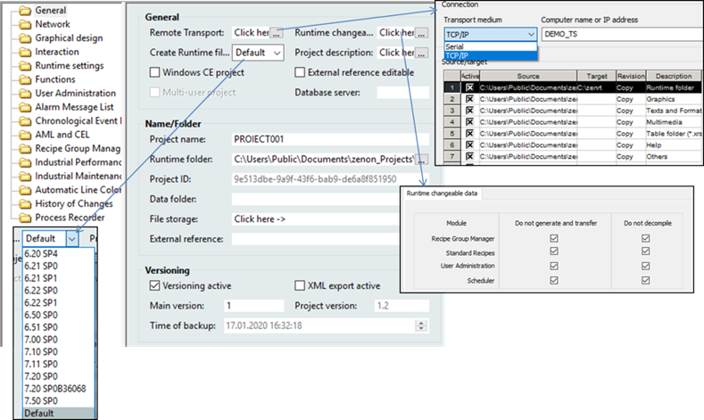
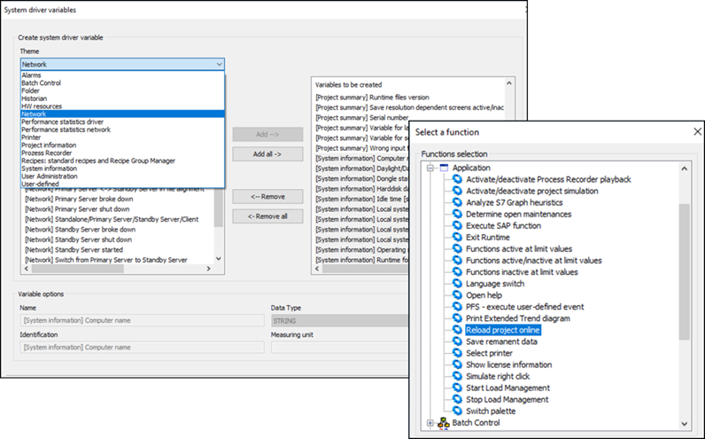
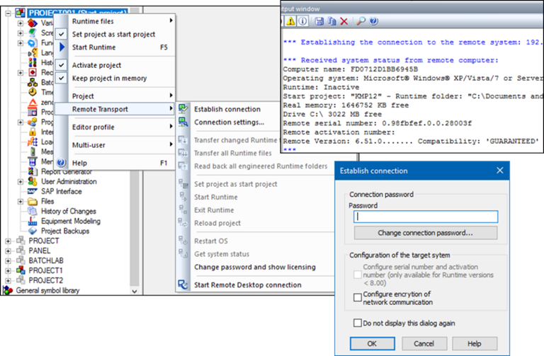

[Головна](README.md) > [2.Загальні принципи розроблення SCADA/HMI](2.md)

# 2.6. Приклад організації проектів в SCADA zenon

## 2.6.1. Основні компоненти середовищ розроблення та виконання 

SCADA zenon (офіційна назва zenon Supervisor) включає в себе ПЗ середовища розроблення (Editor) та середовища виконання (Runtime). Обидва доступні як в 32-бітній так і в 64-бітній версії. Окрім самих середовищ, у комплекті постачається велика кількість утиліт різного призначення. Одна з них – утиліта запуску (Startup Tool), яка дає можливість виконати такі дії (рис. 2.13):

*Рис. 2.13.* Вікно запуску та вікно вибору запуску утиліт zenon

- запустити середовище розроблення або виконання з вказаними параметрами (Application Options);

- запустити різні версії zenon, які можуть бути встановлені на одному ПК;

- адміністрування різних екземплярів SQL для тієї самої версії zenon;

- адміністрування налаштувань для різних версій;

- означення мов для середовищ розроблення та виконання перед їх запуском;

- означення мови для ВЕБ-клієнта;

- запуск утиліт з Startup Tool. 

Startup Tool дає зручний інтерфейс для налаштування і запуску середовищ та потрібних утиліт. Частина з цих налаштувань змінюють параметри в файлі "zenon6.ini", який означує режим та особливості роботи середовища розроблення та виконання. На станцію оператора та/або сервер SCADA ставиться тільки середовище виконання, а Startup Tool дає можливість вказати, який проект слід запускати.  

Проект zenon Editor зберігається в базі даних яка керується СКБД SQL Server Express, яка інсталюється разом із середовищем розроблення. Для середовища виконання СКБД SQL Server з базою даних проекту середовища розроблення не потрібні.

## 2.6.2. Розроблення проекту

Розроблення проектів проводиться у ***Робочому середовищі*** (***Workspace***), файл якого має розширення .wsp6 і завантажується при старті zenon Editor. В одному Робочому середовищі може бути підключено кілька проектів, в один момент часу активним для редагування є тільки один. Яке Робоче середовище необхідно завантажувати і який проект повинен бути активний при старті zenon Editor – означується в zenon6.ini, і може бути налаштований в Startup Tool (див. рис. 2.13). Після старту zenon Editor можна відкривати інші Робочі середовища та проекти. 

Уся конфігурація бази даних середовища виконання проекту міститься в MS SQL Server Express, який інсталюється на інженерну станцію. Інші файли, що стосуються проекту, зберігаються в папці проекту розроблення, яка знаходиться поряд з файлами бази даних SQL. В одному Робочому просторі може бути створено кілька стандартних проектів та один глобальний. Глобальний проект може слугувати бібліотекою фреймів, символів, стилів та інших для всіх інших проектів, відкритих у Робочому просторі. Кілька проектів в одному Робочому просторі є сенс відкривати за кількох причин, наприклад необхідність копіювання частин проекту або включення кількох проектів в один інтегрований для цілей мультисерверної системи (див. параграф 9.1.7).

 При створенні нового проекту Editor запропонує скористатися помічником конфігурування (Project configuration wizard), який допоможе налаштувати основні властивості проекту, добавити необхідні драйвери, налаштувати розміри екранів, поведінку дисплеїв, розміщення меню, тривожних банерів, добавити потрібні сторінки за шаблоном та за необхідністю демонстраційну частину. Усі ці частини проекту можна створювати самостійно, що розглянуто у відповідних розділах цього посібника. 

SCADA zenon пропонує багато помічників (wizards), які автоматизують процеси розроблення, їх можна викликати через меню Tools середовища розроблення. Також можна створювати свої макроси для автоматизації робіт по проекту в інтегрованих середовищах програмування VBA (Visual Basic for Application) або VSTA (Visual Studio Tools for Applications). 

Ряд операцій з проектами в робочому просторі доступні через контекстне меню проекту (див.рис. 2.14):

- активація (Activate project): проект відкритий для редагування (тільки один проект);

- тримати проект в пам’яті (Keep project in memory): проект відкритий тільки для читання; якщо проект не відкритий для редагування і не в пам’яті, то його вміст не буде відображатися; 

- установити проект як стартовий (Set project as start project): один з проектів вибирається як стартовий, тобто буде запускатися при старті середовища виконання;

- запустити проект на виконання.  

*Рис.2.14.* Керування проектами.

В один момент часу один проект (з активною опцією Multi-user project) можуть редагувати кілька користувачів на різних інженерних станціях. 

Через розділ проекту "Project Backup" створюються резервні копії, які зберігаються в папці проектів (див. рис. 2.14). Через контекстне меню ці копії можна експортувати (по суті копіювати) в потрібне місце, наприклад, на знімний носій, для перенесення на іншу інженерну станцію. Також у цей розділ можна імпортувати іншу версію резервної копії проекту. У будь-який момент часу можна відновити потрібну копію (Restore backup). Відновити резервну копію можна також через контекстне меню Робочого простору. Якщо необхідно перенести усі проекти Робочого простору, робиться його резервна копія, яку можна також за необхідності відновити. Файли резервних копій – це, по суті, архіви формату *.ZIP.

Діяльність по розробленню проекту передбачає:

- конфігурування проектних даних відповідно до різних підсистем через зміну властивостей об’єктів; 

- створення графічних екранів;

- створення функцій, які проводять певну діяльність при їх виклику.

Робота з конкретними розділами проекту розглядається в інших розділах посібника. Особливістю zenon є повсюдне використання функцій. Вони створюються для виконання певної діяльності, наприклад, відкриття екрану чи записування значення в змінну тощо (рис. 2.15). За великим рахунком, команди, які проводяться в людино-машинному інтерфейсі або в іншому місці, стосуються або змінних, або функцій. Тому в проекті може бути кілька десятків функцій. 

*Рис.2.15.* Функції zenon

Проект має велику кількість властивостей, в яких означуються загальні функції, які стосуються розділів проекту. Деякі з цих властивостей будуть розглядатися в інших розділах посібника, тут зупинимося лише на основних, більшість з яких налаштовуються на вкладці General (рис. 2.16). У групі General та Name/Folder налаштовуються властивості щодо середовища виконання, які розглянуті далі. Через опцію "Versioning active" можна активувати керування версіями, у цьому випадку основний номер версії проекту (Main version) може бути змінений розробником, а додатковий (номер після крапки) – при кожному створенні резервної копії. Номер версії проекту перевіряється при передачі файлів виконання з використанням віддаленого транспорту (див. параграф 2.6.4) або через мережну топологію і може бути прочитаний через змінну системного драйвера. Якщо в редакторі і в середовищі виконання при цьому завантажена інша версія, то буде відображатися попередження. Якщо виникає конфлікт під час передачі файлів Runtime через мережу, ви підтверджуєте або відхиляєте передачу для всіх проектів, які передаються на комп’ютер і в яких існують конфлікти. Виставивши опцію "XML export active", можна при створенні резервної копії формувати файл з XML-версіями розділів проекту. 

Середовище розроблення zenon дає також можливість вести журнал змін у проекті, активація та деталізація якого налаштовується в розділі "History of changes". 

За допомогою помічника “Documentation Wizard” zenon можна сформувати документацію по проекту у форматі HTML. 

*Рис.2.16.* Основні властивості проекту.

## 2.6.3. Виконання та налагодження проекту

SCADA zenon дає можливість компілювати проекти повністю або частково (тільки внесені зміни). Скомпільовані файли на інженерній станції розміщуються в папці, яка задається у властивості проекту “Runtime folders” (див. рис. 2.16). SCADA zenon дає можливість вибрати версію середовища виконання, якщо вона відрізняється від версії редактора, підтримуються версії від 6.20 до актуальної (див. рис. 2.16). Опція “Windows CE project” вказує, що проект розробляється для операторської панелі. 

При компіляції у вікні "Output window" виводяться повідомлення про результати. За замовченням налаштування проекту, чотири файли не будуть компілюватися, тому будуть виводитися відповідні повідомлення про відмову в переписуванні. Опція налаштування компіляції і перенесення цих файлів налаштовується в "Runtime Changeable" (див. інші розділи посібника). У процесі налагоджування компіляція без цих файлів не є критичною, тому на початку на ці повідомлення можна не звертати уваги. У SCADA zenon усі діяльності по створенню створені таким чином, що ймовірність того, що проект не скомпілюється дуже низька.  

Для налагодження в SCADA zenon можна використовувати такі засоби:

- файли журналів, в які записуються повідомлення та помилки, за замовчуванням розміщується в "%ProgramData%\COPA-DATA\LOG";

- діагностична утиліта "Diagnosis Viewer", яка дає можливість журналювати повідомлення та помилки підключеної робочої станції та зручного перегляду журналів;

- системні змінні, які доступні через драйвер введення/виведення SYSDRV (рис. 2.17) і можуть бути використані як для отримання діагностичної інформації, так і для керування системою;

- функції zenon, зокрема Application (див. рис. 2.17);

- спеціальні типи екранів, наприклад Variable Diagnostic.

Серед функцій групи Application окремо варто виділити "Reload project online", яка дає можливість перезавантажити проект після його зміни без зупинки середовища виконання . 

Для перевірки та зміни тегів є спеціальний тип екрана "Variable Diagnostic", за допомогою якого можна передивитися стан змінних та змінити їх. Драйвери zenon підтримують режим відключення від джерела даних та імітації (див. підрозділ 3.12). Крім того, змінні підтримують режим використання альтернативного значення. 

*Рис. 2.17.* Вікно створення системних змінних та вікно вибору функцій Application

## 2.6.4. Введення в дію

Файли проекту виконання для zenon задаються в zenon6.ini (параметр "VBF30"). Після активації проекту в середовищі розроблення він автоматично відмічається як стартовий, і в zenon6.ini прописується шлях, який вказаний у властивості проекту “Runtime folders” (див.рис. 2.15). Для встановлення параметра "VBF30" на цільовому комп’ютері рекомендується використовувати "Startup Tool".

Після компіляції та налагодження проекту на інженерній робочій станції файли середовища виконання можна передати на цільову систему кількома способами:

- ручним копіюванням файлів у директорію запуску через знімний носій;

- зробивши директорію середовища виконання доступною з мережі та скопіювавши туди файли; 

- використовуючи функціональність системи віддаленої передачі на цільову систему.

Віддалена передача (Remote Transport) дає можливість установити з’єднання з цільовою системою через доступну комунікацію (TCP/IP або послідовний інтерфейс) з метою передачі файлів виконання та керування системою. Параметри віддаленої передачі налаштовуються в однойменних властивостях проекту (див. "Remote Transport" на рис. 2.16). Зокрема, там вказується середовище передачі та адреса або ім’я цільового комп’ютера. У налаштуваннях "Target" вказується папка, куди будуть переміщуватися файли виконання. Налаштування з’єднання можна буде також задати в "Connection settings" перед самим віддаленим підключенням. 

За необхідності передачі файлів на цільову систему спочатку встановлюється з’єднання через пункт контекстного меню проекту “Remote transport”->”Establish connection” (рис. 2.18). Для захисту від несанкціонованого підключення необхідно вказати пароль. При першому з’єднанні цей пароль порожній, його можна задати в меню "Change connection password". Після встановлення з’єднання у вікні "Output window" виводиться інформація про цільову систему та про сумісність проекту з середовищем виконання (див. рис. 2.18)    

Після встановлення з’єднання файли можна передавати на цільову систему або в зворотний бік. Слід відмітити, що при передачі файлів через віддалений транспорт першого разу треба зробити компіляцію всіх файлів, тобто зняти всі опції в "Runtime changeable data"->"Do not generate and transfer", інакше буде видана помилка передачі. Для запуску саме цього проекту в меню віддаленої передачі вказується опція "Set project as start project". Через меню віддаленого транспорту проект можна запускати, зупиняти, перезапускати, а за необхідності перезавантажувати ПК. 

 Для успішної передачі файлів на цільовій системі повинна бути запущена служба ZenSysSrv.exe (за замовчуванням додається в автозапуск при встановленні IDE zenon).  

*Рис. 2.18.* Віддалена передача

Команда "Start Remote Desktop connection" викликає доступ до віддаленого керування або контролю робочого столу цільової системи. Перед цим на цільовому ПК необхідно активувати цю опцію і налаштувати через утиліту zenon "Remote Desktop Server configuration". 