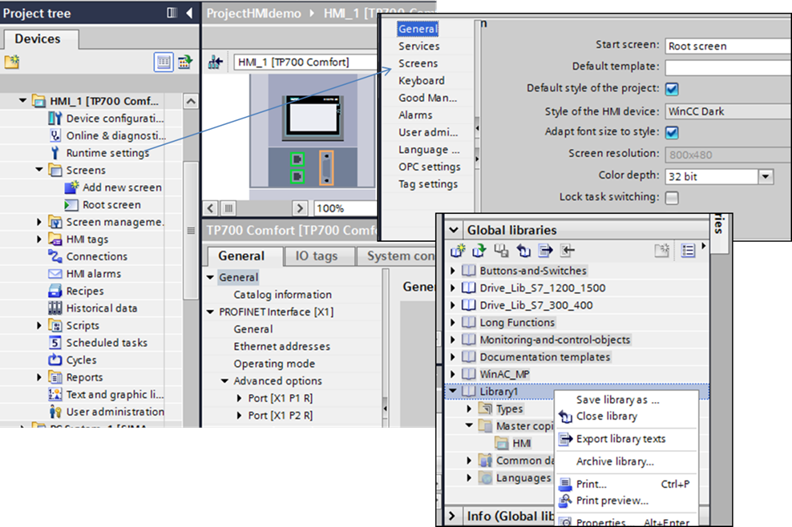
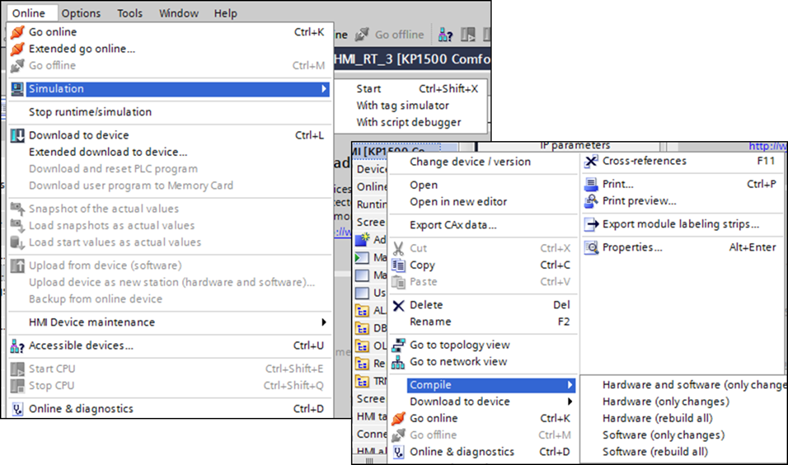
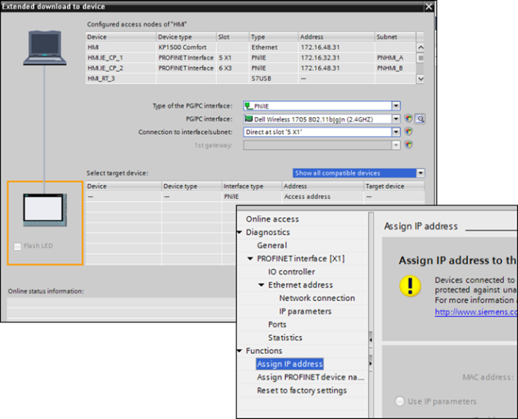

[Головна](README.md) > [2.Загальні принципи розроблення SCADA/HMI](2.md)

# 2.7. Приклад організації проектів у WinCC Comfort

## 2.7.1. Основні компоненти середовищ розроблення та виконання 

Панелі WinCC Comfort конфігуруються як пристрій (Device) у загальному проекті TIA Portal. Середовище розроблення TIA Portal призначене для створення інтегрованих проектів для всієї системи керування, тому в нього добавляються різнорідні пристрої Simatic, такі як ПЛК, приводи, ОП, робочі станції (наприклад, із середовищем виконання WinCC) та інженерні станції (за необхідністю). Опис функціональності TIA Portal виходить за рамки цього посібника, тут більше приділяється увага створенню частини проекту, що відповідає за налаштування панелей WinCC Comfort.

До підсистем, що належать до середовища розроблення та виконання можна віднести:

- TIA Portal;

- пакет середовища розроблення для панелей WinCC Advanced;

- SIMATIC ProSave – інженерна утиліта для створення резервної копії проекту режиму виконання, а також рецептів та адміністрування користувачів і їх завантаження на панель та для її прошивки без наявного TIA Portal; 

- WinCC Runtime Advanced Tag Simulator – утиліта для імітації тегів у середовищі виконання без наявного ПЛК;

- Sm@rtClient – клієнт для підключення до віддаленої панелі оператора;

- WinCC Runtime Advanced – середовище виконання для відлагодження на інженерній станції. 

Середовище виконання для операторських панелей вже встановлене на них. Для комп’ютерів використовується середовище "WinCC Runtime Advanced". Тому при розробленні проектів на інженерній станції використовують даний пакет для імітації роботи панелі. 

## 2.7.2. Розроблення проекту

Враховуючи, що цільовим пристроєм для WinCC Comfort є операторська панель, до проекту добавляється конкретна її модель, для якої конфігурується апаратна частина через розділ "Device Configuration" (рис. 2.19). Загальні налаштування середовища виконання проводяться в розділі “Runtime settings”. Далі відбувається конфігурування частин проекту (див. інші розділи посібника).  

*Рис.2.19.* Вікна налаштування апаратної частини, середовища виконання 
 та глобальної бібліотеки

Проект TIA Portal можна переносити на інший ПК, створивши резервну копію з подальшим її відновленням. У випадку, якщо необхідно перекопіювати тільки проектні дані для конкретної панелі, це можна зробити через глобальну бібліотеку "Master copies", перемістивши туди пристрої. Разом з проектними даними автоматично в бібліотеці будуть створені усі пов’язані бібліотеки. Потім бібліотеку можна перенести в інший проект через команди Archive та відповідно Retrieve (див. рис. 2.19). Після перенесення проектні дані панелі можна перенести у вибраний проект. 

## 2.7.3. Виконання та налагодження проекту

Проектні файли для пристрою компілюються через його контекстне меню в TIA Portal або через відповідний пункт меню при його виділенні в проекті (рис. 2.20). Результати компіляції відображаються у вікні Compile. Якщо компіляція відбулася без помилок, навіть з попередженнями, його можна завантажувати на панель або перевіряти в середовищі виконання на інженерній станції.

Відлагодження варто спочатку провести з використанням імітатора, який є, по суті, середовищем виконання "WinCC Runtime Advanced". Запуск імітатора можна зробити через відповідний пункт меню "Simulation->Start". При цьому для тегів введення/виведення будуть використовуватися наявні з ПЛК комунікації, які є на інженерній станції. 

За необхідності імітування тегів використовується режим "Simulation->With tag simulator". У цьому випадку буде запускатися як середовище виконання, так і утиліта "WinCC Runtime Advanced Tag Simulator", що дає змогу змінювати значення тегів та за необхідності запускати імітацію для них.     

*Рис. 2.20.* Компіляція та запуск імітатора панелі 

## 2.7.4. Введення в дію

Скомпільовані проекти можна перенести на цільовий пристрій кількома способами:

- перенести через знімний накопичувач (папка Generates в проекті HMI);

- завантажити через наявну комунікацію між інженерною станцією та операторською панеллю;

- використати механізм Pack&Go;

- використати SIMATIC ProSave (тут мається на увазі перенесення попередньо створеного бекапу цільового пристрою).

Копіювання файлів виконання із середовища розроблення можна зробити безпосередньо з папки Generates в проекті HMI. Є інший шлях – установити знімний пристрій, який з’явиться в дереві проекту TIA Portal, і перетягнути туди проект HMI. Автоматично буде проведене компілювання і файли виконання будуть створені на знімному пристрої в окремій папці.    

Класичним механізмом завантаження скомпільованих файлів є пересилання через меню “Online->Download to Device”. У вікні завантаження (рис. 2.21) вибирається інтерфейс, через який відбувається завантаження, мережа та пристрій (можна добавити до списку через пошук).   

*Рис. 2.21.* Вікна налаштування

Механізм Pack&Go передбачає можливість простого завантаження проекту на операторську панель, навіть якщо на інженерній станції, що підключена до неї, немає встановленого пакету TIA Portal. На інженерній станції розробника засобами TIA Portal створюється архівний файл, який включатиме скомпільований проект, застосунок "Siemens.Simatic.Hmi.PackNgo.exe", що вміє завантажувати проект через наявні комунікації, образ конфігурації ОП. Цей файл передається на інженерну станцію по місцю операторської панелі, де він розпаковується і з використанням застосунку завантаження передається на панель.

Використовуючи SIMATIC ProSave, можна створити, завантажити та вивантажити з ОП резервну копії проекту режиму виконання. Ці операції також доступні через контекстне меню панелі "HMI Device Maintenance" в TIA Portal.  

Використовуючи розділ проекту "Online & Diagnostic", можна з’єднатися з необхідною операторською панеллю для діагностики, налаштування дати/часу, адреси IP тощо. 

