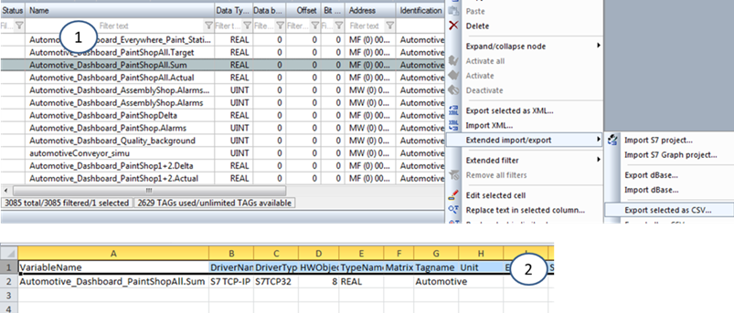
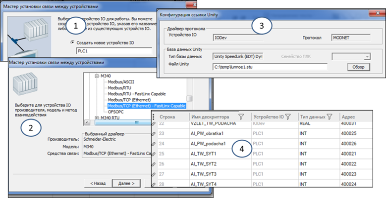

[Головна](README.md) > [3.Підсистема керування збором та обробленням даних в реальному часі](3.md)

# 3.10. Підходи до автоматизації створення БДРЧ

Для невеликих проектів SCADA/HMI кожний тег можна конфігурувати самостійно. Однак якщо кількість тегів вимірюється сотнями і тисячами, виникає потреба автоматизувати процес створення записів у конфігураційній базі даних проекту. Слово "автоматизація" тут розуміється саме в контексті розроблення і стосується заповнення та редагування не тільки бази даних тегів, а і інших розділів проектів. Із процедур до "автоматизованого" наповнення та редагування бази даних проекту можна віднести два підходи:

‒    ***імпортування*** ***(***import***)*** конфігураційних даних;

‒    ***зв’язування*** (linking**, "*лінкування*"**) із зовнішньою базою даних.

Імпортування передбачає копіювання конфігураційних даних з бази даних певного формату, їх перетворення в потрібний вигляд та занесення в базу даних проекту SCADA/HMI. При цьому середовище розроблення може підтримувати різні формати файлу. Як правило, це CSV, XML, OPC (з простору імен) або файли проектів ПЛК. Імпортування проводиться тільки за необхідністю, як правило один раз, при створенні записів у базі даних проекту. Це процедура "втягування" вже створених в іншому редакторі даних.

Зв'язування (сленгова назва "лінкування"), на відміну від імпортування тримає зв'язок бази даних проекту з зовнішньою базою. Як правило, усі поля бази даних проекту, які є зв’язаними, не можуть редагуватися, оскільки вони посилаються на зовнішнє джерело. Типовим прикладом зв’язування є підключення бази даних або її частини до файлу проекту ПЛК, в якому зберігається інформація про змінні. Зв'язування є потужним механізмом утримання бази даних тегів проекту інтегрованою для ПЛК та SCADA/HMI. Тобто будь-яка зміна налаштування змінної в ПЛК автоматично (або за запитом оновлення) приводить до зміни в проекті SCADA/HMI. Великі бренди намагаються зводити це зв’язування до максимальної наближеності до єдності тегів SCADA/HMI+ПЛК. Наприклад, в "Simatic PCS" розроблення прикладного ПЗ ініціюється зі SCADA/HMI, і всі теги створюються автоматично і для БДРЧ SCADA і для ПЛК. Аналогічним чином це робиться у "Hybrid DCS" від Schneider Electric.   

Імпортування змінних (як і інших розділів проекту) передбачає наявність файлу імпорту в тому форматі, який розуміє даний редактор SCADA/HMI. Якщо імпорт передбачає ручне створення файлу (наприклад в Excel або XML-редакторі), наявність можливості підтримки, наприклад, форматів CSV або XML, ще не каже про те, які саме поля або імена будуть використовуватися в цих файлах. Як варіант, опис структури файлу імпорту можна взяти з довідкової системи інструменту, однак повного переліку полів там може не бути. Виходом з цього, може бути використання зворотної процедури, тобто експорту тегів у файл, який, по суті, стане прототипом необхідного файлу імпорту. Наприклад, SCADA zenon надає можливість імпорту та експорту як в XML так і CSV. Зробивши експорт однієї змінної в CSV (рис. 3.12), можна файл експорту відкрити в Excel, після чого добавити туди всі необхідні записи, скориставшись автоматизацією Excel (автоматичне збільшення значення по колонці, копіювання/вставка по взірцю і т.п.). Після внесення змін у редакторі запускається процедура імпорту. Якщо змінні збігаються, редактор дає можливість вибрати заміну, зберегти чи відмінити імпорт.
           

*Рис.* *3.12.* Приклад експорту змінних в SCADA zenon: 1 – процедура експорту, 2  – вигляд експортованого файлу CSV в Excel 

Слід звернути увагу, що згадані вище файли CSV вказують тільки на те, що використовується формат представлення таблиць у вигляді текстових записів, розділених символом переносу рядка, в яких є поля, що розділені розділовим знаком. У якості розділового знаку може бути як кома, так і табуляція, крапка з комою чи інші. Для коректного сприйняття такого файлу редакторами, можна замінити одні розділові знаки на інші в простому текстовому редакторі, наприклад блокноті, шляхом пошуку та заміни. Пара Excel + Notepad (або Notepad++) є дуже корисними помічниками при створенні програмного забезпечення АСКТП.    

Застосування механізмів імпорту/експорту дає можливість використати вихідні дані для проекту не тільки для розуміння технічних вимог, а й для пришвидшення процедури розроблення. Тому у фірмах інтеграторах намагаються уніфікувати вихідні дані у вигляді таблиць, де вказана вся необхідна інформація. Так, у табл. 3.1 показано фрагмент списку введення/виведення для ПЛК, який, у свою чергу, легко перетворюється на таблицю змінних ПЛК<->SCADA, що може бути використана при формуванні файлу імпорту.

 Універсальні формати типу CSV чи XML не єдині, що можуть підтримувати середовище розроблення для імпорту змінних. Нерідко SCADA/HMI підтримують можливість імпорту безпосередньо з файлів проектів ПЛК різних виробників. Наприклад, SCADA zenon підтримує імпорт із файлів проектів Step7 (див. рис. 3.12). Такий імпорт може підтримувати зв'язок з вихідним файлом з можливістю оновлення, у цьому випадку це називають зв’язуванням.   

*Таблиця 3.1.* 

**Приклад фрагменту таблиці** **I/O для ПЛК**

| **Найменування**                         | **Од.   вимір.** | **Поз­нач** | **Тип** | **Мод.кан** | **Діапазон перетво­рювача** | **Діапазон вимірю­вання** | **Пороги** | **Но­мін.** |         |         |          |          |      |
| ---------------------------------------- | ---------------- | ----------- | ------- | ----------- | --------------------------- | ------------------------- | ---------- | ----------- | ------- | ------- | -------- | -------- | ---- |
|                                          |                  |             |         |             | Мін                         | Мах                       | Мін        | Мах         | А нижнє | П нижнє | П верхнє | А верхнє |      |
| Тиск газу на вході ГРС                   | кгс*см2          | PT1         | AI      | 0.0         | 0                           | 60                        | 0          | 60          |         | 25      | 55       |          |      |
| Тиск газу на виході ГРС                  | кгс*см2          | PT2         | AI      | 0.1         | 0                           | 16                        | 0          | 16          | 20%     | 10%     | 10%      | 20%      | 2.0  |
| Тиск газу на власні потреби              | кгс*см2          | PT3         | AI      | 0.2         | 0                           | 0.1                       | 0          | 0.1         |         | 0       | 0.04     |          |      |
| Тиск теплоносія в системі підігріву газу | кгс*см2          | PT4         | AI      | 0.3         | 0                           | 10                        | 0          | 10          |         |         | 3        | 5        |      |
| Тиск газу на вході редукування           | кгс*см2          | PT5         | AI      | 0.4         | 0                           | 16                        | 0          | 16          |         |         |          |          |      |
| Резерв(5)                                |                  |             | AI      | 0.5         |                             |                           |            |             |         |         |          |          |      |
| Резерв(6)                                |                  |             | AI      | 0.6         |                             |                           |            |             |         |         |          |          |      |

 Зв’язування продемонструємо на SCADA Citect (рис. 3.13). У цьому випадку зв’язування проводиться з пристроєм введення/виведення  (I/O Device). Для деяких типів пристроїв (контролерів) прописані правила зв’язування з файлом проекту. Наприклад, у Citect є правила зв’язування з OPC-тегами OFS (OPC Factory Sever) та проектом EcoStruxure™ Control Expert (раніше відомий як Unity Pro), за допомогою яких можна автоматично будувати теги I/O, та тримати їх зв’язаними з вихідними даними. Це значить, що властивості цих тегів у середовищі розроблення не редагуються, але можуть бути оновлені даними з вихідних файлів, коли вони зміняться. Таким чином, якщо, скажімо, зміняться адреси тегів в ПЛК, при оновленні зв’язування, властивості «Адрес» (див. рис. 3.13(4)) також автоматично зміняться. Зв’язування дає можливість не дублювати однакові поля тегів у ПЛК та SCADA/HMI і, що ще важливіше, – тримати зв’язок між цими частинами системи завжди узгодженим.   
 

*Рис. 3.13.* Приклад зв’язування пристрою I/O при його створенні з файлом проекту EcoStruxure™ Control Expert (раніше відомий як Unity Pro): 1 – запуск майстра і створення ім'я пристрою I/O; 2 – вибір типу драйвера; 3 – вибір зв’язаного проекту; 4 – автоматично створені зв’язані теги введення/виведення

[<-- 3.9. Деякі підходи до організації БДРЧ](3_9.md)

[--> 3.11. Приклади конфігурування бази даних реального часу у Citect](3_11.md)