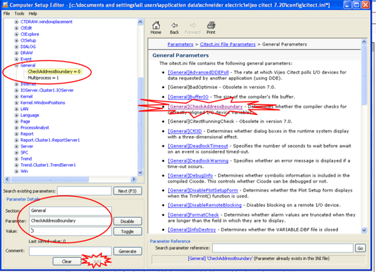

[Головна](README.md) > [3.Підсистема керування збором та обробленням даних в реальному часі](3.md)

# 3.11. Приклади конфігурування бази даних реального часу у Citect

Конфігурування змінних у Citect розглянемо на прикладі Citect 7.2 (у новіших версіях все аналогічно). Усі теги (змінні) у Citect поділяються на ***змінні теги*** (рос. лок. "Переменные теги") та ***локальні змінні*** (рос. лок."Локальные переменные"). 

Змінні теги потребують означення зовнішнього джерела даних, наприклад контролера. Вони представляють копію (додатково перетворену та оброблену) змінних на ***пристроях введення/виведення*** (I/O Devices, рос. лок. "Устройства в/в"). Пристрої введення/виведення, у свою чергу, належать ***серверу введення/виведення***, тому ці змінні оброблюються саме в цій частині виконавчої системи. Інші складові виконавчої системи, по суті, звертаються до цих змінних для читання та записування. Таким чином, одна й та сама змінна доступна в багатьох місцях середовища виконання. Змінні попередньо оброблюються шляхом масштабування, аналізу якості (достовірності) та мають додаткові налаштування для відображення за замовченням. Кількість змінних тегів є показником інформаційної складності проекту та впливає на вартість ліцензії середовища виконання. Це є причиною "економії тегів", яка приводить до різного роду хитрощів розробників, упакування бітів у слова, буферний обмін тощо, які описані раніше.   

На відміну від змінних тегів, ***локальні змінні*** не є частиною серверу введення/виведення. Ці змінні належать клієнтам (наприклад, графічній підсистемі), тому в кожного клієнта своя копія цих змінних. Оскільки у змінних немає зовнішнього джерела, ніякого перетворення, означення адреси для них не потрібне. Кількість локальних змінних не впливає на вартість ліцензії.

Пристрої введення/виведення  мають властивість Memory (рос. лок "Память"), виставивши яку в TRUE, можна вказати на необхідність "відключення" від зовнішнього джерела. У цьому випадку змінні будуть внутрішніми серверними. Цей механізм можна використовувати як для формування внутрішніх серверних тегів, так і тимчасового відключення від джерела задля налагодження (див. параграф 2.5.3).        

Для кожного змінного тегу Citect необхідно вказати ім'я, тип, назву пристрою, з якого змінна зчитується та записується, адресу, а також інші опційні властивості (рис. 3.14).  
 

*Рис.* *3.14.* Основні поля налаштування змінного тега Citect

***Ім'я*** змінного тегу може містити літери латинського алфавіту, цифри, символи "_" та "'\", починатися з літери або "_" і не перевищувати 79 символів. У Citect є свої рекомендації щодо структурування найменування, однак вони не є обов’язковими (деталі в довідці "Using structured tag names"). 

***Тип даних*** задає як інтерпретується адреса даних на пристроїв введення/виведення . У табл.3.2 показані деякі типи даних Citect. 

У Citect найменування багатьох типів не збігається з аналогічними в ПЛК, тобто IEC 61131. Однак неважко здогадатися, що типу DIGITAL у програмованому контролері буде відповідати BOOL або EBOOL, типам LONG та ULONG – DINT та UDINT відповідно. 

*Таблиця 3.2.* 

**Деякі типи даних** **Citect**

| **Тип даних** | **Пояснення**                                                | **Розмір**          | **Діапазон**                    |
| ------------- | ------------------------------------------------------------ | ------------------- | ------------------------------- |
| DIGITAL       | Digital                                                      | 1 bit або 1 byte    | 0 or 1                          |
| INT           | Integer                                                      | 2 bytes             | -32,768 to 32,767               |
| UINT          | Unsigned Integer                                             | 2 bytes             | 0 до 65,535                     |
| LONG          | Long Integer                                                 | 4 bytes             | -2,147,483,648 до 2,147,483,647 |
| ULONG         | Unsigned Long Integer   (тільки для відображення на екрані. Не підтримує арифметичні операції) | 4 bytes             | 0 to 4,294,967,295              |
| REAL          | Floating Point                                               | 4 bytes             | -3.4E38 до 3.4E38               |
| STRING        | String                                                       | 256 bytes (maximum) | ASCII (null terminated)         |

 Слід звернути увагу також на те, що Citect не підтримує тип TIME. У свою чергу, тип TIME, наприклад, в EcoStruxure™ Control Expert (раніше відомий як Unity Pro) відповідно до IEC 61131 займає два слова (тобто дві комірки в області %MW) і містить значення в мілісекундах. Тому для використання TIME у Citect слід використовувати тип ULONG а також зробити відповідні налаштування масшта­бування, наприклад, для позначення в секундах вказується 1(Citect):1000(PLC). 

Адреса вказує на розміщення даних у джерелі даних (контролері). Формат адреси залежить від типу пристрою та драйвера зв’язку. Наприклад, для драйвера типу MODNET30 (Modbus/TCP для ПЛК з Unity PRO), адреса задається аналогічно, як в Unity PRO: наприклад, *%M7* або *%MW3*. Можна також звертатися до біта слова, вказуючи крапку, наприклад *%MW4.6.*

Слід зазначити, що у випадку, коли змінна BOOL/EBOOL в Unity PRO прив’язана до адреси %MW, вона займає один байт. Тому для коректного його відображення у Citect треба вказати номер %MW та номер біта. Наприклад (рис. 3.15), якщо в структурній змінній Unity PRO "TC1_PARA" два поля прив’язані до адреси %MW309, то перше поле (rev_dir) буде адресуватися як %MW309.0, а друге ("en_rcpy") – як %MW309.8.   

 

*Рис.* *3.15.* Правильне означення адреси тега у Citect, що вказує на BOOL/EBOOL 
 в Unity PRO, прив’язаного до комірки %MW

Citect підтримує роботу з масивами. Розмір масиву вказується в адресі в квадратних дужках. Наприклад (рис. 3.16), змінна з ім'ям "HEA_TT1_SP" та адресою "%MW220[6]" буде вказувати на масив із 6-ти елементів, починаючи з %MW220 (%MW220…%MW225). При зверненні до елементу масиву в проекті вказується ім'я змінної та індекс, починаючи з 0-го. Наприклад, "HEA_TT1_SP[5]" буде вказувати на останній елемент масиву.  
 

*Рис .3.16*. Налаштування масиву.

Типи даних REAL, LONG або ULONG (DINT або UDINT в Unity PRO) використовують дві суміжні комірки (наприклад %MW100 та %MW101) для розміщення своїх даних. Тим не менше, в Citect вказується адреса тільки першої, друга буде взята автоматично, оскільки типом означений і розмір. У більшості випадків такі змінні повинні знаходитися тільки по парних або непарних адресам, інакше вони можуть перекриватися. Компілятор Citect контролює це розміщення і може при компіляції видати повідомлення про помилку (рис. 3.17). 

 

*Рис.* *3.17.* Повідомлення про помилку розміщення змінних за адресами.

У випадку, якщо адреси розміщення таких змінних не можна змінити, необхідно відключити цю опцію, виставивши в Citect.ini параметр [General]CheckAddressBoundary = 0 (рис. 3.18). Для цього треба запустити редактор Citect.ini ("Инструменты"->"Редактор конфигурирования компьютера"), зайти в розділ General, вибрати з правого боку потрібний параметр, який після цього добавиться в поле заповнення параметрів (Parameter Details). Параметр змінюється в полі Value (задати 0), а добавляється запис натисканням кнопки "Add". Після "File"->"Save" параметр буде добавлений в Citect.ini, після чого редактор треба закрити.    
 

*Рис.3.18*. Добавлення параметра [General]CheckAddressBoundary = 0 в Citect.ini

Масштабування та обмеження змінної задається полями:

- "Мин. исходное значения" – мінімальне значення в джерелі даних (у контролері);

- "Макс. исходное значения" – максимальне значення в джерелі даних (у контролері);

- "Мин. значения в единицах изм." – мінімальне значення в Citect (в IOServer);

- "Макс. значения в единицах изм." – максимальне значення в Citect (в IOServer).

Значення з джерела даних (контролера) також називається ***сирим*** (raw). Використовується класичне лінійне масштабування. Окрім масштабування, ці межі використовуються для контролю валідності змінної (відповідності діапазону) та значення введення оператору.

Формат відображення використовується для означення вигляду числового зображення даної змінної за замовчуванням. Якщо для числового поля не вказується формат він буде братися зі змінної, що досить зручно при створенні анімаційних бібліотечних елементів (наприклад джинів). Для прикладу, якщо формат заданий "####.## EU" то числове значення буде відображатись у форматі "123.45 кг", де " EU" вказує на одиниці вимірювання, які теж вказуються в налаштуваннях тегу.

[<-- 3.10. Підходи до автоматизації створення БДРЧ](3_10.md)

[--> 3.12. Приклади конфігурування бази даних реального часу   в SCADA zenon](3_12.md)