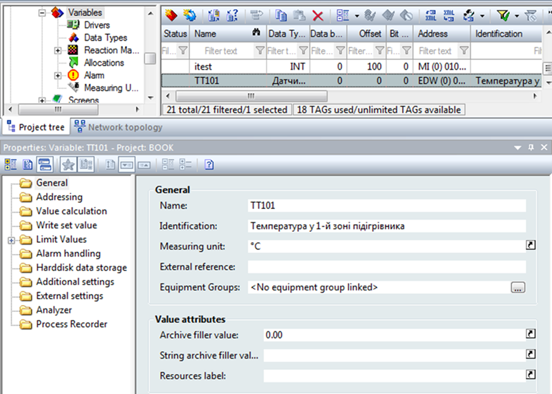
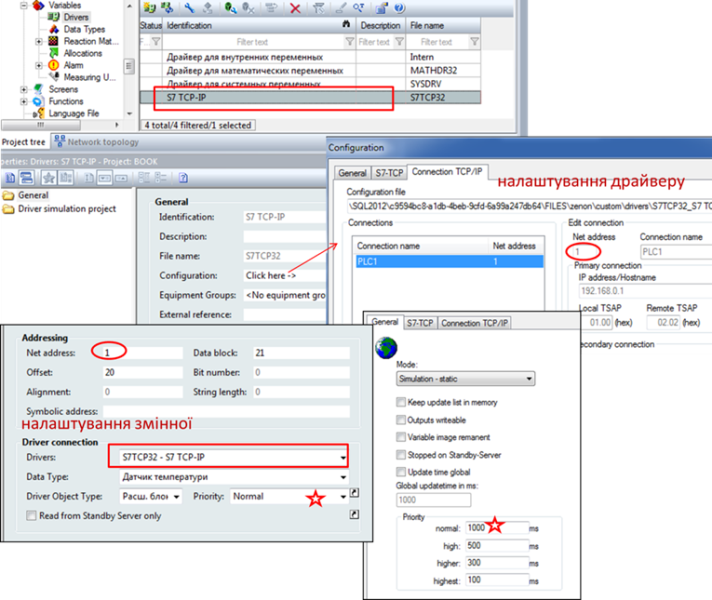
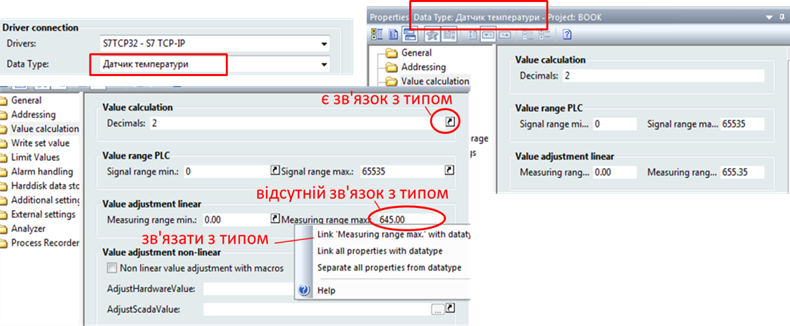
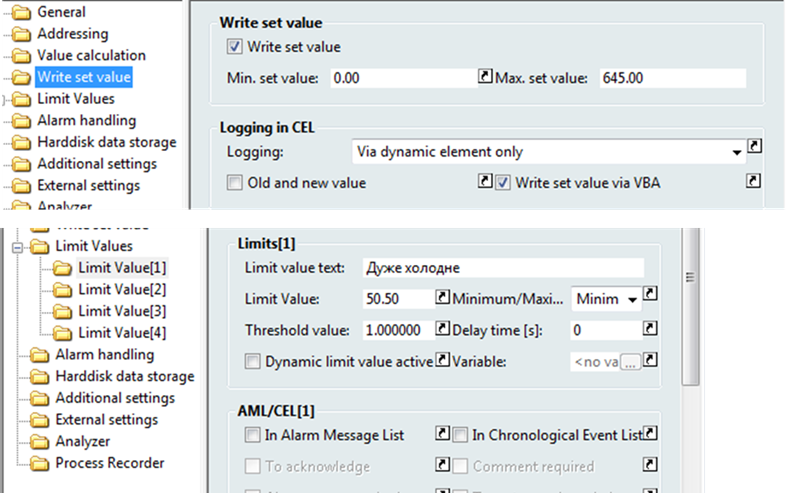

[Головна](README.md) > [3.Підсистема керування збором та обробленням даних в реальному часі](3.md)

# 3.12. Приклади конфігурування бази даних реального часу   в SCADA zenon

У SCADA zenon теги називаються ***змінними*** (***Variables***) і створюються та редагуються в однойменному розділі проекту (рис. 3.19). Змінна в zenon, окрім класичних властивостей означення джерела даних, масштабування, формату відображення, обмежень та іншого, що описано вище, має ряд властивостей, які вказують на поведінку анімації на сторінках (в zenon називаються "екрани") та на використання в підсистемі тривожної сигналізації та подій. Таким чином, велика частина функціональності середовища виконання ґрунтується саме на властивостях змінних.  

                               

*Рис.* *3.19*. Загальний вигляд конфігураційного вікна змінної в SCADA zenon  

Для кожної змінної при створенні вказується ім'я, тип (Data Type) та джерело даних**.** Ім'я змінної (Name) як і у інших SCADA є її унікальним ідентифікатором, однак вимоги до її найменування досить лояльні:

- до 128 символів;

- не можуть містити символи "#" та "@". 

Тобто дозволяється використовувати кирилицю, пробіли та інші розділові знаки. Враховуючи, що zenon використовує зв’язки, а не імена, ім’я змінної можна у будь-який момент часу змінити, і при цьому усі посилання на змінну залишаться.

Джерело даних для змінної означується посиланням на драйвер зв’язку (Driver), адресою пристрою в мережі (Net address), областю змінної в драйвері/пристрої (Driver Object Type) та адресою змінної. Остання задається номером блока даних (Data Block), зміщенням у блоці (Offset), номером біта (Bit Number). Драйвери зв'язку добавляються у відповідному розділі (Variables->Drivers) (рис. 3.20). SCADA zenon підтримує багато драйверів протоколів, є також вбудовані zenon system driver:

- Intern – для внутрішніх змінних серверу або клієнту;

- MATHDRV32 – для розрахункових змінних;

- SYSDRV – для змінних що відображають/змінюють системні дані;

- SIMUL32 – для імітації.

 

*Рис. 3.20.* Налаштування джерела даних в SCADA zenon

Системні змінні не ліцензуються. Змінні, що мають за драйвер Intern, не зв’язуються з зовнішніми джерелами даних і використовуються для проміжних операцій. Вони можуть бути єдиними для всіх клієнтів або локальними для кожного, що означується в налаштуваннях "Internal Variable". Змінні з драйвером MATHDRV32 в якості джерела даних використовують інші змінні, які використовуються у формулі розрахунку значення цієї змінної. Змінні SYSDRV посилаються на конкретну інформацію, наприклад, на ім'я зареєстрованого в системі користувача. Змінні, що прив’язані до драйвера SIMUL32, призначені для зміни їх значення за певним законом. Усі інші драйвери потребують означення зовнішнього джерела даних.

На вкладці "General" драйвера є налаштування режиму його роботи (див. рис. 3.20). Режим "Simulation Dynamic" вказує на необхідність імітувати змінні (будуть змінюватися автоматично), "Simulation static" – для тимчасового відключення від джерела, але без їх імітування. Ці режими можна використати для налагодження.          

Властивість "Net address" вказує на адресу пристрою в мережі. Однак для деяких мереж, і відповідно драйверів, ця властивість вказує на умовний номер пристрою. Так, для драйвера S7 TCP/IP (див. рис. 3.20) адреса пристрою PLC1 вказується в налаштуваннях драйвера через означення адреси IP, тим не менше йому дається унікальний в мережі номер, через який змінна зможе посилатися на цей пристрій при конфігуруванні SCADA.

Періодичність оновлення для тегу задається шляхом вибору пріоритету (Priority) з діапазону: Normal, High, Higher, Highest, значення оновлення для яких задається в налаштуваннях драйвера (див. рис. 3.20)   

Для того щоб вказати, до якої саме області пам'яті необхідно звернутися через драйвер, використовується поле "Driver Object Type". Для багатьох драйверів доступна інформація не тільки із самого пристрою, а й системна інформація драйвера, наприклад, комунікаційний стан. На прикладі з рис. 3.20 для змінної вибрано "Розширений блок даних", тобто DB(Data Block) на ПЛК Simatic. Для означення даних в області блоків даних необхідно вказати номер блока (Data Block) зміщення в байтах (Offset) та номер біта (Bit Number), якщо це бітова змінна. Слід розуміти, що не в усіх областях пам'яті є всі вказані рівні адреси. Крім того, для багатьох драйверів жодного з цих рівнів не буде взагалі, хоч в означенні адреси змінної zenon вони будуть. Тому для налаштування цих полів треба спочатку ознайомитися з довідниковою системою для драйвера.       

Деякі властивості змінних налаштовуються аналогічно, як в інших SCADA/HMI. Зокрема, опис змінної (Identification) та одиниці вимірювання (Measuring unit) задаються в загальних налаштуваннях (див. рис. 3.19). Слід відмітити, що в SCADA zenon можна прив’язуватися до змінної не через ім’я, а через ідентифікатор. Лінійне масштабування задається (рис. 3.21) парою значень сигналу на вході масштабування (Value range PLC: Signal Range min/max) та на виході з нього (Value adjustment linear: Measuring range min/max). Формат відображення задається кількістю знаків після коми (Value Calculation: Decimals). 
 

*Рис.* *3.21.* Налаштування властивостей змінних в SCADA zenon та зв'язок з типом даних

Змінні створюються на базі ***типу даних*** (***Data*** ***Type***), який, по суті, не тільки вказує на тип у джерелі даних, а й має такі самі поля, як і сама змінна. Створена змінна, за замовченням, наслідує усі властивості з того типу, на базі якого створена. Наприклад, якщо в проекті використовується багато параметрів вимірювання температури, що мають однаковий діапазон та одиниці вимірювання, попереджувальні та аварійні значення, поведінка записування d журнал і т.п., можна створити свій тип "Датчик температури", в якому прописати усі необхідні поля за замовчуванням. На прикладі з рис. 3.21 для типу вказані діапазони для масштабування та інша інформація. Змінна наслідує ці значення. Наслідування – це не тільки копіювання значень властивостей з типу, а зв’язування з цими полями. Ознака зв’язування показується у вікні властивостей спеціальним символом. Тепер, якщо необхідно змінити якісь властивості в усіх змінних на базі типу, зміни вносять тільки в типі. Якщо для конкретної змінної необхідно мати свої значення властивостей, що відрізняються від типу, для цього достатньо тільки вписати ці значення. У будь-який час можна повернути зв'язок з типом. Використання наслідування типів є дуже потужним механізмом, що спрощує розроблення та супроводження проекту. Можна створювати як елементарні (simple) типи даних, так і структурні. Структурні типи даних дають можливість означити структури в джерелі даних, що спрощує механізм розроблення. 

Для змінних можна налаштувати обмеження на введення або взагалі зробити змінну, доступну тільки для читання з ПЛК, знявши опцію "Write set value" (рис. 3.22). Через налаштування властивостей границь (Limit Values) означується поведінка змінної при переході значення через задане в налаштуваннях Limit Value вгору або вниз. Поведінка стосується зміни кольору на анімації, виведення тексту в текстове поле, занесення значення в журнал подій, формування тривоги та ін. Інші властивості змінних SCADA zenon розглянуті в наступних розділах посібника. 

   

*Рис.* *3.22.* Налаштування обмеження на введення (зверху) та значення границь змінних у SCADA zenon

Змінна в SCADA zenon в режимі виконання окрім дійсного значення має набір статусних бітів, які означають її стан (наприклад, статус зміни або достовірності). Крім того, підтримується режим заміни вимірюваного значення альтернативним. Це можна використати при налагодженні або при ручному введенні значень вимірювань для виведених з експлуатації засобів.  

[<-- 3.11. Приклади конфігурування бази даних реального часу у Citect](3_11.md)

[--> 3.13. Приклади конфігурування бази даних реального часу   для WinCC Comfort](3_13.md)