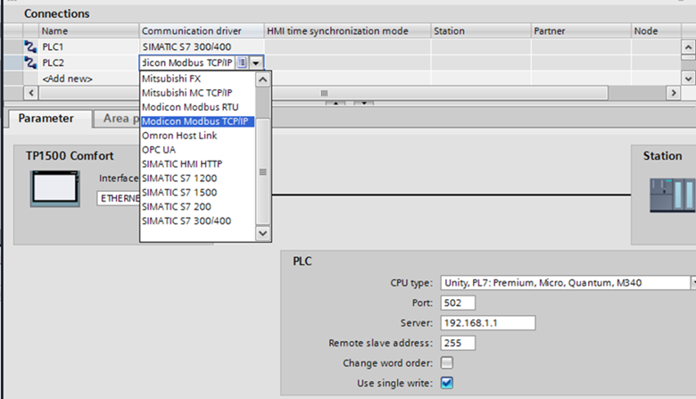
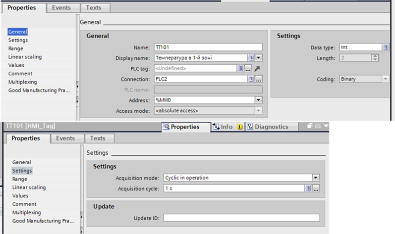
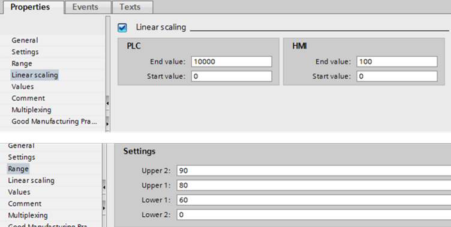

[Головна](README.md) > [3.Підсистема керування збором та обробленням даних в реальному часі](3.md)

# 3.13. Приклади конфігурування бази даних реального часу   для WinCC Comfort 

У SCADA/HMI WinCC TIA Portal для панелей оператора Comfort теги створюються в розділі "HMI tags". Теги можуть бути внутрішніми (***Internal*** ***tag***) або зовнішніми (***External*** ***tag***). 

Для зв’язку із зовнішнім джерелом даних для кожного пристрою створюється своє ***підключення*** (***Connection***). Хоч панелі Simatic найчастіше йдуть разом з ПЛК Simatic S7, вони також підтримують драйвери для інших типів ПЛК. Для кожного підключення вказується ім'я, наприклад PLC1 та PLC2 (рис. 3.23), та налаштовується зв'язок з партнером. Ім'я підключення далі використовується в якості посилання на пристрій із джерелом даних.

Параметри адресації зовнішніх тегів залежать від типу з'єднання між WinCC і PLC. Необхідно розрізняти такі типи з'єднання:

- інтегровані – з'єднання пристроїв, які знаходяться в межах проекту і створені за допомогою редактора "Devices & Networks";

- неінтегровані – з'єднання пристроїв, створених за допомогою редактора "З'єднання"; не обов'язково, щоб усі пристрої знаходилися в межах одного проекту.  

                                 

*Рис .3.23.* Налаштування connection WinCC для HMI Comfort

Для кожного тегу вказується ім’я, опис (Diasplay name), ім’я з’єднання (Connection), адреса змінної в джерелі, тип та періодичність зчитування (рис. 3.24).

  

*Рис.* *3.24.* Налаштування властивостей тегів WinCC для HMI Comfort

Є можливість налаштувати лінійне масштабування (Linear Scaling), обмеження на введення оператором значення (Lower2 та Upper2) та межі норми (Lower1 та Upper1) (рис. 3.25).  

 

*Рис.* *3.25.* Налаштування масштабування та обмежень у властивостях 
 тегів WinCC для HMI Comfort.

