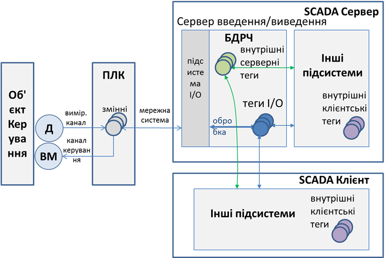

[Головна](README.md) > [3.Підсистема керування збором та обробленням даних в реальному часі](3.md)

# 3.2. Змінні (Теги)

База даних реального часу вміщує ***змінні***, які також називають ***тегами*** (***tag***), а в ряді випадків – точками (point). Слід зазначити, що в багатьох SCADA-програмах поняття "тег" та "змінна" відсутні взагалі, а побудова і функціонування серверної частини значно відрізняється від описаної в цьому посібнику. Так, у SCADA Trace Mode центральним місцем є "канали", які вміщують всю функціональність обробки даних: від джерела до місць призначення та в зворотному напрямку. Тим не менше, нижче наводиться, певне, найбільш поширене та усереднене представлення реалізації БДРЧ. Надалі в тексті буде використовуватися поняття "тег".

Розробник проекту створює теги відповідно до вимог його завдання. При цьому він повинен налаштувати властивості тегів для виконання потрібних операцій введення/виведення. Ці операції залежать від типу та призначення тегів і, звісно, залежать від особливостей конкретного середовища, тобто SCADA/HMI-програми.

Теги, що мають за ***джерело даних*** зовнішній пристрій (контролер) називаються ***тегами введення/виведення* (**теги I/O**)**. Вони потребують обміну через підсистему ведення/виведення, тому мають відповідні до цього властивості та потребують налаштування обміну та перетворення (рис. 3.1). Для таких тегів характерні операції зчитування/записування з/в джерела даних та оброблення, таке як перевірка на діапазон та достовірність, масштабування та додаткових перетворень. Нижче наведемо орієнтовний перелік властивостей, які можуть налаштовуватися при розробленні для тегів введення/виведення:

- ідентифікатор або ім'я тегу;

- короткий опис (коментар);

- тип даних (цілий, булевий, з плаваючою комою, текстовий тощо);

- параметри налаштування вказівки на джерело даних: таких як, наприклад, мережний інтерфейс, адреса контролера, адреса змінної в контролері;

- періодичність оновлення;

- доступ до зміни значення: читання/записування, тільки читання; 

- параметри налаштування оброблення: масштабування, фільтрація тощо;

- обмеження на введення;

- одиниці виміру (наприклад "кПа");

- інші параметри. 

                               

*Рис.3.1.* Оброблення тегів у контексті умовної функціональної структури SCADA 

На відміну від тегів введення/виведення, ***внутрішні теги*** не потребують зв’язку з джерелом. Вони використовуються для обміну даними між підсистемами SCADA/HMI та збереження проміжних результатів. Внутрішні теги, у свою чергу, можуть бути серверними, тобто спільними для всіх підсистем та клієнтів, або клієнтськими – унікальними для кожної підсистеми та клієнта. (Додатково про принципи розділення внутрішніх тегів на клієнтські та серверні написано в підрозділі 9.1 посібника).  

Окрім внутрішніх тегів, SCADA-програма додатково може надавати можливість працювати із системними тегами (наприклад, для отримання інформації про дату й час), або математичними, імітаційними чи іншими, які є специфічним для кожної SCADA-програми. 

Слід зазначити, що політика ліцензування SCADA-програм, як правило, враховує кількість тегів саме введення/виведення, оскільки це опосередковано вказує на масштаби та вартість системи. Це пов’язано з тим, що чим більша вартість системи, тим більше замовник спроможній заплатити за ліцензію та більша відповідальність постачальника SCADA-програми. Тому, щоб зменшити кількість тегів введення/виведення розробники проектів для SCADA нерідко припускаються до певних прийомів. Наприклад, перед відправленням даних у контролері можна упакувати біти в цілі числа, отримуючи в результаті на кожні 16 дискретних (булевих) змінних контролера (або навіть 32) тільки один тег введення/виведення  SCADA. Однак варто відмітити, що розробники середовищ SCADA можуть вираховувати такі прийоми при розрахунку ліцензійних точок.     

[<-- 3.1. База даних реального часу та підсистема введення/виведення ](3_1.md)

[--> 3.3. Ідентифікація тегів](3_3.md)