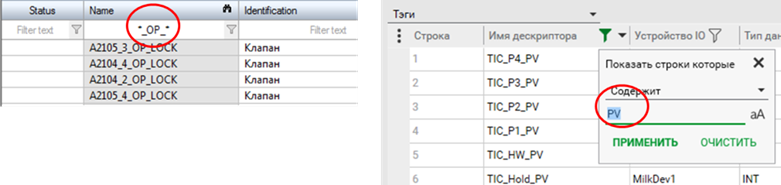

[Головна](README.md) > [3.Підсистема керування збором та обробленням даних в реальному часі](3.md)

# 3.3. Ідентифікація тегів

Кожному тегу, незалежно від його призначення, розробник проекту повинен дати унікальний у межах серверу ідентифікатор, за яким інші підсистеми зможуть звертатись до його значень. Як правило, це є ***ім'я тегу***. У більшості випадків вимоги до формування імен схожі до вимог до змінних мов програмування:

- використовуються тільки літери латинського алфавіту, цифри та деякі спеціальні символи;

- не вміщують пробілів;

- мають суттєві обмеження на кількість літер  

Звісно, не обходиться без виключень з цих правил. Деякі SCADA-програми дозволяють використовувати кирилицю, а в деяких, як наприклад у SCADA zenon, змінні можуть називатися як завгодно (хоч є несуттєві обмеження на кількість літер). Не дивлячись на переваги від відсутності таких обмежень, слід обережно ставитися до використання великих імен та кирилиці. Так, ім'я "ТІ12" кирилицею і латинськими літерами виглядить однаково, хоч з точки зору програми є означеннями різних тегів, що може привести до довгого пошуку причини непрацездатності проекту SCADA/HMI.

Перед створенням тегів необхідно чітко продумати спосіб та правила формування їх імен для конкретного проекту. Це залежить від особливостей конкретної SCADA-програми, розроблювальної системи, особливостей імпорту/експорту/зв’язування з проектом контролера, а також уподобань та прийнятого стилю розробника проекту. Так, наприклад, для переробних галузей за основу може бути прийняте найменування тегів відповідно до стандарту ISA-5.1 (схеми P&ID, позначення засобів автоматизації) або його вітчизняного аналогу  "ДСТУ Б А.2.4", для диспетчеризації електричних систем - IEC 81346.

Розроблення правил найменування є важливим кроком особливо для великих проектів, де кількість тегів вимірюється сотнями і тисячами. Непродумані правила найменування або їх відсутність може значно ускладнити процес розроблення та обслуговування. 

***Простір імен*** (перелік найменувань) тегів може мати плоску (flat) або ієрархічну структуру. Плоский простір імен передбачає наявність тегів з елементарними (не складеними або не структурними) типами даних. Це стає незручним при розробленні вже при кількості тегів понад сотню. На це є декілька причин:

- пошук тегів у просторі імен стає незручним, оскільки неможливо їх відобразити у вигляді ієрархічного дерева;

- теги важко об’єднувати логічно;

- проблематичною є автоматизація процесу створення анімацій. 

Ці незручності частково вирішуються можливостями редакторів. Наприклад, у табличних редакторах та вікнах вибору можна вказувати фільтри для відображення (рис. 3.2).
             

*Рис.* *3.2.* Використання фільтрів у редакторах: ліворуч zenon, праворуч Citect

Класичним виходом із ситуації є використання символу "\_" в якості розділового знака між рівнями ієрархії. Для кращого сприйняття імен тегів розробником у процесі створення та налагодження проекту з великою кількістю точок введення/виведення імена можуть мати псевдо-ієрархічну структуру. Наприклад, плинне значення температури (PV) з контуру (TIC100) в пастеризаторі (PAST1) цеху виробництва і пакування (VIP) може мати назву "VIP_PAST1_TIC100_PV". Псевдо-ієрархічність досягається за рахунок використання символу "_" в якості розділового знака між рівнями. Хоч з точки зору SCADA/HMI таке ім'я тегу є звичайним і не відрізняється від неієрархічних, воно дозволяє простіше вирізнити тег серед інших, а в деяких випадках автоматизувати анімаційні елементи (див. підрозділ 5.5). 

Ієрархічності на певному рівні можна досягти шляхом структурування типів даних для тегів. Наприклад, можна створити структурний тип даних для типової контрольованої вимірювальної змінної процесу з контролем меж, в якому будуть поля:

- PV: для плинного значення аналогової величини;

- HHSP: для значення уставки верхньої аварійної межі;

- LLSP: для значення уставки нижньої аварійної межі;

- HH: біт, що спрацьовує при перевищенні верхньої аварійної межі;

- LL: біт, що спрацьовує при зниженні за нижню аварійну межу.

У цьому випадку, наприклад, для вимірювального параметра TT101 в базі даних тегів буде створена лише одна структурна змінна (а не п’ять), до полів якої можна буде звертатися через крапку, наприклад "TT101.PV" або "TT101.HH". Додатковою перевагою такого підходу є зручність при створенні та модифікації проекту. Більш детально структурування змінних розглянуто у підрозділі 3.8.

Ім'я тегу, як правило використовується тільки для означення зв’язків у самому проекті і не видиме для оператора (користувача) системи режиму виконання. Для оператора ім'я тегу є малоінформативним і не зрозумілим, особливо якщо воно не може містити великих слів кирилицею (для місцевих операторів) та пробілів. Так, скажімо, якщо розробник проекту вирішив використовувати ідентифікацію відповідно до схеми автоматизації, то тег може мати позначення, скажімо "TT1а" для плинного значення температури, або "TV1b" для значення положення клапана. Для розробника в цьому є певний продуманий сенс, але оператор буде важко звикнути до таких найменувань. Тому, якщо на якомусь спливаючому вікні необхідно показати ідентифікатор тегу з яким робиться певна дія, або в легенді тренду вказати назву пера (кривої) замість імені тегу краще використовувати короткий опис (Description) або ***коментар***. Ця властивість, як правило, не має таких суттєвих обмежень як ім'я тегу, і не є ідентифікуючим з точки зору SCADA, однак для оператора його можна використати саме для ідентифікації технологічного параметра, з яким він працює. У наведеному вище прикладі для тега "TT1а" можна вказати коментар "Температура на виході теплообмінника".       

 З ідентифікацією тегів тісно пов’язана парадигма зв’язків між підсистемами в різних SCADA-програмах, про яку вже нагадувалося. Якщо ім'я тегу в проекті використовується в якості зв'язного тільки на етапі компіляції, то це має певні незручності при зміні назви тегу або його видаленні, що призводить до необхідності зміни в усіх місцях, де йде посилання на цей тег. В іншій парадигмі зв'язок відбувається не на рівні імен тегів, а прихованих (від розробника) ідентифікаторів, що робить зв'язок між тегами та його використанням незалежними від імені. Іншим словами, в таких системах зміна імені тегу призведе до такої ж зміни в усіх посиланнях на нього (наприклад, в анімації), що досить зручно.

[<-- 3.2. Змінні (Теги)](3_2.md)

[--> 3.4. Зв'язок із джерелом даних](3_4.md)