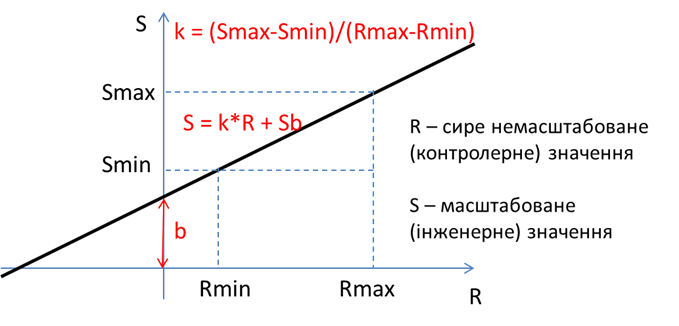

[Головна](README.md) > [3.Підсистема керування збором та обробленням даних в реальному часі](3.md)

# 3.5. Масштабування, діапазони та обмеження на введення

Значення тегів нерідко необхідно масштабувати з одиниць, що вказані в джерелі даних (контролеру) в інженерні одиниці. Це зумовлено рядом факторів, зокрема:

- у джерелі даних (контролері) значення числових змінних знаходиться в контролерних одиницях, які для оператора не мають достатньо зрозумілого представлення;

- одне й те саме значення необхідно представити в різних діапазонах.

Засоби SCADA/HMI в режимі виконання можуть мати вбудовані можливості зміни діапазону значення інженерних одиниць, тобто налаштувати діапазон за необхідності коригування показань датчика (градуюванні). Також деякі SCADA/HMI мають вбудовані можливості нелінійного масштабування.  

Із з розвитком обчислювальних можливостей пристроїв (наприклад контролерів) функція масштабування все частіше проводиться саме на джерелі даних, тому на SCADA/HMI цим можна не користуватися. 

Наведемо деякі типові підходи до організації конфігурування масштабування. Насамперед треба розділяти лінійне та нелінійне масштабування. У більшості SCADA/HMI доступне тільки лінійне масштабування, тобто перетворення вхідних сирих (RAW) контролерних одиниць в інженерні масштабовані одиниці за формулою (рис. 3.4):

`S = k×R + Sb`                           (3.1)

де S – отримуване масштабоване значення в інженерних одиницях; R – вхідне сире немасштабоване значення, Sb – зміщення; k – коефіцієнт, який дорівнює тангенсу кута нахилу прямої масштабування до осі абсцис.     

                               

*Рис.3.4.* Лінійне масштабування

Задавання масштабування у вигляді (3.1) потребує від розробника додаткових розрахунків. Замість цього часто задають тільки мінімальні та максимальні межі для ***сирого*** (***raw***) і ***масштабованого*** (***scaled**)* значення. На рис. 3.4 межі сирого значення показані, як Rmax та Rmin, а масштабованого – як Smax та Smin. Так, якщо в ПЛК значення від датчика задається в діапазоні від 0-10000 (одиниць ПЛК), а на ЛМІ воно повинно відображатися як 50.0 – 150.0 (°С), то:

```
Rmin = 0 (одиниць ПЛК) –> Smin = 50.0 (°С)
Rmax = 10000 (одиниць ПЛК) -> Smax = 150.0 (°С)
```

Неважко зробити перетворення цих меж у коефіцієнти формули (3.1), так як 

```
k = (150.0°С – 50.0°С)/(0 од.ПЛК – 10000 од.ПЛК) = 0.01 °С/од.ПЛК;
b = 50.0°С (можна визначити при Rmin = 0).
```

Крім простоти налаштування, задавання меж має ще додаткові функції. По-перше, так може означуватися нормоване вхідне значення. Іншими словами, якщо вхідне значення з джерела даних виходить за рамки вказаного діапазону, воно вважається недостовірним. По-друге, так може виставлятися обмеження на введення. Тобто, якщо оператор (або якась підсистема) вводить значення, що виходить за межі діапазону, воно не записується в джерело даних, оскільки вважається недостовірним (помилковим). Таким чином, межі використовуються не тільки для масштабування по двох точках, а і для лімітування та сигналізації недостовірності.

Деякі SCADA/HMI дають можливість окремо задавати межі для введення. Це буває дуже доречним, оскільки операторові дозволяється вводити значення тільки з певного піддіапазону загального діапазону величини.

Крім лінійного масштабування, в деяких SCADA/HMI є можливості робити нелінійне масштабування. Способи такого масштабування дуже різноманітні. У будь-якому випадку, якщо вбудованих засобів у інструмента конфігурування немає, таке масштабування можна проводити за допомогою скриптів мовами, вбудованими в SCADA/HMI.

Зовнішній вигляд вікон конфігурування та назва параметрів залежать від конкретного типу SCADA/HMI. Як правило, призначення полів є інтуїтивно зрозумілим. Спробуйте на рис. 3.5 знайти поля, що відповідають за масштабування (межі сирого значення та масштабовані). Детально приклади налаштування розглянуті в кінці розділу.     