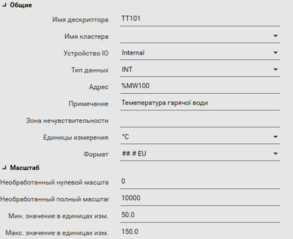

[Головна](README.md) > [3.Підсистема керування збором та обробленням даних в реальному часі](3.md)

# 3.6. Одиниці виміру, формат відображення

Відображення значення величини у вигляді тексту, як правило, повинно супроводжуватися одиницями вимірювання, які також називаються ***інженерними одиницями*** (***engineering*** ***unit,*** ***EU***). Враховуючи, що це стосується тегу, а не тільки його відображення, ці одиниці налаштовуються при конфігуруванні тегу. На рис. 3.5 показано приклад, де в якості одиниць вимірювання вказується °С.

Величини, що мають дробову частину, потребують означення формату відображення. Так, для відображення одиниць pH потребуються дві цифри до крапки(коми), і дві після (6.56 од. pH), а для швидкості оберту двигуна – тільки 4 цифри до коми і жодної після (1456 об/хв). Якщо неправильно налаштувати формат відображення, то в одному випадку пропадуть значимі цифри, а в іншому – будуть показуватися зайві цифри після коми, які не мають значення і тільки заважають сприйняттю інформації. Налаштування формату відображення може проводитися як на самому елементі відображення, так і у властивостях тегу. 

На рис. 3.5 показано приклад формату "##.# EU", в якому, в залежності від значення до коми, буде відображатися дві або менше цифр, а після коми – одна або менше. Крім того, після значення будуть відображатися інженерні одиниці (EU). Тобто при значенні 54.345678 буде відображатися 54.34 °С.         

                               

*Рис.* *3.5.* Приклад налаштування тегу (SCADA Citect)