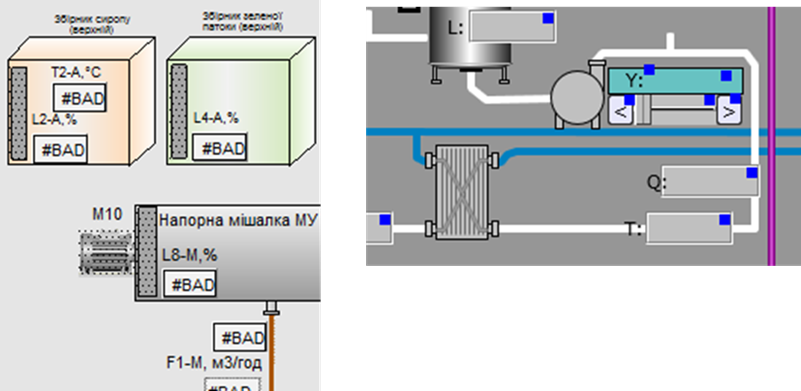
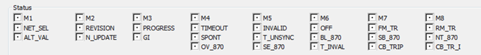

[Головна](README.md) > [3.Підсистема керування збором та обробленням даних в реальному часі](3.md)

# 3.7. Властивості тегів у режимі виконання

Вище описано, які властивості є у тегів для налаштування їх оброблення і поведінки. Ці властивості умовно можна назвати властивостями режиму конфігурування. Як уже було сказано, ці властивості записуються в базу даних проекту середовища розроблення. При компілюванні вони використовуються і в середовищі виконання, однак можуть бути недоступними для відображення та/або зміни. Тому в ряді випадків частина властивостей може бути використана для додаткової анімації, а інша – ні. Наприклад, властивості масштабування можна використати для відображення користувачу дозволених меж введення. 

Незалежно від того, чи є доступ у середовищі виконання до властивостей, чи немає, тег при цьому завжди характеризується мінімум трьома значеннями:

- плинне значення (Value);

- якість (Quality);

- відмітка часу (Time Stamp).

Окрім плинного значення, яке характеризує числовий вимірювальний показник, для тегу характерна якість. Якщо джерело даних недоступне, то оператор повинен бути проінформований, що значення недостовірне, тобто йому немає довіри. На рис. 3.6 наведено приклади відображення ознаки недостовірності: в SCADA Citect замість плинного значення пишеться "BAD", а в SCADA zenon відображаються кольорові квадратики. Слід зазначити, що якість має також різні значення, які вказують на причини. Наприклад, недостовірність може бути спричинено відсутністю зв’язку клієнта із сервером або відсутністю зв’язку сервера з джерелом даних на контролері, або навіть виходом значення за дозволений діапазон.

                               

 *Рис.* *3.6.* Приклади вигляду відображення при відсутності зв’язку із джерелом даних: ліворуч – в Citect, праворуч – в SCADA zenon  

У деяких SCADA-програмах є можливість анімувати стан тегу. На рис. 3.7 показано статусні біти тегу, які можна використати в анімації SCADA zenon. Так, можна змінити колір/відображення/видимість елемента залежно від біту стану SPONT (відбулася зміна значення із джерела даних) або INVALID (значення тегу недостовірне). 

 

*Рис. 3.7.* Вибір бітів статусу тегу в анімації в SCADA zenon  

Слід розуміти, що плинне значення тегу – це далеко не єдина важлива його властивість. Окрім якості, можливо, знадобиться фіксувати зміну тегу оператором або з джерела даних (контролеру), факт оновлення даних, час оновлення. Час оновлення в деяких системах є вкрай важливим фактором при фіксації події в журналах. Для відновлення послідовності подій з точністю до десятків та одиниць мілісекунд, у деяких системах SCADA передають відмітку часу разом зі значенням безпосередньо з джерела даних. Є спеціальні модулі в контролерах, що фіксують відмітку часу, та спеціальні протоколи телеметрії, які передають її разом зі значеннями даних (DNP3, IEC-60870-5).

[<-- 3.6. Одиниці виміру, формат відображення](3_6.md)

[--> 3.8. Типи даних тегів](3_8.md)