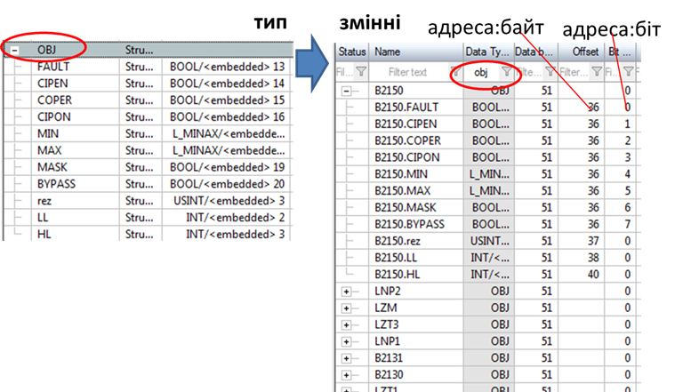

[Головна](README.md) > [3.Підсистема керування збором та обробленням даних в реальному часі](3.md)

# 3.8. Типи даних тегів

Для того щоб правильно інтерпретувати отримані з джерела дані для тегу (кількість байт, порядок біт, формат), необхідно вказати їх тип. Наприклад, для доступу до типу з плаваючою комою (32-бітного) необхідно витягувати в два рази більшу кількість байт, ніж 16-бітного цілого, а також враховувати, що формат цих 4-х байт буде інтерпретуватися відповідно до представлення числа з плаваючою комою. 

Слід також розуміти, що значення на джерелі даних при перетворенні (масштабуванні) може потребувати зміни типу. Припустимо, що діапазон змінної в одиницях ПЛК 0-10000. Враховуючи що змінна в ПЛК цілочисельна, вона зберігається в змінній цілого типу (INTEGER). Однак при масштабуванні в діапазон 0.0-100.0 (%), для збереження перетвореного значення в БДРЧ знадобиться значення з плаваючою комою. Тобто типи даних для тегу в джерелі і перетвореного при масштабуванні будуть відрізнятися. У більшості випадків, перетворення типів проводиться неявно і не потребує конфігурування. У прикладі на рис. 3.5 вказується тільки тип даних на джерелі, хоч по факту плинне значення тегу (Value), очевидно, матиме тип з плаваючою комою (REAL).

Найменування типів в SCADA/HMI може не збігатися з найменуваннями їх у джерелі даних. Окрім того, типи з однаковою назвою в джерелі і SCADA/HMI можуть також інтерпретуватися різним чином. Тому перед означенням типу необхідно чітко розуміти співвідношення типів в SCADA/HMI і джерелі, інакше дані будуть недостатньо інтерпретовані. 

Останнім часом дані в ПЛК все частіше представляються у вигляді структурних ***користувацьких типів* (user types)**. Це досить зручно, бо дає можливість зберігати логічно об’єднані дані як одне ціле та зменшити кількість операцій при програмуванні та налагодженні. Структурування даних на джерелі дає змогу спростити розроблення в SCADA/HMI. Для цього в інструментальних засобах повинна бути можливість створення власного типу даних. Створення структурної змінної при цьому може зводитися тільки до означення її імені та початкової адреси. Усе інше означується типом і розраховується автоматично. На прикладі з рис. 3.8 структурний тип OBJ має 11 полів, які мають різний тип (BOOL, USINT, INT). При створенні змінної на базі цього типу задається тільки номер блоку даних та початкове зміщення відносно нього (у даному випаду в байтах). Середовище розроблення SCADA автоматично розраховує адреси зміщення та бітів для інших полів. Якщо в цьому випадку піти класичним шляхом (без використання структурних типів), усі поля були б як окремі змінні, тобто кількість змінних збільшилась би в 11 разів, і для кожної треба б було окремо задавати усі властивості. Це, можливо, було б не так складно, якби таке "набивання" тегів проводилося один раз. Однак на практиці, завжди доводиться редагувати властивості тегів. Подумайте, скільки змін прийдеться робити в проекті, якщо всі адреси зміщуються на один байт! Кількість змін буде більша або рівною кількості змінних (не важливо структурних чи ні).  

Цей підхід може бути розвинутий до ще більш потужних механізмів. Наприклад використання об'єктно-орієнтованого програмування може забезпечити супроводження структури кодом обробки. У деяких SCADA/HMI в типі також означується поведінка тегу. Наприклад, у SCADA zenon у типі змінної можна налаштувати межі тривог, кольори відображення при досягненні меж, тексти повідомлень, обмеження на введення і т. п. Наявність наслідування типів також значно спрощує розроблення проекту.

                               

*Рис.* *3.8.* Структурні типи та змінні в SCADA zenon

Не дивлячись на потужні можливості користувацьких типів, є певні нюанси, які необхідно враховувати при їх використанні. Зокрема, структури в джерелі даних (наприклад контролері) можуть вирівнюватися в пам'яті за одною ознакою, а в джерелі – за іншою. Наприклад, в ПЛК Modicon M340 (Schneider Electric, поля типу BOOL в структурах вирівнюються по байтах (кожне поле BOOL буде займати окремий байт), а в SCADA zenon – по бітах. Тобто в M340 кожне нове поле BOOL буде зміщуватися на один байт, а в SCADA – на один біт. У цьому випадку для того щоб ці структури вирівняти, доведеться в SCADA zenon вводити на кожен BOOL ще по сім порожніх (непотрібних) BOOL або відмовитися від типу BOOL на користь пакування.   