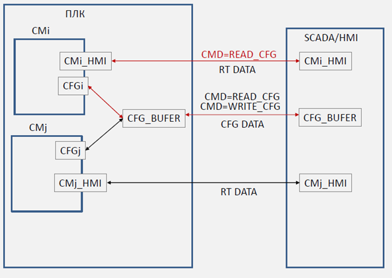
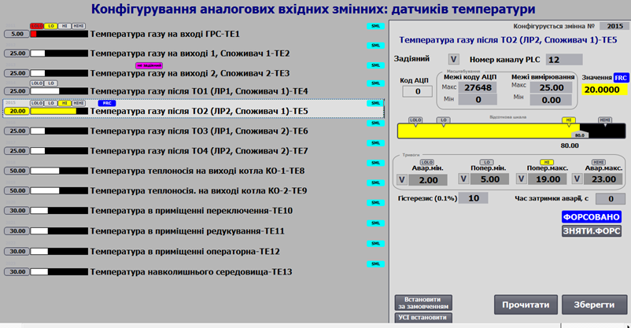
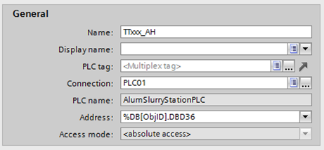

[Головна](README.md) > [3.Підсистема керування збором та обробленням даних в реальному часі](3.md)

# 3.9. Деякі підходи до організації БДРЧ

Організації, що розроблюють автоматизовані системи керування, часто користуються певними стандартизованими принципами розроблення прикладного ПЗ або навіть роблять свої програмні каркаси (набір правил та бібліотек для розроблення), наприклад PAC Framework [1]. У цьому параграфі показані деякі типові підходи і прийоми до організації БДРЧ.   

## 3.9.1. Пакування бітів в теги

Як правило, кожен тег введення/виведення рахується як ліцензована одиниця SCADA/HMI. Іншими словами, чим більше тегів I/O, тим дорожча буде ліцензія на використання середовища виконання SCADA/HMI. Велику частку тегів при цьому займають ті, що мають за джерело змінні типу BOOL. Часто розробники використовують прийом, при якому всі значення змінних з типом BOOL ***пакують*** у змінні цілого типу (16-біні INT, UINT, або 32-бітні DINT, UDINT). Тобто в кожен біт цілої змінної записують значення однієї змінної типу BOOL. Таким чином, в упакованому 16-бітному INT можна передати 16 значень BOOL, а в 32-бітному – 32. Неважко зрозуміти, на скільки (навіть у скільки разів) зменшиться кількість тегів БДРЧ. 

У ПЛК пакування (і розпакування) запрограмувати досить легко, адже є можливість прямого звернення до біту слова. У SCADA/HMI такої можливості може не бути, однак може бути доступним механізми математичного та логічного оброблення. Яким чином, скажімо, дізнатися в якому стані знаходиться 12-й біт в змінній WPACK типу INT? Є декілька варіантів. Наприклад, можна визначити, чи 12-й біт в 1, використавши порівняння значення складеного по побітовому AND з маскою:

```
WPACK AND 4096 < > 0
```

де 4096 – це маска, яка в двійковому форматі має вигляд: 0001_0000_0000_0000. Враховуючи, що всі біти 0-ві, окрім 12-го, побітове AND дасть в усіх бітах 0, окрім хіба що 12-го, який у випадку 1 дасть ненульовий результат. Тобто, якщо 12-й біт буде 1, то результат буде ненульовий, а якщо 0 – то нульовий. 

 Це показано у випадку читання. Якщо необхідно записати (упакувати) якийсь біт в SCADA/HMI, можна також скористатися операціями з маскою. Щоб записати лог. "1" в 12-й біт, можна виконати таку дію:

```
 WPACK = WPACK OR 4096 
```

А щоб записати логічний 0, треба скористатися маскою у двійковому вигляді 1110_1111_1111_1111 (61439 у десятковому) та побітовим AND:

```
WPACK = WPACK AND 61439
```

При такому записі усі біти, окрім 12-го, залишаться в тому ж стані, що й були, а в 12-й запишеться лог."0". 

При пакуванні слід акуратно користуватися константами, щоб SCADA/HMI система коректно виконала дію. Особливо це стосується пакування 15-го біту в 16-бітному слові, який може відповідати за знак. Так, константа 1110_1111_1111_1111 при інтерпретації 16-бітного INT буде дорівнювати від'ємному числу -4097.   

## 3.9.2. Використання буферів

Окрім даних реального часу, з кожним об’єктом автоматизації (регулятором, виконавчим механізмом, технологічною змінною) пов’язана велика кількість конфігураційних даних (CFG DATA), які потрібно передавати в/зі SCADA/HMI тільки за необхідністю. Оскільки більшість SCADA/HMI ліцензуються за кількістю точок введення/виведення, для зменшення великої кількості конфігураційних даних, що циркулюють між SCADA/HMI та контролером, пропонується використовувати ***буфер*** [1]. Для кожного масиву (набору) однотипних об’єктів рекомендується використовувати свій буфер. Кожен об’єкт має унікальний у межах набору ідентифікатор, за яким можна його зв’язати з буфером (рис. 3.9). У будь-який момент часу змінні CFG_BUFER (конфігураційний буфер), CMi_HMI…CMj_HMI (структура зі значеннями стану реального часу, де i,,j – умовні ідентифікатори змінних) в SCADA/HMI пов’язані з однойменними змінними в ПЛК. Отримуючи команду на читання (CMD=READ_CFG), відповідний об’єкт (i..j) в ПЛК завантажує свої конфігураційні дані в буфер та пов'язується з ним (займає/оволодіває ним). Під час займання буферу в ньому оновлюються дані реального часу від обраного об’єкта. Це можуть бути не тільки видимі RT DATA, а додаткові відлагоджувальні дані (номер кроку, час кроку, значення інтегралу і т.п.), які немає сенсу відображати постійно. Конфігураційні дані оновлюються в буфері тільки по команді на читання. Це зроблено для того, щоб оператор міг змінити ці значення в буфері і записати їх в об’єкт відповідною командою CMD=WRITE_CFG.      

                               

*Рис.* *3.**9* Приклад конфігурування кранів на HMI.

На рис. 3.10 наведено приклад, яким чином може використовуватися буфер при налаштуванні аналогових змінних. На HMI постійно відображається значення змінних та їх стан (біти тривог та інші статуси). При виборі необхідної змінної на дисплеї (підсвічується світло-сірим фоном), на ПЛК відправляється команда завантаження даних цієї змінної в буфер. Вміст буфера відображається в правій частині дисплею – це параметри масштабування, фільтрації, меж тривог тощо. Конфігураційні параметри зчитуються тільки в момент вибору змінної або натискання кнопки "Прочитати". Інші значення, такі як "код АЦП" (немасштабоване значення), "Значення" (масштабоване), оновлюються в буфері постійно. Наладчик може змінити будь-яке конфігураційне значення в буфері, але тільки після команди "Зберегти" воно буде перезаписано з буфера в конфігураційні параметри вибраної змінної в ПЛК. Таким чином, для всіх конфігураційних даних виділяється тільки одна змінна в SCADA/HMI, яка за фактом є буферною.  

*Рис. 3.10* Приклад використання буферу для налаштування аналогових змінних на HMI

Не дивлячись на значну економію ресурсів, використання буфера супроводжується рядом обмежень. Найбільш суттєвим обмеженням є неможливість використання буфера з 2-х та більше засобів ЛМІ. При одночасному використанні буфер "відбирається" останнім користувачем. Іншим недоліком є відмова від табличних виглядів карт технологічних змінних. 

## 3.9.3. Використання індексної адресації 

Альтернативою буферу може бути індексна адресація, коли в якості адреси даних використовується індекс або зміщення. Наприклад, у WinCC для операторських панелей, що працюють з контролерами Simatic, за індекс можна використовувати номер блока даних (DB). На рис. 3.11 номер DB задається значенням внутрішнього тегу ObjID. У такому випадку можна при переході до екрана відображення інформації аналогової величини TT101 передавати у тег ObjID значення 101, при цьому тег TTxxx_AH буде пов’язаний з %DB101.DBD36. А при переході до екрану відображення інформації аналогової величини TT203 передавати у тег ObjID значення 203, при цьому тег TTxxx_AH буде пов’язаний з %DB203.DBD36.

 

*Рис. 3.11* Приклад конфігурування використання індексу в анімації

[<-- 3.8. Типи даних тегів](3_8.md)

[--> 3.10. Підходи до автоматизації створення БДРЧ](3_10.md)