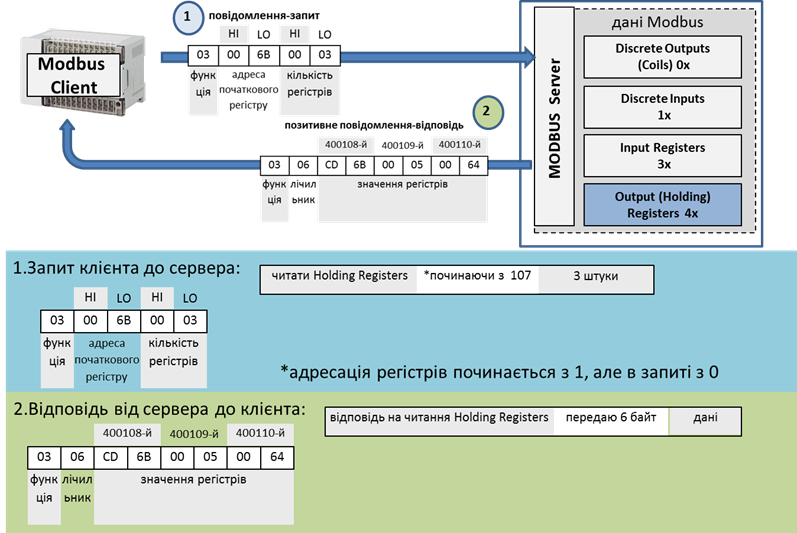
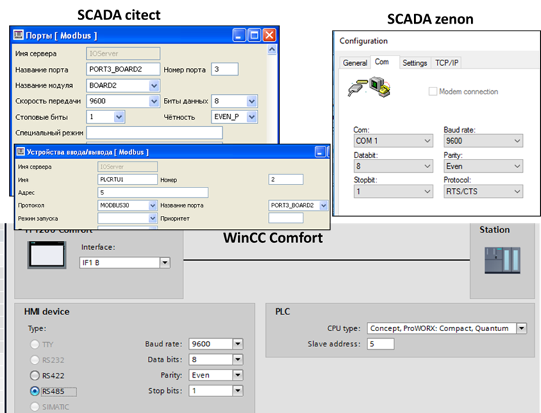

[Головна](README.md) > [4.Підсистема введення/виведення](4.md)

# 4.1. MODBUS

## 4.1.1. Загальні принципи функціонування та налаштування MODBUS

***MODBUS*** на сьогоднішній день є одним з найбільш популярних протоколів. Основна причина такої популярності – це простота в реалізації. Протокол MODBUS підтримує і розвиває організація ***MODBUS.ORG***. Вона забезпечує його відкритість та розроблює готові компоненти для спрощення реалізації. Протокол функціонує в 4-х типах мереж: MODBUS RTU та ASCII (Modbus over Serial Line), MODBUS Plus і MODBUS TCP/IP. 

MODBUS використовують для різних цілей, зокрема:

- обміну даними SCADA/HMI з ПЛК чи іншими інтелектуальними засобами (електроприводами, лічильниками, засобами розподіленого введення/виведення тощо);

- обміну даними між ПЛК;

- обміну даними ПЛК з іншими інтелектуальними засобами.

Усі вузли мережі, вірніше, їх прикладні процеси (програми), поділяються на дві категорії: ті, які мають дані (***Modbus сервери***), і ті, яким ці дані потрібно прочитати або змінити (***Modbus клієнти***). 

У зв’язку з тим, що контролери для підсистеми введення/виведення SCADA/HMI є джерелом даних, у більшості випадків драйвери Modbus у них є клієнтами, хоч бувають випадки коли їх налаштовують як сервери. У цьому посібнику буде розглядатися тільки випадок, коли SCADA/HMI виступає в ролі Modbus клієнта. 

Для розуміння функціонування і особливостей роботи Modbus варто ознайомитися з ним з точки зору тих пристроїв, для яких він був створений. Протокол Modbus розроблено для зв’язування контролерів від фірми Modicon (тепер є частиною Schneider Electric). З боку серверу, який, як правило, являв собою ПЛК, передбачалося використовувати змінні з 4-х областей пам’яті (рис. 4.1):

- дискретні виходи (0x), або котушки (***Coils***);

- дискретні входи (1x), іншими словами – вхідні біти (***Input Bits***) ;

- аналогові входи (3x), або вхідні регістри (***Input Register*,** 16-бітові) ;

- аналогові виходи (4x), або вихідні/внутрішні регістри (***Holding Registers*,** 16-бітові). 

Кожна область має умовний номер (зміщення) і вміщує комірки, до яких можна звертатися за адресою, починаючи з 1. Так, область Input Registers починається з комірки **3**0001 (або 300001, залежно від варіантів ПЗ). Усі інші комірки області вхідних регістрів розміщуються в адресах, номер яких послідовно збільшується. Таким чином, при розробленні проекту для такого типу ПЛК Modicon інженер-програміст указував, які комірки пам’яті за які саме канали відповідали. А пристрій Modbus клієнт, який мав прочитати чи записати цю комірку, звертався до неї за її номером та номером області пам’яті, в якому вона знаходилася. 

                               

*Рис. 4.1.* Області пам’яті згідно з MODBUS

Комірки з усіх зон пам’яті доступні для читання. Однак для записування доступні тільки комірки з областей Holding Registers та Coils, адже вхідні дані змінюються тільки залежно від значення вхідних каналів. 

Не дивлячись на цілком логічну архітектуру пам’яті ПЛК Modicon, на практиці необхідно обмінюватися також іншими даними. По-перше, протокол Modbus використовується зараз для зв’язку не тільки з ПЛК Modicon. По-друге, в якості Modbus серверів, як було вже зазначено, може бути взагалі не контролер, а, наприклад, перетворювач частоти. Крім того, для обміну внутрішніми змінними, параметрами регуляторів тощо потрібні інші типи комірок пам’яті. Тому виробники пристроїв самі вирішують, як зрештою організована пам'ять пристрою і як вона зв’язується з комірками згідно з Modbus. Тобто в самому пристрої йде так зване ***відображення*** (***Mapping***) реальних комірок пам’яті на комірки, що означені в Modbus (рис. 4.2). За якими правилами проводиться це відображення, означується самим виробником пристрою. Тому розробникові системи необхідно ознайомитися з документацією на конкретний пристрій, перш ніж з’єднуватися з ним по протоколу Modbus. 

 

*Рис. 4.2*. Відображення реальних комірок пам’яті на віртуальну пам’ять MODBUS

Порядок доступу до комірок пам’яті, правила формування повідомлень, які при цьому використовуються, означені протоколом MODBUS. ***MODBUS Application Protocol (MBAP*** MODBUS протокол прикладного рівня) базується на моделі клієнт-серверного обміну повідомленнями і означує формат повідомлень ***MODBUS PDU*** (Protocol Data Unit). Клієнтський прикладний процес робить повідомлення-запит до серверного процесу, в якому в полі "код функції" вказує йому на функцію (сервіс), яку необхідно провести, а в полі даних уточнює деталі виконання цієї функції. Більшість доступних функцій (сервісів) – це операції читання/записування (рис. 4.3)  

 

*Рис. 4.3.* Сервіси (функції) Modbus

При конфігуруванні введення/виведення в SCADA/HMI розробникові не обов’язково потрібно знати формати повідомлень. Однак при налагодженні розуміння протоколу може дати певні відповіді на проблемні питання. На рис. 4.4. показано приклад виконання функції  читання Holding Registers. 

 

*Рис. 4.4.* Приклад читання Holding Registers з 400108 по 400110 (3 шт)

Перший байт у запиті є номером функції: 03 – читання Holding Registers. Далі вказується область даних, яку необхідно прочитати: починаючи зі 108-го (107 зміщення), 3 регістри. При позитивній відповіді (коли немає помилок) MODBUS сервер повертає той самий номер функції і регістри, які були запитані. При негативній відповіді, сервер пришле повідомлення з модифікованим номером функції (старший біт в 1) та номером помилки. 

Таким чином, для вказівки джерела даних (змінної) на пристрої Modbus необхідно вказати необхідну комірку (-ки). У програмі SCADA/HMI це може робитися різним чином:

- вказівкою адреси у форматі (0x, 1x, 3x, 4x);

- вказівкою області пам’яті (Input Bits, Coils, Input Register, Holding Registers) та зміщення в ній відносно 1-го елемента;

- вказівкою використовуваної функції, адресою початкового елемента.  

На рис. 4.5 показано приклади адресації змінних у джерелі даних у різних SCADA/HMI. Так, у SCADA Citect і для панелей WinCC Comfort змінна задається безпосередньо адресою, а в SCADA zenon – областю пам’яті і зміщенням (Offset).   

 

*Рис. 4.5.* Приклад налаштування тегу Modbus в різних SCADA/HMI

У сучасних ПЛК Schneider Electric (Modicon M340/M580, M241/M251, M221 та інші) адресація змінних йде за іншим принципом. Хоч протокол Modbus досі ще підтримується, Modbus-змінні відображаються на інші комірки пам’яті (табл.4.1).  

*Таблиця 4.1.* 

**Відображення областей** **Modbus на змінні деяких** **ПЛК** **Modicon**

| **Modbus**            | **Micro****/****Premium****/****M****340****/M580/M221** |
| --------------------- | -------------------------------------------------------- |
| Discrete  Input 1x    | %M                                                       |
| Coils  0x             | %M                                                       |
| Input  Registers 3x   | %MW                                                      |
| Holding  Registers 4x | %MW                                                      |

 Враховуючи це, розробникові проекту SCADA/HMI для вказаних ПЛК зручніше вказувати дійсні адреси, а не в форматі Modbus. Тому постачальники можуть надати інший формат налаштування, залежно від вибраного ПЛК. Ось, наприклад, який мають вигляд різні налаштування для пристроїв зі старими ПЛК та новими Modicon (рис. 4.6). Не слід забувати, що використаний протокол від цього не зміниться, це лише зручність для розробника.   

 

*Рис. 4.6.* Налаштування однакової адреси Modbus для різних типів ПЛК

Оскільки в протоколі MODBUS означені тільки 16-бітні регістри, при необхідності роботи з даними типу REAL (FLOAT) та DINT/UDINT проводиться прив’язка до комірок із сусідніми адресами. У цьому випадку також треба означити послідовність слідування цих комірок, інакше дані будуть неправильно інтерпретовані. На рис. 4.7 показано приклад означення порядку регістрів для FLOAT і DWORD в SCADA zenon. У SCADA Citect це вказується в налаштуваннях Citect.ini, а в WinCC Comfort – опцією "Change Word order" (рис. 4.12). Також на рис. 4.7 показано, як будуть відрізнятися відображення значення змінних при різному порядку слідування регістрів у подвійних словах та в змінних із плаваючою комою.  

 

*Рис. 4.7.* Налаштування порядку регістрів в REAL та DOUBLE в SCADA Zenon

Слід розуміти, що Modbus Protocol є протоколом прикладного рівня. Він не означує, яким чином проводиться доставка повідомлення від клієнта до сервера та в зворотному напрямку, це залежить від типу мережі Modbus. Для розробника SCADA/HMI необхідно також розуміти, як функціонує ця мережа, які додаткові налаштування потрібні та які є обмеження. У наступних параграфах розглядається Modbus RTU та Modbus TCP/IP. 

## 4.1.2. Загальні принципи функціонування   та налаштування MODBUS RTU/ASCII

Перші мережі MODBUS базувалися на асинхронних послідовних лініях зв’язку і отримали назву ***MODBUS RTU*** та ***MODBUS ASCII*.** На фізичному рівні вони використовують стандартні послідовні інтерфейси із символьним режимом передачі. На сьогодні в MODBUS.ORG ці мережі мають назву ***MODBUS over Serial Line*** і описані у відповідному стандарті. У ньому вказуються правила та рекомендації використання на канальному та фізичному рівнях. 

Згідно зі стандартами MODBUS.ORG, Modbus over Serial Line (Modbus RTU або Modbus ASCII) може функціонувати поверх інтерфейсів RS-485 або RS-232. На практиці Modbus over Serial Line може працювати поверх будь-яких стандартних послідовних асинхронних інтерфейсів (RS-422, Current Loop і т.п). Замість словосполучення "Modbus over Serial Line" частіше використовують "мережа Modbus" (Modbus network), "шина Modbus" (Modbus bus), Modbus Serial або прямо вказують Modbus RTU чи Modbus ASCII. Щоб вказати повний стек протоколів та інтерфейсів для конкретної реалізації мережі, краще використовувати назву типу "Modbus RTU on RS485". Саме Modbus RTU будемо розглядати надалі. 

Для реалізації зв’язку по SCADA/HMI по Modbus RTU використовуються послідовні порти. Як правило, вони мають назву COMx, де x – це номер порту. Ці порти можуть бути реалізовані як RS-232, RS-422 або RS-485. На ПК стандартні послідовні порти можуть бути відсутні, тому замість них використовуються порти USB, до яких підключення проводиться через перетворювачі інтерфейсів, наприклад USB<->RS485. При цьому в системі все одно з’являються віртуальні COM-порти.  

Принцип роботи мереж Modbus RTU базується на тому, що кожний байт, який треба передавати, відправляється одним 11-бітним символом – послідовністю біт: 1 старт, 8 біт даних, 1 паритет або без нього, 1 стоповий біт, або 2 – якщо паритет не використовується. Бітові швидкості, як правило, означені 9600 біт/с та 19200 біт/с. Однак виробники пристроїв можуть додатково підтримати і інші швидкості. 

Оскільки мережа MODBUS RTU може мати шинну топологію, то в один момент часу тільки один пристрій може передавати свої дані. Для вирішення колізій доступу до єдиного інтерфейсу використовується метод доступу ведучий/ведений (Master/Slave). ***Ведучий*** (***Master***) може передавати свій кадр тоді, коли в нього є на це потреба, а ***ведений*** (***Slave***) тільки тоді, коли йому дав на це право ведучий. Тому в мережі MODBUS RTU процес ведучого завжди є клієнтом, а процеси ведених – серверами. Це значить, що ведучий відсилає запити коли забажає, і чекає від них відповіді. Ведені, отримавши запити, обробляють їх, після чого надсилають відповідь. Весь цей час ведучий очікує відповідь і тим самим надає право зайняти веденому шину для її передачі. 

Оскільки SCADA/HMI у більшості випадків є клієнтами, то вони є ведучими. Кожний ведений повинен мати свою унікальну адресу (1-247), за якою до нього звертаються, сам ведучий не адресується. Ведучий чекає від веденого відповідь протягом тайм-ауту. 

Слід розуміти, що на одній шині не може функціонувати більше одного ведучого, оскільки вони будуть конфліктувати, перебиваючи запитами один одного. Тому SCADA/HMI на одній шині Modbus RTU/ASCII можуть бути тільки в тому випадку, якщо одна з них буде з правами ведучого, а інші – веденого. Така конфігурація не завжди можлива і не рекомендується. Детальніше про Modbus RTU можна прочитати з посібника [1]. З тієї ж причини на одній мережі зі SCADA/HMI ПЛК не можуть обмінюватися між собою, оскільки один із них мав би бути ведучим. 

На рис. 4.8 показано приклад виконання однієї транзакції між Modbus RTU Master та Slave з адресою 5. Окрім повідомлення і адреси веденого, кадр також включає контрольну суму (для RTU це CRC).

 

*Рис. 4.8* Приклад функціонування Modbus RTU

Таким чином, при зазначенні джерела даних на пристрої Modbus RTU (ASCII), з яким необхідно зв’язатися, для означення пристрою необхідно вказати:

- номер комунікаційного порту;

- налаштування параметрів порту (швидкість, паритет, стопові біти);

- додаткові параметри синхронізації інтерфейсів (за необхідності);

- тайм-аути;

- номер веденого (Slave).

На рис. 4.9 показано приклади налаштування в різних SCADA/HMI зв’язку зі Slave по Modbus RTU. Для всіх налаштувань спільне означення протоколу (ASCII або RTU, 7 або 8 біт), тип біта паритету та кількість стопових біт, номер фізичного порту (для панелі Comfort IF1 B), адреса пристрою (для zenon вказується безпосередньо у змінній в полі Net Address) та бітова швидкість.  

 

*Рис. 4.9* Приклади налаштування в SCADA/HMI зв’язку зі Slave по Modbus RTU

При використанні перетворювачів інтерфейсів, наприклад USB<->RS-485, або RS-233<->RS-485 або модемів, що потребують апаратного керування потоком, інколи необхідно налаштовувати параметри керування його трансмітером. У SCADA Citect, наприклад, це задається в параметрах налаштування порту, в SCADA zenon – в полі Protocol (рис. 4.9)  

## 4.1.3. Загальні принципи функціонування   та налаштування MODBUS TCP/IP

У мережах Modbus RTU та ASCII використовуються послідовні лінії передачі. У Modbus on TCP/IP в якості транспорту використовується стек TCP/IP. При цьому протокол передбачає як безпосереднє підключення клієнта і сервера через TCP/IP (наприклад по мережі Ethernet), так і підключення через шлюзи (gateway), які з одного боку мають з’єднання до мережі IP, а з іншого – до послідовного інтерфейсу мережі Modbus RTU (або ASCII) (рис. 4.10). 

Таким чином, для зазначення пристрою, через який відбувається з’єднання по TCP/IP, необхідно вказати адресу IP. При необхідності доступитися до пристрою на Modbus Slave, через шлюз, додатково треба вказати і його адресу. Для цього в протоколі існує спеціальне поле – Unit ID. У якості TCP-порта сервера за замовчуванням використовується номер 502, хоч у деяких випадках можуть використовуватися інші номери портів.   

 

*Рис. 4.10* Комунікаційна архітектура Modbus on TCP/IP 

Щоб зрозуміти, що відбувається на рівні протоколу, розглянемо формування обміну по Modbus TCP/IP. Загальне Modbus повідомлення-запит, що включає функцію і дані, розміщується в TCP-пакеті разом з додатковим заголовком MBAP Header (рис. 4.11). 

Розробникові SCADA/HMI необхідно розуміти тільки призначення поля, яке вказує адресу пристрою, тобто UnitID. Як правило, коли йде звернення безпосередньо до пристрою через IP, поле UnitID ігнорується отримувачем. У деяких випадках UnitID вказує на сервіс, який буде використовуватися. Наприклад, для перетворювачів частоти Altivar Process (Schneider electric) UnitID може вказувати на використання сервісу I/O Scanning або прямого (конфігураційного) доступу до регістрів.  

Таким чином, при зазначенні джерела даних на пристрої Modbus on TCP/IP, з яким необхідно зв’язатися, для означення пристрою необхідно вказати:

- IP адресу пристрою або шлюзу;

- TCP порт (за замовчуванням 502);

- UnitID (за замовчуванням 0 або 255, залежить від реалізації). 

 

*Рис. 4.11* Modbus on TCP/IP формат повідомлення

На рис. 4.12 показано приклади налаштування зв’язку з Modbus Server по Modbus TCP/IP у різних SCADA/HMI. Для всіх налаштувань спільне означення IP адреси, Port (502), адреса UnitID (Slave=5).

 

*Рис. 4.12* Приклади налаштування в SCADA/HMI зв’язку по Modbus TCP/IP

## 4.1.4. Інструменти для тестування та налагодження 

У багатьох ситуаціях, особливо при ознайомленні з новою SCADA/HMI або пристроєм, з яким необхідно з’єднатися, доводиться провести багато часу, щоб довести обмін до очікуваного результату. Особливо це характерно для ситуацій, коли у розробників небагато досвіду роботи з такими засобами або/та протоколом. У наступному параграфі розглянемо типові проблеми, з якими зустрічаються розробники при налагодженні зв’язку між SCADA/HMI по мережах Modbus, а також шляхи їх вирішення. Тут наводяться засоби, які можуть допомогти в цьому.

 При налагодженні зв’язку SCADA/HMI рекомендується використовувати різноманітні утиліти Modbus та засоби роботи з послідовними портами й мережею Ethernet. З апаратних засобів можуть знадобитися:

- перетворювачі інтерфейсів RS-232<->RS-485, USB<->RS-485, USB<->RS-232;

- Ethernet концентратори (HUB), або комутатори (Switch) з дзеркальним портом (Port Mirroring) для прослуховування обміну;

- тестер, осцилограф та інше додаткове устатковання. 

В Інтернеті є багато різних платних і безкоштовних програмних утиліт, які можуть допомогти при боротьбі з неполадками.  

1) Утиліти для роботи із СОМ-портами та TCP-сокетами з ручним формуванням та аналізом байтових послідовностей (кадрів для Serial та пакетів по TCP та UDP), зокрема:

- утиліти для роботи з COM-портом; 

- утиліти для роботи з пакетами TCP/UDP, наприклад http://packetsender.com для відправки/прийому поверх TCP/IP (UDP/IP); 

- Сніфери, аналізатори для прослуховування з аналізом протоколу. 

2) Утиліти для імітації Modbus Server/Slave

3) Утиліти Modbus Client/Master 

   Нижче розглянемо деякі з них, більш детальну інформацію Ви можете  отримати з [[2](http://asu.in.ua/viewtopic.php?f=194&t=1052)]. Наведені програмні утиліти є популярними безкоштовними (або мають період безкоштовного користування) і наведені виключно для демонстрації ключових функцій, які можуть допомогти у вирішенні певних проблем. Кожен розробник підбирає собі свій "джентльменський набір", який тією чи іншою мірою задовольняє його потреби.  

**Утиліти для роботи з СОМ-портами** 

Ці утиліти не аналізують Modbus-повідомлення, хоча можуть мати цей додатковий функціонал. Вони показують обмін через СОМ-порт, що може допомогти при ручному візуальному аналізі трафіка. 

Утиліта COM Port Toolkit (доступна пробна безкоштовна версія, [http://www.compt.ru](http://www.compt.ru/)) дає можливість прослуховувати COM-порт ПК, на якому вона встановлена та відправляти байтові послідовності (рис. 4.13). Отримувати та відправляти дані можна як у HEX, так і в ASCII-форматі. Альтернативою цій утиліті є багато інших, зокрема Terminal [[3](https://sites.google.com/site/terminalbpp/)], кожен із спеціалістів вибирає собі найбільш зручний та з необхідним набором функцій. 

 

*Рис. 4.13* Приклад роботи COM Port Toolkit

   Наведені вище утиліти дають можливість працювати з COM-портом ПК у тому випадку, якщо відправник (отримувач) до нього підключений. Наприклад, якщо необхідно проаналізувати відповідь ПЛК на якийсь запит, який формується з ПК наладчика, або якщо треба "послухати" обмін між пристроями. Інколи виникає необхідність "послухати" COM-порт на тому ж ПК, на якому є програма, що його використовує. Наприклад, треба проаналізувати обмін SCADA з пристроєм. Для цього потрібен пасивний режим, який не заважав би основній програмі (SCADA) зайняти COM-порт. У цьому випадку може знадобитися утиліта, що вміє прослуховувати порт, розділяючи його з іншими застосунками. Одна з таких – це Free Serial Analyzer https://freeserialanalyzer.com. Платна версія програми має ще багато різних корисних функцій. На рис. 4.14 показано приклад вікна перегляду повідомлень із СОМ-порта, який використовує SCADA-програма для роботи через протокол Modbus. Альтернативою є добре відома Portmon [[4](https://technet.microsoft.com/ru-ru/sysinternals/bb896644.aspx)], яка має менше можливостей. 

 

*Рис. 4.14* Приклад вікна перегляду повідомлень Free Serial Analyzer

   Якщо SCADA/HMI програму необхідно з’єднати з іншою програмою через COM-порт для перевірки працездатності, не обов’язково їх запускати на різних ПК. Можна використати спарені віртуальні COM-порти, створивши їх утилітою COM0COM [[5](http://sourceforge.net/projects/com0com/?source=navbar)] (рис. 4.15). Емуляція портів не є повноцінною, тим не менше може сильно допомогти в налагодженні та пошуку несправностей. Наведена утиліта наразі не підтримується 64-біними версіями Windows.   

**Утиліти для роботи з пакетами TCP/UDP**

   Для перевірки роботи з Modbus TCP/IP можуть стати в нагоді утиліти, які дають змогу формувати та отримувати повідомлення поверх стеку TCP/IP. Важливо, щоб була можливість реалізовувати як клієнтську так і серверну сторону TCP та UDP. Однією з таких програм є Packet Sender https://packetsender.com. На рис. 4.16 показано приклад формування запиту та відповіді Mobdus TCP/IP. Подібний функціонал має утиліта TCP/IP Builder (TCP/UDP Client/Server) [[6](http://www.drk.com.ar/builder.php)]. 

 

*Рис. 4.15* Принцип роботи COM0COM

 

*Рис. 4.16* Приклад використання Packet Sender (TCP/UDP Client/Server)

**Сніфери, аналізатори для прослуховування з аналізом протоколу**  

***Sniffer*** (від англ. to sniff – нюхати) – це мережний аналізатор трафіка, програма або програмно-апаратний пристрій, призначений для перехвату та наступного аналізу, або тільки аналізу мережного трафіка, призначеного для інших вузлів. Перехват трафіка може відбуватися звичайним "прослуховуванням" мережного інтерфейсу. Метод ефективний при використанні в сегменті концентраторів (hub) замість комутаторів (switch) або наявності в комутатора дзеркального порту. У іншому випадку метод менш ефективний, оскільки на сніфер потрапляють лише окремі кадри, які призначені приймаючому вузлу. Існують також інші методи прослуховування, але наразі ми обмежимося цим. 

Сніфери застосовуються як у благих, так і деструктивних цілях. Аналіз трафіка, що проходить через сніфер, дає можливість:

- відслідковувати мережну активність застосунків;

- налагоджувати протоколи мережних застосунків;

- локалізувати несправність або помилку конфігурації;

- знаходити паразитний, вірусний та закільцьований трафік, наявність якого збільшує навантаження мережного устатковання та каналів зв’язку;

- виявити в мережі шкідливе ПЗ, наприклад, мережні сканери, флудери, троянські програми, клієнти пірингових мереж та ін.;

- перехоплювати будь-який незашифрований (а інколи й зашифрований) трафік користувача з метою дізнавання паролів та іншої інформації.

На сьогоднішній момент існує достатня кількість хороших реалізацій сніферів. Деякі з них: 

- Tcpdump (http://www.tcpdump.org/) – консольний варіант сніфера. Працює на найбільш поширених ОС;

- Wireshark (http://www.wireshark.org/) до недавнього часу був відомий під ім'ям Ethreal;

- WinDump http://www.winpcap.org/windump.

   Утиліта ***Wireshark*** є однією з найбільш зручних реалізацій сніферів, яка доступна для багатьох ОС і поширюється безкоштовно. Сніфери використовують інтерфейсну бібліотеку libpcap у режимі "захоплення" пакетів, тобто може отримувати копію всіх даних, що проходить через драйвер мережного інтерфейсу. Зміни в самі дані не вносяться. Якщо локальний трафік не проходить через драйвер мережного пристрою, то він не буде видимий сніфером. Іншими словами, фіксується тільки той обмін, який реально проходить через Ethernet-порт. Для контролю обміну всередині хоста (через 127.0.0.1) в нових версіях Wireshark надається інтерфейс Loopback.  

На рис. 4.17 показано зовнішній вигляд основного вікна WireShark. Аналізатор здатний розпізнавати та деталізувати велику кількість протоколів, у тому числі Modbus TCP/IP та S7. Детальніше можна ознайомитися з роботою сніфера, виконавши лабораторну роботу по промислових мережах  [[7](http://edu.asu.in.ua/mod/book/view.php?id=49)]  

 

*Рис. 4.17* Зовнішній вигляд основного вікна утиліти WireShark

**Утиліти для імітації Modbus Server/Slave**

За необхідності перевірки роботи Modbus Client бажано мати "еталонний" Modbus Server. Надалі під "***еталонним***" клієнтом (ведучим) або сервером (веденим) будемо розуміти той програмний чи програмно-апаратний засіб, працездатність і обмеження якого перевірені і який надає можливість вільно змінювати і передивлятися будь-які регістри. Таким "еталонним" сервером може стати імітатор контролера або реальний ПЛК, що має вбудовані функції Modbus Server. Якщо такого немає, або є потреба в додаткових функціях (наприклад, перегляд трафіка), можна скористатися спеціальними утилітами-серверами Modbus. Одна з таких утиліт – Modbus serial RTU/ASCII/TCP simulator http://www.plcsimulator.org. Зовнішній вигляд графічної консолі показано на рис. 4.18. Ця утиліта має наступні можливості:

- Modbus RTU/ASCII Slave;

- Modbus TCP/IP Server;

- вікно виводу пакетів;

- імітація роботи усіх Slave на шині; 

- підтримка VB-скриптів для імітації роботи Slave (наприклад програми ПЛК).

 

*Рис. 4.18*. Зовнішній вигляд Modbus serial RTU/ASCII/TCP simulator

Нижче наведені кілька програмних утиліт Modbus Server:

- з функціями Modbus RTU/ASCII Slave:

- ModLink (http://www.ozm.cz/ivobauer/modlink ) компоненти для Borland Delphi/С++. Є скомпільований демо-проект Modbus RTU/ASCII Slave для 32-х та 64-х бітних платформ; 

- MODBUS Serial RTU+TCP/IP Simulator http://www.plcsimulator.org;  

- Modbus DiagSlave (https://www.modbusdriver.com/diagslave.html) – консольна утиліта Modbus RTU/ASCII Slave (Linux, QNX RTOS 6.0.0, Win32) ;

- Modbus Tools (https://www.modbustools.com) – набір утиліт Modbus Slave (тріал на 30 діб по 10 хв), .NET та ActiveX компоненти;

- Simply Modbus Slave ([http](http://simplymodbus.ca/)[://simplymodbus.ca](http://simplymodbus.ca/)), в демо-режимі обмежена функціональність;

- з функціями Modbus TCP Server: 

- MODBUS Serial RTU+TCP/IP Simulator (http://www.plcsimulator.org/);  

- Modbus DiagSlave (https://www.modbusdriver.com/diagslave.html) консольна утиліта Modbus TCP/IP Server (Linux, QNX RTOS 6.0.0, Win32).

**Утиліти Modbus Client/Master з функціями пошуку** **Slave**

   Тестові програми Modbus Client, очевидно, є найбільш популярними і затребуваними. Як і у випадку з імітаторами Modbus Server, ці програми можна назвати "еталонними" Modbus Client. Вони дають можливість перевірити з’єднання з Modbus Server та визначити реакцію на запити. Прикладом такої програми є  CAS Modbus Scanner [[8](http://www.chipkin.com/products/software/modbus-software/cas-modbus-explorer)]. Програма має такі функції:  

- Modbus ASCII/RTU Master;

- Modbus TCP/IP Client;

- підтримує декілька одночасних з'єднань;

- має вікно виводу пакетів;

- підтримує функцію пошуку (Discover): пошук Modbus Slave (ASCII/RTU/TCP), для кожного пристрою визначення діапазону регістрів. 

Слід виділити наявність такої корисної функції, як Discover, яка дає можливість шукати пристрої Modbus Slave у вказаному діапазоні адрес. Зовнішній вигляд деяких вікон програми показано на рис. 4.19. 

- функції Modbus RTU/ASCII Master:

- ModLink (http://www.ozm.cz/ivobauer/modlink) – компоненти для Borland Delphi/С++. Є скомпільований демо-проект Modbus RTU/ASCII Master для 32-х та 64-х бітних платформ; 

- LibModbus – Linux dynamic library (https://libmodbus.org/) – відкриті бібліотеки (створені на С) для Linux, Mac OS X, FreeBSD, QNX and Win32 для відправлення/приймання даних з використанням протоколу Modbus RTU/ASCII; 

- Modpoll Modbus Polling Tool (https://www.modbusdriver.com/modpoll.html) – консольна утиліта Modbus RTU/ASCII Master (Linux, QNX RTOS 6.0.0, Win32);

- Modbus RTU and TCP ActiveX controls (http://www.sapia-inc.com/) – ActiveX, .NET компоненти (демо на 60 хвилин) для Modbus RTU/ASCII Master;

- Simply Modbus Master ([http://simplymodbus.ca](http://simplymodbus.ca/)), в демо-режимі обмежена функціональність;

 

*Рис. 4.19* Зовнішній вигляд CAS Modbus Scanner

- функції Modbus TCP Client: 

- Modpoll Modbus Polling Tool (https://www.modbusdriver.com/modpoll.html ) – консольна утиліта Modbus TCP/IP Client (Linux, QNX RTOS 6.0.0, Win32) ;

- Modbus RTU and TCP ActiveX controls (http://www.sapia-inc.com/) – ActiveX, .NET компоненти (демо на 60 хвилин) для Modbus TCP/IP Client;

- Simply Modbus TCP Client (http://simplymodbus.ca/), в демо-режимі обмежена функціональність.

Наведені утиліти та засоби можуть знадобитися для вирішення таких завдань:

- перевірити доступ SCADA/HMI на "еталонних" серверах Modbus; 

- перевірити доступ "еталонних" Modbus клієнтів до ПЛК (або іншого джерела даних);

- замінити ПЛК (або інше джерело даних) імітатором Modbus Server для налагодження;

- прослухати канал зв’язку між SCADA/HMI та ПЛК (або іншого джерела даних). 

## 4.1.5. Налагодження та боротьба з неполадками

Мабуть, найбільше проблем налагодження в SCADA/HMI пов’язано саме з комунікаціями. Досвідчені розробники мають певний набір дій, які допомагають у виявленні несправності або помилки конфігурації. У цьому параграфі наведено найбільш поширені проблеми, рекомендації щодо виявлення їх причин та можливі дії щодо їх усунення при роботі з комунікаціями SCADA/HMI по Modbus RTU/ASCII та TCP/IP. Утиліти, які при цьому рекомендується використовувати, наведені в попередньому параграфі.

**1.** **Дані на** **SCADA відображаються як недостовірні/недоступні (****Modbus RTU/ASCII).**

Виділимо кілька можливих причин:

- неправильно налаштована швидкість, біт паритету, кількість біт тощо;

- неправильно вказано COM-порт;

- номер веденого в SCADA/HMI не збігається з реальним;

- сервер не підтримує функцію, вказану в запиті;  

- сервер не може повернути/змінити комірки, вказані в запиті; 

- COM-порт використовує в цей час інша програма;

- проблеми зі з’єднанням (неправильне підключення, великий рівень завад, фізичний обрив, тощо);

- проблеми з комунікаційним портом на одному з пристроїв. 

Для виявлення цих помилок для початку можна скористатися утилітою прослуховування COM-порту, наприклад "Free Serial Analyzer", яка покаже обмін через вказаний COM-порт. Звісно, що ця утиліта повинна виконуватися на тому самому ПК, що й SCADA. Якщо через COM-порт не проходить жодного запиту, то це значить, що драйвер SCADA не звертається до нього. Якщо не приходять відповіді, то варто скористатися утилітами "еталонного" клієнта та "еталонного сервера", підключаючи їх відповідно до ПЛК та SCADA. Якщо відповіді приходять, але помилкові (5 байт, де 2-й байт – номер функції з модифікованим старшим бітом), по номеру помилки (3-й байт) треба визначити номер помилки (рис. 4.20). Означені стандартом помилки наведені в табл. 4.2.     

*Таблиця 4.2.* 

**Номер та опис помилки** **Modbus**

| **Код** | **Назва**            | **Опис**                                                     |
| ------- | -------------------- | ------------------------------------------------------------ |
| 01      | ILLEGAL FUNCTION     | Прийнятий код функції не може бути  оброблений на сервері    |
| 02      | ILLEGAL DATA ADDRESS | Адреса даних, вказана в запиті, не  доступна даному серверу  |
| 03      | ILLEGAL DATA VALUE   | Величина, вміщена в полі даних  запиту, є недопустимою величиною для сервера |
| 04      | SLAVE DEVICE FAILURE | Поки сервер намагався виконати дію  запиту, мала місце невиправна помилка |
| 05      | ACKNOWLEDGE          | сервер прийняв  запит і оброблює його, але необхідний певний час. Ця відповідь захищає клієнта  від генерації помилки тайм-ауту |
| 06      | SLAVE DEVICE BUSY    | сервер зайнятий обробленням команди,  клієнт повинен повторити запит пізніше |
| 07      | NEGATIVE ACKNOWLEDGE | Невдалий програмний запит (для  функцій 13 і 14)             |
| 08      | MEMORY PARITY ERROR  | сервер хоче читати розширену пам’ять,  але знайшов помилку паритету |

 

*Рис. 4.20.* Відповідь веденого в разі помилки оброблення запиту Modbus

   Кожна помилка може свідчити про одну з кількох можливих проблем. Наприклад, може бути ситуація, коли драйвер оптимізує трафік і запитує змінні, яких немає у веденого. Якщо Ви означите в SCADA/HMI дві змінні INT з посиланням на Holding Register з номером 4 та 100, то дуже ймовірно, що драйвер буде намагатися прочитати їх одним запитом на читання з 4-го 97 штук, оскільки в Modbus підтримується зчитування до 120 регістрів. У результаті SCADA може на Modbus запит отримати помилку 02 (неправильна адреса). Це може говорити про те, що Modbus Slave не може відправляти відповідь з такою кількістю регістрів або певних регістрів з діапазону немає в адресному просторі. Інший приклад: враховуючи, що у Modbus означені два варіанти записування (одиночний та груповий), ведений Modbus може не підтримувати одного з них, а саме того, який використовує SCADA/HMI. Такі проблеми можуть вирішуватися тонким налаштуванням підсистем введення/виведення SCADA/HMI, якщо є така можливість. На жаль, бувають випадки, коли такі проблеми вирішуються тільки заміною протоколу або одного із засобів.

Бувають специфічні проблеми, пов’язані з особливостями реалізації підсистеми введення/виведення. Так, SCADA Citect шле стартову посилку, щоб перевірити доступність веденого. При цьому ведений може не підтримувати дану функцію. Детальніше про цю ситуацію і як з неї виходити Ви можете подивитися в лабораторній роботі [[9](http://edu.asu.in.ua/mod/book/view.php?id=41)] 

Вирішення апаратних проблем виходить за рамки цього посібника. Однак нижче наведені найбільш часті причини помилок та способи їх вирішення:

- невірно підключені провідники на RS-485: спробувати змінити місцями A і B;

- невірно підключені провідники на RS-232: заміряти опір між TxD і SG та RxD і SG при підключених пристроях:

- якщо опір по 5 кОм – підключення правильне;

- якщо опір між RxD і SG 2-3 – не реалізоване перехресне з’єднання, змінити підключення;

- якщо опір між RxD і SG 5 кОм, а TxD і SG – мегаоми, обрив провода або неправильне підключення;

- неправильно організована лінія зв’язку, нестабільний або відсутній зв'язок: 

- перевірити/реалізувати термінатори лінії; 

- реалізувати захисне зміщення (bias), тобто поляризувати лінію в лог.1;

- перевірити/реалізувати заземлення екранів;

- перевірити/реалізувати розділити силові та мережні кабелі в лотках;

- неправильно налаштовані перетворювачі інтерфейсів.    

**2.** **Дані на операторській панелі (ОП) відображаються як недостовірні/недоступні (Modbus RTU/ASCII)**.

Причини проблем можуть бути ті самі, що й у попередньому випадку, за винятком хіба що відсутності одночасного доступу кількох програм до одного СОМ-порта. Принциповою відмінністю є неможливість використати утиліти прослуховування СОМ-порта безпосередньо на операторській панелі. Тому для вирішення причини проблеми можна підключитися до каналу ОП<->ПЛК утилітою роботи з COM-портом, наприклад COM Port Toolkit. Це можливо зробити у випадку, якщо зв'язок між даними пристроями реалізований через інтерфейс RS-232 або RS-422. Тоді, маючи відповідний перетворювач можна підключитися до лінії в режимі прослуховування. Якщо використовується інтерфейс RS-232, це можна зробити тільки через спеціальні апаратні засоби, оскільки цей інтерфейс дає змогу підключати до передавача тільки один приймач. Якщо таких засобів немає, тоді необхідно йти шляхом використання "еталонного" веденого та "еталонного" ведучого, поступово підключаючи їх до ОП та ПЛК відповідно. Можливо, знадобиться скористатися утилітами роботи з COM-портами. Усі ніші дії аналогічні попередньому пункту. 

**3.** **Дані на** **SCADA відображаються як недостовірні (****Modbus TCP/IP).**

Виділимо кілька можливих причин:

- неправильно налаштована мережа;

- IP-адреса сервера в SCADA/HMI не збігається з реальним;

- ведений не підтримує функцію, вказану в запиті;  

- ведений не може повернути/змінити комірки, вказані в запиті; 

- проблеми зі з’єднанням (неправильне підключення, великий рівень завад, фізичний обрив, тощо).

У такому випадку можна почати з тестування з’єднання по IP. Для цього необхідно відправити з ПК SCADA/HMI "ping" на IP-адресу ПЛК. Однак треба мати на увазі, що для деяких ПЛК реагування на ці запити (ICMP ехо-запити) може бути заблоковане. Після перевірки з’єднання по IP, використовуючи тестові "еталонні" клієнти і сервери можна перевірити почергово кожного з партнерів зв’язку. У деяких випадках, якщо проблема все одно не вирішена, доведеться скористатися сніфером Wireshark на ПК SCADA/HMI.     

Усе інше, що стосується реакції на запити Modbus, аналогічне попереднім випадкам. 

**4.** **Дані на ОП відображаються як недостовірні (Modbus TCP/IP).** 

На відміну від попереднього випадку, перелік утиліт, доступних на операторській панелі, може бути значно обмежений. Тим не менше, у багатьох ОП є можливість тестування ping. Для детального аналізу ситуації бажано проаналізувати трафік сніфером, для чого підключити ОП, ПЛК та тестовий ПК (з Wireshark) до одного концентратора (hub) або комутатора (switch) з дзеркальним портом (для тестового ПК). Використання звичайного комутатора не дасть результатів, оскільки пакети між ОП та ПЛК не будуть видимі тестовому ПК зі сніфером. 

**5.** **Відображене числове значення типу** **INT** **SCADA/HMI не відповідає такому в ПЛК.**

Виділимо кілька можливих причин:

- неправильно вказано адресу комірки;

- неправильно вказано область пам’яті Modbus; 

- неправильно вказано тип даних.

Найбільш поширеною помилкою є неправильно вказаний номер комірки. У більшості випадків це пов’язано з тим, що в протоколі зміщення вказується з 0, а номери комірок починаються з 1, що призводить до плутанини. Іншою проблемою може бути неправильно інтерпретоване в ПЛК (джерелі даних) Modbus-відображення. Наприклад, вказана для ПЛК (іншого пристрою) комірка 40001 може значити як зміщення в будь-якій області, так і перша комірка в області Holding Registers. Слід також пам’ятати, що в Modbus усі регістри є 16-бітовими значеннями зі знаком, а SCADA/HMI цілий тип може бути 32-х бітним.  

Як правило, ці проблеми вирішуються без необхідності використання спеціалізованих утиліт, методом проб і помилок.      

**6.** **Відображене числове значення типу** **REAL/UDINT** **SCADA/HMI не відповідає такому в  ПЛК.**

Виділимо кілька можливих причин:

- неправильно вказано адресу комірки;

- неправильно вказано область пам’яті Modbus; 

- неправильно вказано тип даних;

- неправильно вказано порядок слів (байт в словах) в REAL/UDINT.

Для перевірки причини спочатку можна змінювати значення в ПЛК і подивитися, чи реагує на нього SCADA/HMI. Якщо реакція є, але значення не збігаються на SCADA/HMI і ПЛК, то можливі дві причини або їхня комбінація: дані зсунуті на один регістр або неправильно вказано порядок слів (або байт). Порядок слів (байт) повинен задаватися в налаштуваннях SCADA/HMI. Як правило ці проблеми вирішуються без необхідності використання спеціалізованих утиліт, методом проб і помилок. Якщо в SCADA/HMI немає можливості такого налаштування, то можна реалізувати заміну байт/слів в ПЛК, наприклад, МЕК функціями ROR, ROL, SHIFT або подібними до них інструкціями.    

**7.** **Стан бітів** **SCADA/HMI не відповідає такому в ПЛК.** 

Окрім наведених вище причин неправильно зазначеної адреси, при адресації бітів у регістрах також може бути невідповідність їх номерів в ПЛК та SCADA/HMI. Поступовою зміною інших бітів у ПЛК можна визначити правило відповідності. Як правило, ці проблеми також вирішуються без необхідності використання спеціалізованих утиліт, методом проб і помилок.   

Це, звичайно, не весь перелік проблем і боротьби з ними. Інколи після усіх змін допомагає перезавантаження пристрою або навіть повторна прошивка. 

Наведені вище утиліти можуть знадобитися не тільки для Modbus, а й для інших мереж. Крім того, для визначення помилок можна скористатися інструментами налагодження самої SCADA/HMI, якщо вони є. Як правило, інструмент надає можливість переглянути статусну інформацію або спеціалізовані журнали. 

**8.** **Дані не встигають оновлюватися.** 

При значних обсягах зчитуваних даних мережа може не справлятися з заданою періодичністю оновлення. Це особливо характерно для послідовних інтерфейсів (Modbus RTU/ASCII), але з такою проблемою можуть зіткнутися й користувачі Modbus TCP/IP. Причиною є велика кількість необхідних для оновлення запитів, кожен із яких проходить таку процедуру оброблення:

- формування та відправлення запиту клієнтом, у даному випадку клієнтом є SCADA/HMI;

- передача кадру із запитом по мережі;

- отримування та оброблення запиту сервером, тобто джерелом даних для SCADA/HMI;

- формування та відправлення відповіді по мережі;

- отримування та оброблення відповіді клієнтом.  

Кожен із цих кроків потребує певного часу. Для Modbus RTU/ASCII кожен новий запит повинен дочекатися оброблення попереднього. Для Modbus TCP/IP кілька запитів можуть відправлятися без очікування оброблення попередніх, але ця кількість також має обмеження. Крім того, передача поверх Ethernet робить передачу кадру порівняно швидкою. Тим не менше, для обох реалізацій на кожен запит йде час на оброблення в самих пристроях. 

На перший погляд здається, що при виникненні такої проблеми виходом може бути тільки зміна комунікаційної моделі, але можна спробувати робити певну оптимізацію. Необхідно намагатися мінімізувати кількість запитів. 

По-перше, треба групувати адреси запитуваних змінних якомога ближче один до одного, тобто не робити великих "зазорів" в адресах, що циркулюють між SCADA/HMI та джерелом даних. Наприклад, якщо є три Holding Registers з адресами 1, 120 і 360, які відображаються на одному дисплеї, то SCADA/HMI зробить три запити на читання одного регістра. Якщо ж значення необхідних змінних в джерелі розмістити в комірках 1,2 та 3, то буде зроблений лише один запит на читання трьох регістрів, що може прискорити оброблення практично в три рази.

По-друге, якщо попереднє групування в одну область вже проведене, треба намагатися зробити групування за дисплеями. Якщо ряд даних відображаються тільки на певних дисплеях, треба робити групування саме за цими даними.

Також варто розглянути підходи організації в базі даних реального часу, які розглянуті в підрозділі 3.9.         

[<-- Розділ 4. Підсистема введення/виведення](4.md)

[--> 4.2. OPC DA](4_2.md)