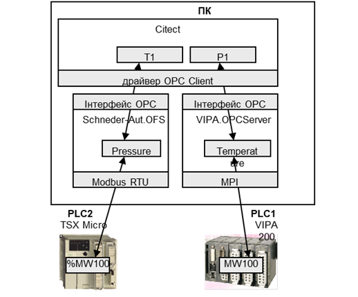
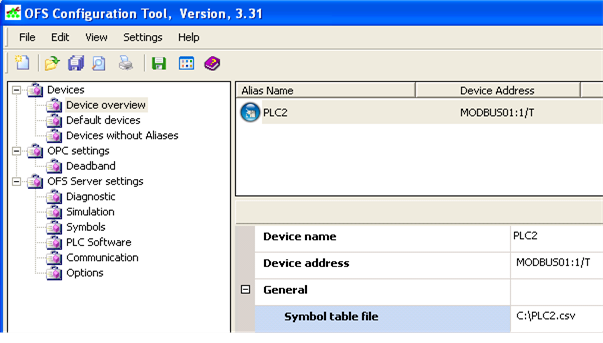
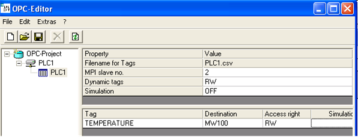
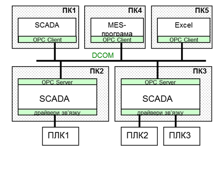
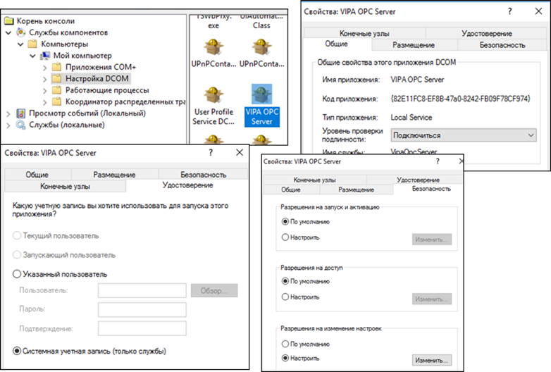

[Головна](README.md) > [4.Підсистема введення/виведення](4.md)

# 4.2. OPC DA

При інтеграції продуктів одного виробника наявність в SCADA-програмі драйверів зв’язку з необхідними контролерами є очевидною. Складнішим є випадок, коли необхідно інтегрувати засоби від декількох виробників, ряд з яких підтримують закриті протоколи. У цій ситуації важко підібрати таку SCADA-програму, яка підтримувала б усі необхідні протоколи промислових мереж. Для подолання цієї проблеми кілька великих компаній вирішила створити стандартний інтерфейс доступу до даних "драйвера" зі сторони програмного забезпечення верхнього рівня. Таким чином, будь-який драйвер зі стандартним інтерфейсом може бути використаний будь-якою SCADA-програмою, яка цей інтерфейс підтримує. Технологія отримала назву ***ОРС***. 

Першу версію стандарту OPC (OPC DA 1.0) розробила група компаній, які в 1996 р. організували некомерційну організацію ***OPC*** ***Foundation*** ([www.opcfoundation.org](http://www.opcfoundation.org/)), що займається розвитком та просуванням цієї технології на ринку. 

Стандарти OPC Foundation існують у наборі декількох специфікацій. Серед них найбільшу популярність на сьогоднішній день мають OPC DA, які стандартизують доступ однієї програми до даних реального часу іншої програми, та OPC UA, які стандартизують доступ до даних і сервісів різного призначення. 

Специфікації ***OPC DA*** (OPC Data Access) ґрунтуються на технологіях, що можуть застосовуватися тільки на програмних платформах Windows і мають ряд суттєвих обмежень. Абревіатура OPC на момент створення стандартів розшифровувалася як "OLE for Process Control", що означало використання стандартів OLE (Object Linking and Embedding), яка, по суті, представляла COM (Component Object Model), для керування технологічними процесами. Тепер використання технологій COM не рекомендується, особливо для розподілених застосунків, тому технологія OPC DA, очевидно, з часом не буде використовуватися. Тим не менше, зараз вона досить популярна. 

Специфікації ***OPC UA*** (OPC Unified Architecture) є більш сучасними. Вони гуртуються на обміні різноманітними даними (реального часу, історичними, тривогами), використовуючи відкриті протоколи на базі XML та інших WEB-технологій. Відхід від технологій COM відобразився і в абревіатурі, яка звучить як "Open Platform Communications". Технологія OPC UA є більш універсальною і може бути використана для взаємодії між програмними елементами, які виконуються на різних платформах. Крім того, специфікації OPC UA стандартизовані в IEC 62541. Принципи роботи OPC UA описано в наступному підрозділі, в цьому розглядаються OPC DA.

Слід сказати, що, крім OPC DA, старі специфікації OPC (що ґрунтуються на технології COM) включали ряд інших:

- OPC DA 1.0, 2.0, 3.0 (Data Access) – три версії специфікацій доступу до даних реального часу;

- OPC AE (Alarms & Events) – для реалізації завдань тривожної сигналізації та подій;

- OPC HDA (Historical Data Access) – для реалізації завдань ведення архіву та доступу до архівних даних;

- OPC DX (Data eXchange) – для безпосереднього обміну між ОРС-серверами;

- OPC XML – для обміну даними через пов’язані мережі за допомогою структур XML на базі WEB-сервісів та SOAP;

- OPC Batсh – для реалізації керування рецептурними завданнями.

## 4.2.1. Загальні принципи використання OPC DA

У загальному випадку, технологія ОРС забезпечує одній програмі (ОРС-клієнту) доступ до даних процесу іншої програми (ОРС-сервера) через стандартний набір інтерфейсів. Найбільш часто ОРС-технологія використовується як універсальний інтерфейс до драйверів контролерів та периферійних пристроїв. Тобто разом з контролером, або за окремим замовленням, може поставлятися спеціальна програма - ОРС-сервер, яка надає стандартизований доступ до змінних цього типу контролеру. Тобто ОРС-сервер, з одного боку, має драйвери для зв’язку з контролерами за конкретними протоколами промислових мереж, а з іншого – надає універсальний ОРС-інтерфейс для зв’язку із сервером SCADA-програми. У такій системі SCADA-програма буде ОРС-клієнтом. 

На рис. 4.21 показано спрощену схему функціонування роботи ОРС-технології в контексті описаної системи.

База даних реального часу SCADA-програми (з умовною назвою "SamplSCADA") збирає дані з чотирьох джерел: ПЛК1, ПЛК2, ПЛК3 та ПЛК4. Для перших двох контролерів для збирання даних використовуються драйвери зв’язку для цих ПЛК, вірніше – для протоколів промислових мереж, по яких вони з’єднуються. Дані зчитуються (або записуються) з ПЛК в БДРЧ. Зв’язок з ПЛК3 та ПЛК4 виконується через ОРС-сервери з умовними назвами відповідно "Sampl.OPC" та "Exmpl.OPC" з використанням драйвера ОРС-клієнт. Тобто ОРС-сервери через вбудовані драйвери зчитують дані з ПЛК та зберігають їх у своїй базі даних реального часу. SCADA-програма, в свою чергу, зчитує дані з ОРС-серверів. Запис даних відбувається аналогічно.

                               

 *Рис. 4.21.* Функціонування ОРС з точки зору інтегратора

Таким чином, для реалізації такого зв’язку в SCADA-програмі користувач повинен: 

1) Налаштувати OPC-сервер за допомогою спеціалізованої програми-конфігуратора, що поставляється разом з ним: створити всі необхідні змінні серверу, тобто дати їм ім’я (ItemID) та вказати джерела даних в ПЛК, на які вони посилаються. 

2) У SCADA-програмі вказати:

- назву ОРС-сервера, з яким необхідно зв’язатися (ProgID); у наведеному прикладі це будуть два сервери – "Sampl.OPC" та "Exmpl.OPC"; інколи SCADA надає можливість вибору ProgID зі списку зареєстрованих ОРС-серверів; 

- для вибраної змінної в якості джерела даних вказати ім’я на ОРС-сервері, тобто ItemID, що був створений на 1-му кроці; як правило ItemID вибирається зі списку, який надає Browser на стороні ОРС-клієнта. 

## 4.2.2. Принципи функціонування OPC DA

Технологія ОРС DA ґрунтується на клієнт-серверній архітектурі. ОРС-клієнт користується послугами ОРС-сервера, використовуючи СОМ-інтерфейси його об’єктів. У наведеному на рис. 4.22 прикладі *ОРС-клієнтом* є SCADA-програма, завданням якої є відображення чотирьох змінних (%MW100-%MW103), які знаходяться на ПЛК. OPC-сервер отримує необхідні дані через драйвери зв’язку і зберігає їх у своїй базі даних реального часу. Для того щоб доступитися до даних ОРС-сервера, ОРС-клієнт створює для себе ОРС-Group (Group1, Group2), в яких створює ОРС Item (Item1, Item2), що посилаються на ці дані.
<a href="media4/4_22.png" target="_blank"></a> 

*Рис. 4.22.* Модель сервера та адресний простір OPC DA

***ОРС-клієнт* (*OPC Client*)** – прикладна програма, яка вміє користуватися об’єктами OPC-сервера за допомогою ОРС-інтерфейсів (підмножина 
 СОМ-інтерфейсів). ***ОРС-сервер* (*OPC Server*)** – прикладна програма, яка надає доступ до визначених у специфікації ОРС СОМ-об’єктів за допомогою 
 ОРС-інтерфейсів.

 З одним ОРС-сервером можуть з’єднатися декілька ОРС-клієнтів. З іншого боку, одна й та сама програма ОРС-клієнт може одночасно користуватися послугами декількох ОРС-серверів. Тобто технологія ОРС є мультиклієнтною і мультисерверною. 

Оскільки ОРС-сервер – це СОМ-сервер, він реєструється на комп’ютері унікальним числовим ідентифікатором (GUID) та має строковий програмний ідентифікатор (***ProgID***). Тобто для того щоб для ОРС-клієнта означити, з яким ОРС-сервером на тому самому ПК йому необхідно з’єднатися, достатньо вказати його ProgID. 

Об’єкт ***ОРС-Item*** надає доступ до джерела даних (надалі – ***тег***) в межах ОРС-сервера, яке ідентифікується унікальним у межах сервера ідентифікатором ***ItemID***. Тому при створенні ОРС-Item’а вказується ItemID необхідного тега. Правила ідентифікації даних залежать від реалізації ОРС-сервера, а механізм означення їх джерел (наприклад, адреса пристрою та змінної в ПЛК) найчастіше реалізується в конфігураторі цього сервера. 

Увесь список ItemID може мати плоску або деревовидну ієрархічну структуру, завдяки чому зручніше використовувати цей механізм у проектах з великою кількістю даних. Для навігації по списку/дереву ідентифікаторів ОРС-сервер, як правило, має об’єкт ***OPC*** ***Browser***. 

ОРС-Item належить клієнту, який його створив, і тому його не можуть використовувати декілька клієнтів. Тим не менше, є можливість посилатися на одні й ті самі дані. На рис. 4.22 два клієнти одночасно використовують дані з %MW100 та %MW102, однак створюють для цього різні OPC-Item. Джерелом даних не обов’язково є змінна на зовнішньому пристрої, це можуть бути внутрішні дані самого сервера. 

З кожним ОРС-Item'ом асоціюється плинне значення (***Value***), відмітка часу (***Time Stamp***) та якість (***Quality***). Таким чином, OPC-сервер не тільки повідомляє про значення змінної, а й указує на їхню свіжість та достовірність. 

***OPC-Group*** – об’єкт ОРС-сервера, який призначений для виконання групових операцій над ОРС-Item’ами. Оскільки ОРС-Item не може існувати без цього об’єкта, спочатку ОРС-клієнт створює ОРС-Group, а потім у його межах створює ОРС-Item’и.          

В інтерфейсі OPC DA 2.0 кожний ОРС-Group, як і все його наповнення, належить окремому ОРС-клієнту. Механізм групування дає змогу розділяти дані за принципом читання/записування, періодичністю операцій та активувати/деактивувати відновлення змінних. Розробнику SCADA/HMI не обов’язково розуміти деталі читання та записування. Тим не менше ці знання можуть знадобитися при тонкому налагодженні та боротьбі з несправностями, тому пояснимо механізми читання та записування в OPC DA.  

Операції читання та записування проводиться одночасно для всіх Item'ів у межах ОРС-Group. Читання зводиться до вирішення таких питань:

- коли на ОРС-сервері повинні відновлюватися дані з пристроїв для кожного з ОРС-Item'ів;

- яким чином про відновлення даних дізнається ОРС-клієнт і як він їх отримає.

При синхронному читанні (Sync Read) ініціація процесу відновлення змінних на ОРС-сервері проводиться самим ОРС-клієнтом: ОРС-клієнт робить запит на відновлення певної ОРС-Group. У такому випадку клієнт може заморозити виконання своєї програми (потоку), поки не дочекається результату читання від ОРС-сервера. На рис. 4.23 графічно зображено процес обміну між ОРС-клієнтом та ОРС-сервером. За необхідності клієнт робить запит за допомогою виклику методу SyncRead для OPC-Group "myGroup" та чекає, поки той не поверне відповідь.

Механізм синхронного читання гальмує роботу програми (потоку) клієнта, тому доречний для читання невеликих об’ємів даних. Альтернативою йому може бути використання асинхронного читання (Async Read), при якому ОРС-клієнт теж ініціює обмін, однак не чекає результату оброблення. Замість цього при закінченні процесу читання ОРС-сервер викликає функцію зворотного виклику ОРС-клієнта (обробник події AsyncReadComplete), в яку передає результат читання. Для реалізації цього механізму необхідно, щоб в об’єкті OPC-Group був активований механізм підписування (Subscript). 
<a href="media4/4_23.png" target="_blank"></a> 

*Рис. 4.23.* Механізми читання та записування даних процесу

За необхідності відновлення даних обидва наведених способи потребують від ОРС-клієнта кожного разу проводити запит до ОРС-серверу. Однак, як правило, дані необхідно читати періодично через певні інтервали часу. Для цього в специфікаціях OPC DA є механізм Періодичного Читання з Оповіщенням (Periodical Read with Notify). При створенні ОРС-Group клієнт замовляє частоту відновлення Item'ів в межах цієї групи. Через зазнчені проміжки часу ОРС-сервер відновлюватиме ці дані, а результат буде зберігати в кеші (Cache). Якщо дані (Value або Quality) хоча б для одного ОРС-Item'а в OPC-Group змінилися, то буде викликана функція зворотного виклику Оповіщення (Notify), тобто обробник події DataChange, у параметрах виклику якого будуть передані нові значення. Для ефективного використання цього механізму можна скористатися зоною нечутливості (Deadband). Слід зазначити, що в об’єкті OPC-Group повинен бути активований механізм підписування та прапорець активності (ACTIVE FLAG). Крім того, періодично відновлюватись будуть тільки активні OPC-Item.      

Операції записування можуть проводитися двома способами: синхронне записування (Sync Write) та асинхронне записування (Async Write). Функціонування повністю аналогічне, як і в операціях читання.

## 4.2.3. Приклад налаштування в SCADA Citect

Розглянемо конфігурування OPC на прикладі SCADA Citect та 2-х ОРС-серверів (Schneider-Aut.OFS, VIPA.OPC-Server). Необхідно в SCADA Citect зчитувати такі змінні (рис. 4.24):

- MW100, що відповідає за температуру з PLC1(VIPA200) по протоколу MPI;

- %MW100, що відповідає за тиск з PLC2 (TSX Micro) по протоколу Modbus RTU.

Для зв’язку з контролерами використовуються ОРС-сервери:

- OFS  від Шнейдер Електрик (ProgID=Schneider-Aut.OFS), що підтримує ряд протоколів, зокрема Modbus RTU;

- VIPA OPC-Server від фірми VIPA (ProgID=VIPA.OPCServer), що підтримує протокол MPI. 

Відповідно до рис. 4.24, на OFS-Cервері необхідно створити змінну з назвою "Pressure", джерелом даних для якої буде змінна %MW100 на PLC2, а на VIPA.OPCServer – змінну з назвою Temperature, джерелом даних для якої буде зміна MW100 на PLC1.

Для конфігурування сервера OFS використовується утиліта OFS Configuration Tool.

 

*Рис .4.24.* Схема обміну даним SCADA Citect з використанням ОРС

Дані означуються так (рис .4.25):

- створюється псевдонім, що буде вказувати на адресу конкретного пристрою, з яким може обмінюватись ОРС-сервер; у нашому випадку псевдонім пристрою має ім’я PLC2;

- для створеного псевдоніму вказується драйвер зв’язку, адреса пристрою та додаткові параметри, що уточнюють місцезнаходження його в мережі; в нашому випадку в результаті конфігурування створиться адреса: MODBUS01:1/T;

- для створеного псевдоніму пристрою вказати файл, в якому будуть знаходитись символьні імена та відповідні їм змінні контролера; у нашому випадку вибраний файл PLC2.CSV, в якому сформований запис:

```
%MW100 <символ_табуляції> PRESSURE
```

 

*Рис. 4.25.* Конфігурування ОFS

Відповідно до правил іменування змінних в OFS, ідентифікатор потрібної змінної буде формуватися так: 

```
ItemID = Ім’я_псевдоніму_пристрою!Ім’я_змінної
```

У нашому випадку ідентифікатор змінної буде 

```
PLC2!PRESSURE
```

Конфігурування VIPA OPC-Server виконується з використанням утиліти OPC Editor. Аналогічно OFS, на сервері створюються пристрої, в межах яких означуються змінні, однак їх порядок і форма дещо відрізняються (рис. 4.26).

 

*Рис. 4.26.* Конфігурування VIPA-OPC

Спочатку вибирається драйвер мережі (в нашому випадку MPI). У межах мережі створюється PLC (у нашому випадку PLC1), а в межах пристрою вказується назва змінної (Tag) та її адреса в ПЛК (TEMPERATURE - MW100) Відповідно до правил іменування змінних в VIPA OPC ідентифікатор змінної буде формуватися так: 

```
ItemID = Ім’я_PLC/Ім’я_змінної
```

У нашому випадку ідентифікатор змінної буде: `PLC1/TEMPERATURE `

Усі змінні в Citect (VariableTag) створюються в межах пристроїв введення/виведення (IODevices), які по своїй суті є програмними, а не апаратними. Тому необхідно створити два IODEvices, які будуть відповідати за ОРС сервери. Для створення IODevices можна скористатися Express Communication Wizard (рис. 4.27). В обох випадках вибирається драйвер ОРС DA Client. У полях Address вказується ім’я ОРС-серверів, тобто їх ProgID.
<a href="media4/4_27.png" target="_blank"></a> 

*Рис. 4.27*. Створення в Citect IODevices, прив’язаних до OPC-серверів

Потім необхідно створити змінні (рис. 4.28) з прив’язкою до створених IODevices, і в полі адреси вказати відповідні ItemID. 

 

*Рис. 4.28*. Створення в Citect Variable Tags

SCADA Citect підтримує механізми імпорту та лінкінгу тегів з OPC Item ID. 

## 4.2.4. Приклад налаштування в SCADA zenon

Розглянемо з’єднання SCADA zenon з OPC Server VIPA за тих самих налаштувань серверу. У SCADA zenon для з’єднання через OPC DA є спеціальний драйвер "OPC Client V2-0". У налаштуванні драйвера вибирається OPC Server та спосіб ідентифікації змінних (рис. 4.29). 

 

*Рис. 4.29.* Налаштування з’єднання драйвера з OPC Client V2-0 з сервером OPC

Розробник проекту може вибрати різний спосіб ідентифікації змінних, зокрема через зазначення адреси в параметрах змінної чи через назву змінної або символьну адресу. Якщо опція "Identification with variable Name" не виставлена, необхідні в проекті змінні вибираються у вкладці Browser (рис. 4.30), в список клієнтського адресного простору (Client address space). Далі в налаштуваннях змінної на вибраний Item посилаються через зміщення (offset), яке вказується відповідно до однойменного поля з клієнтського адресного простору. Недоліком такого підходу є постійне формування і редагування клієнтського адресного простору і можлива зміна зміщення. Тому в zenon є механізм символьної адресації OPC Item через:  

- Variable Name – ім’я змінної zenon повинно відповідати OPC Item ID;

- Variable identification – ідентифікатор змінної zenon повинен відповідати OPC Item ID; 

- Symbolic address – поле Symbolic address у змінній zenon повинен відповідати OPC Item ID (див. рис. 4.30).

Для спрощення створення змінних zenon підтримує механізми імпорту (див. рис. 4.30)
<a href="media4/4_30.png" target="_blank"></a> 

*Рис. 4.30.* Налаштування змінних в zenon для прив’язки до OPC Item 

## 4.2.5. OPC DA в мережних архітектурах

ОРС-клієнт та ОРС-сервер на одному й тому самому ПК запускаються як окремі процеси. Обмін даними між цими процесами відбувається за правилами СОМ-технології. У мережних архітектурах може виникати необхідність з’єднати ОРС-клієнта з віддаленим ОРС-сервером, який знаходиться в мережі на іншому ПК. Для такого з’єднання використовуються сервіси DCOM.

На рис. 4.31 наведено приклад, у якому ОРС-клієнт (SCADA) на ПК1 з’єднується з локальним ОРС-сервером (OPCServer1) та двома віддаленими (OPCServer2 на ПК2 та OPCServer3 на ПК3). Для реалізації такого з’єднання для ОРС-клієнта, окрім ProgID, необхідно вказати розміщення ПК з ОРС-сервером, а також правильно налаштувати DCOM-конфігуратор. Таким чином, необхідно виконати таку послідовність:

1) налаштувати DCOM Конфігуратор на вузлі сервера та клієнта;

2) вказати Server Node (Ім’я вузла з ОРС-сервером) або його IP;

3) вказати ProgID сервера. 

Для захисту доступу до об’єктів COM-класів у Windows використовується так званий декларативний захист. Механізм активізації і контролю доступу ґрунтуються на механізмі ролей. Для кожного зареєстрованого класу записи в реєстрі визначають, які користувачі Windows або групи користувачів мають право створювати екземпляри певного класу, тобто об’єкти. Користувачі визначаються при аутентифікації, тобто при їх перевірці, наприклад введенні паролю при вході в Windows. DCOM підтримує декілька рівнів автентифікації:

- без автентифікації; 

- при першому з’єднанні з сервером;

- при кожному зверненні;

- усіх пакетів даних;

- пакетів даних з перевіркою їх цілісності;

- пакетів даних з перевіркою їх цілісності і шифрування пакетів даних. 

Однак зв’язатися з віддаленим ОРС за допомогою ОРС DA можливо тільки у випадку, якщо вузли знаходяться в межах одного домену або робочої групи Windows та не розмежовуються брандмауерами. Останні можуть не пропустити пакети СОМ (порти RPC, як правило, закриті для доступу), тому для з’єднання через Інтернет необхідно вдаватися до певних прийомів. Щоб вирішити цю проблему, OPC Foundation пропонує технології OPC XML та OPC UA.

 

*Рис. 4.31.* Робота з віддаленим сервером ОРС 

У прикладах, наведених вище, розглянуто технологію ОРС-DA в контексті вирішення проблеми доступу до даних ПЛК зі SCADA. Тобто ОРС-сервер розглядався як стандартний драйвер зв’язку. Однак область застосування ОРС цим не обмежується. На рис. 4.32 показано приклад використання інтерфейсів ОРС як „мосту” між двома прикладними програмами на різних ПК. При горизонтальній інтеграції може знадобитися об’єднання в єдиний інформаційний простір SCADA-програм. Популярність ОРС-технології призвела до появи в останніх не тільки клієнтської сторони ОРС, а й серверної. Тобто SCADA може виступати як ОРС-клієнтом, так і ОРС-сервером.

Існування в SCADA серверного інтерфейсу OPC дає можливість доступитись до її даних зі сторони прикладних програм рівня MES чи ERP. Офісні програми завдяки наявності VBA та ActiveX теж надають таку можливість. Наявність в SCADA OPC UA сервера збільшує можливості інтеграції.  У OPC UA розроблено шлях міграції для клієнтів і серверів OPC, що базуються на технології Microsoft COM (наприклад OPC DA). При розробленні OPC UA було зроблено певні кроки для того, щоб існуючі дані, які виставлялися на серверах OPC COM (DA, HDA та A&E), могли бути легко відображені та розкриті через OPC UA. Постачальники можуть вибирати міграцію своїх продуктів на OPC UA або використовувати обгортки для перетворення з OPC COM в OPC UA, і навпаки. Кожна з попередніх специфікацій OPC визначила власну модель адресного простору та власний набір послуг. OPC UA об'єднує попередні моделі в єдиний інтегрований адресний простір з єдиним набором сервісів.

 

*Рис. 4.32*. Приклад використання ОРС як „мосту”

## 4.2.6. Налагодження та боротьба з несправностями 

   Аналогічно, як з Modbus, для пошуку причин проблем та їх вирішення необхідно мати набір корисних утиліт. Як мінімум, бажано мати як "еталонний" OPC Client так і OPC Server. В Інтернеті доступно багато безкоштовних утиліт Наприклад в якості тестового OPC Server можна скористатися "Gray Simulator" [[10](http://www.gray-box.net/download_graysim.php)], а клієнта – "dOPC Explorer" [[11](https://www.kassl.de/opc/download.shtml)]. 

   Як правило, від постачальника в комплекті з пакетами OPC серверів йдуть тестові OPC клієнти. Наприклад, з ОРС сервером "OFS" від Schneider Electric в комплекті постачається безкоштовний "OFS Client", який є OPC DA клієнтом, що має досить зручний інтерфейс і можливості. А в комплекті "SIMATIC NET OPC Server" від Siemens AG постачається "OPC Scout".

Якщо в розробника немає досвіду роботи з конкретними OPC серверами, то з’єднання і особливості роботи можна спочатку перевірити на "еталонному" OPC Client. І навпаки, якщо немає досвіду роботи з клієнтським налаштуванням обраної SCADA/HMI, можна перевірити його на "еталонному" OPC -сервері.

Типова проблема, з якою зустрічаються розробники проекту,  – це відображення даних на SCADA/HMI як недостовірних/недоступних. Спочатку треба перевірити, де саме виникає проблема доступу до даних. Є кілька варіантів:

- відсутній зв'язок між ОРС-клієнтом та ОРС-сервером; 

- відсутній зв'язок між ОРС-сервером та джерелом даних. 

Для перевірки наявності зв’язку з джерелом даних необхідно підключитися до OPC-сервера "еталонним" клієнтом. Якщо зв'язок із джерелом даних нормальний, треба вирішувати проблеми зв’язку між ОРС-клієнтом та ОРС-сервером. 

На зв'язок між ОРС-клієнтом та ОРС-сервером сильно впливають налаштування конфігуратора DCOM. Для настройки захисту у Windows є спеціальна утиліта Dcomcnfg.exe, яка запускається з командного рядка. Якщо при підключенні випадає помилка на кшталт “Access denied”, то, ймовірніше за все, неправильно налаштовані дозволи використання. У "Служби компонентів" у розділі налаштування вибирається властивість конкретного OPC-Server і вказуються потрібні дозволи. На рис. 4.33 показано зовнішній вигляд вікон налаштувань, але правильні налаштування вибираються виходячи з конкретної ситуації. 
<a href="media4/4_33.png" target="_blank"></a> 

*Рис. 4.33.* Зовнішній вигляд налаштування DCOM для ОРС-сервера

Для роботи в мережі необхідно зробити ряд налаштувань DCOM. Зокрема:

1) налаштувати вбудовані брандмауери та антивіруси, щоб вони допускали вхідне з’єднання на ПК з ОРС-сервером та ОРС-клієнтам по RPC-портам;  

2) для роботи сервісів DСОМ необхідно запустити та перевести в автоматичний запуск наступні служби:

- запуск серверних процесів DCOM;

- локатор віддаленого виклику процедур (RPC);

- віддалений виклик процедур (RPC);

3) необхідно правильно задати конфігурацію DCOM; 

4) необхідно правильно налаштувати параметри безпеки у Windows. 

Налаштування зв’язку з віддаленим OPC-сервером потребує хороших знань системного адміністратора. При неправильному налаштуванні зв'язок може запрацювати, але з точки зору кібербезпеки комп’ютер може стати вразливим до кібератак. Допомогти у вирішенні цієї проблеми можуть так звані тунелі OPC (наприклад у Matrikon – "matrikon opc tunneller"), як можуть допомогти обійти незручності налаштувань DCOM.

Серед відомих проблем несумісності є також інтерпретація клієнтом символів у рядку OPC Item ID. Наприклад символ "!", який користується “OPC Factory Server” Schneider Electric для розділення назви пристрою та адреси, у SCADA Citect колись інтерпретувався як розділювач для масиву.   

[<-- 4.1. MODBUS](4_1.md)

[--> 4.3. OPC UA](4_3.md)