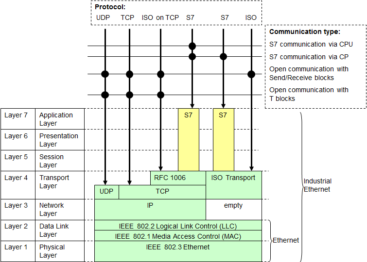
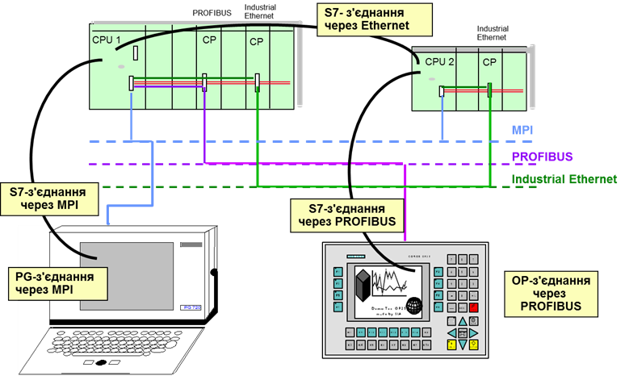
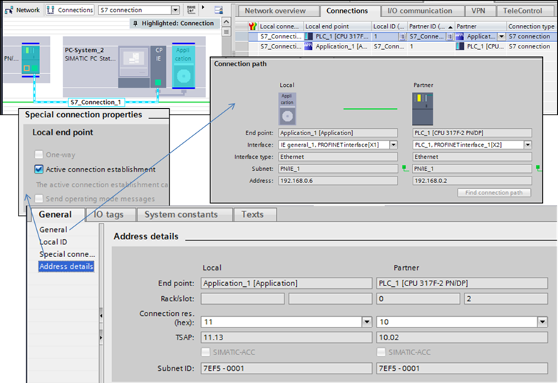

[Головна](README.md) > [4.Підсистема введення/виведення](4.md)

# 4.4. Протокол Simatic S7 

Поряд з відкритими протоколами промислових мереж ПЛК серії Simatic S7 (S7-300, S7-400, S7-1200 та S7-1500) підтримують пропрієтарний протокол S7, який надає різноманітні можливості з обміну даними, конфігруванню та програмуванню цих контролерів. Протокол S7 функціонує поверх мереж MPI, Profibus та Industrial Ethernet. Враховуючи велику популярність використання Siemens в Україні, доцільно розглянути цей протокол у контексті обміну SCADA/HMI. 

На рис. 4.67 показано стек протоколів, які підтримуються ПЛК Simatic поверх Industrial Ethernet, за винятком стека Profinet. У цьому випадку він може функціонувати поверх TCP (з прошарком RFC 1006) або поверх ISO Transport.   

Для засобів SCADA/HMI може підтримуватися ряд сервісів протоколу S7, які наведені в табл. 4.7.
<a href="media4/4_67.png" target="_blank"></a>          

*Рис. 4.67.* Протоколи прикладного рівня в Industrial Ethernet для ПЛК Simatic 

*Таблиця 4.7.* 

**Типи сервісів, що надаються протоколом** **S7**

| **Типи  сервісів**                | **Призначення  сервісів**                                    |
| --------------------------------- | ------------------------------------------------------------ |
| Інформаційні                      | Інформація про статус з'єднання.  Відображення статусу пристрою та користувача партнера по зв’язку. |
| Роботи зі змінними                | Функції для читання та записування  типу запит-відповідь однієї чи декількох змінних.  -   Data blocks (DB);  -   Instance data blocks (DB);  -   Inputs/outputs (I/Q);  -   Peripheral inputs/outputs (PI/PQ);  -   Memory bits/words (M);  -   Timers (T);  -   Counters (C); |
| Обмін через буфери (блоки  даних) | Програмно керована передача  великих блоків даних    (до 64 кбайт). Потребує конфігурованого з’єднання на боці  обох партнерів (SCADA/HMI і/або ПЛК). Один із  партнерів відправляє блок даних, інший – приймає. Можливий також обмін між SCADA/HMI.  Відображення буфера може відбуватися на  будь-які структури змінних (реалізація через OPC Simatic) |
| Керування програмними  блоками | Ці сервіси дають змогу  завантажувати, вивантажувати, видаляти та зв'язувати програмні блоки в ПЛК  під час роботи. Завдяки цьому можна динамічно змінювати послідовності та  параметри програми. Доступні блоки: OB, FB, FC, DB, SDB. Після завантаження  блоків у ПЛК вони стають активними тільки за умови їх зв’язування зі списком  активних блоків |
| Робота з подіями та  тривогами | Ці сервіси використовуються  для отримання та оброблення повідомлень від програмованих контролерів SIMATIC  S7, наприклад тривог. Тривоги зберігаються в буфері, який зчитується SCADA/HMI |
| безпеки                        | Контроль доступу шляхом  установлення паролів для об’єктів даних SIMATIC S7. Це дає змогу робити  захищені з’єднання та керувати доступом до них |
| серверні                       | Станція ПК стає сервером S7  і надає блок даних (до 64 кбайт), який  можна читати і записувати як локально, так і віддалено (PUT/GET). Значення  даних у блоках зберігаються навіть при виключеному ПК. Клієнтом може бути як  ПЛК, так і інший ПК (інша SCADA/HMI) |

Усі наведені вище сервіси доступні тільки в програмних засобах Siemens, зокрема комунікаційних бібліотеках Simatic NET (драйвери, OPC-сервери та ін.). У підсистемах введення/виведення SCADA/HMI інших виробників, як правило, доступні тільки сервіси роботи зі змінними.

Для обміну даними можна використовувати сервіси роботи зі змінними, обмін через буфери або серверні функції. Класичними є сервіси роботи зі змінними, де SCADA/HMI циклічно опитує потрібні змінні за принципом клієнт-сервер. При розподілі даних по пам’яті це створює велике навантаження на мережу, оскільки для кожного невеликого блока треба робити окремі запити на читання. Ця проблема аналогічна тій, яка описана для Modbus у параграфі 4.1.5. 

Альтернативою обміну типу запит-відповідь може бути обмін даними через буфери, при якому дані можуть відправлятися за необхідності. Цей обмін повинен бути запрограмований в ПЛК. Іншим альтернативним варіантом є використання серверних сервісів, тобто ПК (SCADA/HMI) надає дані для читання/записування іншому клієнту. Іншим клієнтом може бути ПЛК, в якому необхідно реалізовувати програму з використанням функцій GET/PUT, або інший ПК із сервісом обміну даними через буфер.  

Обмін по протоколу S7 ґрунтується на встановленні ***S7-з’єднання*** (**S7** ***connection***). Один із партнерів зв’язку є активним учасником, який установлює з’єднання, інший – пасивним, який підтверджує це з’єднання. На рис. 4.68 показано кілька варіантів організації S7-з’єднання, серед них окремо виділяються PG-з’єднання, що передбачають підключення програматора, та OP – для підключення SCADA/HMI (HMI Connection). Позиціонування в різних типах документації PG/OP як окремого типу S7-з’єднання пов’язано з їх особливістю, що описана далі.   

 

*Рис. 4.68.* Різні S7-з’єднання 

S7-комунікації поділяються на два типи: конфігуровані та неконфігуровані. Конфігуровані зв’язки конфігуруються в середовищах розроблення (NetPro в Step7, або TIA Portal). У цьому випадку при роботі партнерів вони створюють з’єднання і розривають його тільки при відключенні одного з них. Неконфігуровані з’єднання не потребують налаштування. На одному з партнерів є наперед визначені ресурси, які можна використовувати за необхідності. Такими ресурсами для ПЛК є ресурси з’єднання PG/OP, які використовуються тільки за необхідності. У цьому випадку з’єднання створюються та розриваються в разі потреби.

З’єднання передбачає виділення ***ресурсів з’єднання*** (***connection resource***), які можна представити як певні структури, які відповідають за з’єднання. Ресурси для ПЛК обмежені, що треба враховувати при проектуванні. Ресурси є як на комунікаційному модулі, так і на процесорному. Враховуючи, що комунікаційний модуль (CP) є посередником, при встановленні S7-з’єднання резервується як ресурс цього модуля так і процесора.

Кожен ресурс має свою адресу – точку доступу транспортного сервісу (***TSAP*** – Transport Service Access Point). Структура TSAP залежить від типу пристрою. Для S7-300 та S7-400 використовується пара значень:

```
xx.yz
```

де xx - номер ресурсу з’єднання; y - номер шасі; z – номер слота

Номер шасі та слота вказує на розміщення ресурсу. При зв’язку з ПЛК – це розміщення CPU. Для серверних ресурсів S7-300 це завжди буде 02, для S7-1200/1500 – 01. 

Номер ресурсу з’єднання вказує на затребуваний ресурс на модулі (табл. 4.8). 

*Таблиця 4.8.* 

**Номери ресурсів з’єднання для протоколу S7**

| **Номер ресурсу  з’єднання** | **Тип**                                                      | **Призначення**                                              |
| ---------------------------- | ------------------------------------------------------------ | ------------------------------------------------------------ |
| 0x01  ("PG")                 | Підключення пристрою програмування  вільне з’єднання (неконфігуроване  серверне) | Як мінімум, один ресурс в CPU зарезервовано для  підключення програматора. Для деяких CPU може бути доступно кілька ресурсів |
| 0x02 ("OP")                  | Підключення HMI вільне з’єднання (неконфігуроване серверне)  | Як мінімум, один ресурс в CPU зарезервовано для  підключення OP. Для деяких CPU може бути  доступно кілька ресурсів |
| 0x03 (інше)                  | Вільне з’єднання (конфігуроване з одного боку, one-way)      | Цей ресурс може обслуговувати кілька з’єднань. З’єднання  конфігурується з боку активного підключення із зазначенням неозначеного (unspecified) партнера. Це значить, що з’єднання відбуватиметься  з партнером по TSAP=03 |
| 0x10…0xDF                    | Конфігуроване з’єднання                                      | Кожен із цих ресурсів може підтримувати тільки одне  з’єднання. Конфігурується з кожного боку як зв'язок з неозначеним партнером (unspecified).  При виборі опції one-way з боку активного з’єднання зв'язок відбуватиметься з  ресурсом 03. В інших випадках вказується інше значення |

 Таким чином для конфігурованого з’єднання між S7-1500 CPU та S7-300/400 CPU будуть такі налаштування:

- для S7-1500 CPU (rack 0, slot 1, connection resource 10) TSAP = 10.01;

- для S7-300/400 CPU (rack 0, slot 2, connection resource 11) TSAP = 11.02.       

Для з’єднання OP адреса TSAP для джерела даних буде:

- для S7-1500/1200 CPU (rack 0, slot 1, connection resource 02) TSAP = 02.01;

- для S7-300/400 CPU (rack 0, slot 2, connection resource 02) TSAP = 02.01.

Для контролерів S7-1500/1200 (>=V2.0) доступні з’єднання, що підтримують звернення за символьною адресацією змінних. Такі з’єднання називаються SIMATIC-ACC (SIMATIC Application Controlled Communication). Для них встановлено такий формат TSAP:

"SIMATIC-ACC"<nnn><mm>,

де nnn – Local ID; mm – будь-яке значення.

Наприклад, для конфігурування з’єднання між двома S7-1500 CPUs:

- S7-1500 CPU з local ID 200: TSAP=SIMATIC-ACC20001;

- S7-1500 CPU з local ID 3B2: TSAP=SIMATIC-ACC3B201.

При доступі зі SCADA/HMI в символьному режимі можуть використовуватися інші драйвери, ніж для класичних S7, тим не менше конфігурування ACC-з’єднань не потребується.  

Конфігуровані з’єднання робляться через конфігураційні утиліти, зокрема через NetPro, який входить до комплекту класичного SIMATIC STEP 7, або через налаштування TIA Portal. Наприклад, створення з’єднання в TIA Portal проводиться в розділі Devices & Networks (рис. 4.69), де спочатку вказується тип – “S7 connection”, далі з використанням візуального з’єднувача з’єднуються партнери PLC_1 та Application_1. Редактор автоматично налаштовує усі параметри з’єднання за замовчуванням. Кожне з’єднання отримує своє унікальне символьне ім’я. Перелік усіх з’єднань видно на вкладці Connections, вибравши якесь із них можна змінити налаштування.    
<a href="media4/4_69.png" target="_blank"></a> 

*Рис. 4.69.* Налаштування S7-з’єднань 

Для кожного конфігурованого S7-з’єднання вказуються параметри:

- тип з’єднання (вибирається при створенні);

- мережа та партнери з’єднання (вибираються при створенні);

- використовувані інтерфейси; 

- спеціальні параметри;

- точка доступу транспортного сервісу (TSAP).

[<-- 4.3. OPC UA](4_3.md)

[--> 4.5. Протокол MQTT ](4_5.md)