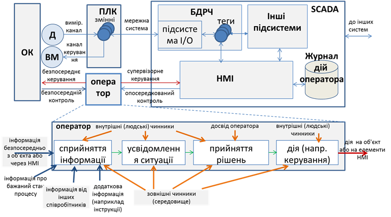
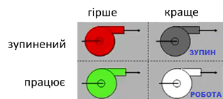
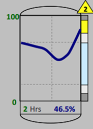
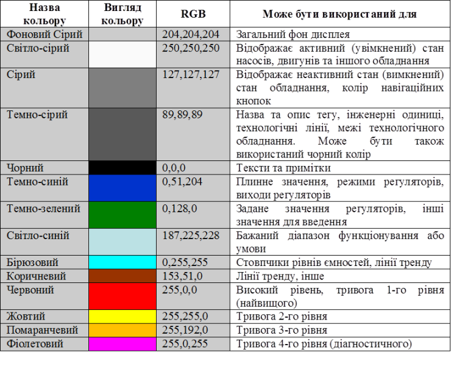
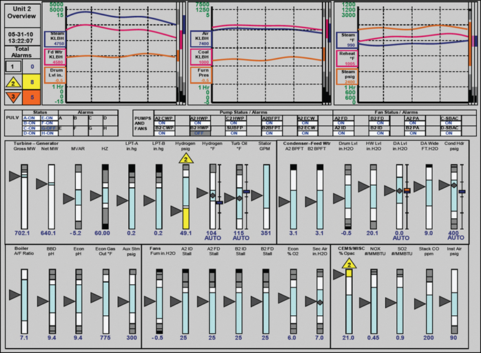
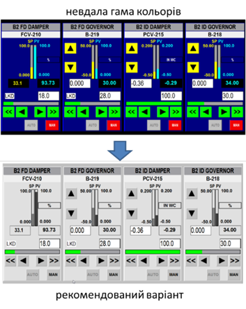

[Головна](README.md) > [5.Людино-машинний інтерфейс](5.md)

# 5.1. Основи побудови ефективних людино-машинних інтерфейсів 

## 5.1.1. Модель контура контролю та керування 

Людина в системах автоматизованого керування відіграє важливу роль у безпечному та ефективному проходженні технологічного процесу. HMI в цьому повинен допомогти в ранньому виявленні, діагностиці та правильному реагуванні на нештатну ситуацію. Тому для розроблення високоефективних людино-машинних інтерфейсів необхідно чітко розуміти усі фактори, що впливають на процеси усвідомлення ситуації людиною, прийняти рішення та реалізувати дії. Щоб отримати інформацію про загальний стан процесу, оператор з надзвичайно великої кількості контрольованих ним сигналів повинен виділити найбільш пріоритетні, на основі чого прийняти й реалізувати правильні рішення.   

Розглянемо контур контролю та ручного/супервізорного керування в системі як комплекс взаємопов’язаних функцій (рис. 5.1). Інформація від об’єкта керування (ОК) проходить ряд перетворень і зрештою замикається на ньому через дію оператора: 

- вимірювання значення даних, які необхідно контролювати з об’єкта керування;

- оброблення даних на пристрої збору (наприклад ПЛК);

- зчитування даних з пристрою збору та їх оброблення  в базі даних реального часу (БДРЧ);

- зчитування даних з бази даних реального часу та їх оброблення в інших підсистемах;

- відображення стану в підсистемі HMI;

- сприйняття оператором інформації; 

- усвідомлення стану оператором (ситуаційна обізнаність) ;

- прийняття рішень оператором;

- реалізація керуючих дій. 

Оператор повинен якнайшвидше зорієнтуватися в ситуації, яка є на даний момент, прийняти рішення і реалізувати керуючу дію. Контроль та дія можуть відбуватися як через засоби супервізорного спостереження та керування (тобто через SCADA/HMI), так і безпосередньо на об’єкті (тобто за допомогою візуального, аудіального, органолептичного і т.п. сприйняття та ручних засобів керування). Дії оператора через SCADA/HMI записуються в журнал. 

 

*Рис. 5.1.* Модель контуру контролю та керування з використанням SCADA/HMI 

Виділені у наведеному вище переліку напівжирним шрифтом процеси стосуються безпосередньо оператора і повинні обов’язково враховуватися при розробленні SCADA/HMI. Враховуючи, що саме оператор є особою, яка приймає рішення та реалізує керування, необхідно розроблювати системи таким чином, щоб максимально сприяти правильності та швидкості прийняття рішень, а також швидкості їх реалізації. Для цього необхідно забезпечити:

1)   отримання даних з об’єкта з необхідною швидкістю (частотою, періодичністю);

2)   отримання інформації про достовірність/доступність даних;

3)   оброблення даних для сприйняття людиною; 

4)   представлення даних на засобах HMI у потрібному контексті;

5)   допомогу в прийнятті рішень;

6)   швидкий доступ до елементів керування;

7)   уникнення помилкових дій.   

При цьому необхідно враховувати внутрішні та зовнішні чинники, а також досвід операторів. Слід зазначити, що розробники SCADA/HMI часто не враховують частини з наведених вище вимог. 

Розроблення високоефективних HMI тісно пов’язане з ергономікою, яка є окремою дисципліною, тому її розгляд виходить за рамки посібника. Окрім вимог до HMI, ергономіка розглядає інші, не менш важливі, а навіть первинні фактори. З питаннями ергономіки в HMI можна ознайомитися у праці Анохіна та Івкіна [2]. Далі розглянемо тільки деякі рекомендації, означені в стандарті ISA-101 [[1](https://www.isa.org/products/ansi-isa-101-01-2015-human-machine-interfaces-for)].

Виділимо три складові, які впливають на ефективність роботи оператора:

1)   правильне усвідомлення ситуації (ситуаційна обізнаність);

2)   правильне прийняття рішень;

3)   достатній час для усвідомлення, прийняття рішень та безпомилкової реалізації керуючої дії

У наступних параграфах розглядаються фактори, що впливають на ситуаційну обізнаність у розроблювальних HMI, а також на взаємодію з користувачем. На правильність прийняття рішень оператором також впливає використання інших підсистем – тривожної сигналізації, трендів, формування допомоги, підтримка прийняття рішень і т. п. Не менш важливими факторами є первинне навчання операторів, періодичні тренінги, аналіз минулих ситуацій і т. п., які є частиною життєвого циклу системи.   

## 5.1.2. Ситуаційна обізнаність 

Як зазначено у стандарті ISA-101  [[1](https://www.isa.org/products/ansi-isa-101-01-2015-human-machine-interfaces-for)], проведення досліджень показали, що недостатня ситуаційна обізнаність була одним із основних факторів нещасних випадків, пов’язаних із помилками людини. Під ***ситуаційною обізнаністю* (**усвідомленням ситуації) розуміють не тільки сприйняття теперішнього стану об’єкта, а й прогнозування на майбутнє. Оператор повинен реагувати на відхилення стану від бажаного, який задається інструкціями, порадами та навіть власним досвідом. При отриманні інформації необхідно враховувати сенсорні можливості та обмеження користувача в її сприйнятті, що зумовлено як його суб’єктивними властивостями, так і зовнішніми обставинами (див. рис. 5.1). На продуктивність користувача та основні когнітивні процеси (здатність розуміти, пізнавати, вивчати, усвідомлювати, сприймати і перероблювати зовнішню інформацію) впливає рівень завантаженості роботи, усвідомлення ситуації та складність завдання, кожен з яких може бути оптимізоване засобами HMI.

Одна з основних ідей побудови високоефективних HMI ґрунтується на тому принципі, що **за нормального функціонування процесу дисплеї повинні проявляти мінімальні сенсорні стимулювання, тобто не привертати до себе уваги**. І навпаки, **коли процес відхиляється від норми, засоби HMI повинні проявляти візуальні та звукові активності**. Для цього можна скористатися кольором, яскравістю та контрастністю елементів, взаємним їх розміщенням, рухом, блиманням чи миготінням, видимістю та звуковими оповіщеннями. Далі розглянемо рекомендації стандарту щодо використання цих властивостей.  

**Використання кольору, яскравості та контрастністю**

   Конструкція HMI повинна враховувати візуальні обмеження групи користувачів у середовищах, де повинні виконуватися завдання, пов'язані з процесом (робоче місце оператора). При виборі засобів HMI, кольорів та контрастів дисплеїв та елементів необхідно враховувати зовнішнє освітлення. У нормальному стані процесу елементи HMI не повинні бути надмірно контрастними, однак за необхідності інформація повинна чітко сприйматися. Під час проектування слід враховувати потенційні недоліки або відсутність сприйняття кольорів операторами. Відмінності в кольоровому сприйнятті для поширених типів колірної сліпоти (дальтонізму) показані на рис. 5.2 [[3](https://uk.wikipedia.org/wiki/%D0%94%D0%B0%D0%BB%D1%8C%D1%82%D0%BE%D0%BD%D1%96%D0%B7%D0%BC)]. 

 

*Рис. 5.2.* Відмінності кольорового сприйняття для найбільш поширених типів дальтонізму

Слід використовувати відповідний диференційний контраст і яскравість. Для всіх користувачів вибрані кольори повинні відрізнятися один від одного і мають бути перевірені на зручність використання. Як правило, колір слід використовувати для підкреслення ключової інформації, такої як тривоги та аномальні умови. Зверніть увагу, що при використанні зеленого та червоного кольорів у якості позначення увімкненого та вимкненого обладнання для більшості людей з дальтонізмом сприймаються практично однаково. Тому для розділення елементів можуть бути використані їх контраст та яскравість, наприклад, білий іде в контрасті з темно-сірим (як відтінок білого). На рис. 5.3 показано приклад використання позначення контрастності та яскравості замість кольору для стану насосів.

 

*Рис. 5.3.* Використання контрастності та яскравості замість кольору 

Корисно перевірити кольорове зображення, перетворивши його на градації сірого, щоб переконатися, що всі комбінації елементів мають достатній контраст, який може виявити користувач з дальтонізмом.

Кольори, які використовуються для індикації тривоги відповідно до методології тривожної сигналізації ISA-18.2 (див. розділ 6), слід резервувати і не використовувати з будь-якою іншою метою. Це необхідно для усунення плутанини та швидкості реакції оператора на тривогу. Тим не менше, на колір не слід покладатися як на єдиний показник важливості умови. Кольорове кодування повинно дублюватися іншими способами подання інформації, включаючи форму, текст, яскравість, розмір і текстуру. На рис. 5.4 для відображення попереджувального рівня, окрім жовтого кольору, використовується поява трикутника із зображенням рівня пріоритету. 

 

*Рис. 5.4.* Використання форми (трикутник) в якості відображення тривоги 2-го пріоритету

Вибір кольорів, які використовуються на дисплеї, повинен відображати важливість поданої інформації: для найбільш важливої інформації слід використовувати найбільш помітні кольори. Градієнти кольорів не повинні використовуватися на дисплеї для статичних або нединамічних елементів, але можуть застосовуватися, щоб виділити динамічний елемент. Колір та/або миготіння символів мають спрямовувати увагу оператора на нові критичні ситуації.

Фон дисплею повинен мати ненасичений або нейтральний колір (наприклад, сірий), щоб обмежити хроматичні спотворення і забезпечити виразність відображеної на ньому інформації. У більшості застосувань слід уникати використання кольорів фону, які можуть викликати надмірний контраст, наприклад, чорного. При цьому колір фону має бути таким, щоб забезпечити прийнятний і достатній контраст в очікуваних умовах освітлення. Комбінації кольорів переднього плану та фону повинні забезпечувати достатній контраст для виділення елементів. У табл. 5.1 наведено приклад вибору призначених кольорів. Таблиця свідомо має задній фон кольору фону дисплею для сприйняття контрастності інших кольорів. На рис. 5.5 наведено приклад використання кольорів. Слід зазначити, що такий перелік кольорів не означений стандартом і наведений тільки як приклад. 

Таблиця 5.1. 

**Приклад вибору призначення кольорів.**

 

 

   *Рис. 5.5.* Використання кольорів на дисплеях 

На рис. 5.6 показано варіанти з різним вибором кольору [[4](http://wilmingtonisa.org/files/Download/ISA-Applying-ISA101-to-Existing-HMIs_MikeHawrylo.pdf)]. Верхній варіант більш яскравий, можливо, навіть більш привабливий, однак він не дасть змоги швидко звернути увагу на аварійний рівень, якщо його підсвітити іншим кольором. 

 

*Рис. 5.6.* Порівняння використання кольорів на дисплеях 

Якщо серед операторів є люди похилого віку, то слід враховувати також вікові недоліки зору. Розміщення та регулювання моніторів має враховувати використання різних лінз, що коригують зір. 

**Щільність**

Слід враховувати можливість сприйняття людиною інформації з дисплеїв при високій щільності (великій кількості елементів на одиниці площі). Необхідно виводити відповідну інформацію, яку оператор може швидко інтерпретувати, уникаючи зайвого. Елементи дисплея мають розташовуватися послідовно в просторі, щоб уникнути захаращення. Для цього проводять: 

- консолідацію (гуртування) різних об’єднаних процесом даних у єдиний інформаційний компонент, що робить меншу щільність на дисплеї;

- використання стилю дисплею (див. підрозділ 5.2), більш ефективного для інтерпретації оператором;

- надають деяку інформацію лише за вимогою (наприклад, через контекстне меню);

- розділення одного дисплея на декілька.

Послідовне об'єднання даних в єдину групу при сприйнятті людина оброблює як єдиний об'єкт, прискорюючи його реакцію. Про це детальніше можна ознайомитися в підрозділі 5.8.

**Рух, блимання, миготіння та видимість**

Через обмеження сприйняття на дисплеях може бути ефективно використана лише обмежена кількість кольорів. Тому для привернення уваги оператора до конкретної інформації можна застосовувати такі методи візуального динамічного кодування: рух, блимання (blinking, типу видимість-невидимість), миготіння (flashing, зміна кольору) та умовну видимість. Однак при цьому треба врахувати ряд обмежень:

- блимання повинно бути зарезервоване для предметів, які призначені для появи та зникнення, наприклад, символів або меж для непідтвердженої тривоги; 

- текст і цифри самі по собі не повинні рухатись або блимати, оскільки зміна положення чи кута або чергування появи та зникнення тексту чи цифр утруднюють їх читання; 

- жодна частина дисплея не повинна блимати або миготіти, якщо від оператора не вимагається реакції на це; використання візуальної динаміки має бути зарезервоване для висвітлення аномальних ситуацій або ситуацій, що потребують уваги оператора (наприклад, тривоги);

- операторові повинні бути надані засоби для зупинки блимання або миготіння.

**Звукові сповіщення**

Візуальні попередження повинні дублюватися звуковими, зокрема при появі нової тривоги, неправильній дії по введенню, помилці HMI або неможливості виконати відправлену команду. Звукові сповіщення повинні допомагати спрямовувати оператора в місце виникнення ситуації і не заважати його нормальній роботі. При проектуванні необхідно також враховувати шуми довкілля.

Значення кожного звукового сигналу має бути чітким та однозначним. Звукові сповіщення повинні виникати безпосередньо на консолі оператора і бути достатньо гнучкими для їх сприйняття, але не сильно гнучкими, щоб не відволікати операторів інших консолей у тому самому пункті керування. Слід передбачити спосіб заглушити звуковий сигнал після його підтвердження оператором. Якщо операторові не потрібно постійно знаходитись у безпосередній близькості від консолі HMI, то слід застосовувати альтернативні методи, що охоплюють усі передбачувані робочі зони. 

## 5.1.3. Взаємодія з користувачем  

При реалізації керуючих дій, а також для отримання більшої кількості інформації для ситуаційної обізнаності оператор постійно взаємодіє через засоби HMI. Правильна організація взаємодії є не менш важливою, ніж правильна організація відображення чи сповіщення. Методи досягнення ситуаційної обізнаності та взаємодії з користувачем мають бути прописані у методології HMI, бажано ще на стадії технічного завдання. Згідно зі стандартом ISA-101, при організації взаємодії з користувачем застосовуються методи:

- введення даних та команд;

- навігації;

- уникнення помилок;

- організації доступу користувачів;

- позасистемних повідомлень.

При розробленні інтерактивних елементів HMI слід намагатися уникати складної взаємодії, тобто такої, що потребує великої кількості дій. Інтерактивні елементи мають підпорядковуватися загальному розробленому правилу, щоб дія оператора приводила до очікуваної реакції. При цьому елементи повинні візуально або/та аудіально якомога швидше реагувати на дію, щоб оператор мав можливість отримати зворотній зв'язок. Повідомлення про помилку введення або блокування команди повинні виділятися за стилем від інших повідомлень.     

Нижче подано деякі пропозиції щодо організації взаємодії з оператором, які взяті з ISA-101 і є рекомендованими (необов’язковими). Методи навігації наведені в підрозділі 5.7.  

**Методи введення даних та команд**

Інтерактивні елементи, або компоненти, включають у себе усі засоби HMI, що реагують на дію оператора, зокрема: елементи введення, кнопки, опції, списки, командні графічні елементи/компоненти (що реагують на натискання), елементи приладових панелей та спливаючих вікон. У першому розділі ці елементи були перераховані з точки зору оператора, тут зупинимося на рекомендаціях щодо їх проектування. 

Для елементів  введення даних та команд рекомендується використовувати візуальні підказки про доступний метод введення. При наведенні вказівника на елемент, що приймає команди, бажано використовувати зміну вигляду курсору, а при його виділенні – він повинен набувати чіткого видимого позначення знаходження "у фокусі". Заблокований для введення чи команди елемент повинен мати інший колір (наприклад сірий).      

Якщо введене значення має неправильний формат, воно повинно бути відхилено, про що операторові повинно бути повідомлено візуально та/або звуком. У випадках, якщо для забезпечення обмежень щодо введення даних застосовуються методи уникнення помилок, слід повідомити про причини відхилення.

Уведення даних та команд не повинно заважати відображенню на активному дисплеї. Для цього рекомендується використовувати вбудовані елементи цього самого дисплея, спливаючі екрани, лицьові панелі (faceplate) які потребують тільки частини простору дисплея. Відкривати інший дисплей слід тільки за необхідності навігації за процесом. 

Для елементів із числовими даними необхідно забезпечувати можливість введення та відображення із заданою точністю (кількість знаків після коми) та вказувати знак (де це потрібно). Оператор повинен постійно, або через підказку бачити інженерні одиниці вимірювання введеного/відображеного значення. Вводити значення необхідно в тих самих інженерних одиницях, що відображаються. Після введення протягом короткого часу значення повинно бути відображене (при позитивному результаті) або має з’явитися повідомлення про причину відхилення.      

Для елементів введення та відображення тексту необхідно: забезпечувати вирівнювання в полі для зручності читання; уникати використання слів, написаних прописними літерами, оскільки вони погано читаються (за винятком абревіатур або службових слів); уникати скорочень та абревіатур, невідомих оператору; уникати підкреслень, які варто використовувати для гіперпосилань; текст відображати в напрямку звичного читання (горизонтально); за можливості при введенні вибирати текст із доступного набору.  

Командні елементи (що сприймають дії оператора від клавіатури, миші, торкання і т. п.) повинні візуально виділятися від звичайних (не інтерактивних) елементів. Якщо команди  призводять до прямої дії в процесі (наприклад відкриття клапана), вони повинні вимагати від оператора декількох вхідних дій (наприклад, додаткового підтвердження або натискання додаткової кнопки клавіатури), щоб уникнути ненавмисного виклику команди. Якщо команда передбачає кількох виборів опцій оператором, то її виконання повинен підтверджувати оператор для всього списку дій (наприклад, вибір нового рецепта та підтвердження джерел і напрямків продукту). При цьому для великої кількості опцій їх рекомендується візуально групувати. Якщо команда складна і передбачає реакцію процесу на певних кроках, то рекомендується використовувати діалогові вікна команд. Рекомендується передбачати засоби відміни відправленої команди або/та повернення до попередньої конфігурації. Ряд команд, як і елементи введення, можуть потребувати обмеження на їх виконання. У цьому разі у випадку невиконання команди оператору мають бути повідомлені причини. У будь-якому випадку оператор повинен побачити (почути) результат виконання команди. 

Для виконання команд, запуску програм чи навігації можуть використовуватися кнопки. Ці типи кнопок повинні візуально відрізнятися між собою. Кнопки мають бути достатньо великого розміру, щоб користувачі могли швидко й точно вибирати їх із тим вказівним пристроєм, який планується використовувати. Якщо кнопка недоступна за певних причин, вона повинна залишатися видимою, але мати характерний вигляд (наприклад сірий напис). Для кнопок, що запускають певний процес або програму, може бути потрібне додаткове підтвердження.

Для діалогів рекомендується використовувати спливаючі вікна (pop-up window), які не повинні займати велику частину екрана, щоб не заважати перегляду основного дисплея. Альтернативою можуть бути лицьові панелі (faceplate), які розміщені на спеціально виділеній частині загального дисплея, що змінюються залежно від вибраного контексту. При використанні кількох спливаючих вікон або панелей оператор повинен чітко бачити, яке з них має фокус введення. Для спливаючих вікон рекомендується використовувати період очікування, після якого, за відсутності дії оператора, вікно саме закривається.

**Методи уникнення помилок**

При проектуванні HMI слід приділити увагу методам уникнення помилок при введенні та додатковим підтвердженням. Вони потрібні для уникнення неправильно введених оператором даних (наприклад, вихід значення за дозволений діапазон), випадкового виклику команд, а інколи для внесення в журнал причини виклику команди. Тим не менше, методи уникнення помилок не повинні надмірно перешкоджати операторам швидко робити зміни та бути інтуїтивно зрозумілими. Ці методи разом з іншими мають бути описані в методології HMI.

Як уже зазначалося, при контролі введення та команд оператор повинен бачити результат – як позитивний, так і негативний. Це може бути у формі візуальної зміни, звукового сигналу або їх комбінації. У ряді випадків може бути потрібне спливаюче вікно з повідомленням.   

Якщо команди потребують додаткового підтвердження, це може бути реалізовано через прості діалогові вікна з кнопками типу "так" та "відміна". Тим не менше, в ряді випадків може бути потрібна вказівка причини запуску команди, наприклад, через уведення тексту або вибір опції. Для дуже відповідальних об’єктів може знадобитися уведення паролю або навіть автентифікація користувача через сканування біометричних даних (наприклад, відбиток пальця або сканування сітківки ока), які описані в підрозділі 8.7.  

**Методи позасистемних повідомлень**

Для взаємодії з операторами або обслуговуючим персоналом, що за якихось причин не перебувають у зоні дії HMI, використовуються позасистемні повідомлення (Off-system messaging). До них можна віднести:

- голосові повідомлення автовідповідача;

- віддалені тривоги;

- повідомлення пейджерів, SMS;

- електронні листи;

- інші.

Так само, як і інші методи, вони є частиною методології HMI, в якій повинні також бути прописані способи кодування та, за необхідності, зарезервовані канали позасистемних повідомлень. 

Обмін із суміжними системами детальніше розглядається в розділі 9 посібника.

**Методи організації доступу користувачів**

Підсистема організації користувачів розглядається в підрозділі 8.7 посібника; тут зупинимося на основних рекомендаціях щодо організації доступу до інтерактивних елементів. Стандарт ISA-101 передбачає, що в системі HMI виділяється кілька рівнів доступів, які ґрунтуються на ролях та привілеях, відповідно за якими обмежується використання елементів різними користувачами. Автентифікація може проводитися як за ім'ям та паролем, так і на підставі біометричних даних. Для організації доступу можуть використовуватися також електронні підписи. Може бути передбачено обмеження доступу залежно від місця входження користувача.    

Стандарт передбачає можливість тимчасового входу в систему (тільки на час виконання дії), якщо необхідно виконати високопріоритетну команду.  

Дії користувача можуть фіксуватися в журналі разом із його обліковими даними та за необхідності – з його примітками. 

[<-- Розділ 5. Людино-машинний інтерфейс](5.md)

[--> 5.2. Дисплеї](5_2.md)