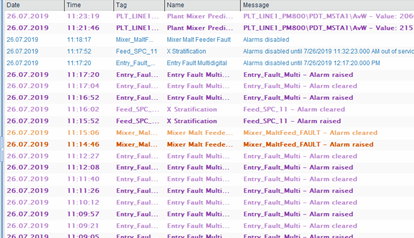

[Головна](README.md) > [5.Людино-машинний інтерфейс](5.md)

# 5.2. Дисплеї

## 5.2.1. Типи та стилі дисплеїв

У першому розділі сказано, що робота графічної підсистеми ґрунтується на дисплеях, які в різних середовищах розроблення можуть називатися сторінками, екранами, мнемосхемами або відображеннями. У стандарті ISA-101 використовується саме термін Display. Ми надалі будемо вживати слова, які вважатимемо синонімами: ***дисплей*, *дисплейна сторінка*** або ***сторінка***. Для прикладу конкретної програми SCADA/HMI буде вживатися прийнятий у ній термін. 

Більшість АРМ потребують багатосторінкового інтерфейсу. Це викликано необхідністю відобразити велику кількість даних, які неможливо помістити на одній дисплейній сторінці. Деякі стилі передбачають використання одного дисплея, в межах якого в певних місцях екрана переключаються сторінки залежно від контексту.  

Дисплейні сторінки за призначенням умовно можна розділити на такі типи:

- технологічні (наприклад, сторінка відділення фільтрації; сторінка станції приготування, тощо); 

- діагностичні та тривогові (наприклад, сторінка списку активних тривог; сторінка списку повідомлень; сторінка стану приводу);

- трендові (наприклад, сторінка історичних трендів);

- звітні (наприклад, сторінка звіту приготування продукту; сторінка із загальними показниками ефективності процесу (KPI)); 

- налагоджувальні (наприклад, карта ПЛК; налаштування ПІД-регулятора контуру температури); 

- конфігураційні (наприклад, параметри роботи фільтра; налаштування роботи виконавчих механізмів). 

Стилі відображення дисплейних сторінок відрізняється залежно від призначення. У стандарті ISA-101 виділено стилі, показані в табл. 5.2.

*Таблиця 5.2.* 

**Типи стилів дисплейних сторінок**

| **Тип стилю**                                             | **Опис**                                                     | **Приклад  застосування**                                    | **Приклад  зовнішнього вигляду** |
| --------------------------------------------------------- | ------------------------------------------------------------ | ------------------------------------------------------------ | -------------------------------- |
| Список  (List)                                            | Рядки  або списки з даними. Текстові і числові дані можуть змішуватися із символами  технологічного обладнання | Таблиця  технологічних змінних із відображенням значень, таблиці конфігурування  змінних та тривог |  |
| Процес,  технологічний (Process)                          | Графічне  відображення технологічного обладнання, трубних з'єднань та засобів  автоматизації | Перероблені  схеми автоматизації (P&ID) або технологічні схеми (PFD) |  |
| Схематичний  огляд  (Schematic overview)                  | Інформаційний  огляд області керування без деталізації. Типи елементів керування та  відображення на схемі залежать від функціональних вимог | Схема  всього цеху або технологічної лінії, схема транспортування матеріалів |   |
| Функціональний  огляд  (Functional overview, Dashboard) | Представлення  функціональних залежностей даних            | Відображення  ключових показників ефективності (KPI)         |  |
| Топологічний,  за розміщенням (Topology, Location)     | Представлення  розміщення обладнання на місцевості         | Схема  розміщення обладнання в цеху                          |  |
| Графіки  (Graph)                                          | Представлення  даних у вигляді графіків залежностей або діаграм історичних даних чи даних  реального часу | Тренди  реального часу або історичні.   Статистичні  діаграми якості або статистичні діаграми керування процесом |  |
| Груповий  (Group)                                        | Набір  лицьових панелей для точок вимірювання                | Керуючі  клапани багатокорпусного підігрівника.     Клапани  регулювання витрат ректифікаційної колони |  |
| Логічне  відображення (Logic Monitor)                    | Дисплеї,  що відображають логічні залежності між функціями системи | Дискретні/логічні  діаграми, блочні діаграми, ступінчасті діаграми, діаграми послідовностей |  |
| Процедурний (Procedural)                                 | Дисплеї  логіки процедурного керування                      | Діаграми  SFC (Sequential function chart) або PFC (Procedure function  chart) |  |
| Відео  (Video)                                            | Дисплеї  з відображенням потокового або записаного відео    | Відео  відображення технологічного процесу. Відеонагляд      |  |
| Діагностичний  (Health/ Diagnostic)                     | Відображення  стану певної інфраструктури компонентів HMI та системи керування | Дисплей  стану обчислювальної мережі                         |  |
| Список  тривог (Alarm list)                               | Відображення  списку статусної інформації                   | Дисплей  зведення тривог.  Дисплей  відтермінованих  тривог.  Дисплей  виведених з обслуговування тривог.   Дисплей  журналу повідомлень |  |

Дисплейні сторінки відображаються на ***вікнах***. Вікна можуть бути ***постійними***, які завжди займають всю область відображення, або ***спливаючими*** (***pop-up***), що появляються поверх інших вікон, як правило, для діалогових цілей (наприклад, повідомлення з підтвердженням або вікно керування виконавчим механізмом). При налаштуванні вікон, на яких розміщуються сторінки, як правило, вказують:

- розмір та позицію вікна; 

- можливість переміщення; 

- налаштування заголовка вікна; 

- ширина заголовка;

- наявність системних кнопок вікна.

Залежно від інструментальних засобів SCADA/HMI, параметри вікон, на яких розміщуються дисплейні сторінки можуть налаштовуватися в параметрах самої дисплейної сторінки або окремо. У першому випадку властивості вікна задаються безпосередньо в налаштуваннях дисплейної сторінки. У другому – розробник спочатку розробляє концепцію відображення дисплеїв на засобах HMI, тобто в якому саме місці відображатимуться конкретні типи дисплеїв, які будуть спливаючими, і т. п., а після цього – прив’язує дисплеї до цих вікон. 

Багато SCADA/HMI програм підтримують механізм ***шаблонних сторінок*** (***Template***). Шаблонна сторінка – це дисплейна сторінка, яка призначена для використання її в якості підкладки для інших сторінок. Наприклад, якщо треба на багатьох сторінках використовувати однакові кнопки навігації, то це можна зробити тільки на одній шаблонній сторінці, на базі якої створити усі інші сторінки. Слід сказати, що зв'язок дисплейної сторінки із шаблонною сторінкою залишається. Це значить, що якщо необхідно добавити нові елементи на шаблон або змінити існуючі, то це автоматично відобразиться на всіх дисплейних сторінках.

## 5.2.2. Дисплеї в SCADA zenon

У SCADA zenon дисплейні сторінки називаються ***екранами*** (***Screens***). Вони розміщуються на вікнах, що визначаються налаштуваннями ***фреймів*** (***Frames***). Для кожного фрейму задаються певні параметри (рис. 5.7) Прокоментуємо ті з них, які були уже наведені:

- Left, Right, Top, Bottom – позиція на екрані монітора; 

- Width (maximum), Height (maximum) – ширина та висота; 

- Positioning – відносна (щодо кнопки, яка викликає) чи абсолютна позиція на екрані монітора;

- Move – можливість переміщення;

- Always in the foreground – завжди на передньому плані (над усіма іншими вікнами);

- Frame can be opened multiple times – можливість відкриття декількох екземплярів вікон;

- Border type – тип межі вікна;

- Title, System menu, Min./Max. buttons – кнопки меню в заголовку вікна.

 

*Рис. 5.7.* Приклад налаштування параметрів вікна в SCADA zenon 

Екрани (Screens) в SCADA zenon вже створюються з прив'язкою до фреймів. Такий підхід дає можливість розділити процеси створення дисплейних сторінок (наповнення) та розміщення їх на екрані монітора.

## 5.2.3. Дисплеї в SCADA Citect

У SCADA Citect дисплеї називаються ***сторінками*** (***Page***). Налаштування вікна вказується в налаштуванні самої сторінки. На рис. 5.8 показано налаштування сторінки, для якої, зокрема, вказуються:

- ширина та висота сторінки;

- "Предназначено для показа заголовка" – наявність заголовка;

- заголовок вікна.

Інші властивості вікна, зокрема наявність системних кнопок, можливість переміщення, модальність та інші задаються у функціях, що викликають це вікно. Справа в тому, що в SCADA Citect практично вся діяльність реалізована через вбудовану мову програмування Cicode, зокрема через вбудовані функції, команди та вирази. Сторінку можна відкрити, безпосередньо викликавши її за ім'ям, або шляхом виклику функції створення вікна із завантаженням у нього сторінки. Другий варіант дає можливість налаштувати додаткові параметри вікна.

 

*Рис. 5.8.* Приклад налаштування параметрів сторінки в SCADA Citect

Citect підтримує механізм шаблонів. Тобто, можна вибрати шаблон, на базі якого сторінка буде створена. Шаблон, по суті, являє собою спеціальний тип сторінки, де можна використовувати ті самі елементи, що й на звичайних сторінках, а також анімацію. Дозволяється використовувати замінники, взяті в знак "%", аналогічно, як у джинах (розглянуто в параграфі 5.5.2). При створенні сторінок весь зміст шаблону буде недоступний на ній для редагування, а всі зміни в шаблоні будуть проявлятися на сторінках після їх відкриття.  

## 5.2.4. Дисплеї у WinCC Comfort

У WinCC Comfort дисплеї називаються ***екранами*** (***Screen***). Вони можуть бути звичайними, спливаючими (Pop-up screens) або висувними (Slide-in screens, висуваються за необхідності з країв екрана). Для всієї операторської панелі виставляється постійна зона (Permanent Area) – це спільна для всіх звичайних екранів область, яка не буде змінюватися незалежно від відкритого екрана. Ця область може бути використана, наприклад, для відображення останніх тривог або/та загального статусу системи. Для екранів налаштовується кольорова гама, шаблон, а також шари́ відображення (Layers) (рис. 5.9). 

 

*Рис. 5.9.* Приклад налаштування параметрів екрана в WinCC Comfort

Шаблон (Template) дає змогу використовувати на декількох екранах однаковий набір елементів та анімації. Наприклад, за допомогою шаблону можна задати кнопки навігації, які будуть вести себе однаково на всіх екранах із цим шаблоном.  

[<-- 5.1. Основи побудови ефективних людино-машинних інтерфейсів ](5_1.md)

[--> 5.3. Редактори графічної підсистеми](5_3.md)