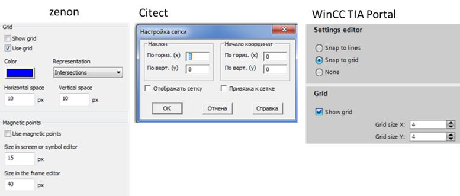
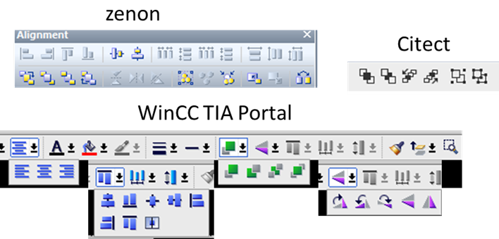
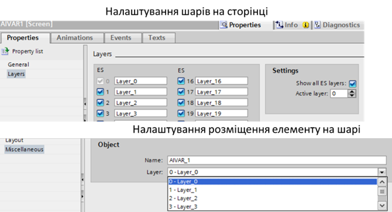

[Головна](README.md) > [5.Людино-машинний інтерфейс](5.md)

# 5.3. Редактори графічної підсистеми

Можливості редакторів графіки в SCADA/HMI значно впливають на швидкість розроблення та зручність. Нерідко вподобання розробників щодо конкретного програмного пакета диктуються саме критеріями зручності. Огляд усіх можливостей реакторів навіть однієї SCADA/HMI програми міг би зайняти весь обсяг посібника. Тому тут наведемо найбільш вживані підходи, характерні для більшості редакторів.

Для розміщення графічних елементів на дисплейній сторінці часто зручно використовувати сітку. Ця можливість наявна практично в усіх редакторах. У налаштуванні вказується крок сітки та опція прив’язки, яку можна в будь-який момент активувати чи деактивувати (рис. 5.10).

                               

*Рис. 5.10.* Налаштування сітки та прив’язки до сітки

Елементи на сторінці мають такі основні властивості:

- позиція на екрані;

- розміри (висота та ширина);

- позиція по осі Z відносно інших елементів на екрані (над, під);

- кут нахилу.

Більшість редакторів дають можливість змінювати ці властивості рухами миші та клавіш переміщення або безпосереднім уведенням значення властивості. Нижче перерахуємо основні можливості, які надають редактори для взаємного розміщення елементів (як це виглядає в різних редакторах показано на рис. 5.11):

- вирівняти виділені елементи по висоті, ширині;

- вирівняти позицію елементів по вертикалі, горизонталі;

- розмістити виділені елементи рівномірно відносно першого та останнього (по вертикалі та горизонталі);

- перемістити елемент вище/нижче, над/під усіма іншими елементами;

- згрупувати елементи разом, зручно переміщувати як єдине ціле; 

- повернути елемент на 90º, 270º, довільний кут;

- відобразити елемент дзеркально відносно горизонталі/вертикалі для вказаної якірної точки.  

Якірна точка або лінія – це умовна точка/лінія, відносно якої відбувається поворот, дзеркальне відображення або анімація ширини, висоти, повернення.

 

*Рис. 5.11.* Інструменти редагування графічних елементів SCADA/HMI 

Якщо елементів на екрані дуже багато або вони розміщені один над одним і потрібно керувати їхньою видимістю, ряд редакторів надають можливість розміщувати їх по ***шарах*** (layers). Кожен елемент розміщується на одному з шарів. За необхідністю, в редакторі шари можна ховати/показувати. Приклад конфігурування шарів показано на рис. 5.12. Шари можуть також бути доступні для анімації видимості в середовищі виконання.

 

*Рис. 5.12.* Налаштування шарів (Layers) в WinCC TIA Portal  