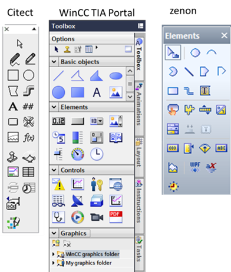
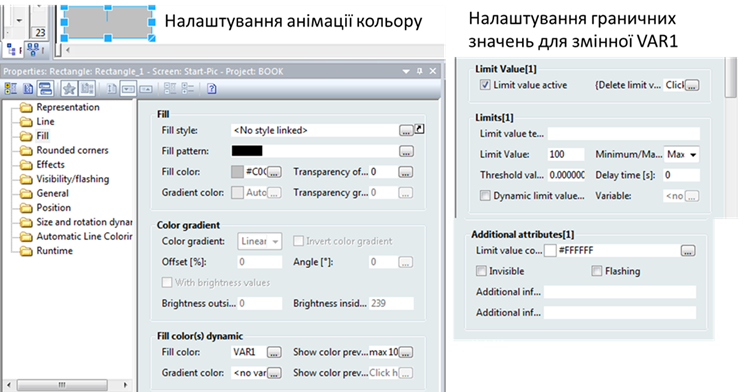
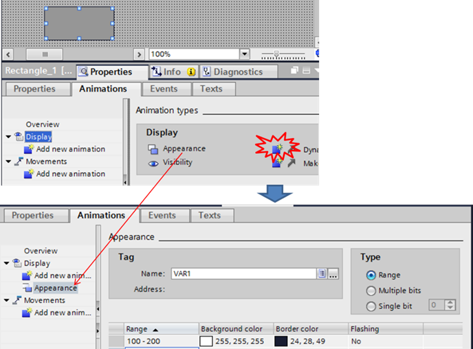
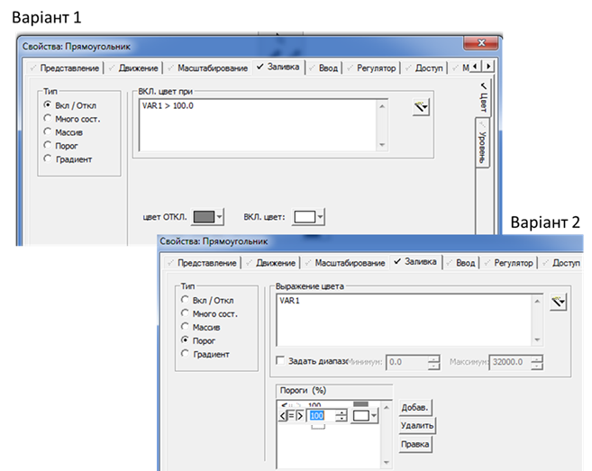
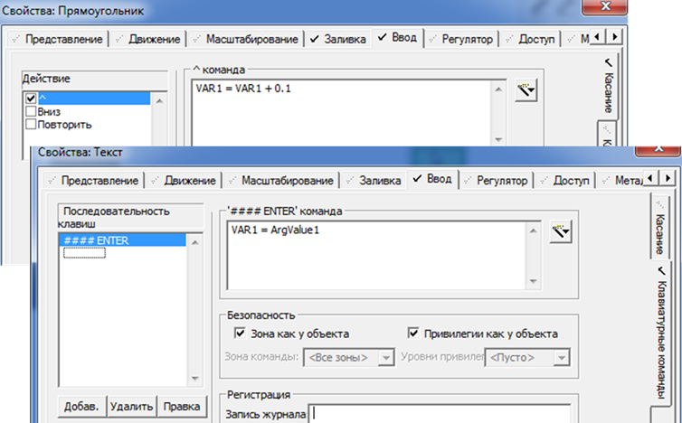
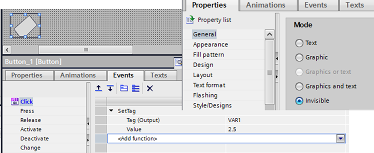
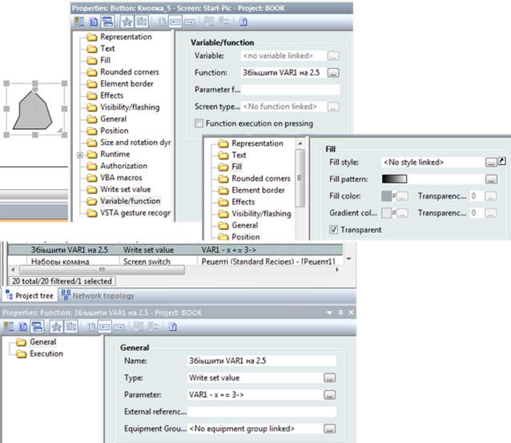

[Головна](README.md) > [5.Людино-машинний інтерфейс](5.md)

# 5.4. Об'єкти людино-машинного інтерфейсу та анімація

## 5.4.1. Типи об'єктів людино-машинного інтерфейсу

Основні об’єкти людино-машинного інтерфейсу та їх анімаційні можливості показані в розділі 1. Тут зосередимося на механізмах налаштування об’єктів та їх анімацій. Слід зазначити, що підходи до налаштування анімації в різних інструментах SCADA/HMI можуть дуже відрізнятися. Тим не менше, далі наведено результати певної класифікації за визначеними ознаками. 

Для зручності використання усі об’єкти зосереджують на палітрі (рис. 5.13). Об'єкти HMI можна умовно розподілити на:

- базові елементи, що не мають вбудованої анімації;

- об’єкти із вбудованою анімацією;

- базові компоненти (символи, групи), що складені з декількох об’єктів без анімації;

- компоненти із вбудованою анімацією;

- об’єкти сторонніх виробників.  

                               

*Рис. 5.13.* Палітра об’єктів у різних SCADA/HMI

**Базові елементи** не мають за замовченням вбудованої анімації. Це, як правило, геометричні фігури, лінії, трубопроводи і т. п. Тим не менше, ряд їх властивостей, таких як колір, розміри, кут повороту, позиція, можна анімувати. 

**Об'єкти із вбудованою анімацією** – вже мають анімаційні властивості, в які треба тільки задати потрібні змінні (теги) або вирази. Номенклатура таких об’єктів дуже різноманітна і по-різному реалізована в SCADA/HMI. Ідея полягає в тому, щоб прив’язати вже існуючу анімацію до змінних або виразів. 

**Базові компоненти (символи**) – це об'єднання об’єктів, що, як правило, не мають вбудованої анімації, або вбудована анімація не підтримує заміни. Таке об'єднання дає можливість робити складні геометричні графічні компоненти і зберігати їх у бібліотеці проекту або глобальних бібліотеках. Один раз розробивши символ двигуна, можна його використовувати в проекті декілька разів. При цьому часто використовують механізм зв’язування. Це значить, що при зміні символу в бібліотеці усі його екземпляри автоматично також будуть змінені. У SCADA/HMI такі компоненти можуть називатися символами (symbol) або групами (group). Використання символу із вбудованою анімацією, яка не може бути змінена, як правило, мало корисне. Однак компонент із вбудованою анімацією зі змінюваними прив’язками є дуже потужним механізмом, за допомогою якого можна значно прискорити процес розроблення проекту. Цей механізм розглянуто в наступному підрозділі.    

У програмах SCADA/HMI можуть також бути використані об’єкти сторонніх виробників. Інтеграція відбувається через стандартні механізми вбудовування та зв’язування. Детальніше ці механізми розглядаються в підрозділі 5.6.

Нижче, на прикладах SCADA zenon, SCADA Citect, та HMI WinCC Comfort, розглядаються підходи до базової анімації. Принципи налаштування анімацій показано на прикладі зміни кольору прямокутника залежно від значення числової змінної VAR1 типу REAL: 

- білий, коли VAR1>100

- сірий, коли VAR1<100 

## 5.4.2. Анімація у SCADA zenon 

У SCADA zenon налаштування анімації відбувається шляхом прив’язки властивості до тегу (змінної). Це досить логічно і дає можливість побудувати середовище розроблення на прив’язках (лінкуванні), який описано раніше. Тобто, змінюючи назву змінної, в анімаціях зв'язок з перейменованою змінною залишається. Для багатьох типів анімації використовуються властивості самої змінної. На рис. 5.14 показано налаштування анімації кольору для прямокутника. Прямокутник має статичний сірий колір, який використовується як колір за замовчуванням. Динамізація (анімація) кольору налаштовується шляхом прив’язки властивості "Fill Color" до змінної VAR1. Очевидно, що вказівки змінної VAR1 у якості джерела недостатньо для означення поведінки типу "коли VAR1>100 змінити колір на білий". У zenon анімація кольору ґрунтується на налаштуваннях змінної. У самій змінній прописується граничне значення Limit Value[1]=100 з типом "Maximum" (див. рис. 5.14), що говорить про подію VAR1>100. Для цього граничного значення вказується Limit value color = "White". Таким чином, при досягненні граничного значення усі елементи, що будуть прив’язані до змінної по анімації кольору, заповняться в білий колір.

 

*Рис. 5.14.* Налаштування анімації кольору в SCADA zenon  

## 5.4.3. Анімація у WinCC Comfort 

У WinCC Comfort кожна анімація також використовує прив’язки до змінних, однак добавляється до існуючого базового компоненту. Наприклад, для прямокутника на вкладці "Animations" можна добавити одну з доступних анімацій. Анімація кольору добавляється як "Appearance" (рис. 5.15), для якої вказується змінна, тип анімації (діапазон – Range, побітно – Multible bits, за одним бітом – Single bit) та значення з кольором. Для анімації кольору за діапазоном можна вказати декілька діапазонів змінної, кольори фону та контурів, які відповідають за ці діапазони, та миготіння (flashing). Додатковою зручністю такого підходу є копіювання безпосередньо анімації та вставка її в інший елемент.

## 5.4.4. Анімація у Citect

У SCADA Citect конфігураційне вікно кожного об’єкта HMI вже має закладки з анімаціями. Зміна кольору налаштовується в закладці "Заливка", вкладці "Цвет". Тип анімації вибирається з ряду:

- "вкл/откл." – по стану лог. "0" або лог."1";

- "много сост" – по стану набору бітів;

- "массив" – для кожного значення свій колір;

- "порог" – для кожного діапазону значень свій колір;

- "градиент" – градієнтна заливка залежно від кольору.

На відміну від інших, наведених вище SCADA/HMI, в якості значення вказується не тег, а вираз, записаний за правилами мови Cicode. Вибравши тип анімації "Вкл/Откл", записується вираз "VAR1 > 100.0", при істинності якого буде білий колір заповнення, а при хибності – "сірий" (рис. 5.16). Альтернативою може бути також тип "порог". У цьому випадку використовується ім'я тегу, як вироджений варіант виразу.     

Подібним чином налаштовуються інші анімації для базових об’єктів HMI.

 

*Рис. 5.**15.* Налаштування анімації кольору в WinCC

 

*Рис. 5.16.* Налаштування анімації кольору в Citect

## 5.4.5. Налаштування реакцій на подію

Для налаштування реакції на події оператора базові елементи можуть мати додаткові властивості. На рис. 5.17 показано налаштування обробника в Citect для кнопок миші ("Ввод"->"Касание") та клавіатури ("Ввод" -> "Клавиатурные команды"). Налаштування обробника миші для елемента треба розуміти так: якщо дія відпускання лівої кнопки миші ("^") – виконати команду 

```
VAR1 = VAR1 + 0.1
```

Налаштування для обробника клавіатури для елемента слід розуміти так: якщо набрана послідовність чотирьох або менше клавіш та натиснута клавіша "ENTER", то буде виконана команда 

```
VAR1 = ArgValue1
```

Оскільки ArgValue1 – це системна "змінна" вікна, що отримує значення вводу, в VAR1 буде записане те значення, яке набрав оператор. 

У Citect будь-який елемент має можливість обробника події. У zenon та WinCC Comfort оброблення подій від оператора налаштовується тільки для об’єктів із вбудованою анімацією. Для того щоб вийти з такої ситуації, коли необхідно, наприклад, обробити натиснення миші на довільному графічному елементі, використовують прозорі кнопки. На рис. 5.18 показано, як налаштовуються обробники подій для кнопки у WinCC Comfort. Це налаштування треба розуміти так: коли оператор натиснув кнопку – буде викликана функція SetTag, що запише у змінну VAR1 значення 2.5. Оскільки кнопка має властивість Mode = Invisible, оператор візуально буде натискати на зображення під кнопкою. 

  

*Рис. 5.17.* Налаштування оброблення подій в Citect

 

*Рис. 5.18.* Налаштування оброблення подій у WinCC Comfort для прозорої кнопки 

На рис. 5.19 показано, як налаштовуються обробники подій для кнопки у SCADA zenon. Для виконання будь-яких дій в zenon необхідно створити функцію користувача. У цьому прикладі це функція типу "Write set Value" з назвою "Збільшити VAR1 на 2.5". Для кнопки виставляється властивість Fill->Transparent, що робить її прозорою. У групі властивостей "Write Set Value" знімається опція "Switch", що говорить про використання кнопки для виклику функції. А в параметрах Variable/Function вказується потрібна функція. Аналогічну дію можна виконати через опції Write Set Value.



*Рис. 5.19.* Налаштування оброблення подій у zenon для прозорої кнопки