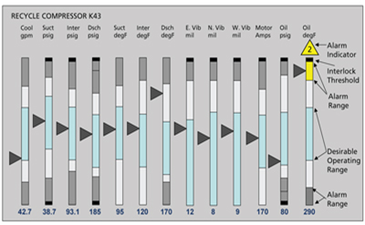
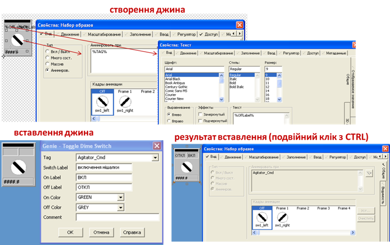
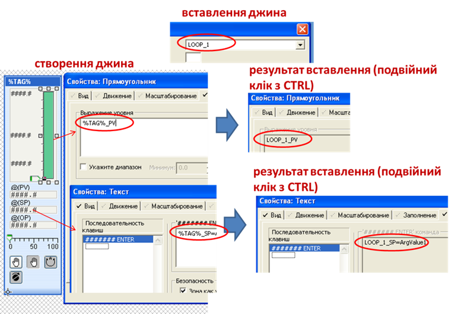
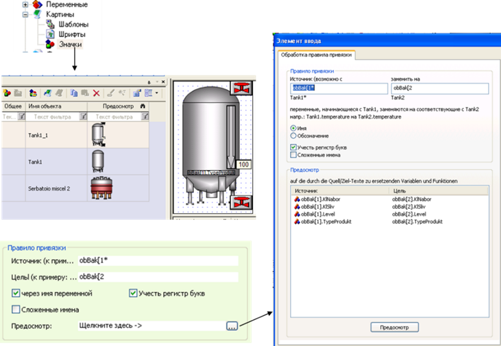
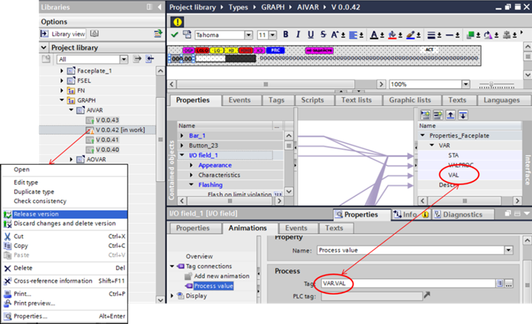
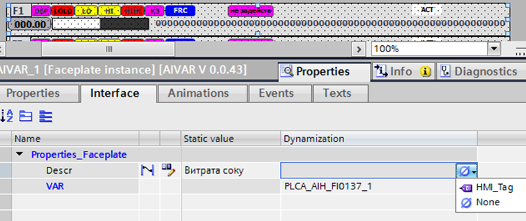

[Головна](README.md) > [5.Людино-машинний інтерфейс](5.md)

# 5.5. Анімовані компоненти (символи) та сторінки із замінними прив’язками анімацій 

## 5.5.1. Основні ідеї

При розробленні великої кількості однотипних об’єктів, що мають кілька прив’язок, виникає необхідність в автоматизації рутинних однакових операцій. Для прикладу, уявіть собі проект із кількома сотнями різнотипних виконавчих механізмів (запірно-регулюючої арматури, кількома десятками насосів та інших двигунів), кожен з яких на HMI повинен показувати не тільки стан (активний/неактивний), а й надавати ряд інших функціональних можливостей, наприклад:

- відображати дійсне значення параметрів (положення, швидкість);

- відображати режим роботи руч./авт./блок.;

- давати можливість змінювати стан, віддаючи команди через спливаючі вікна;

- відображати стан тривог, пов’язаних із даним ВМ;

- надавати дії через контекстне меню. 

Подібне характерно не тільки для виконавчих механізмів, а й для індикаторів, що мають багато змінних параметрів. Наприклад, на рис. 5.20 показано фрагмент схеми, в якій використовується багато індикаторів, які, окрім плинного значення відображають стан тривоги, межі тривог та іншу інформацію. Якщо такі індикатори необхідно розробити самостійно, кожен з них потребує множинної анімації, що ускладнює їх використання навіть у кількох екземплярах.  

                               

*Рис. 5.20.* Фрагмент мнемосхеми з великою кількістю індикаторів

Звичайно, розробивши один прототип та об’єднавши його в групу, можна скопіювати необхідну їх кількість, а далі пошуком і заміною змінити прив’язки на необхідні. Зрештою, на це може піти від кількох десятків хвилин до кількох годин, що не так вже багато в масштабах життєвого циклу проекту. Однак у більшості випадків робота над проектом потребує змін, а кожна зміна з прототипом потребує повторення цієї процедури. Тому більшість SCADA/HMI надають механізми створення ***анімованих компонентів* (*символів*)**, які, на відміну від базових мають вбудовану анімацію, що змінюється відповідно до вимог конкретного екземпляра. 

Механізм функціонування таких символів сильно залежить від інструменту, однак є певні загальні підходи, які схожі на використання функцій або об’єктів у програмуванні. Ідея ґрунтується на тому, що є певний прототип анімованого символу, який можна умовно назвати ***класом символу***. У класі визначається поведінка об’єкта, робляться віртуальні прив’язки до змінних, які задаються ***формальними параметрами***. З точки зору користувача розроблення такого компоненту нічим не відрізняється від розроблення звичайного набору графічних елементів, хіба що редагування може бути виділено в окремому вікні, і прив’язки робляться не до тегів, а до формальних параметрів. Інколи створення такого класу відбувається шляхом прототипування існуючого набору (групи). Далі на базі цього прототипу (класу) створюються ***екземпляри анімованих символів***. При створенні екземпляра відбувається означення фактичних параметрів взамін формальним. При правильній назві формальних параметрів можна вказати тільки частину імені, тоді на весь об’єкт приводиться тільки одна частина прив’язки. Екземпляри зберігають зв'язок із класом, тому будь-які зміни в класі приводить до зміни в усіх екземплярах. 

Приблизно такий самий механізм використовується для сторінок (як правило, спливаючих). На сторінці використовуються прив’язки, які при виклику можна замінити. Таким чином, наприклад, вікна налаштування регуляторів можуть бути однаковими, але з різними прив’язками, і розробникові не доведеться розроблювати однакові дисплейні сторінки.  

Розглянемо це на прикладах.    

## 5.5.2. Підходи в Citect

У Citect механізм анімованих символів реалізований через ***Джини*** (***Genie***) – сукупність пов'язаних об'єктів із вбудованою анімацією на базі замінників, які використовуються в графічних сторінках. Джини – це бібліотечні елементи, які у великій кількості доступні вже у системних проектах, що включаються зі стилем в основні. Можна створювати свої джини, що значно спрощує розроблення графічної підсистеми з великою кількістю однотипних компонентів.

Ідея роботи джинів полягає в такому. У графічних елементах, які становлять основу джину, в місцях анімації або текстової властивості вставляються ***замінники*** (substitution), що виділяються з обох боків символом процента. При вставленні джину ці замінники замінюються іншим текстом, який вводить користувач при вставленні.

Наприклад, на рис. 5.21 показано джин з ім'ям "ToggleDimeSwitch", в якому використовується анімація набору символів. У місце анімації "Анимировать при" вставлений замінник %TAG%, а в місце відображення тексту в поле "Текст" показано %OffLabel%. При вставленні такого джина в місця замінників вставляються "Agitator_Cmd" та "ОТКЛ" відповідно. Після вставлення, замінені значення можна перевірити, зробивши подвійне натискання миші одночасно з клавішею "CTRL" по необхідному елементу джина (див. рис. 5.21).

Використання замінників дає можливість вставляти в елементі джина тільки частину імені тегу (напису). При використанні структурованих імен змінних це ще більше скорочує час розроблення. Так, на рис. 5.22 показано джин, в якому всі елементи прив’язані до змінних, частина імені яких означена замінником %TAG%. Таким чином, коли при вставленні джина замінник отримує значення "LOOP_1", він стає частиною імені змінних тегів "LOOP_1_PV" та "LOOP_1_SP".

Використання такого підходу зменшує кількість введення замінників. Джини створюються в редакторі графіки.

Спливаючі сторінки, аналогічно джинам, можуть містити вбудовану анімацію із замінниками, які під час виклику можна замінити на необхідні змінні. Такі замінники реалізуються з використанням ***асоціацій*** (association). Асоціації разом з типом беруться в символи знака питання:

```
?<Data Type> <Association>?
```

де `<Data Type>` – тип асоціації, може бути BCD, BYTE, LONGBCD, UINT або ULONG; якщо тип не вказується, Citect буде визначати його автоматично;   

```
<Association>
```

 – номер або ім’я асоціації.     

 

*Рис. 5.21* Приклад прив’язування в джині

 

*Рис. 5.22* Приклад використання замінника як частини тегу 

Асоціації на сторінці можна прив’язати за замовченням у властивостях сторінки "Сопоставления". 

Сумісно із джинами можна використовувати спеціальні бібліотечні спливаючі сторінки, які призначені саме для виклику з джинів. Такі сторінки називаються ***суперджинами*** (Super Genies). Вони створюються в редакторі графіки. Для прив’язування суперджина до джина, при редагуванні джина необхідно вказати їх у меню "Правка->Присоединить суперджины". Спливаючі сторінки створюються як сторінки, їх не потрібно прив’язувати і вони можуть бути викликані з будь-якого елемента. У всьому іншому механізми роботи спливаючих вікон і суперджинів однакові.

Для прив’язування асоціацій сторінки до змінної можна використати функцію "Ass" перед її викликом. Для спрощення виклику можна скористатися Cicode функцією "AssWin".  

## 5.5.3. Підходи в zenon

У SCADA zenon анімовані символи називаються також ***symbol***, хоч у російськомовному інтерфейсі вони називаються "значками". Символ створюється в бібліотеці проекту або копіюється туди з існуючого на дисплейній мнемосхемі. Таким чином, він нічим не відрізняється від звичайної групи анімованих об’єктів. Однак при вставленні екземпляра символу (рис. 5.23) можна встановити правило прив’язки, в якому вказується, яким чином будуть замінюватися назви прив’язаних змінних в анімації. У правилі прив’язування вказується вхідний пошуковий шаблон та замінник. Таким чином, усі тексти, що вказані в шаблоні як частина прив’язки, будуть замінені на замінники.   

   

*Рис. 5.23* Приклад використання символу в zenon 

Аналогічно робиться із заміною прив’язок у дисплейних сторінках. При створенні функції відкриття екрану, редактор zenon запропонує сформувати правило прив’язування для заміни існуючих прив’язок. 

## 5.5.4. Підходи в WinCC Comfort

У WinCC анімовані компоненти реалізовані через так звані ***faceplate*** (лицьова панель, надалі ***фейсплейт***). WinCC дає можливість не тільки робити анімування компонентів через бібліотечний прототип, а й забезпечує керування версіями. Усі прототипи фейсплейтів є різновидністю типів об’єктів і також знаходяться в бібліотеці типів (Project Library, рис. 5.24). При розробленні або редагуванні конкретний тип фейсплейта знаходиться в стані “in work” ("в роботі"). Це дає можливість редагувати, зберігати їх у бібліотеці без внесення змін у програму. При відсутності необхідності у випуску версії фейсплейта, його версію відміняють (Discard changes and delete version). Якщо треба, щоб зміни вступили в силу, версію випускають у реліз (Release version), при цьому можуть замінити існуючі екземпляри на нову версію або залишити їх прив’язку до старої версії. Усі типи попередніх версій залишаються в бібліотеці до тих пір, поки розробник їх не видалить. Видалення можливе тільки за умови відсутності екземплярів, прив’язаних до цієї версії.

 

*Рис. 5.24**.* Налаштування faceplate в TIA portal

Редагування елементів фейсплейту відбувається так само як і безпосередньо на сторінці. Однак прив’язку можна робити не до зовнішніх змінних, а до формальних параметрів фейсплейт, які сторцюються у його властивостях. На рис. 5.24 показано, що створена формальна змінна структурного типу з назвою VAR, а поле VAL цієї змінної використовується в анімації “Process Value” одного з текстових елементів. Для того щоб використати фейсплейт, його тип вибирається з бібліотеки і перетягується на сторінку. У властивостях екземпляра "Interface" (рис. 5.25) формальні параметри прив’язуються до фактичних змінних (поле "Dynamization") або до констант (Static Value), що налаштовується через контекстне меню властивості. 

 

*Рис. 5.25.* Використання faceplate з прив’язкою до змінних або констант

Це далеко не всі можливості фейсплейтів, детальніше можна прочитати в довідниковій системі.

[<-- 5.4. Об'єкти людино-машинного інтерфейсу та анімація](5_4.md)

[--> 5.6. Можливості розширення палітри анімаційних компонентів](5_6.md)