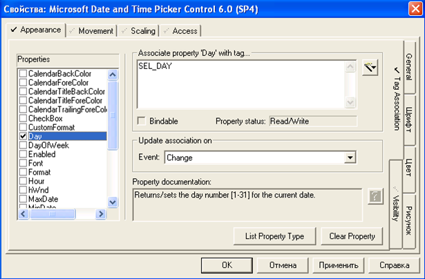
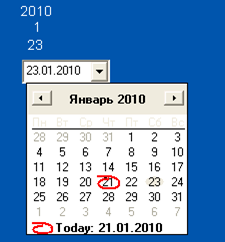

[Головна](README.md) > [5.Людино-машинний інтерфейс](5.md)

# 5.6. Можливості розширення палітри анімаційних компонентів

Більшість SCADA/HMI програм надають можливість не тільки розроблювати власні компоненти з існуючих елементів, а й впроваджувати графічні активні елементи, розроблені в інших редакторах. Вже класичною технологією, яка використовується для цього, є ActiveX. Треба зазначити, що, не дивлячись на велику кількість розроблених ActiveX-компонентів, сама технологія вже не рекомендується Microsoft (яка її й розробила) для розвитку, оскільки має ряд вад, зокрема:

- є небезпечною, оскільки розробник компоненту може розмістити шкідливий або нестабільний код;

- підтримується тільки Windows;

- підтримується не всіма браузерами, що ускладнює використання тих самих вікон для ВЕБ-доступу.

Альтернативою є використання технології WPF, яка розроблена Microsoft для заміни ActiveX. У майбутньому очікується повний перехід на HTML5, тому й компоненти вочевидь також будуть ґрунтуватися на сумісних технологіях. Тим не менше, поки що ActiveX має найбільш популярне використання в SCADA/HMI.

Розглянемо приклад, де в SCADA Citect потрібно забезпечити можливість вибору оператором необхідної дати в зручному графічному інтерфейсі, для подальшого її використання в перегляді історичних трендів. Для цього можна використати ActiveX елемент "Microsoft Date AND Time Picker Control". У Citect створюються три внутрішні змінні типу INT: SEL_DAY, SEL_MONTH, SEL_YEAR. Ці змінні плануються для використання в мові Cicode для визначення початкової дати перегляду трендів. У Graphics Builder на панелі Tools вибирається елемент ActiveX, після чого з’явиться список установлених на ПК елементів ActiveX. Необхідно вибрати елемент "Microsoft Date AND Time Picker Control" і, вибравши вкладку "Appearance", закладку "TagAssociation", у вікні "Propertiies" настроїти такі властивості (рис. 5.26):

- властивість Day, вибрати тег SEL_DAY, в полі "Update association on" вибрати "Change";

- властивість Month, вибрати тег SEL_MONTH, в полі "Update association on" вибрати "Change";

- властивість Date, вибрати тег SEL_DATE, в полі "Update association on" вибрати "Change".

На вкладці "TagAssociation" настроюється зв’язок властивостей ActiveX зі значеннями змінних. Запис значень властивостей у змінні проводиться в момент виникнення події, яка задається в полі "Update association on". Для відображення внутрішніх змінних на мнемосхемі виведемо 3 елементи Number, і в закладці "Display Value" прив’яжемо їх значення до змінних SEL_DAY, SEL_MONTH, SEL_YEAR. 

                               

*Рис. 5.26.* Зовнішній вигляд вікна налаштування елемента ActiveX в SCADA Citect

Результат роботи RunTime системи з елементом ActiveX "Microsoft Date AND Time Picker Control" показано на рис 5.27.

Як видно з даного прикладу, можна розширити функціональність графічного інтерфейсу за рахунок вставки сторонніх елементів, навіть не написавши код. Тим не менше це радше виняток, аніж правило, бо використання ActiveX нерідко потребує виклик методів та оброблення подій.  

 

*Рис. 5.27.*Фрагмент мнемосхеми RunTime системи SCADA Citect з демонстрацією роботи ActiveX елемента

[<-- 5.5. Анімовані компоненти (символи) та сторінки із замінними прив’язками анімацій](5_5.md)

[--> 5.7. Ієрархія дисплеїв та навігація](5_7.md)