[Головна](README.md) > [5.Людино-машинний інтерфейс](5.md)

# 5.8. Принципи розроблення високоефективного   людино-машинного інтерфейсу

## 5.8.1. Стан проблеми високоефективних HMI

На сьогоднішній день велика кількість існуючих людино-машинних інтерфейсів недостатньо ефективна [5]–[9]. Під ефективністю розуміється ступінь використання наявних ресурсів з точки зору швидкості, надійності, керованості та спостережності.  

Велика кількість низькоефективних HMI пов’язана з рядом факторів, основним з яких є відсутність до недавнішніх пір стандартів, присвячених їх розробленню. Останні 10–15 років ряд організацій та вчених проводили дослідження інцидентів та аварій на промислових підприємствах і причин, які на них впливали. Виявилося, що однією з головних причин цих інцидентів був людський фактор. При цьому велика кількість неправильно прийнятих рішень оператором була пов’язана з недостатньою ситуаційною обізнаністю, які, в свою чергу, сильно залежали від погано реалізованого людино-машинного інтерфейсу. Сьогодні багато проблемних питань вирішується шляхом застосування вимог та рекомендацій стандарту ISA-101 які наведені вище у цьому розділі. У цьому підрозділі зупинимося на інших рекомендаціях та тенденціях, які не увійшли в цей стандарт.   

## 5.8.2. Основні недоліки реалізованих HMI

Нижче наведені типові помилки та рекомендації щодо побудови високоефективного HMI, які після ряду досліджень та експериментів організації PAS були викладені у їхньому вебінарі [[5](https://youtu.be/RSpwACuPv9A)]. Автори наводять такі типові недоліки.

**1.**   **Використання схем** **P&ID (типу схем автоматизації та технологічних схем**) в якості дисплеїв верхнього рівня.

Традиційно основні мнемосхеми розробляються у вигляді схеми установки. Наприклад, на рис. 5.37 показано устатковання, точки вимірювання та керування аналогічно до технологічної схеми або/та схеми автоматизації. Це традиційно і досить звично, оскільки використовується у більшості випадків, які нам траплялися. Найчастіше автори вебінару, а також автор посібника робили дисплеї верхнього рівня саме такими. Такий підхід може бути зручним для пуско-налагодження, для пояснення того, як діє технологічний процес (первинне ознайомлення оператора), для навчання оператора, для керування установкою в ручному режимі. Однак такі сторінки недостатньо ефективні при використання їх в якості постійного дисплея верхнього рівня в ієрархії дисплеїв. Причин для цього декілька:

- інформація розосереджена по всьому дисплею за принципом територіального розміщення засобів КВПіА, що потребує контролю кількох точок на екрані для ситуаційної обізнаності в роботі конкретної функції або завдання; для дисплеїв верхнього рівня варто розміщувати елементи за функціональною ознакою; наприклад, значення pH за потоком матеріалу бажано було б виставити в один ряд, так само як і витрати; 

- на дисплеї велика кількість відображених даних, які не потрібно поміщати на основній мнемосхемі; наприклад, значення ступеня відкритості клапанів або частоти двигунів насосів, як правило, не потрібні при нормальній експлуатації, достатньо тільки графічного відображення стану;  

- велику частину екрана займають графічні зображення устатковання, що ускладнює пошук потрібних значень; наприклад, якби всі показання перемістити в один куток екрана, це зайняло б менше 25%;
<a href="media5/5_37.png" target="_blank">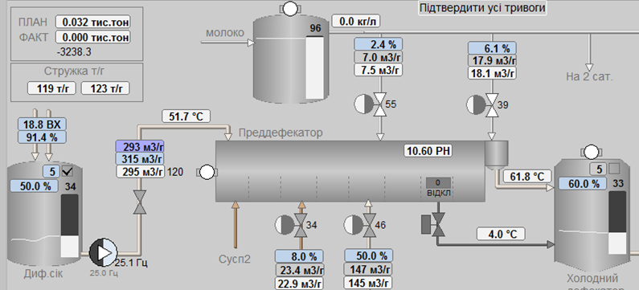</a> 

*Рис. 5.37.* Фрагмент мнемосхеми, зробленої за прототипом технологічної схеми або схеми автоматизації  

**2.**    **Використання цифрових індикаторів без аналогової інтерпретації**

Один із основних постулатів, озвучених у праці [5](), є: "дані – це не інформація!". Для кращої ситуаційної обізнаності дані треба представляти в контексті, інакше оператор буде змушений подумки представляти те, яким чином показане значення співвідноситься до меж норми або з іншими значеннями. Наприклад, на рис. 5.38 показано представлення профілю (розподілу) температури по колоні. Перші дві колони на рисунку показують той самий профіль: перший тільки цифровим індикатором, а другий – графічно, у вигляді "аналогових" гістограм, де значення візуально знаходиться в контексті діапазонів. Причому значення на аналогових індикаторах з’єднані графічно, створюючи графік профілю. Крім того, на третій колоні, яка відображається в стилі 2-ї, одразу видно не тільки те, що температура внизу дуже низька, а й те, як вона спадає вниз по колоні. Людина легше сприймає аналогове представлення, ніж цифрове. Глянувши одним поглядом на таке зображення, оператору вже не потрібно дивитися на числа, щоб оцінити стан процесу.   

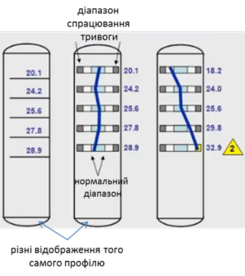 

*Рис. 5.38.* Використання аналогового представлення температурного розподілу по колоні

**3.**   **Надмірне використання** **3D та анімації руху.**

На рис. 5.39 показано не дуже вдалий дисплей з точки зору ситуаційної обізнаності [[5](https://youtu.be/RSpwACuPv9A)]. Окрім яскравих кольорів та цифрових індикаторів, які заважають оцінюванню ситуації, дисплей вміщує об’ємні зображення. Об’ємне зображення устатковання набагато приємніше і реалістичніше виглядає, аніж плоске, але воно ускладнює читання інформації з дисплея.   

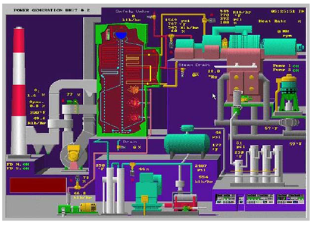 

*Рис. 5.39.* Приклад невдалого використання 3D

На рис. 5.40 показано інший приклад дисплея, який розроблював автор цього посібника на одному з цукрових підприємств. У цій мнемосхемі є багато недоліків, про які вже було сказано (невдале використання кольорів, цифрові індикатори, відображення рівнів у "розірваних отворах"). Тут зупинимося на проблемі надмірного використання об’ємної графіки. Ця мнемосхема подобалася як автору цього посібника (був основним розробником мнемосхеми), так і іншим учасникам проекту, операторам, керівництву підприємства та, зрештою, всім опитуваним. "Подобається" – це був головний критерій при розробленні цього дисплея. Однак, слід задатися питанням, яким чином на цьому дисплеї 3D-візуалізація впливає на ефективність сприйняття? Використання 3D для цього проекту мало такі наслідки:

- змусило використати більше простору, ніж 2D зображення; окрім бокових і задніх частин, надмірно малі зображення не давали можливості вставити в рисунок індикатори, щоб не порушити естетику; зображення самих засобів вимірювання та керування зайняли багато місця для непотрібної графіки; 

- змусило використати градієнт, який ускладнював відображення показань; на рис. 5.40 цей ефект видно на температурах колони, де текст "°C" поступово "розмазується"; жовтий колір – невдалий для цього випадку; на рис. 5.43 показано приклад, де градієнт ускладнює читання тренду реального часу; 

- примусило використати різні відтінки кольору та надати їм більше контрасту; якщо подивитися, що найбільше привертає на себе увагу, то виявиться, що ці елементи не є важливими з точки зору керування.     
<a href="media5/5_40.png" target="_blank">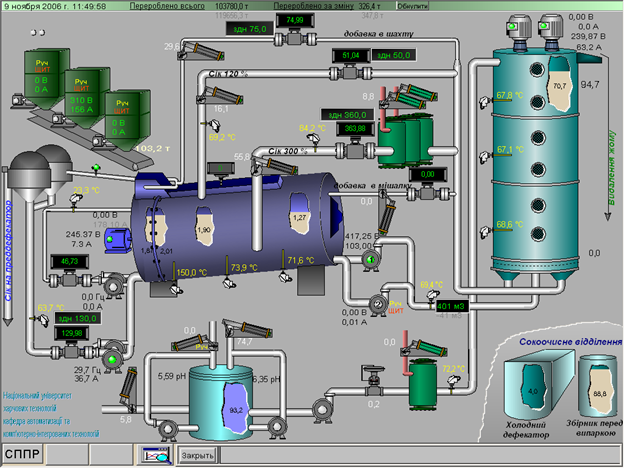</a> 

*Рис. 5.40.* Приклад невдалого використання 3D з власної практики автора

Окрім наявного 3D, мнемосхема з рис. 5.40 має ще одну особливість – виконавчі механізми на ній були рухомими: пневмоциліндри змінювали своє положення, стрічка подачі стружки мала анімацію руху. Про недоліки використання анімації руху сказано в стандарті ISA-101 і описано вище. Оператор інтуїтивно при першому погляді буде дивитися саме на рухомі частини мнемосхеми, тоді як у тій частині процесу, за фактом, нічого не трапилося. У цьому випадку розроблення анімованих компонентів диктувалося двома критеріями: "цікаво" і "задоволення власних амбіцій".       

Слід сказати, що демонстраційні проекти більшості постачальників програмних засобів SCADA/HMI перенасичені кількістю подібних дисплеїв. Щоб упевнитися в "модності" і популярності таких дисплеїв, достатньо в пошуковому запиті Інтернету набрати "3D HMI/SCADA". Це пояснюється бажанням звабити потенційного покупця яскравими та гарними рисунками. Зрештою, як відзначають автори вебінару [[5](https://youtu.be/RSpwACuPv9A)], такі дисплеї можуть бути саме для таких цілей, а не використовуватися в операційному режимі.   

Також треба розуміти, що в деяких випадках використання 3D на дисплеях виправдане і потрібне. Як приклад, це можуть бути дисплеї для дистанційного керування кранами, або навігації по цеху для технічного обслуговування, діагностичні екрани устатковання з відображенням його складових тощо. Екрани з 3D можна використовувати для навчання персоналу або в якості анімованих конструкторських документів. Використання 3D також є невід’ємною частиною віртуальної реальності, яка також може бути частиною SCADA/HMI.   

**4.**   **Неправильне використання кольорів.**

   Про правильне і неправильне використання кольорів описано в підрозділі 5.1. Тут зупинимося на використання кольору в якості відображення тривоги (детальніше про тривоги читайте в наступному розділі). Дослідники у своїх працях [[5](https://youtu.be/RSpwACuPv9A)],[[9](https://www.amazon.com/High-Performance-HMI-Handbook-Comprehensive-ebook/dp/B00CELQJU8)] оцінили різні способи відображення тривог на графічних елементах дисплеїв з урахуванням миготіння або/та блимання елементів чи складових непідтверджених тривог. Найгіршим способом вони вважають зміну кольору значення індикатора (рис. 5.41, Варіант 1), оскільки він погано видимий у стані тривоги, а при миготінні – тим паче. Крім того, він має усі недоліки наступного, 2-го варіанту.    

Другим варіантом є використання зміни кольору фону (а) або контуру (б) індикатора залежно від стану тривоги. Порівняно з попереднім способом, при виникненні тривоги елемент досить добре виділяється на фоні, ще краще – при блиманні. Однак і тут є ряд проблем:

- одночасне відображення тривог кількох пріоритетів; цієї проблеми немає при використанні зміни кольору контурів (варіант 2,б), оскільки вони можуть бути різного розміру і не накладатися один на одного; 

- немає дублювання формою та текстом, що може стати проблемою для сприйняття людьми з вадою зору (див. параграф 5.1.2). 
<a href="media5/5_41.png" target="_blank">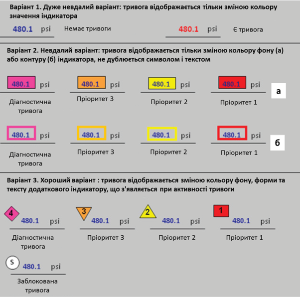</a> 

*Рис. 5.41.* Варіанти відображення станів тривоги та їх оцінка [[9](https://www.amazon.com/High-Performance-HMI-Handbook-Comprehensive-ebook/dp/B00CELQJU8)]

Найкращим, на думку авторів [[5](https://youtu.be/RSpwACuPv9A)] та [[9](https://www.amazon.com/High-Performance-HMI-Handbook-Comprehensive-ebook/dp/B00CELQJU8)], є використання третього варіанта, тому що тут для кожного пріоритету тривоги використовується свій символ зі своїм кольором, формою і текстом. Крім того можна вказати додатковий символ для заблокованих тривог. Альтернативним до третього варіанта є використання окремих символів також і для типів тривог, а не тільки для пріоритету (на рис. 5.41 не показана). Автори вважають, що такий спосіб займає багато простору і він надто складний в реалізації, а також потребує вирішення питань одночасної появи тривог кількох типів.   

**5.**   **Правильне налаштування відображення тривог.**

Про розроблення ефективних підсистем тривожної сигналізації описано в розділі 6.

**6.**   **Використання трендів реального часу тільки на окремих дисплеях.**

Тренди реального часу можуть значно допомогти в ситуаційній обізнаності. Однак у багатьох реалізаціях вони виведені в окремі дисплеї. У гіршому випадку, щоб вивести на екран тренд для затребуваного тегу, необхідно виконати декілька десятків дій, що, звісно, не припустимо для швидкого оцінювання стану. 

Розміщення трендів на одній сторінці з іншими елементами пов'язане зі складністю використання ними значної частини дисплею. Для дисплейних сторінок рівнів 1 і 2, тренди повинні бути одним із основних елементів для найбільш затребуваних змінних процесу. Для дисплеїв 2-го та 3-го рівня, де використовується зображення устатковання, тренди можна відображати безпосередньо на самому устаткуванні. Так, автори [[5](https://youtu.be/RSpwACuPv9A)],[[9](https://www.amazon.com/High-Performance-HMI-Handbook-Comprehensive-ebook/dp/B00CELQJU8)] пропонують використовувати зображення ємностей в якості канви для трендів реального часу. Вони навели кілька способів відображення рівня в ємності та оцінили їх (рис. 5.42). На їхню думку, найгірший варіант – показувати рівень у вигляді "розірваного" отвору на 3D зображенні ємності, хоч детального пояснення причини такій оцінці в їхніх працях [5] та [9] немає. Найкращий варіант, той, де значення рівня показується стовпчиковою діаграмою, а задній фон ємності використовується як тренд реального часу. Це дає змогу операторові не тільки оцінити плинний стан рівня (значення в контексті меж), а й тенденцію, що, звісно, дає можливість запобігти виникненню тривоги ще до того, як вона спрацювала.     

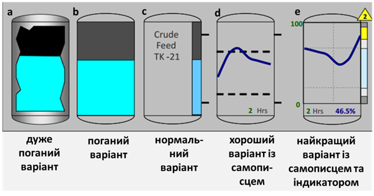 

*Рис. 5.42.* Різні варіанти відображення рівня

Запропонований підхід був апробований автором цього посібника на кількох підприємствах. На рис. 5.37 та 5.43 показані значення рівня в збірниках. На рис. 5.37 та 5.43 (внизу) тренди зроблені на устаткованні, що виконані у вигляді 3D (з використанням градієнта). Використання градієнта було вимогою замовника, що значно ускладнило сприйняття тренду. На верхній частині рис. 5.43 показано той самий фрагмент дисплейної сторінки, але вже без градієнтів; відсутність градієнта зробило кращим контрастування трендів. Це ще одна причина, чому не варто зловживати 3D та градієнтами. Слід зазначити, що фрагменти дисплеїв з рис. 5.42 мають ще ряд недоліків, зокрема, не дуже вдало були підібрані відтінки та заповненні області устатковання.   
<a href="media5/5_43.png" target="_blank">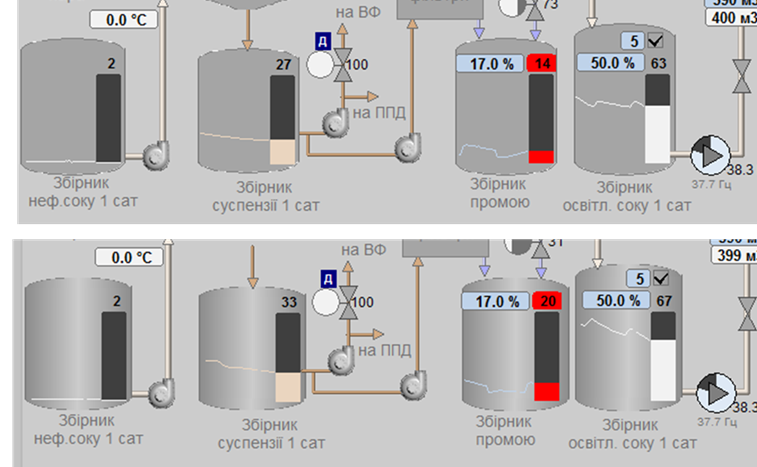</a> 

*Рис. 5.43.* Використання трендів реального часу на збірниках без градієнта (вгорі) та з градієнтом (внизу) 

Хоч наведені на рис. 5.42 варіанти “a та b” були розкритиковані дослідниками [[5](https://youtu.be/RSpwACuPv9A)],[[9](https://www.amazon.com/High-Performance-HMI-Handbook-Comprehensive-ebook/dp/B00CELQJU8)], автор цього посібника провів експеримент, в якому оператори після кількох днів використання попросили змінити зображення рівнів у ємностях зберігання молока з вигляду варіанта “e” до варіанта “b”. Їх основний аргумент: "краще видно навіть здалеку". Відображення ж тенденції зміни рівня для операторів не було затребуваним, оскільки збірники наповнювалися та вивантажувалися періодично. Таким чином, використання того чи іншого варіанта зображення сильно залежить від об’єкта та реалізації інших складових системи.  

## 5.8.3. Елементи високоефективних людино-машинних інтерфейсів

   Деякі підходи щодо розроблення високоефективних людино-машинних інтерфейсів описані в підрозділі 5.1 та в параграфі 5.8.2. Велика кількість приладів наведені в роботах [2–12] а також вони є у вільному доступі в Інтернеті. Дуже цікавим є відео [[10](https://youtu.be/9YdIYMwWkxM)], яке наглядно показує графічні можливості, що є у Wonderware HMI SCADA. 

Далі наведені тільки деякі доповнення елементами та підходами, що з’явилися за останні кілька років.

**1.**   **Збірні компоненти для відображення стану процесу або контуру у вигляді індикаторів.**

Останнім часом у засобах SCADA/HMI почали з’являтися нові складені компоненти, які відображають стан процесу або контуру регулювання, що характеризуються кількома змінними. Зовнішній вигляд і стиль можуть сильно змінюватися, але їх об’єднує один принцип – скомпонований графічний елемент змінює свою зовнішність залежно від кількох значень (плинне, задане, обмеження та ін.). Це дає можливість оцінити стан частини процесу (функції, контуру регулювання тощо) одним поглядом. 

На рис. 5.44 показано приклад відображення індикаторів в аналоговій формі. На рисунку видно не тільки саме значення, а і його розміщення відносно діапазонів його меж. Праворуч відображений стан регулятора, де індикатор доповнюється уставкою, значенням виходу на виконавчий механізм (ВМ) та режимом роботи. Якщо виконавчий механізм має зворотній зв'язок за положенням регулюючого органу (РО), він показується на тому самому повзунку, що й вихід на ВМ, тому при однаковості їх значень вони займуть ту саму позицію.    
<a href="media5/5_44.png" target="_blank">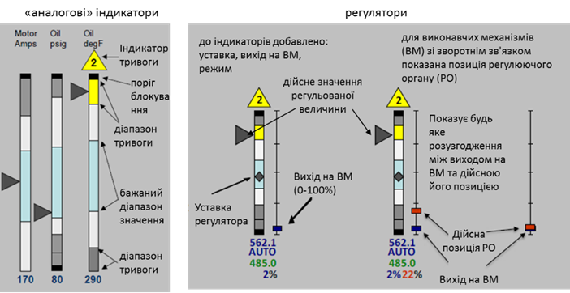</a> 

*Рис. 5.44.* Компоненти – "аналогові" індикатори та регулятори 

Індикатори можуть також містити додаткову смугу, висота якої показує на значення параметра за останній час, наприклад, за останню годину (рис. 5.45).

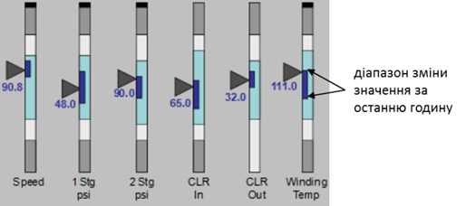 

*Рис. 5.45.* Індикатори з додатковим відображенням смуги діапазону зміни значення за останній час 

Варіанти подібних індикаторів трапляються все частіше в бібліотеках сучасних засобів SCADA/HMI. На рис. 5.46 показано кілька варіантів індикаторів з бібліотеки Wonderware Situational Awareness із System Platform. Там закладені подібні до розглянутих вище ідеї, однак тут для різних типів параметрів пропонуються дещо різні зображення. Тим не менше, кожен компонент будується приблизно за однаковим принципом (рис. 5.47). Рекомендується відображати плинне значення в діапазоні доступних меж, який, як правило, менший від діапазону вимірювального датчика. За необхідності компонент може відображати повний діапазон, при цьому графічно вказується "прапорець" перпендикулярно до шкали. Бібліотечні елементи підтримують багато додаткових можливостей, зокрема: автоматичне масштабування; автоматична зміна діапазону доступних значень на повний діапазон вимірювання; поява стрілки напрямку зміни.     
<a href="media5/5_46.png" target="_blank">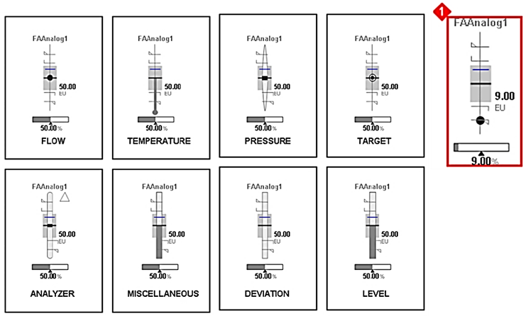</a> 

*Рис.* *5.46.*Кілька варіантів компонентів з бібліотеки Wonderware Situational Awareness Library  

<a href="media5/5_47.png" target="_blank">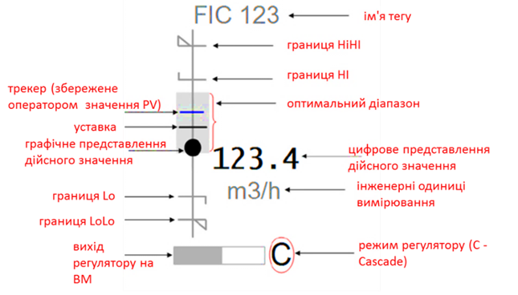</a> 

*Рис.* *5.47.* Налаштування компонента з бібліотеки Wonderware Situational Awareness Library 

У стані тривоги весь компонент виділяється смугою відповідного кольору та з позначкою тривоги в геометричній фігурі. На дисплеї це матиме вигляд, як показано на рис .5.48.  
<a href="media5/5_48.jpg" target="_blank">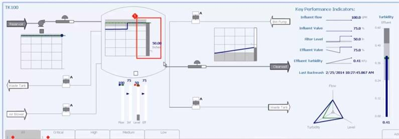</a> 

*Рис.* *5.48.* Відображення тривоги на дисплейному компоненті в Wonderware Situational Awareness Library 

**2.**   **Збірні багатоелементні компоненти.**

Окрім стандартних форм представлення змінних процесу та регуляторів у вигляді індикаторів (так званий "приладовий інтерфейс"), все частіше використовують складені багатоелементні компоненти, які автори [2–6] називають "екологічним інтерфейсом". Одним з таких компонентів є пелюсткова діаграма, на якій відображено кілька значень параметрів у якості відрізку на одному з променів-радіусів кола, що зміщені один відносно одного на однаковий кут. З’єднанні між собою кінці відрізків утворюють фігуру. На прикладі використання (рис. 5.49, а) таких параметрів 12. Форма фігури є представленням стану технологічного процесу або його частини. 
<a href="media5/5_49.png" target="_blank">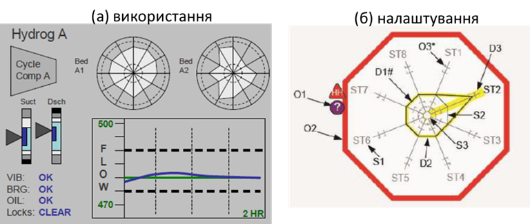</a> 

*Рис.5.49.* Приклад використання та налаштування пелюсткових діаграм.

На рис. 5.49,б показано також приклад налаштування пелюсткової діаграми на 8-ми променях із бібліотеки Wonderware Situational Awareness Library. На схемі позначені такі елементи (D – динамічні, S – статичні, O – інші об’єкти ):

D1: плинний контур пелюсткової діаграми;

D2: виділення тривожного пелюстка (пов’язано з O2);

D3: виділення тривожного сигналу/променя (пов’язано з O2);

S1: ідентифікатор променя;

S2: очікувана форма пелюстка; 

S3: вісь; 

O1: ідентифікатор стану якості даних;

O2: рамка компонента в стані тривоги.

На рис. 5.50 показано приклад відображення іншого типу компонента, для барабана-сепаратора, в якому пароводяна суміш розділяється на пар та конденсат [6]. Рівень води повинен підтримуватися в досить вузькому діапазоні, і залежить від кількох параметрів: витрат суміші з реактора, від системи живлення і продувки, відбору пари та води. Компонент допомагає:

- показати тенденцію зміни рівня в барабані за трендом;

- показати різницю показань рівня за двома вимірюваними резервованими датчиками, що відображається товщиною лінії тренду; 

- відобразити дисбаланс між подачею води в барабан і відбором пари шляхом опускання перпендикуляра від однієї шкали до іншої;

- визначити за уставками час спрацювання захисту, якщо процес протікатиме в тому самому напрямку.
<a href="media5/5_50.png" target="_blank">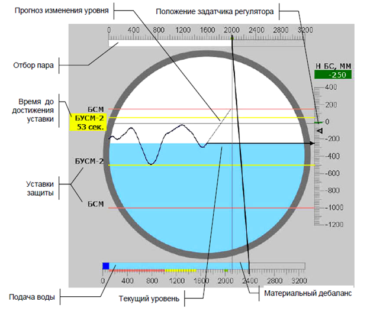</a> 

*Рис. 5.50.* Приклад відображення барабана-сепаратора [6]

**3.**   **Контекстна допомога.**

Використання контекстної допомоги може значно допомогти операторові при нештатних ситуаціях. Крім того, контекстна допомога може зберігати усю додаткову інформацію про устатковання або технологічний процес, що потрібно не тільки оператору, а й обслуговуючому персоналу. Контекстну допомогу можна реалізувати, наприклад, через елементи контекстного меню (див. підрозділ 5.7).

**4.**   **Дисплеї спеціального призначення.**

Для пусків, зупинок, перехідних режимів, нештатних ситуацій рекомендується робити окремі дисплеї, які вміщують необхідну інформацію, характерну тільки для цих режимів установки. Серед таких елементів можуть бути спеціальні тренди, які показують знаходження змінної в заданих межах, що також змінюються з часом (рис. 5.51). Автори вебінару [[5](https://youtu.be/RSpwACuPv9A)] порівнюють лінії обмежень з відмітками на автомобільних дорогах.  

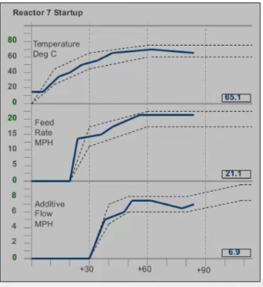 

*Рис. 5.51.* Приклад відображення трендів запуску установки

[<--5.7. Ієрархія дисплеїв та навігація](5_7.md)

[--> Розділ 6. Розроблення підсистеми тривожної сигналізації](6.md)
