[Головна](README.md) > [6.Розроблення підсистеми тривожної сигналізації](6.md)

# 6.11. Підсистема тривожної сигналізації в SCADA Citect

## 6.11.1. Загальні принципи функціонування

У SCADA Citect функціями тривожної сигналізації (окрім функцій HMI) займається ***сервер тривог*** (Alarm Server). Усі тривоги (окрім системних) означуються розробником через ***тег тривоги*** (тег аларма, ***alarm tag***), у якому задаються всі налаштування, що відповідають за виявлення тривоги та її поведінку. 

У SCADA Citect для тегу тривоги реалізований стандартний автомат станів, який описаний вище, в тому числі підтримує блоковані тривоги. Однак є певні відмінності в англійській термінології означенні станів, зокрема усі блоковані тривоги в Citect називаються Disabled, хоч у деяких місцях для відтермінованих тривог використовується термін Shelved. У будь-якому випадку, внутрішні механізми організації усіх блокованих тривог однакові з описаними в стандарті. Для реалізації проектно-блокованих тривог використовуються Cicode функції блокування (AlarmDisable, AlarmDisableREC) та розблокування (AlarmEnable, AlarmEnableREC).     

Більшість тегів тривог оброблюються з періодом [Alarm]ScanTime (задається в Citect.ini).

Тривоги записуються в журнали та виводяться на сторінки: 

- активних тривог (Active Alarms Page);

- апаратних тривог (Hardware Alarms Page);

- блокованих тривог (Disabled Alarms Page);

- журналу зведення тривог (Alarm Summary Page);

- журналу послідовності подій (Sequence of Events (SOE) Page);

- банер тривог (Alarm Banner).

Для зведення тривог підтримується ведення журналу. Усі системні події та тривоги з активними опціями журналювання записуються в спеціальний журнал Sequence of Events (SOE).   

Для тегів тривоги означено ряд атрибутів, які задаються в редакторі (рис. 6.14). Перелік атрибутів залежить від типу тривоги, але деякі з них спільні для всіх. Кожний тег повинен мати ім’я, яке як і тег введення/виведення повинно бути унікальним у межах проекту. Для детального описування тегу можна використовувати коментар (Comment; в рос. лок. "Примечание"). Окрім імені, для тегу задається ***назва тривоги*** (Alarm Name) – змістовний опис тривоги, наприклад, ім'я, що включає фізичний пристрій, пов'язаний з тривогою. На відміну від імені тегу тривоги та коментаря, які стосуються розробника проекту SCADA/HMI і не потрібні користувачеві, назва тривоги використовується для відображення на дисплеях.

Для детального представлення операторові використовується ***опис тривоги*** (Alarm Description, в рос. лок. "Описание тревоги"). Цей опис використовується для відображення на дисплеї і записах у журналах і допускає включення в нього змінної частини. Наприклад, якщо в описі тривоги записане значення:  

```
Тривога поломки лінії при швидкості {LineSpeed1}
```

то при формуванні запису замість {LineSpeed1} буде виведене значення тегу LineSpeed1. У фігурних дужках можна вставляти Cicode вирази. 

Окрім детального опису тривоги, Citect підтримує також використання сторінки допомоги для тривог, назву яких можна вказати в атрибуті Help (в рос. лок. "Справка"). У цьому випадку при виклику функції AlarmHelp() для виділеної тривоги відкриється сторінка допомоги.

Усі теги тривоги мають атрибут Delay (в рос. лок. "Задержка"), яка вказує на затримку спрацювання тривоги і задається у форматі HH:MM:SS. Цей атрибут у стандарті ISA-18.2 називається "on-delay". 

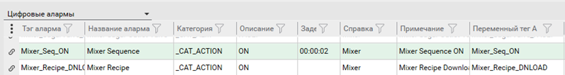                               

*Рис. 6.14*. Приклад налаштування тривог у Citect (вказані вибіркові поля).

Для означення поведінки тривоги на дисплеях (сторінках) тривоги класифікуються через категорії (див. параграф 6.11.3). Тривоги створюються відповідно до вибраного типу. 

У стандарті ISA-18.2 одним із атрибутів є група тривог, за якою можна групувати тривоги по відношенню їх до певної частини просу чи устатковання. У SCADA Citect для цього використовується устатковання (Equipment), частиною якого може бути тег тривоги (див. параграф 9.2.3). 

## 6.11.2. Типи тривог 

У SCADA Citect поняття типу тривог збігається зі стандартним (ISA-18.2). Тим не менше, у Citect усі типи розділяються на дві групи:

- ***конфігуровані тривоги*** (Defined alarms) – ці тривоги конфігуруються розробником проекту самостійно;  

- ***апаратні тривоги*** (Hardware alarms, в рос.лок. "Аппаратные тревоги") – ці тривоги пов’язані з роботою самої системи Citect і не потребують конфігурування. 

Короткий опис типів тривог наведений у табл.6.7. У колонці "Назва аналогу ISA-18.2" подано еквівалентний, на думку автора, аналог у стандарті. Слід зазначити, що таке авторське уявлення надане для кращого розуміння читачем і не є офіційною позицією Schneider Electric.   

*Таблиця 6.7.* 

**Типи тривог у** **SCADA Citect**

| Назва Citect                                                 | Назва аналогу ISA-18.2 (англ)                            | Умова спрацювання та налаштування                            |
| ------------------------------------------------------------ | -------------------------------------------------------- | :----------------------------------------------------------- |
| Апаратні тривоги /Hardware alarms/Аппаратные алармы          | system diagnostic alarm                                  | Апаратні тривоги можуть  виникати, наприклад, через помилки: комунікаційних; доступу чи роботи  серверів; роботи Cicode-функцій. Не конфігуруються розробником, є  наперед означеними |
| Дискретні  тривоги/Digital Alarm/Цифровые алармы             | absolute alarm,  discrepancy alarm                       | Спрацьовують залежно від стану 2-х  дискретних змінних тегів. Дискретна тривога виникає тоді, коли вирази в полі  тег А та тег В будуть дорівнювати TRUE. Якщо поле "Variable Tag B" порожнє, то перевіряється  тільки тег А. У поля можна також вставляти перед тегами оператор  "NOT" для інверсії умови |
| Мульти-дискретні  тривоги /Multi-Digital Alarm/Многоразрядные  алармы | bit-pattern  alarm                                       | Спрацьовують  залежно від комбінації станів 3-х дискретних змінних тегів, які вказуються в  полях тегів A, B та C (рис. 6.15), мають додаткові налаштування; для  кожної з 8-ми комбінацій станів задається опис тривоги (в рос. лок. "Состояние")  та активації тривоги (в рос. лок. "Триггер": 1 – задіяти, 0 – не  задіяти); тобто "Состояние 00A" = "@(SM-A1)" – означає,  що при спрацюванні тільки тегу А буде відображатися "SM-A1"; поле "Повторный  аларм" задає, чи треба генерувати нову тривогу при переході з одного  стану активної тривоги в інший стан також активної тривоги; для переходу між  станами тривоги можна задати функції, які будуть викликатися;  підтримується взаємне програмне блокування  тривог у межах однії групи, яка задається атрибутом Suppression (в рос. лок. "Блокировка"): тривоги з меншим рівнем  блокування (Level, в рос. лок. "Уровень")  будуть блокувати тривоги з більшим рівнем у межах тієї самої групи |
| Аналогові  тривоги/ Analog Alarm/ Аналоговые алармы          | absolute alarm,  deviation alarm,   rate-of-change alarm | Спрацьовують при виході значення  аналогової змінної за одну або декілька заданих меж; у налаштуванні тривоги вказується  тег (або Cicode-вираз), значення якого буде перевірятися (рис. 6.16); можна  задати Deadband ("Зона нечуствит."), що відповідає однойменному в  стандарті – повернення до норми тільки після проходження цієї зони |

|                                                              |                                                              |                                                              |
| ------------------------------------------------------------ | ------------------------------------------------------------ | ------------------------------------------------------------ |
|                                                              | absolute alarm                                               | Підтримується тривога високого (high  alarm) і критично високого значення (high high alarm), тривога низького (low  alarm) і критично низького значення (low low alarm); для кожної межі можна  задати значення, проходячи через яку буде генеруватися тривога, а також  затримку (Delay) на спрацювання |
| deviation alarm                                              | Підтримується тривога відхилення  (deviation alarm), коли значення відхиляється від значення, заздалегідь  означеного в атрибуті "Уставка" (Setpoint) на величину, вказану в  атрибуті Deviation (в рос. лок. "Отклонение"); окрім значення,  також можна задати затримку на спрацювання |                                                              |
| rate-of-change alarm                                         | Підтримується тривога швидкості  зміни (rate of change alarm), коли значення змінної змінюється дуже швидко; у  полі Rate (в рос. лок. "Скорость") можна задати значення, яке буде  використовуватися в якості максимально-дозволеної зміни за період, що  задається в параметрі [Alarm]Period; у моменти сканування тривоги (задається  параметром [Alarm]ScanTime) перевіряється значення тегу, якщо швидкість його  зміни перевищує максимальну – спрацьовує сигнал про швидкість зміни |                                                              |
| Розширені тривоги/Advanced  Alarm / Расширенные алармы       | calculated alarm, adjustable alarm,  adaptive alarm          | Спрацьовують, коли результат Cicode виразу, заданого в атрибуті Expression  (в рос. лок."Выражение"), повертає TRUE |
| Тривоги з  відміткою часу/Time Stamped Alarm/ Алармы с  меткой времени | явно  не виділені                                            | Подібні до дискретної тривоги, за  винятком того, що відмітка часу спрацювання береться з окремої  змінної-лічильника, що задається в атрибутом Timer Expr. (в рос.лок."Выражение  таймера"); детальніше див. довідник |
| Дискретні  тривоги з відміткою часу/Time Stamped Digital Alarm/Цифровые  алармы с меткой времени | явно  не виділені                                            | Подібні до дискретної тривоги, за  винятком того, що дискретні теги тривоги оновлюються за підпискою від сервера  введення/виведення; відмітка часу береться зі змінного тегу |
| Аналогові  тривоги з відміткою часу/Time Stamped Analog Alarm/Аналоговые  алармы с меткой времени | явно  не виділені                                            | Подібні до аналогової тривоги, за  винятком того, що аналогові теги тривоги оновлюються за підпискою від сервера  введення/виведення; відмітка часу береться зі змінного тегу |

Інші типи тривог з ISA-18.2 можуть бути реалізовані з використанням Cicode.

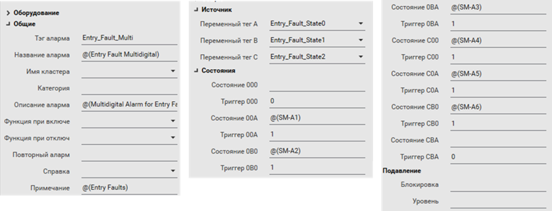 

*Рис. 6.15.* Приклад додаткових налаштувань мультидискретної тривоги

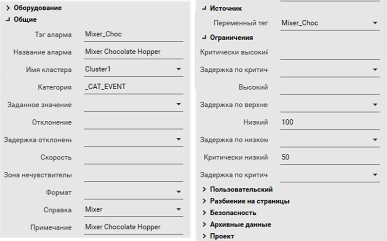 

*Рис. 6.16.* Приклад додаткових налаштувань аналогової тривоги

## 6.11.3. Категорія тривог (Alarm Category) 

Для означення поведінки тривоги в налаштуваннях тегу тривоги вказують ***категорію тривоги*** (Alarm Category, в рос. лок."Категория алармов"), в якій задають (рис. 6.17): 

- пріоритет тривоги; 

- шрифт, який використовується під час відображення тривоги (у SCADA Citect у шрифті задається розмір, колір тексту і фону, миготіння);

- форматування, яке використовується при появі тривоги;

- дія, яка запускається (через вираз Cicode), коли сигнал тривоги досягає заданого статусу (увімкнено, вимкнено або підтверджено);

- журнал, який використовується для тривоги.

Як зазначено в довідниковій системі, основним фактором для розділення за категоріями є пріоритет. Однак, враховуючи, що може бути кілька категорій з однаковим пріоритетом, можна класифікувати тривоги і за іншою ознакою, наприклад, приналежність до класу.

Кожна категорія має свій номер, який вказується в атрибуті "категорія" тегу тривоги, щоб віднести її до цієї категорії. Якщо номер категорії в тегу не вказується, то вважається, що це категорія 0. У SCADA Citect деякі номери категорій зарезервовані:

0 – категорія за замовченням, тобто якщо в налаштуваннях тривоги не вказується номер категорії, вважається 0; 

254 – для зведення тривог (Alarm Summary);

255 – для апаратних тривог (Hardware Alarm). 

Якщо в проекті не створені категорії із зарезервованими номерами, для них використовуються властивості за замовченням. Користуватися номерами не дуже зручно, тому рекомендується використовувати ярлики (Label), які замінюють числа на текстові осмислені повідомлення (застосовуються для будь-яких полів, а не тільки для тривог).   

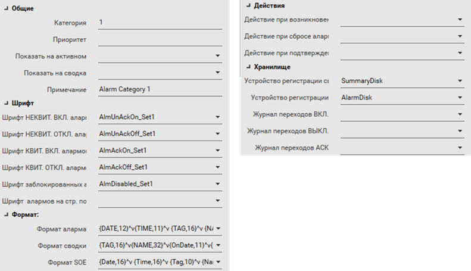 

*Рис. 6.17.* Налаштування категорії тривоги 

Пріоритет тривоги задає послідовність відображення активних тривог у списку, що відповідає стандарту ISA-18.2. Пріоритет 0 – це найвищий пріоритет, 255 – найнижчий. За замовченням використовується пріоритет 0.

Для категорії можна вказати, чи необхідно виводити дану тривогу на сторінці активних тривог (Show on Active; в рос. лок. "Показывать на активном") та зведених тривог (Show on Summary; в рос. лок. "Показывать на сводка").  

Для записування подій тривог у файл журналу (текстовий файл, принтер, базу даних) у вигляді зведення, в полі Summary Device (в рос. лок. "Устройство регистрации сводки") вказується назва системного пристрою, куди треба вести записування. Якщо необхідно вести журнал у вигляді списку, заповнюється поле Log Device (в рос. лок. "Устройство регистрации"). Які саме події необхідно записувати в журнал, вказується вибором TRUE в полях ON, OFF та ACK відповідно. Слід зазначити, що сучасні версії та нові шаблони Citect (від версій 7.5 до 8.1) не потребують означення цих журналів для їх відображення в шаблонних сторінках SOE та Summary. Ці журнали можуть знадобитися для ведення історії в текстових файлах або базах даних для перегляду в сторонніх програмах (див. 6.11.4).  

Для означення формату відображення на сторінці активних тривог зведення тривог та SOE використовуються відповідно поля Alarm Format (рос. лок. "Формат аларма"), Summary Format (рос. лок. "Формат сводки") та SOE Format (рос. лок. "Формат SOE"). Однак формат для кожної категорії окремо підтримується тільки деякими шаблонами. Для шаблонів Tab_Style та StruxureWare формат означується першим зі списку:

- параметрами [Format]Alarm, [Format]Summary і [Format]SOE відповідно;

- форматом означеним в категорії 0;

- форматом за замовчуванням.

При означенні формату у фігурних дужках вказуються поля, кількість літер для відображення та вирівнювання (L (Left), R (Right) або N (None)):

```
{<ім’я поля>, [кількість літер[, вирівнювання]]}
```

Між полями можна вказувати знак табуляції "^t". Для сторінки тривог та SOE дозволяється використовувати поля, неповний перелік яких подано в табл.6.8.

*Таблиця 6.8.* **Деякі поля для сторінок активних тривог та SOE 
 (повний перелік див. у довідниковій системі)**

| **Поле**          | **Опис**                                                     |
| ----------------- | ------------------------------------------------------------ |
| {Tag,n}           | Ім’я аларм тегу                                              |
| {AlarmType,n}     | Тип тривоги: наприклад  "Digital"                            |
| {AlmComment,n}    | Текст,  введений для тривоги в полі коментарю                |
| {Name,n}          | Текст,  введений для тривоги в полі імені тривоги            |
| {Desc,n}          | Текст,  введений для тривоги в полі опису тривоги            |
| {Category,n}      | Номер  категорії                                             |
| {Area,n}          | Зона                                                         |
| {Priv,n}          | Привілеї                                                     |
| {Priority,n}      | Пріоритет                                                    |
| {Type,n}          | Стан тривоги:  ACKNOWLEDGED, CLEARED, DISABLED, UNACKNOWLEDGED |
| {LocalTimeDate,n} | Дата та час:  "yyyy-mm-dd hh:mm:ss[.ttt]"                    |
| {Time,n}          | Час останньої  зміни стану (hh:mm:ss).                       |

|              |                                                              |
| ------------ | ------------------------------------------------------------ |
| {Date,n}     | Дата останньої  зміни стану (dd:mm:yyyy).                    |
| {Value,n}    | Плинне  значення для аналогової тривоги                      |
| {State,n}    | Плинний стан  аналогової тривоги: DEVIATION, RATE, LOW, LOWLOW, HIGH, HIGHHIGH, CLEARED |
| {ErrDesc,n}  | Інформація про  апаратну тривогу                             |
| {LogState,n} | Стан тривоги  (для лог-журналу)                              |

Для сторінки зведення дозволяється використовувати поля, які показані в табл.6.9. 

*Таблиця 6.9.* 

**Деякі поля для сторінок зведення тривог 
 (повний перелік див. в довідниковій системі)**

| **Поле**     | **Опис**                                                     |
| ------------ | ------------------------------------------------------------ |
| {UserName,n} | Ім'я користувача, що проводив певні дії з тривогами (наприклад  підтвердження) |
| {FullName,n} | Повне ім'я користувача, що проводив певні дії з тривогами (наприклад  підтвердження) |
| {UserDesc,n} | Текст пов’язаний з подією, записаний користувачем            |
| {OnDate,n}   | Дата виникнення тривоги                                      |
| {OnTime,n}   | Час виникнення тривоги                                       |
| {OffDate,n}  | Дата повернення тривоги до нормального стану                 |
| {OffTime,n}  | Час повернення тривоги до нормального стану                  |
| {AckDate,n}  | Дата підтвердження тривоги                                   |
| {AckTime,n}  | Час підтвердження тривоги                                    |
| {SumState,n} | Плинний стан тривоги                                         |
| {SumDesc,n}  | Плинний опис тривоги                                         |
| {SumType,n}  | Стан тривоги: ACKNOWLEDGED, CLEARED, DISABLED, UNACKNOWLEDGED |
| {Comment,n}  | Коментар, який вводить оператор у режимі виконання           |

## 6.11.4. Ведення журналів тривог і подій та їх відображення на дисплеях (сторінках)  

Запис зміни стану тривог в історичні журнал проводиться в трьох варіантах:

- журнал зведення тривог;

- журнал списку тривог;

- журнал послідовності подій (SOE).

Журнал зведення тривог (Alarm summary log) зберігається в пам’яті і з певною періодичністю або за подією записується на диск у папку, що вказана параметром [DATA]. За замовчуванням це проводиться автоматично, і сторінки зведення можуть показувати зміст журналу. Якщо необхідно зведення тривог переглядати в інших програмах, його можна виводити на пристрій системного виведення (див.6.11.6), наприклад, у текстовий файл або в базу даних. 

У старих версіях Citect журнал списку тривог (Alarm Log) був єдиним способом ведення історії тривог. Журнал був реалізований через пристрої системного виведення (див.6.11.6), який давав змогу виводити тривоги в базу даних, принтер або текстовий файл. Зараз стандартним підходом є використання SOE, тому журнал використовується радше для виведення для сторонніх програм або принтер.  

***Журнал послідовності подій*** (***SOE***, Sequence of Events) використовується як єдина база даних тривог та подій. На відміну від журналів, які організовані через пристрої системного введення/виведення, він надає можливість зручного перегляду та керування записами через вбудовані засоби шаблонів сторінок та функції Cicode. Крім того, він фіксує не тільки означені користувачем події, а й системні. У Citect події (Events) вважаються більш загальним поняттям і включають у себе:

- Action (Дії) — події, що реєструють дію, здійснену оператором для тривоги; 

- `<Alarm Type>` — події, пов'язані з певним типом тривоги (наприклад, ON, OFF та ACK); 

- System (Системні) — системні події, наприклад, зупинка та перезапуск сервера;  

- Configuration (конфігураційні) — події, що відбуваються під час завантаження змін конфігурації (наприклад, додавання або видалення тегів тривоги);

- Comment (коментарі) —події, які вказують, коли користувач додає коментар до послідовності подій ;

- Interface Events (інтерфейсні події) — події, які вказують, коли користувач додає нову подію до SOE.

Для відображення активних тривог та журналів використовується вбудована в шаблони сторінок анімація та спеціальні сторінки. У табл. 6.10 ці засоби наведені в контексті їх переліку в ISA-18.2. 

*Таблиця 6.**10**.* 

**Спеціальні шаблони та елементи сторінок** 

| **Дисплеї    ISA-18.2 (англ)**                               | **Засоби  Citect (укр./англ./рос.лок**                       | **Призначення  та способи реалізації**                       |
| ------------------------------------------------------------ | ------------------------------------------------------------ | ------------------------------------------------------------ |
| alarm summary display                                        | Сторінка активних тривог/Active  Alarms Page/Активные  алармы | відображаються  усі активні тривоги, тобто які не в стані "норма А" (див. рис. 6.5);  відображають (див. рис. 6.18) усю необхідну інформацію про  тривоги та надають можливість керувати відображенням та станом тривоги  відповідно до вимог ISA-18.2 (див. табл.  16.4); реалізовуються через шаблони або власні сторінки |
| Сторінка журналу зведення тривог/Alarm  Summary Page/сводка  алармов | відображаються  записи, в яких наведені дата та час всіх подій проходження по автомату  станів (рис. 6.21); реалізовуються  через шаблони або власні сторінки |                                                              |

|                                                              |                                                              |                                                              |
| ------------------------------------------------------------ | ------------------------------------------------------------ | ------------------------------------------------------------ |
| alarm summary status display                                 | Банер тривог/ Alarm  Banner/Аларм баннер                     | відображається  останні тривоги з найвищим пріоритетом та зведення статусу тривог (див.рис. 6.24);  реалізовуються через шаблони або джини |
| alarm log display                                            | Сторінка журналу послідовності  подій/ Sequence of Events (SOE) Page/Последовательность  событий | відображаються  події, в тому числі системні та тривоги у вигляді хронології подій (див.рис. 6.22);  реалізовуються через шаблони або власні сторінки |
| Сторінка журналу зведення тривог/Alarm  Summary Page/сводка  алармов | відображаються  записи, в яких наведені дата та час усіх подій проходження по автомату  станів (див. рис. 6.21);  реалізовуються через шаблони або власні сторінки |                                                              |
| process display                                              | Анімовані елементи на сторінках                              | змінюється  візуальне представлення та текст; реалізовуються через використання анімації  та джинів з прив’язкою до властивостей тегів тривог |
| system diagnostic alarm display                              | Сторінка апаратних тривог/Hardware  Alarms Page/Аппаратные  адармы | відображаються  усі активні апаратні (системні) тривоги; реалізовуються через шаблони або  власні сторінки |
| shelved alarm display,  suppressed-by-design alarm display, out-of-service alarm display | Сторінка блокованих тривог/ Disabled  Alarms Page/Отключенные  алармы | відображаються  усі заблоковані тривоги (див. рис. 6.23); реалізовуються через шаблони  або власні сторінки |

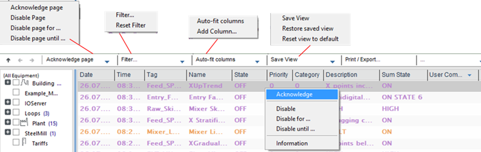 

*Рис. 6.18*. Сторінка активних тривог та доступні функції 

Зверніть увагу, що сторінка журналу зведення тривог не є аналогом сторінки зведення тривог в ISA-18.2. У стандарті в сторінці зведення відображаються активні тривоги, а SCADA Citect для цього існує сторінка активних тривог. У SCADA Citect журнал зведення – це своєрідний тип (історичного) журналу тривог, у якому всі події переходу тривоги зі стану до стану записуються в один запис.

На сторінці активних тривог а також частково на сторінці зведення доступні такі функції (див. рис. 6.18):

- підтвердження виділеної тривоги або всієї сторінки;

- отримання інформації про тривогу (рис. 6.19);

- блокування тривоги або всієї сторінки (Disable);

- відтермінувати тривогу або всю сторінку (Disable for…) та (Disable until…) (див. рис. 6.19);

- впорядкування записів за будь-яким полем (зробивши клік на потрібній колонці);

- добавлення та видалення колонок зі сторінки;

- збереження налаштувань вигляду;

- друк та експорт сторінки;

- фільтрація виведених записів за вказаними в фільтрах критеріями (рис. 6.20);

- фільтрація виведених записів за приналежності до устатковання. 

Як уже було сказано, у стандарті для кожної тривоги можна вказувати групу, до якої вона належить. Групою може бути устатковання або частина технологічного процесу. У SCADA Citect тег тривоги може бути частиною устатковання (Equipment). У цьому випадку для фільтрації записів на сторінці можна використовувати ліву бічну панель, в якій в ієрархічному вигляді представлене устатковання (див. рис. 6.18). Виділивши необхідне устатковання, можна вибрати тільки ті тривоги, що належать до нього. Число праворуч від назви устатковання вказує на кількість активних тривог для нього. Додаткову інформацію про використання устатковання в Citect можна прочитати в параграфі 9.2.3.    

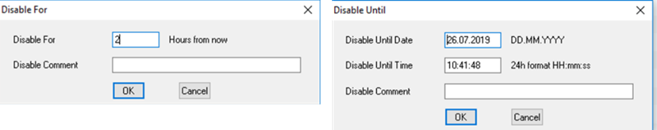 

*Рис. 6.19.* Відтермінування тривог

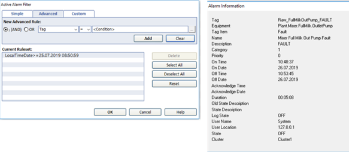 

*Рис. 6.20.* Вікно налаштування фільтру (ліворуч) та вікно інформації про тривогу (праворуч)  

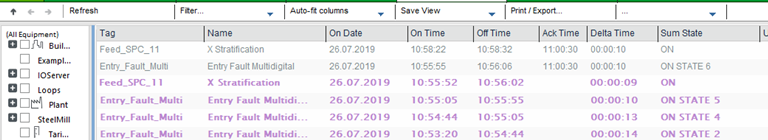 

*Рис. 6.21.* Сторінка зведення тривог

На сторінці SOE доступні всі функції відображення та керування, що вимагаються стандартом ISA-18.2 до дисплеїв журналів тривог. На рис. 6.22 показано тільки частину колонок. 

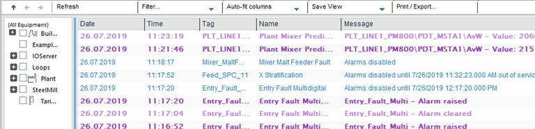 

*Рис. 6.22*. Сторінка послідовності подій SOE

У стандарті ISA-18.2 передбачено три різні способи блокування тривог і відповідно – три окремих дисплеї. У SCADA Citect для цього є тільки одна сторінка, куди виводиться інформація про всі заблоковані тривоги (рис. 6.23). Поле дати часу, до якого діє відтермінування тривоги, може бути пустим; це значить, що це є виведена з обслуговування або проектно-блокована тривога. Якщо необхідно використовувати фільтри, а додаткові поля усі заблоковані, то тривоги можна розподілити на три окремі сторінки. З цієї сторінки необхідні тривоги (або всі) можуть бути розблоковані.   

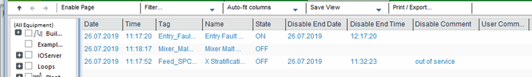   

*Рис. 6.23*. Сторінка заблокованих тривог

Останні найбільш пріоритетні активні тривоги виводяться в банер тривог (рис. 6.24). Лівіше від банера виводяться піктограми різних тривог, клікнувши на які можна перейти до конкретної сторінки тривоги. Праворуч від піктограм відображається кількість тривог на даній сторінці.  

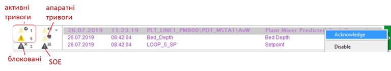 

*Рис.6.24.* Банер тривог та індикатори зведення статусу тривог

Дисплей (сторінка) зведення статусу тривог відсутня в наперед визначених шаблонах Citect. Тим не менше, засоби Citect дають можливість реалізувати таку сторінку самостійно. У переліку Cicode-функцій є багато таких, що призначені для роботи саме з тривогами (Alarm Functions). На додаток до цього теги тривог можна використовувати для налаштування та анімації на сторінках.  

## 6.11.5. Використання властивостей тривог як тегів  

У Citect є можливість використовувати властивості тегів тривог в анімації та Cicode функціях. Для цього в якості імені вказується назва тегу тривоги та через крапку властивість, до якої необхідно звернутися. Наприклад, якщо необхідно дізнатися про спрацювання тривоги з ім'ям "CV110_ERROR", необхідно звернутися до властивості "On". Тобто:

```
CV110_ERROR.On
```

Перелік властивостей даний в табл. 6.11.

*Таблиця 6.11.* 

**Деякі властивості тегів тривог (повний перелік див. у довідниковій системі)**

| **Власти­вість** | **Опис**                                         | **Доступ**            | **Примітка**                                    |
| ---------------- | ------------------------------------------------ | --------------------- | ----------------------------------------------- |
| .On              | =1 – Тривога активна                             | читання               |                                                 |
| .Ack             | =1 – Тривога підтверджена                        | читання/  записування |                                                 |
| .Disabled        | =1 – Тривога заблокована                         | читання/  записування |                                                 |
| .Name            | Ім’я тривоги                                     | читання               | аналогічне полю налаштування тривоги            |
| .State           | Стан тривоги                                     | читання               | числове значення                                |
| .Desc            | Опис тривоги                                     | читання               | аналогічне полю налаштування  аналогових тривог |
| .Tag             | Ім’я тегу тривоги                                | читання               | аналогічне полю налаштування тривоги            |
| .DVL             | =1 – активна тривога відхилення  (вниз)          | читання               | тільки для аналогових тривог                    |
| .DVH             | =1 – активна тривога відхилення  (вверх)         | читання               | тільки для аналогових тривог                    |
| .R               | =1 – активна тривога швидкої зміни  значення     | читання               | тільки для аналогових тривог                    |
| .L               | =1 – активна тривога низького  значення          | читання               | тільки для аналогових тривог                    |
| .H               | =1 – активна тривога високого  значення          | читання               | тільки для аналогових тривог                    |
| .LL              | =1 – активна тривога критично  низького значення | читання               | тільки для аналогових тривог                    |

|                                     |                                                   |                       |                                                 |
| ----------------------------------- | ------------------------------------------------- | --------------------- | ----------------------------------------------- |
| .HH                                 | =1 – активна тривога кри­тично  високого значення | читання               | тільки для аналогових тривог                    |
| .Value                              | значення змінного тега для тривоги                | читання               | тільки для аналогових тривог                    |
| .DeadBand                           | налаштування зони нечутливості                    | читання/  записування | аналогічне полю налаштування  аналогових тривог |
| .Deviation                          | налаштування значення відхилення                  | читання/  записування | аналогічне полю налаштування  аналогових тривог |
| .HighHigh                           | налаштування критично високого  значення          | читання/  записування | аналогічне полю налаштування  аналогових тривог |
| .High                               | налаштування високого значення                    | читання/  записування | аналогічне полю налаштування  аналогових тривог |
| .LowLow                             | налаштування критично низького  значення          | читання/  записування | аналогічне полю налаштування  аналогових тривог |
| .Low                                | налаштування низького значення                    | читання/  записування | аналогічне полю налаштування  аналогових тривог |
| .HHDelay,.HDelay, .LDelay, .LLDelay | налаштування затримок спрацювання                 | читання/  записування | аналогічне полю налаштування  аналогових тривог |
| .Rate                               | налаштування швидкості зміни                      | читання/  записування | аналогічне полю налаштування  аналогових тривог |
| .Setpoint                           | налаштування уставки для тривоги  відхилення      | читання/  записування | аналогічне полю налаштування  аналогових тривог |

 

## 6.11.6. Пристрої системного введення/виведення в Citect та ведення журналу користувацьких подій 

***Пристрої системного введення/виведення***, або просто ***пристрої*** (Device; в рос. лок. "Устройства") надають користувачеві можливість у Citect забезпечувати записування та читання даних з файлів, принтерів та СУБД (рис. 6.25). Пристрої можуть використовуватися для ведення журналів тривог, записування/читання даних з файлу/БД у Cicode, а також для ведення журналу дій оператора (наприклад, натискання кнопки або введення значення в полі). 

Один і той самий пристрій може використовуватися в різних діяльностях Citect. При необхідності використання декількох пристроїв для виведення їх групують в групу пристроїв. При роботі з СУБД дані можна не тільки записувати, а й зчитувати. Додаткову інформацію про роботу Citect з СУБД Ви можете отримати з параграфа 8.3.5.  

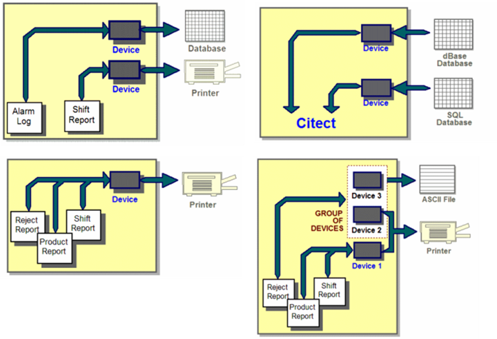 

*Рис. 6.25.* Приклади застосувань пристроїв

При конфігуруванні пристрою вказується тип (рис. 6.26), який можна вибрати з ряду: 

- RTF files; 

- ASCII files; 

- dBASE databases; 

- SQL databases (через ODBC) ; 

- Printers (Принтери). 

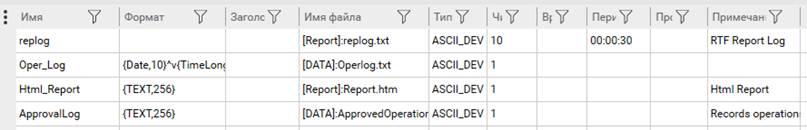 

*Рис. 6.26* Налаштування пристроїв

Для файлів в полі імені файлу (File Name; в рос. лок. "Имя файла") задається ім’я файлу. Шлях до директорії можна вказати з використанням параметра. Наприклад, наступний запис вказуватиме на те, що розміщення файлу буде завдатися параметром DATA, який записується в Citect.ini або в налаштуваннях параметра проекту. 

```
[DATA]: ALARMLOG.TXT
```
Для файлів можна вказати також періодичність створення (рос.лок."Периодичность") та кількість історичних файлів (в рос. лок. "Число файлов"). Нові файли будуть створюватися із зазначеною періодичністю відносно часу, вказаного в полі Time (в рос. лок."Время"). Наприклад, якщо кількість файлів задати 10, періодичність 24:00:00, ім’я FileName.TXT, а час 12:00:00, то відбуватиметься така послідовність (рис. 6.27):

1)   спочатку записування будуть вестися у файл "FileName.TXT";

2) о 12:00 наступного дня файл буде перейменовано на "FileName.001", після чого створиться новий файл "FileName.TXT", куди буде проводитися записування;

3) у 12:00 3-го дня файл "FileName.001" буде перейменовано на "FileName.002", а файл "FileName.TXT" на "FileName.001", після чого створиться новий файл "FileName.TXT", куди буде проводитися записування; 

4) на 11-й день найстаріший файл буде видалено.  

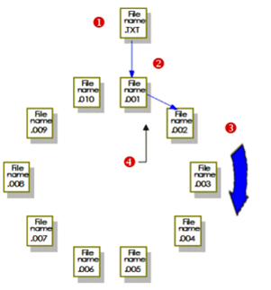 

*Рис. 6.27*. Ведення історії файлів

Якщо кількість файлів не вказано, за замовченням береться 10. Кількість фалів можна також задати рівним:

```
0 – без історії;
-1 - записування в той самий файл.
```

Для означення формату запису в файл використовуються спеціальні поля, як це робиться для полів тривог (див. 6.11.3). Якщо в тривогах не означений формат для журналу, то буде використовуватися той, який означений для пристрою. Для журналу дій оператора використовуються спеціальні імена полів, які вказані в табл. 6.12. 

Для ведення ***журналу дій оператора*** (***лог-журнали***) для необхідного графічного елемента або системної клавіатурної команди вказується пристрій, який повинен бути створений заздалегідь (рис. 6.28), а також повідомлення (MsgLog), яке буде заноситися до лог-журналу (рис. 6.29).

*Таблиця 6.12.* 

**Деякі поля для лог-журналів дій оператора (повний перелік див. в довідниковій системі)**

| **Поле**          | **Опис**                                                     | **Примітка**                   |
| ----------------- | ------------------------------------------------------------ | ------------------------------ |
| {UserName,n}      | Ім’я користувача                                             |                                |
| {FullName,n}      | Повне Ім’я користувача                                       |                                |
| {Time,n}          | Час формування запису в файлі                                |                                |
| {Date,n}          | Дата формування запису в файлі                               |                                |
| {Page,n}          | Назва сторінки, яка була  відображена, коли відбувався запис |                                |
| {MsgLog,n}        | Повідомлення, яке прописано в  графічному елементі або системній клавіатурній команді, що потребує записування  в журналі дій оператора |                                |
| {Arg1,n}…{Arg8,n} | Набір клавіш натиснутих оператором                           | тільки для клавіатурних команд |

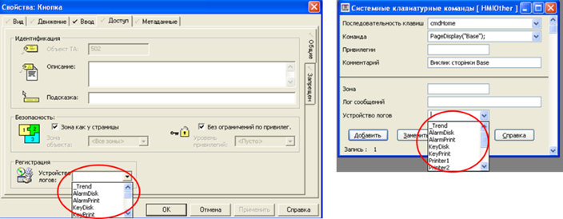 

*Рис. 6.28* Вказівка на пристрій для графічного елемента та системної клавіатурної команди 

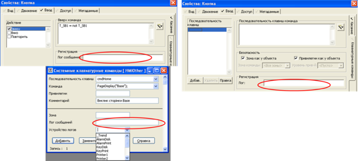 

*Рис .6.29* Вказівка повідомлення, яке буде писатися в пристрій при діях оператора: натисканнях миші по елементу, введення з клавіатури для елемента та на рівні всієї системи

Слід розуміти, що ці події не будуть заноситися в загальний журнал SOE. Для внесення сконфігурованих користувачами подій можна скористатися функцією Cicode "SOEEventAdd".

## 6.11.7. Додаткові функції тривог в Citect 

В останніх версіях SCADA Citect (на час написання актуальна 8.1/2018 R2) у ньому з’явилося багато додаткових можливостей, пов’язаних з тривогами. Частина з них пов’язана з появою принципово нового шаблону Situational Awareness, який описаний у попередньому розділі. Деякі доступні для всіх типів шаблонів. 

Для будь-якої тривоги можна прив’язати інформацію про можливу причину і найбільш адекватне реагування на тривогу з цієї причини (Cause and Response). Інформація про можливу причину (Possible Alarm Cause) і необхідне реагування на неї (Response) добавляється в редакторі і видима через контекстне меню тривоги. Додатково можна означити допустимий час реагування (Response Time) та можливі наслідки (Consequence), якщо реагування не буде зроблене протягом вказаного часу (рис. 6.30). До однієї тривоги може бути прив’язано кілька причин, які будуть видимі у вікні "Cause and Response", і оператор зможе вибрати з них найбільш достовірну.  

У новому шаблоні SCADA Citect з назвою Situational Awareness доступні також додаткові функції, які передбачають використання готових графічних компонентів (джинів) з наперед закладеною анімацією за станом тривог, а саме:

- зміною кольору елементів залежно від пріоритету тривоги; 

- відображення спеціальних символів та літер залежно від пріоритету тривоги;

- зміною кольору та відображення символів залежно від режиму (блокована/неблокована). 

На рис. 6.30 показано фрагмент екрана з нового шаблону SCADA Citect 2018. Компоненти що мають тривоги, підсвічуються кольором та відображають спеціальний символ залежно від режиму та блокування (Shelved/Disabled). У правому нижньому кутку екрана відображається контекст тривоги для виділеного компонента, в якому також для кожної тривоги підсвічується символ залежно від пріоритету.  

На рис. 6.31 показано фрагмент дисплея активних тривог, створеного на базі шаблону Situational Awareness. У вікні навігації устатковання (Equipment Tree) додатково відображається кількість тривог для кожного пріоритету та символ. Також змінено інтерфейс переглядача, в якому швидко можна вибрати тривоги потрібного пріоритету.  

Розроблені шаблони Situational Awareness передбачають використання наперед визначених композитних джинів (Composite Genies), а ті, в свою чергу, використовують налаштування пріоритетів та режими тривог. Для пріоритетів означуються текстове позначення, кольори та джини для анімації символів (рис. 6.32). Джини задаються як для графічних компонентів (Genie Name), так і компактні для переглядачів тривог та навігатора устатковання (Thumbnail Name). Аналогічні налаштування просяться для заблокованих тривог (Shelved/Disabled)  

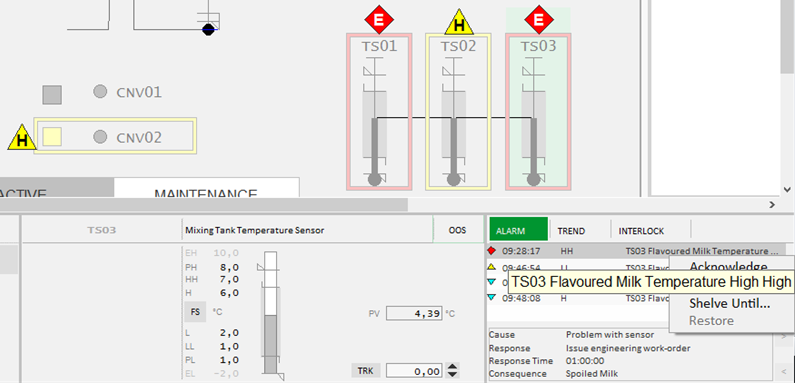 

*Рис. 6.30.* Фрагмент дисплею що створений на базі шаблонів Situational Awareness. 

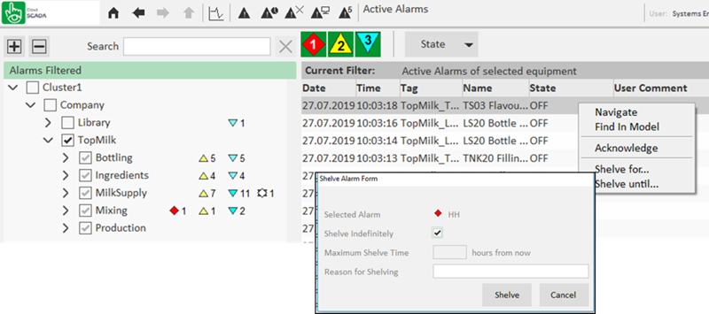 

*Рис. 6.31.* Фрагмент дисплея активних тривог, створеного на базі шаблонів Situational Awareness 

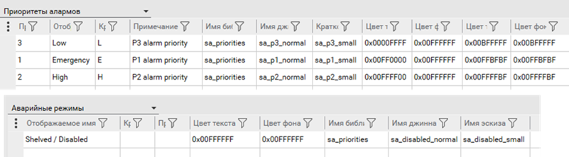 

*Рис. 6.32.* Налаштування відображення пріоритетів та режимів. 