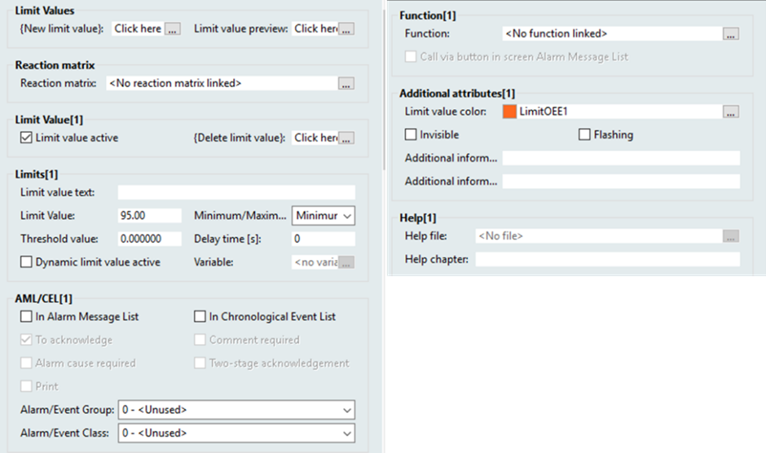
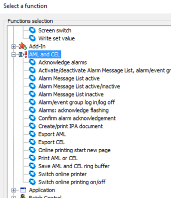
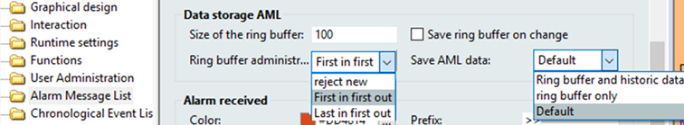
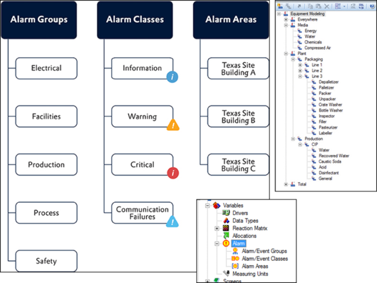
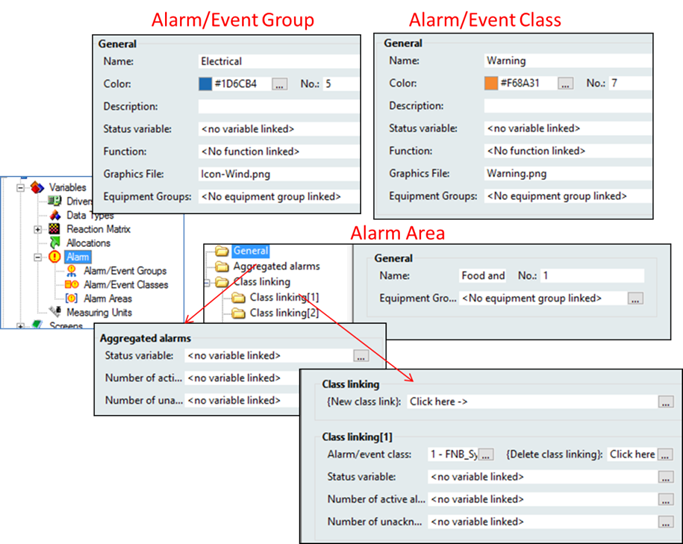
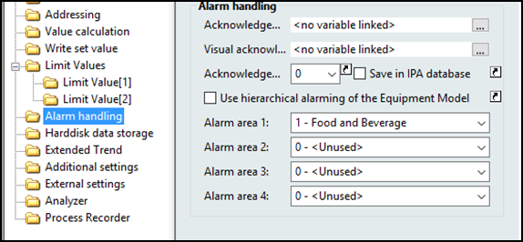
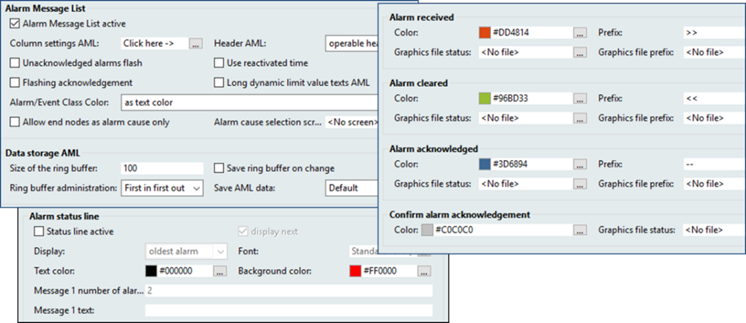
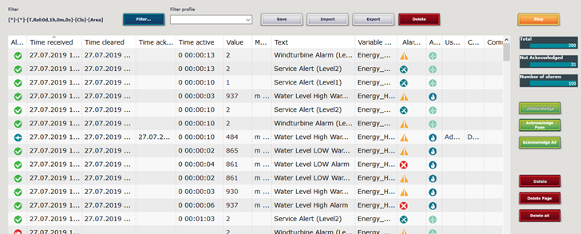
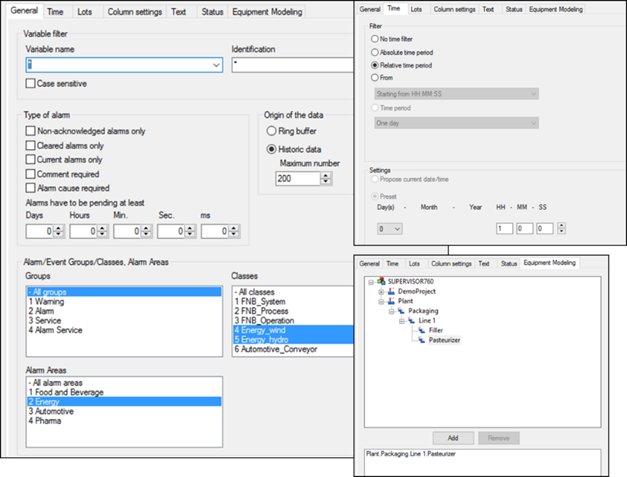
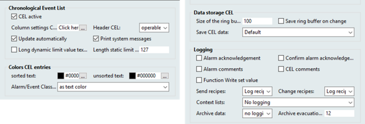

[Головна](README.md) > [6.Розроблення підсистеми тривожної сигналізації](6.md)

# 6.12. Підсистема тривожної сигналізації в SCADA zenon

## 6.12.1. Загальні принципи функціонування

У SCADA zenon конфігурування функцій сигналізації проходить через конфігурування змінних та загальних групових налаштувань тривог та подій. Означення тривог може відбуватися двома взаємовиключними шляхами:

- через добавлення в зміну граничних значень (Limit values) із зазначенням налаштувань, що належать до тривог та подій;

- через створення матриць реакції, в яких налаштовуються поведінка тривог та подій з подальшою їх прив’язкою до змінних 

Обидва варіанти є частиною процесу конфігурування змінних бази даних реального часу. Тобто в zenon немає явно виділених тегів (змінних) тривог. 

Коли тривога спрацьовує, в спеціально виділену область оперативної пам'яті, яка називається ***кільцевим буфером*** (***Ring buffer***), заноситься запис, для якого робляться усі відмітки проходження тривоги по автомату станів, зокрема:

- час появи тривоги, отриманий у мілісекундах як унікальний підпис;

- додаткова інформація, така як причина, значення тощо;

- час зникнення;

- час підтвердження.

Кожний запис у кільцевому буфері – це активна тривога; як тільки тривога повернулася в нормальний стан – вона видаляється з буфера. Для збереження буфера при вимкненні середовища виконання, він записується в файл "alarm.bin" в директорії середовища виконання.

Одночасно з кільцевим буфером усі тривоги записуються у файл журналу тривог ***Alarm Message List*** *(*AML*)* з розширенням "\*.aml". Цей файл створюється автоматично для кожного календарного дня та керується за допомогою властивості "Save AML data". Ім'я файлу тривоги поєднується з буквою "A", а потім – з датою у формі "JJMMDD" та розширенням ".aml"; наприклад "A100623.aml". Ці файли створюються автоматично на кожен день і повинні бути евакуйовані або видалені користувачем вручну, якщо обсяг пам’яті обмежений. Файли "\*.aml" зберігаються у папці "...\Project folder\Computer name\Project name folder".

Кільцевий буфер використовується для виведення на статусний рядок тривоги (Alarm Status Line) або екран типу Alarm Message List. Останній можна використовувати як для перегляду і взаємодії з буфером, так і з журналом AML. 

Кільцевий буфер та AML зберігають інформацію у вигляді зведення, тобто набір записів, кожен з яких представляє проходження автомату станів. Якщо подію необхідно записувати в журнал у хронологічному порядку її виникнення, то використовується ***Chronologic Event List*** (***CEL***). Журналювання подій в CEL розглядається в розділі 6.12.6.

SCADA zenon підтримує кілька автоматів станів для тривог:

- тривоги без необхідності підтвердження; 

- тривоги з необхідністю підтвердження (як в ISA-81.2);

- тривоги з необхідністю двостадійного підтвердження, коли тривога вилучається зі списку активних вручну, навіть коли вона не активна і підтверджена. 

У SCADA zenon є кілька можливостей підтвердження тривог:

- через подвійний правий клік по статусному рядку (alarm status bar) або переглядачі AML;

- через функцію "Acknowledge alarms";

- спеціальну кнопку в переглядачі AML.

Можна сконфігурувати тривоги так, щоб вони потребували обов’язкового коментування перед підтвердженням. Додатковою вимогою може також слугувати попередній вибір причини тривоги (alarm cause). Причини попередньо створюються у вигляді дерева в спеціальних екранах типу "Context List".   

Окрім звичайного підтвердження, в zenon існує можливість робити ***візуальне підтвердження*** *(**Visual acknowledgment**)*. Для цього в екранах типу AML є можливість створити окрему кнопку. Таким чином, в zenon підтвердження може проходити в три етапи:

- візуальне підтвердження;

- підтвердження;

- підтвердження підтвердженого – видалення з кільцевого буфера (при двостадійному підтвердженні);

Хоч в SCADA zenon наявний класичний автомат станів, явної можливості блокувати окремі тривоги немає. Тобто в zenon немає відтермінованих, проектно-блокованих і виведених з обслуговування тривог. Тим не менше, в ньому є можливість блокування тривог за групами або класами, що дає можливість проводити групове блокування, що частково компенсує таку відсутність. Також zenon має можливість індивідуально відключити опитування змінної, через яке також можна реалізувати подібну функцію.

## 6.12.2. Означення типів тривог через граничні значення та матриці реакцій 

Класичним способом означення тривог є використання конфігурованих меж змінної, так званих ***граничних значень змінних*** (Limit Values). Для потрібної змінної або типу створюються граничні значення (рис. 6.33) для яких вказується:

- значення змінної, при якому відбувається перехід через межу (Limit Value); значення змінної може задаватися іншої змінною, для цього треба активувати опцію "Dynamic limit value active" та задати змінну уставки значення межі (Variable); 

- текстове значення (Limit value text), яке асоціюється з даною межею, яке може бути використане в анімації на екранах та в переглядачах тривог; в Runtime значення може формуватися динамічно, для чого використовуються спеціалізовані службові символи, зокрема при формуванні тексту можна використовувати:

  - текст з мовної таблиці (language table); 

  - значення інших змінних;

  - деякі властивості змінної;  

- тип межі (Minimum/Maximum), який вказує яка дія є переходом через межу:

- Minimum – перехід через межу з більшого до меншого значення змінної вважається умовою спрацювання;

- Maximum – перехід через межу з меншого до більшого значення змінної вважається умовою спрацювання;

- значення гістерезису (Threshold value), тобто відхилення від граничного значення, при якому межа перестане спрацьовувати; наприклад, при межі Limit Value = 100 (Maximum) і Threshold value=10 межа спрацює при 100 і більше, а перестане спрацьовувати при 90 і менше;

- час затримки (Delay time);

- опція використання межі як тривоги (In Alarm Message List);

- опція зберігання в журналі подій та тривог (In Chronological Event List);

- опція необхідності підтвердження (To acknowledge);

- опція обов’язковості вказівки причини тривоги (Alarm cause required);

- опція обов’язковості вказівки коментарю для тривоги (Comment required);

- опція обов’язковості ручного видалення тривоги з кільцевого буфера тривог (Two-stage acknowledgment);

- опція виведення тривоги на принтер (Print);

- віднесення до групи тривог (alarm/event group);

- віднесення до класу тривог (alarm/event class);

- колір, прозорість та миготіння для межі;

- функція, яка може бути викликана при спрацюванні межі або вручну через кнопку на екрані AML (при активній опції "Call via button in screen Alarm Message List");

- файл допомоги (Help file) та розділ у ньому (Help chapter).   

                               

*Рис. 6.33*. Налаштування Limit Values 

При переході через граничне значення властивість графічних елементів зміниться відповідно до налаштувань, а в кільцевому буфері та журналі тривог з’являться відповідні записи. Ці налаштування можна задавати для кожної змінної окремо, або задавши їх у типі змінної. 

Є альтернативний варіант конфігурування меж з використанням ***матриці реакцій*** (***Reaction Matrix,ReMa***). Цей підхід передбачає створення матриць реакцій, в яких задаються усі необхідні налаштування для меж, а потім – прив’язують їх до змінних. Матриці реакцій задаються для різних варіантів змінних: Binary, Multi binary, Numeric, Multi numeric, String. На рис. 6.34 показане вікно налаштування для матриці реакцій типу Numeric. Більшість налаштувань такі самі як у конфігуруванні граничних значень. Принциповою відмінністю є те, що умова спрацювання межі задається не через граничне значення, а через комбінацію умов по логічному AND:

- спрацювання умови: більше/менше/рівне за вказане значення, або входить у діапазон;

- відповідає комбінації статусних бітів: для кожного біта задається 0, 1 або будь-яке значення;

- час виконання наведених умов більше за Delay.  

 

*Рис. 6.34.* Налаштування через матрицю реакцій

Для "Multi binary" та "Multi numeric" на вкладці "AML/CEL text" можна означувати додатково окремий текст та активувати запис значення змінної, які будуть добавлятися до тексту повідомлення залежно від бітів статусу. На вкладці "Status Routing" можна сконфігурувати збереження бітів статусу, зчитуючи їх з бітів значення або з інших бітів статусу. Матриці реакції типу “String” дозволяють генерувати реакцію на зміну текстового значення.  

Як бачимо, в zenon тривоги налаштовуються досить гнучко. Хоч явно виділених типів згідно ISA-18.2 в SCADA zenon немає, спробуємо зробити хоча б загальне приведення. Абсолютні тривоги реалізовується штатними засобами як через матрицю реакцій, так і через граничні значення. Враховуючи, що через матрицю реакцій zenon може обробляти значення побітово, достатньо легко можна реалізувати тривоги по бітовому шаблону. Матриця реакцій дає змогу аналізувати статусні біти змінних, що дає можливість реалізувати системно-діагностична тривоги, тривоги діагностування приладу, тривоги помилки вимірювання тощо. Такі тривоги, як тривога відхилення, тривога невідповідності, обчислювальна тривога потребують додаткових внутрішніх та математичних змінних. Зрештою те, що не реалізується безпосередньо, завжди можна зробити через вбудовану систему скриптів. Зведені варіанти реалізації типів ISA-18.2 в SCADA zenon показані в табл. 6.13. Слід зазначити, що це є авторським представленням суто для кращого розуміння читачем і не є офіційною позицією COPA DATA. 

*Таблиця 6.13.* 

**Варіанти реалізацій типів тривог** **ISA-18.2 в** **SCADA zenon** 

| **Назва (англ./ укр.)**                                 | **Засоби реалізації**     | **Варіанти реалізації**                                      |
| ------------------------------------------------------- | ------------------------- | ------------------------------------------------------------ |
| absolute alarm/  абсолютна тривога                      | Limits або ReMa           | задаванням  абсолютних меж, гістерезису, таймауту            |
| deviation alarm/  тривога відхилення                    | Limits або ReMa           | створенням  внутрішньої змінної через математичний драйвер, значення якої дорівнює  різниці значень змінної та уставки |
| rate-of-change alarm/  тривога швидкості зміни змінної  | Limits або ReMa           | через  внутрішні та математичні змінні а також з використанням переприсвоєння (Allocation); можна зробити через скрипти |
| discrepancy alarm/  тривога невідповідності             | ReMa                      | через  внутрішню змінну та/або бітову матрицю                |
| calculated alarm/  обчислювальна тривога                | Limits або ReMa           | створенням  внутрішньої змінної через математичний драйвер, значення якої розраховується  відповідно до вимог |
| recipe-driven alarm/  керована рецептом тривога         | Limits                    | через  динамічне значення межі, значення якої змінюються модулем Batch, при відключеній процедурі задаються завідомо в значенні що не є  тривогою (окремий Limit) |
| bit-pattern alarm/  тривога по бітовому шаблону         | ReMa                      | в  ReMa задається бітова маска                               |
| controller-output alarm/  тривога по виходу регулятора  | Limits або ReMa           | задаванням  абсолютних меж вихідної змінної, гістерезису, таймауту |
| system diagnostic alarm/  системно-діагностична тривога | система,  Limits або ReMa | через  системні повідомлення; через системні змінні          |

|                                                              |                 |                                                              |
| ------------------------------------------------------------ | --------------- | ------------------------------------------------------------ |
| instrument diagnostic alarm/ тривога  діагностування приладу | ReMa            | через  системні біти статусу змінної, деякі беруться з пристроїв |
| adjustable alarm/  налаштовувана оператором тривога          | Limits          | через  динамічне значення межі, значення якої задається через внутрішню змінну  оператором |
| adaptive alarm/адаптивна  тривога                            | Limits          | через  динамічне значення межі, значення якої задається через змінну, яка змінюється  алгоритмом |
| statistical alarm/статистична  тривога                       | Limits або ReMa | через  математичний драйвер                                  |
| first-out alarm/  першопричинна тривога                      | ReMa            | можна  забезпечити через варіанти групового блокування тривог |
| bad-measurement alarm/  тривога помилки вимірювання          | ReMa            | через  системні біти статусу змінної, деякі беруться з пристоїв |

Як уже зазначалося, у zenon штатними засобами не передбачено індивідуального блокування тривог. Однак можна використовувати спеціальні функції для групового блокування, зокрема “Activate or deactivate alarm/event groups/classes” або змінивши змінну статусу для групи чи класу. Заблоковані активні на момент блокування тривоги продовжують змінювати свої стани (можна підтверджувати, вони переходять до нормального стану), але нові записи в кільцевому буфері і в AML не з’являються. Автору не відомі прямі способи фільтрування тривог за блокованими групами, однак можна відслідкувати стан груп/класів.   

У zenon доступно багато інших функцій роботи з тривогами (рис. 6.35)  

 

*Рис. 6.35*. Функції для керування тривогами

## 6.12.3. Кільцевий буфер та AML 

Як написано вище, кільцевий буфер зберігає записи активних тривог. Тривоги видаляються з буфера у випадку: 

- якщо вона не потребує підтвердження: коли перейшла в неактивний статус;

- якщо для тривоги стоїть атрибут "З підтвердженням" ("To acknowledge"): коли перейшла в неактивний статус і підтверджена користувачем;

- якщо для тривоги стоїть атрибут "Двоступеневого підтвердження" ("Two-stage acknowledgement"): коли перейшла в неактивний статус, підтверджена користувачем і явно видалена оператором з буфера.

На відміну від кільцевого буфера, записи ніколи не видаляються з AML, змінюється тільки їхній статус. Розмір кільцевого буфера повинен бути встановлений через однойменну властивість проекту (“Size of the ring buffer”), який вказує на максимальну кількість записів у ньому (рис. 6.36). Рекомендується вказувати розмір рівним принаймні кількості змінних, для яких налаштована тривога.

 

*Рис. 6.36.* Налаштування кільцевого буферу

Коли Runtime закривається, кільцевий буфер автоматично зберігається у файлі alarm.bin. Якщо Runtime закривається несподівано, наприклад, при відключенні живлення, записи будуть втрачені. Щоб запобігти цьому, кільцевий буфер можна зберігати постійно при створенні нового запису, виставивши опцію "Save ring buffer on change at every new entry". Альтернативою є запуск функції "Save AML and CEL ring buffer" (Зберегти кільцевий буфер AML та CEL). 

Файл тривоги "*.aml" зберігається щоразу, коли створюється новий запис. Файл AML синхронізується з кільцевим буфером. Усі зміни типу підтвердження здійснюються лише в кільцевому буфері, а потім синхронізуються з файлом AML. Якщо виставлена опція "Save AML data" = “Ring buffer and historic data”, то одночасно зі збереженням кільцевого буфера буде збережений файл "*.aml". 

Якщо кільцевий буфер переповнюється, оскільки він занадто малий, у файлі тривоги залишаються непідтверджені записи. Вони відображаються під час фільтрації, але їх більше не можна підтвердити. Спроба підтвердити їх може спровокувати підтвердження в кільцевому буфері, якщо тривоги стосуються тієї самої змінної та того самого порушення граничного значення.

## 6.12.4. Класифікація та групування тривог

У zenon тривоги можуть бути згруповані та пріоритизовані через (рис. 6.37):

- логічне групування через групи тривог/подій (Alarm/event groups);

- класифікація за пріоритетом для кольорового кодування тривог в AML і подій в CEL (Alarm/event classes);

- групування за розміщенням на виробничому майданчику (Alarm areas). 

 

*Рис. 6.37.* Групування тривог у zenon

Налаштування груп, класів та ділянок проводиться в розділі проекту Variables->Alarm (див. рис. 6.37). Кожній групі чи класу можна присвоїти ім’я, число, колір, функцію, змінну стану, графічний символ та групу устатковання (equipment group), до якої вони належать. 

***Класи тривог/подій*** (***Alarm/event classes***) зазвичай використовуються для пріоритизації тривог. Для цього в класі задається колір (рис. 6.38), яким буде позначатися текст в переглядачах AML/CEL для всіх тривог цього класу. Окрім кольору, можна вказати символ, яким буде позначатися даний клас тривог. При виникненні тривоги даного класу можна запустити функцію. Статус класу тривог можна прив’язати до булевої змінної статусу ("Status variable"). У цьому випадку змінна може бути використана як для контролю, так і для керування блокуванням тривог даного класу. Заблокувати тривоги вказаного класу або групи можна також за допомогою функції "Alarm/event group connection active/inactive". Явно виділеного номера пріоритету в zenon немає, однак в переглядачах AML/CEL можна упорядковувати повідомлення за вибраним класом або групою, що по суті одне й те саме.   

Окрім класифікації за пріоритетом, можна об’єднувати тривоги в логічні ***групи тривог/подій*** (***Alarm/Event Group***). Тривоги можуть бути організовані в групи за різним принципом, наприклад, за типом устатковання і за своїм призначенням, що більше схоже на клас тривог, означений в ISA-18.2. Для груп тривог/подій характерні ті самі налаштування, за винятком кольору, який стосується не тексту повідомлення а тільки спеціального індикатора у відповідній колонці переглядача AML/CEL. 

 

*Рис. 6.38.* Налаштування груп, класів та ділянок для тривог у zenon

Для групування за розміщенням на виробничій площадці використовуються **ділянки тривог** (***Alarm areas***). Ділянки так само як і класи та групи можуть використовуватися для фільтрування відображення тривог у переглядачах AML/CEL. Однак, окрім цього, ділянки мають можливість формувати загальну статистику для всіх тривог та по кожному класу окремо. Для цього в розділі "Aggregated alarms" (див. рис. 6.38) задаються змінні:

- статусна змінна (Status variable): байтова змінна, в першому біті якої вказується 1, якщо є активні тривоги, у другому – якщо є непідтверджені;  

- для відображення кількості активних тривог (Number of active alarms); 

- для відображення кількості непідтверджених тривог (Number of unacknowledged alarms).

Подібне налаштовується для кожного класу тривог, який підключений до ділянки, що дає можливість проводити статистику за кожним класом тривоги окремо. 

Класи та групи тривог/подій прив’язуються в змінних (див. рис. 6.33) або матрицях реакцій (див. рис. 6.34). Приналежність до ділянки може вказуватися двома шляхами:

- статично, прив’язавши змінну безпосередньо до потрібних ділянок (максимум до чотирьох); 

- ієрархічно через модель устатковання (Equipment Modelling).

Перший спосіб передбачає пряме означення належності змінної конкретній ділянці тривог через властивості Alarm handling (рис. 6.39). Другий спосіб (при виставленій опції "Use hierarchical alarming of the Equipment Model") приналежності буде визначатися налаштуванням ієрархії устатковання (див. параграф 9.2.4).  

     

*Рис. 6.39*. Прив’язка змінної до ділянок тривог

Додатково у групі параметрів "Alarm handling" можна налаштувати дві змінні, які будуть встановлюватися в задане в полі "Acknowledgement value" значення:

- "Acknowledgement variable" при підтвердженні тривоги; 

- "Visual acknowledgement variable" при візуальному підтверджені тривоги.

## 6.12.5. Відображення на дисплеї подій та тривог

Для відображення активних тривог та журналів використовуються як готові типи сторінок, так і додаткові засоби. Для активних тривог використовуються екран типу AML та ***статусний рядок тривоги*** (***Alarm status line***). Статусний рядок – це смуга на екрані, що знаходиться над усіма вікнами, в якій відображається одна активна непідтверджена тривога. Подвійний клік правою кнопкою миші підтверджує видиму тривогу. 

Для AML та статусного рядку в групі властивостей проекту "Alarm Message List" є ряд налаштувань (рис. 6.40):

- активація функції AML;

- властивості за замовчуванням: вибір колонок на екрані AML та їх ширини;

- поведінка миготіння елементів на звичайних екранах та AML;

- вибір використання кольору як фону чи як тексту;

- налаштування вибору причин тривоги;

- для кожної події (received – активація, cleared – перехід у норму, acknowledged – підтвердження) означення кольору та текстового префіксу відмітки часу, графічного символу статусу (як альтернативи кольору), графічного символу префіксу (як альтернатива текстовому);

- кольору та символу для стану підтвердженої тривоги при двостадійному підтвердженні.

 

*Рис. 6.40.* Загальні налаштування AML та кільцевого буферу

Додатково можна активувати статусний рядок тривоги (див. рис. 6.35), для якого вказується:

- порядок (найстаріший, найновіший) відображення тривог у рядку;

- повідомлення, що будуть з’являтися, якщо досягнута певна кількість тривог у буфері.

Для відображення усіх активних тривог за вказаними критеріями (фільтрами) використовуються екрани типу “Alarm Message List” (рис. 6.41). За призначенням вони відповідають "alarm summary display" з ISA-18.2 і можуть відображати як зміст кільцевого буфера, так і певну кількість записів AML (рис. 6.42). Відповідно до ISA-18.2, AML відображає всю обов’язкову інформацію (див. табл. 6.4), за винятком хіба що пріоритету, оскільки його в явному вигляді в zenon немає. Однак, якщо вважати, що клас тривоги еквівалентний пріоритету, то це не так принципово.  

 

*Рис. 6.41*. Приклад екрану AML 

На сторінці AML доступні наступні функції:

- упорядкування тривог за хронологічним порядком та за будь-яким іншим стовпцем;

- підтвердження виділеної тривоги (подвійний клік правою кнопкою миші) або всієї сторінки чи всіх тривог, що задовольняють фільтрам;

- візуальне підтвердження;

- підтвердження підтвердженого (для тривог з двохстадійним підтвердженням);

- виклик файлу допомоги за тривогою;

- виклик прив’язаної функції, наприклад для навігаційного посилання на відповідний екран процесу;

- фільтрація тривог за різними параметрами (див. рис. 6.42), в тому числі за:

- типом тривог;

- часом;

- групами тривог;

- класами тривог;

- ділянкою процесу;

- приналежністю до ієрархії устатковання;

- іменем або ідентифікатором змінної;

- внесення коментарю;

- вибір причини тривоги;

- збереження користувацьких налаштувань відображення як профіль з можливістю його завантаження;

- добавлення та видалення колонок зі сторінки;

- друк, експорт та імпорт сторінки.

 

*Рис. 6.42.* Налаштування фільтрів AML

Інші типи екранів, що вимагаються в ISA-18.2, за винятком дисплеїв блокованих тривог, також доступні в zenon і наведені в табл. 6.14. Екрани CEL та конфігурування самого журналу наведені в наступному параграфі. Хоча стандартних засобів перегляду блокованих тривог немає в zenon, їх можна реалізувати самостійно, хоч це не є тривіальним завданням. За іншим варіантом реалізації блокування може проводитися з використанням контролера [8].

*Таблиця 6.14.* 

**Засоби** **zenon для реалізації різних типів сторінок** 

| **Дисплеї    ISA-18.2 (англ)**                               | **Засоби** **zenon** **(укр./англ.*)**                       | **Призначення  та способи реалізації**                       |
| ------------------------------------------------------------ | ------------------------------------------------------------ | ------------------------------------------------------------ |
| alarm summary display                                        | екран  активних тривог/Alarm Message List; режим відображення буферу | відображаються  останні тривоги з кільцевого буферу та AML (див. рис. 6.36); реалізовуються через типи екранів AML |
| alarm summary status display                                 | стандартні  екрани + змінні статистики за ділянками процесу (Alarm handling) | відображаються  статистичні дані по кожній ділянці (Area); реалізуються  через змінні, означені властивостях "Alarm handling" |
| alarm log display                                            | екран журналу  подій/ Chronological Event List (CEL);        | відображаються  тривоги та події CEL у  вигляді хронології подій; реалізовуються через типи екранів CEL |
| екран  активних тривог/Alarm Message List; режим відображення AML | відображаються  тривоги у вигляді зведення;  реалізовуються через типи екранів AML |                                                              |
| process display                                              | стандартні  екрани                                           | змінюється  візуальне представлення та текст; реалізовуються через використання граничних значень або ReMa |
| system diagnostic alarm display                              | екран  активних тривог/Alarm Message List                    | відображаються  усі активні апаратні (системні) тривоги; реалізовуються з використанням  фільтрів, наприклад, за групою тривог; попередньо створюються системні змінні  та тривоги для них |
| shelved alarm display,  suppressed-by-design alarm display, out-of-service alarm display | немає в zenon                                                | можливо,  реалізовується через скрипти (VBA,  VSTA)          |

## 6.12.6. Ведення журналів подій та тривог (CEL) 

Для записування подій і тривог у хронологічному порядку в zenon використовується Chronological Event List (CEL). Туди можуть заноситися такі події (список неповний):

- зміна стану тривоги;

- видалення тривоги;

- установлення значення;

- виконання, зміна рецепта; 

- архівування даних;

- різні дії оператора (наприклад, реєстрація);

- мережні дії.

У CEL також є тимчасовий кільцевий буфер (cel.bin), який містить останні кілька записів (означується в налаштуваннях). Усі останні записи з буфера записуються у файли архіву (з розширенням *.cel). Поведінка та налаштування кільцевого буфера аналогічні кільцевому буферу тривог.  

CEL активується і налаштовується в однойменній групі властивостей проекту (рис. 6.43). Зокрема там вказується:

- налаштування колонок на екрані типу CEL за замовчуванням;

- необхідність автоматичного оновлення змісту екрана CEL;

- вибір використання кольору як фону чи як тексту;

- розмір кільцевого буфера; 

- налаштування необхідності записування у файл історії при кожній події;

- налаштування необхідності фіксувати в CEL:

- подій підтвердження тривог та підтвердження підтвердженого;

- внесення коментарю в CEL та AML;

- виконання функції записування значення змінної;

- виконання/зміни рецепта та записуваних значень;

- змін у списку контексту;

- внесення змін в архів CEL.  

 

*Рис. 6.43.* Налаштування CEL у властивостях проекту

Фрагмент прикладу екрану CEL показано на рис. 6.44. Він має ті самі функції налаштування і фільтрування, що й AML, однак не дає змоги керувати тривогами.   

 

*Рис. 6.44*. Фрагмент екрану CEL

[<-- 6.11. Підсистема тривожної сигналізації в SCADA Citect](6_11.md)

[--> 6.13. Підсистема тривожної сигналізації у WinCC Comfort ](6_13.md)