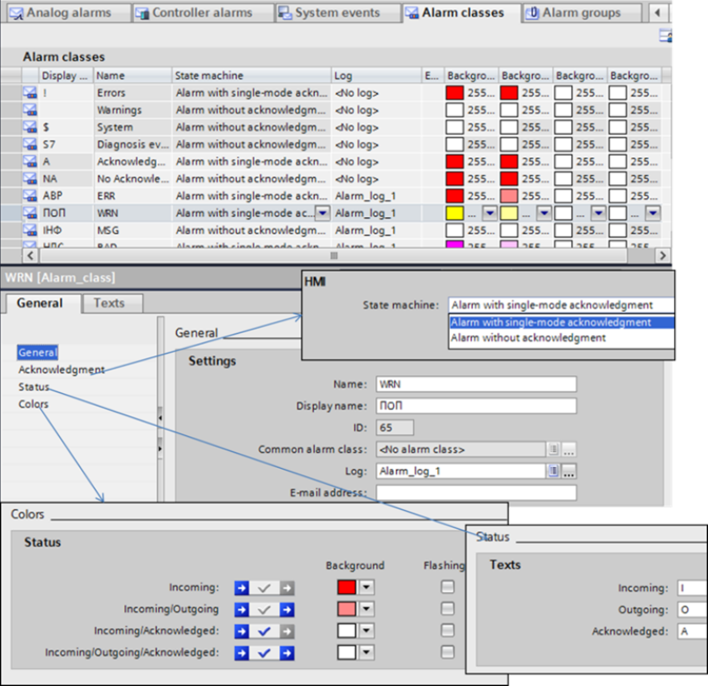
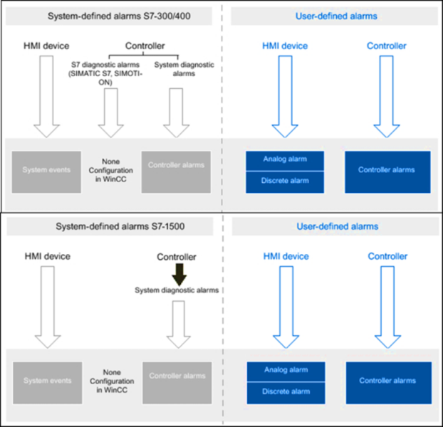
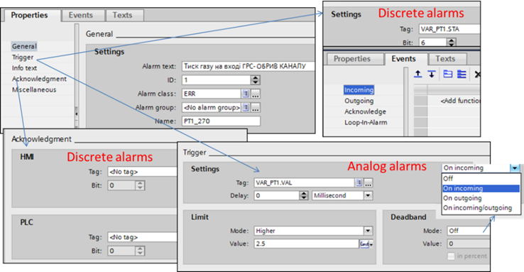
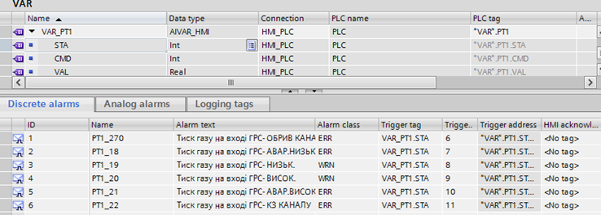
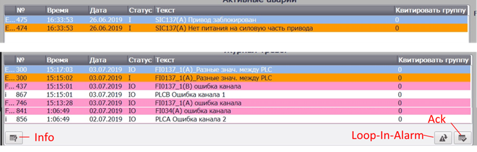
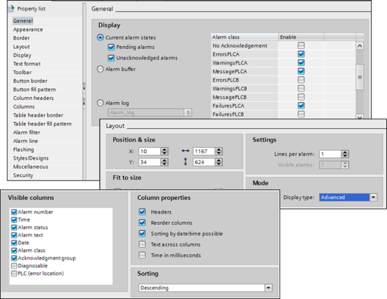

[Головна](README.md) > [6.Розроблення підсистеми тривожної сигналізації](6.md)

# 6.13. Підсистема тривожної сигналізації у WinCC Comfort 

## 6.13.1. Загальні принципи функціонування

У WinCC Comfort Panel тривоги налаштовуються через їх створення у відповідному розділі проекту "HMI Alarms" або безпосередньо через налаштування тегу. WinCC підтримує два автомати станів:

- класичний, з підтвердженням – "Alarm with single mode acknowledgment";

- без підтвердження - “Alarm without acknowledgment”.

Підтвердження може проводитися користувачем (через кнопку на панелі інструментів переглядача, спеціальну кнопку на дисплеї), системними функціями або тегом. 

Поведінка тривоги задається через клас тривоги (Alarm Class), підтримується також групування тривог. Група може використовуватися як для відображення у переглядачів тривог, так і для групового квітування тривог. Група означується іменем та індексом.  

## 6.13.2. Класи тривог

Клас тривог (Alarm Class) означує для тривоги автомат станів, поведінку (наприклад, змін кольору) та ведення журналу тривоги. Є налаштовувані (Custom) та наперед визначені (Predefined) класи тривог. Наперед визначені тривоги не можна видаляти, вони включають у себе:

- користувацькі класи:

  - "Warnings" – для попереджень, без квітування;

  - "Errors" – для передаварійних тривог, з квітуванням; 

- системні класи:

  - "System" – це клас, до якого належать усі системні тривоги панелі та ПЛК; це не підтверджувані тривоги;

  - "Diagnosis Events" – до цього класу належать тривоги, що відображають стан контролерів SIMATIC S7; це непідтверджувані тривоги; 

  - "Safety Warnings" (не для всіх ОП) – клас, до якого входять системні тривоги для функціонально-безпечних операцій; це непідтверджувані тривоги.

Конфігурування налаштовуваних класів тривог відбувається через відповідну вкладку (рис. 6.45). Для класу вказується:

- назва класу та назва, що відображається на дисплеї для всіх тривог у вкладці; 

- "Log" – назва журналу, куди записується тривога класу; детальніше налаштування журналу читайте в підрозділі 7.6; 

- e-mail адреса, куди будуть відправлятися тривоги (тільки, якщо в налаштуваннях панелі правильно вказані параметри сервісу електронної пошти);

- status – символи, які будуть відображатися у відповідній колонці статусу при активації (Incoming), деактивації (Outgoing) і підтвердженні (Acknowledged) тривоги;

- кольори фону та миготіння для кожного стану тривог.      

                               

*Рис. 6.45.* Налаштування класів тривог

## 6.13.3. Типи тривог 

WinCC Comfort підтримує такі типи тривог (рис. 6.46):

- Означувані користувачем (User-Defined), налаштовуються в WinCC 

  - Analog alarms – аналогові тривоги, реагують на спрацювання меж для числової змінної;

  - Discrete alarms – дискретні тривоги, реагують на спрацювання біта в слові;

  - Controller alarms – тривоги, що конфігуруються в Step7 для ПЛК (створюються користувачем); 

- Означені в системі (System defined), не налаштовуються в WinCC:

  - System-defined controller alarms – діагностичні тривоги SIMATIC S7 та системні тривоги ПЛК; наявність залежить від типу ПЛК;

  - System events – системні тривоги ОП (залежить від типу ОП).

 

*Рис. 6.46.* Типи тривог залежно від використовуваного ПЛК

Для всіх типів означуваних користувачем тривог налаштовується (рис. 6.47) ім’я, клас і група (за необхідністю) та текст повідомлення (Alarm Text). 

Для дискретних тривог у налаштуваннях тригера вказується біт тегу типу INT або UINT (інші типи не підтримуються для тривог), також на вкладці "Acknowledgment" можна налаштувати тег для відслідковування підтвердження тривоги (HMI) та тег, яким можна підтверджувати (PLC). 

Для аналогових типів тривог у налаштуваннях тригера вказується:

- значення тегу (Tag); 

- затримка на спрацювання (Delay);

- межа спрацювання (Limit), може здаватися константою або змінною (наприклад, для тривог відхилення);

- умова спрацювання (Higher – Tag>Limit Value,  Lower – Tag<Limit Value);

- зона нечутливості (Deadband), яку можна задати як на активацію, так і деактивацію тривоги.     

 

*Рис. 6.47*. Налаштування дискретних та аналогових тривог

На вкладці Events для тривог можна також вказати функції, які будуть викликатися при зміні стану тривоги (див. рис. 6.47). Окрім класичних подій "Incoming", "Outgoing" та "Acknowledge", у переліку є також "Loop-In-Alarm", яка викликається при натисканні однойменної кнопки в переглядачі тривог, якщо тривога виділена в списку. Це дає змогу зробити, наприклад, швидкий перехід на потрібний екран. 

Дискретні та аналогові тривоги можна налаштовувати безпосередньо зі змінних, вибравши їх у списку (рис. 6.48).  

Контролерні тривоги створюються та налаштовуються безпосередньо в контролері, їх можна подивитися в розділі Step 7 "PLC Supervision & Alarms" на вкладці Alarms:

- User-Defined controller alarms на вкладці "Program Alarms" (створюються з використанням спеціальних функцій);

- System-defined controller alarms на вкладці "System alarms" (конфігуруються через налаштування апаратної частини).

Детальніше про контролерні тривоги Ви можете прочитати в довідниковій системі TIA Portal. 

 

*Рис. 6.48*. Налаштування тривог через змінні

## 6.13.4. Відображення тривог на дисплеях (екранах) 

Для відображення активних тривог та журналу можна використовувати глобальне вікно "Alarm window" та графічний елемент переглядача тривог "Alarm View" з бібліотеки Controls. На рис. 6.49 показано зовнішній вигляд переглядача тривог у режимі виконання, який за необхідності може включати кнопки підтвердження ("Acknowledge"), інформації (“Info”) та ("Loop-In-Alarm"). Оператор може вибрати потрібну тривогу зі списку і зробити необхідну дію, наприклад підтвердження. При натисканні кнопки "Info" з’являється інформація, що задана у властивості тривоги "Info Text". При натисканні кнопки "Loop-In-Alarm" виконається дія, налаштована у відповідному Event для тривоги.

Праворуч від повідомлень є повзунок, за допомогою якого можна прокручувати список з повідомленнями. 

У режимі перегляду журналу статус повідомлення відображає історію станів тривоги. Так, запис "I" означає, що в цей час тривога з’явилася (див. рис. 6.45, на якому означені літери статусів), "IO" – що вона зникла. Статус "IOA" – означав би, що тривога в цей час була підтверджена (A), але перед тим вона зникла (O), а ще перед тим з’явилася (I). А от статус "IAO" вказував би на те, що тривога була спочатку підтверджена, а тільки після цього зникла.      

 

*Рис. 6.49.* Переглядач тривог у режимі відображення активних тривог (вгорі) та журналу (знизу)

На рис. 6.50 показані деякі налаштування переглядачу тривог. Група властивостей “Display” вказує на режим відображення:

- Current alarm states: активні тривоги (можна фільтрувати за підтвердженням та активністю);

- Alarm Buffer: усі тривоги з буфера;

- Alarm Log: журнал тривог (необхідно вказати назву журналу).

Для переглядача тривоги можна фільтрувати за класом, задавати порядок сортування за часом (Sorting), вибирати колонки, які потрібно відображати, та написи в заголовках, налаштовувати панель інструментів (кнопки Toolbar), змінювати кольори, миготіння, налаштовувати доступ. 

У WinCC Comfort немає подій, окрім системних або контролерних, тому для збереження подій потрібно використовувати непідтверджені тривоги. Такий спосіб незручний, бо в журналі будуть завжди дві події: "Incoming" та "Outgoing", що ускладнює його розуміння оператором.  

 

*Рис. 6.50*. Налаштування переглядачу тривог

[<-- 6.12. Підсистема тривожної сигналізації в SCADA zenon](6_12.md)

[--> Розділ 7. Розроблення підсистеми трендів](7.md)
