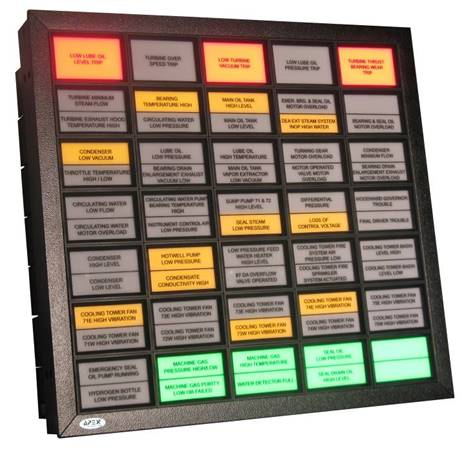

[Головна](README.md) > [6.Розроблення підсистеми тривожної сигналізації](6.md)

# 6.2. Місце підсистеми тривожної сигналізації в системі автоматизованого керування

Згідно зі стандартом ISA-18.2  ***тривога* (**з англ. ***alarm*),** – це звукові та/або візуальні засоби індикації для оператора про несправність устаткування, відхилення від процесу, ненормальні умови, які потребують своєчасного реагування. Слід сказати, що в зарубіжних та вітчизняних стандартах є інші означення тривоги, зокрема в ДСТУ 3960-2000 та ДСТУ EN 50136-1-1-2014, які дещо відрізняються. 

Згідно зі стандартом ISA-18.2, сукупність апаратного і програмного забезпечення, яке виявляє стан тривоги, повідомляє про це операторові і записує в журнал зміни стану, називається ***системою тривожної сигналізації*** (**alarm system)**. При цьому наголошується, що оператор є частиною цієї системи. Є також інші означення у вітчизняних стандартах, зокрема у ДСТУ 3960-2000, де система тривожної сигналізації – це електричне устатковання, призначене для виявлення та попередження про наявність небезпеки. У посібнику використовується термін "система тривожної сигналізації", взятий з українського стандарту, а означення терміну – з ISA-18.2 як більш сучасне та застосовне для SCADA/HMI. 

Стандарт ISA-18.2 побудований на принципах розгляду системи тривожної сигналізації через призму життєвого циклу, що характерно для більшості сучасних стандартів ISA (і не тільки), зокрема спорідненого до нього ISA-101. Це типова практика системної інженерії, яка останні кілька десятків років сильно впливає на стандарти інженерії в цілому. Більшість функцій та сутності тривожної сигналізації в стандарті ISA-18.2 не розкриваються детально, а лише коротко описуються. Однак найбільш фундаментальні сутності, а також структура в стандарті описані на достатньому рівні, щоб їх зрозуміти. Крім того, після виходу першої версії стандарту вийшло також ряд технічних звітів, які надають рекомендації щодо впровадження підходів, викладених в ISA-18.2 (деталізують сутності та функціонування). У цьому розділі зупинимося на найбільш фундаментальних сутностях, описаних у стандарті, "вирвавши" їх із контексту життєвого циклу.     

Стандарт розглядає систему тривожної сигналізації в контексті взаємодії з іншими системами. До сфери її діяльності можуть входити БСКТП/BPCS (базова система керування технологічними процесами/the basic process control system), СПАЗ/SIS (система протиаварійного захисту/the safety instrumented system) та інші автономні системи (packaged systems), кожна з яких використовує свої датчики вимірювання для стеження за умовами проходження процесу і логіку генерування тривог ( рис. 6.1). Система тривожної сигналізації забезпечує передачу інформації про тривогу операторові через HMI (зазвичай являє собою екран комп'ютера) або на панель оповіщення (annunciator panel) (рис. 6.2). До додаткових функцій системи тривожної сигналізації належать ведення журналу тривог (alarm log), сховища тривог (alarm historian) та розрахунок показників ефективності функціонування системи. 

                               

*Рис.* *6.1.* Функціональна структура тривожної сигналізації 

 

*Рис. 6.2*. Приклад панелі оповіщення 

На рис. 6.1 у зоні дій системи тривожної сигналізації показано елементи, які стосуються не тільки її функцій. У стандарті зазначено, що ці засоби не входять у зону її діяльності, але можуть мати функції, які стосуються систем тривожної сигналізації. Зокрема:

- функції тривожної сигналізації можуть бути включені в датчики та виконавчі механізми;

- тривоги та діагностичні показання може передавати іншим підсистемам система СПАЗ (система протиаварійного захисту), яка описана в стандартах IEC 61511 (ISA-84.00.01-2004) та IEC 61508; 

- у систему тривожної сигналізації можуть інтегруватися панелі оповіщення (annunciator panel), які описані стандартом ISA-18.1-1979 (R2004); 

- тривоги та діагностичні показання можуть передавати системи пожежної сигналізації і протипожежного захисту, а також системи охоронної сигналізації. 

Ефективність систем (або підсистем) тривожної сигналізації та інших наведених вище підсистем з аналогічними функціями, ґрунтується на правильному налаштуванні тривоги. Від цього залежить своєчасне реагування на тривогу та усвідомлення наступних дій, які має провести оператор. Для кращого розуміння правильного налаштування тривог варто розглянути їх через взаємодію оператора з процесом. 

[<--6.1. Важливість і стандарти впровадження підсистем тривожної сигналізації](6_1.md)

[--> 6.3. Взаємодія оператора з процесом](6_3.md)