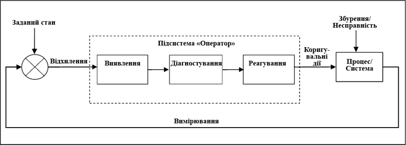
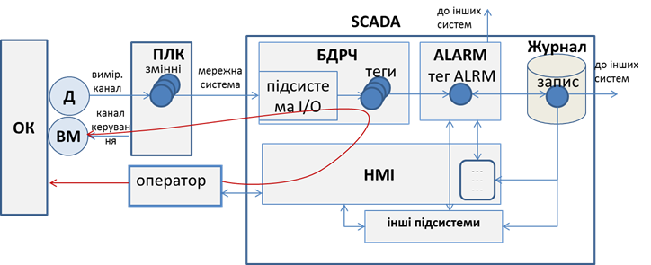

[Головна](README.md) > [6.Розроблення підсистеми тривожної сигналізації](6.md)

# 6.3. Взаємодія оператора з процесом

Розробники АСКТП нерідко забувають, що система тривожної сигналізації розроблена саме для оператора, який у даному контурі посідає головне місце. Саме його реакція і дії визначають досягнення цілей функціонування тривог. Система тривожної сигналізації лише допомагає операторові виявити тривогу та надати йому інструменти для швидкого орієнтування в ситуації. Дії щодо виправлення нештатної ситуації він повинен сформувати і провести самостійно. Тому в стандарті ISA-18.2 велику увагу приділяють опису моделі контуру тривоги через взаємодію оператора з процесом (рис. 6.3). 

Тривога потрібна для усунення оператором або іншою уповноваженою особою нештатної ситуації в тому випадку, коли алгоритми автоматичного керування не передбачають цього. Наприклад, якщо зміна в процесі істотно відхиляється від бажаного стану, а система керування не може це виправити, оператор повинен вжити певних заходів, щоб повернути процес до норми. Якщо устатковання або система керування має несправність, то обслуговуючий персонал повинен вчасно зробити дії щодо її усунення. Будь-яка з наведених ситуацій передбачає, що оператор повинен виявити факт нештатної ситуації, діагностувати її та вжити відповідних дій:  

1) **виявлення** (detect): оператор дізнається про відхилення від бажаного стану або несправності устатковання за допомогою відповідного сигналу тривоги. Структура системи тривожної сигналізації та інтерфейс оператора повинні сприяти виявленню відхилень; 

2) **діагностування** (diagnose): у відповідь на відхилення оператор використовує свої знання та навички для інтерпретації інформації, діагностування ситуації та визначення необхідних коригувальних дій. Діагностувати ситуацію операторові допомагають процедури реагування на тривогу;

3) **реагування** (respond): вживаються коригувальні дії для компенсації збурення. У відповідь на відхилення оператор (або інша уповноважена особа) приймає коригувальні дії і контролює процес, щоб визначити, чи було виправлене це відхилення.

                               

*Рис. 6.3.* Модель контуру тривоги через взаємодію оператора з процесом

Кожен із цих етапів дуже важливий і потребує окремої уваги на всіх стадіях життєвого циклу системи. Крім того, треба врахувати, що людина в цьому контурі є найбільш непередбачуваною ланкою. На здатність оператора виконувати свої функції впливає багато факторів, у тому числі:

- навантаження;

- ергономіка операторської консолі;

- обмеження пам'яті;

- втома;

- знання;

- мотивація.

При розробленні системи тривожної сигналізації неврахування якогось із наведених факторів може призвести до проблем. Зокрема, кількість активних тривог та частота зміни їх стану можуть стати причиною неефективності роботи системи тривожної сигналізації. Згідно зі стандартом ISA-18.2, ситуація, при якій частота виникнення тривог більша, ніж оператор може їх ефективно опрацювати, називається ***переповненням тривог*** (з англ. ***alarm*** ***flood***). Прикладом переповнення тривог може бути показник частоти більший ніж 10 тривог за 10 хвилин. Для усунення цього негативного ефекту в стандарті 
 ISA-18.2 означено багато механізмів та рекомендацій щодо побудови життєвого циклу організації системи тривожної сигналізації, деякі з них наведені в цьому та 10-му розділі посібника.

Розглянемо контур тривоги в системі як взаємопов’язані функції (рис. 6.4):

- вимірювання значення даних, які необхідно контролювати з об’єкта керування;

- оброблення даних на пристрої збирання (наприклад ПЛК);

- зчитування даних із пристрою збирання та їх оброблення в базі даних реального часу (БДРЧ);

- зчитування даних з бази даних реального часу та їх оброблення в підсистемі тривожної сигналізації; 

- відображення стану та керування тривогами в підсистемі HMI;  

- записування змін стану тривоги в журнал тривог та подій. 

На рис. 6.4 підсистема тривожної сигналізації включає в себе тег ALRM, однак це є умовним позначенням, і наявність такого типу тегів залежить від реалізації. Також слід нагадати, що підсистема тривожної сигналізації (позначена як ALARM) може бути реалізована як у вигляді окремого сервера (навіть на окремому ПК), так і не існувати як підсистема, натомість її функції реалізовуватимуть в інших частинах SCADA/HMI.  

 

*Рис. 6.4.* Деталізована модель тривогового контуру 

Перелічені вище функції формують ланцюжок, який будемо називати ***тривоговим контуром***. Як видно з рис. 6.4, швидкість виявлення спрацювання тривоги залежить від каналу вимірювання, швидкості опитування ПЛК та взаємодії між підсистемами. Діагностуванню в технічному плані можуть допомогти підсистема HMI та додаткові підсистеми. Реагування оператора може проводитись як через підсистеми SCADA, так і безпосередньо через ручні засоби керування (на рис. 6.4 показано бордовими лініями).  