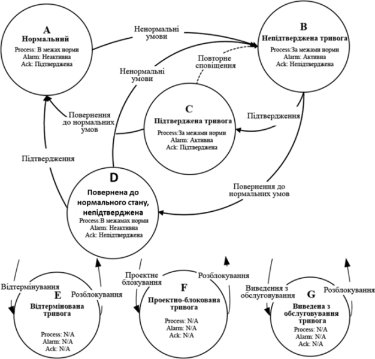

[Головна](README.md) > [6.Розроблення підсистеми тривожної сигналізації](6.md)

# 6.4. Автомат станів тривог

Принципово важливим для означення функцій тривог є формалізація їх автомату станів. На практиці трапляються неодноразові випадки, коли не тільки обслуговуючий персонал, а й розробники не могли чітко пояснити роботу тривог, закладену постачальниками інструментів SCADA/HMI. Іншим типовим випадком є власно придумані автомати станів, або відсутність їх (автоматів) взагалі. **Недостатньо формалізований автомат станів може призвести до неправильного його тлумачення учасниками життєвого циклу підсистеми тривожної сигналізації і може спричинити непередбачувані наслідки!** Навіть якщо в проекті буде реалізовано власний автомат станів, відмінний від стандартного, його треба обов’язково описати в документації у відповідному розділі проекту. У стандарті означення автомату станів є одним із фундаментальних механізмів, на яких ґрунтуються всі інші сутності. 

Тривога може знаходитися в кількох станах, зміни яких можуть бути викликані різними джерелами в системі керування, включаючи польовий пристрій (наприклад, датчики і виконавчі механізми), систему керування (базову чи СПАЗ) та HMI (дії оператора). У стандарті ISA-18.2 наведено діаграму автомату станів тривоги, що показана на рис. 6.5. Стани тривоги представлені на рисунку колами, в яких наводиться опис стану, що включає літерну мітку (ідентифікатор стану), назву стану, опис умови проходження процесу та комбінацію статусів:

- статус тривоги;

- статус підтвердження.

Таким чином, стан – це узагальнюючий показник, який залежить від плинного значення статусів та від попереднього стану. 
            

*Рис. 6.5.* Автомат станів тривог згідно з ISA-18.2

У нижній частині діаграми показано можливі стани блокованих тривог (alarm suppression). Стрілки на рис. 6.5 відповідають переходам між станами. Діаграма не показує безпосередньо вплив зон нечутливостей чи затримок на спрацювання, які включені в оцінку статусу тривоги (тобто активної або неактивної). Більшість із них є очевидними, тому при описі станів прокоментуємо тільки деякі з них. ***Нормальний стан*** (A – Normal, NORM) означується як стан, в якому процес працює в межах нормальних характеристик, статус тривоги не є активним і попередні виникнення тривоги були підтверджені. Стан ***непідтвердженої*** тривоги (B – Unacknowledged state, UNACK) є початковим станом тривоги, що стає активною внаслідок ненормальних умов і є не підтвердженою оператором. Стан ***підтвердженої*** тривоги (C – Acknowledged state, ACKED) – це стан, в якому статус тривоги є активною і оператор її підтвердив. ***Повернена до нормального стану, непідтверджена*** тривога (D – Return to normal unacknowledged state, RTNUN) – це стан, в якому процес вже знаходиться в межах норми, але попередній активний стан тривоги не був підтверджений оператором. 

У стандарті наведений типовий автомат станів, який реалізований у більшості відомих засобів SCADA/HMI. Деякі з інструментальних засобів передбачають два автомати станів: стандартний і без наявності статусу підтвердження.   

Окрім наведених "класичних" станів, стандарт передбачає можливість блокувати тривоги, що повинно убезпечити систему тривожної сигналізації від ефекту переповнення тривог (alarm flood), про який уже згадувалося. Це стани тривоги: відтермінована (Shelved), проектно-блокована (Suppressed-by-design) та виведена з обслуговування (Out-of-service). На цих станах варто зупинитися детальніше, оскільки далеко не всім розробникам АСКТП вони відомі.

Стан ***відтермінованої тривоги*** (E – Shelved state, SHLVD) – це стан, в якому тривога тимчасово блокується оператором, тобто для неї не проводиться оповіщення. Перехід до відтермінованої (будь-який стан → E) відбувається тоді, коли оператор командою з HMI відтерміновує сигнал тривоги, щоб уникнути її появи на дисплеях активних тривог. Відтермінування – ручна операція, а от розблокування (unshelve) може відбуватися як автоматично (після заданого часу), так і вручну оператором. Якщо статус тривоги в цей час активний, перехід повинен здійснюватися до стану непідтвердженої тривоги, а якщо не активна – до нормального стану. Таким чином, функція відтермінування передбачає, що оператор задає час, протягом якого тривога буде заблокована. Система тривожної сигналізації повинна забезпечувати виконання таких функцій:

- можливість відтермінувати тривогу;

- відображення на дисплеях відтермінованих тривог або еквівалентних до них списків;

- задавання часу для відтермінування;

- контроль доступу до відтермінування індивідуальних тривог;

- можливість розблокування тривоги;

- формування в журналах записів про відтермінування.

Стан ***проектно-блокованої тривоги*** (F – Suppressed-by-design, DSUPR) – це стан, в якому тривога блокується з причини певних умов експлуатації або стану установки, і для неї не потрібно проводити оповіщення. Тривога в цьому стані перебуває під контролем логіки, що означує актуальність тривоги. Перехід до стану проектно-блокованої тривоги (будь-який стан → F) відбувається тоді, коли виникли певні умови або стан процесу, які означені в проекті для блокування тривоги. Означене проектом блокування зазвичай є автоматичною операцією. Перехід від проектно-блокованої тривоги до нормального стану або стану непідтвердженої тривоги (F → A або B) відбувається тоді, коли виникли умови або змінився стан технологічного процесу, що означений для розблокування тривоги. Це зазвичай відбувається автоматично. 

Щодо проектно-блокованих тривог система тривожної сигналізації повинна забезпечувати виконання таких функцій:

- відображення проектно-блокованих тривог;

- формування записів в журнал для кожної проектно-блокованої тривоги.

Стан ***виведеної з обслуговування тривоги*** (G – Out-of-service state, OOSRV) – це стан, в якому тривога блокується вручну оператором, як правило, при проведенні технічного обслуговування, і тому в цьому стані не потрібно проводити оповіщення. Тривога в цьому стані перебуває під контролем технічного обслуговування. Виведена з обслуговування тривога – це не те саме, що виведення з обслуговування устатковання або його частини. Устатковання може бути виведене з обслуговування, тоді як відповідні тривоги – ні. Перехід до цього стану (будь-який стан → G) відбувається тоді, коли тривога блокується з метою технічного обслуговування устатковання або з інших причин. Як правило, виведення з обслуговування – це ручна операція. Перехід від стану виведеної з обслуговування тривоги до нормального стану або непідтвердженої тривоги (G → A або B) відбувається, як правило, також вручну, після закінчення обслуговування. 

Для виведених з обслуговування тривог система повинна виконувати функції:  

- індивідуальне повернення кожної тривоги до обслуговування;

- відображення списку на дисплеї зведення виведених з обслуговування тривог або еквівалентного до нього;

- контроль доступу до виведення тривог з обслуговування;

- ведення записування виведення кожної тривоги з обслуговування.

На відміну від класичного автомату станів, механізм блокування не завжди передбачається розробником, що приводить до наслідків, описаних на початку розділу. Не дивлячись на те, що сучасні SCADA/HMI включають ці функції (або принаймні певні з них), їх часто ігнорують розробники АСКТП. 

Слід звернути увагу на те, що назви станів можуть не збігатися у різних інструментальних засобах SCADA/HMI. Очевидно, це пов’язано з тим, що стандарт вийшов порівняно недавно.  

Для узагальнення розуміння автомату станів у стандарті наводиться таблиця станів (табл. 6.1).   

*Таблиця 6.1.* 

**Стани тривоги**

| ID   | Ско­рочено | Назва стану            | Стан техноло­гічного  процесу | Статус тривоги | Статус оповіщення | Статус підтвердження |
| ---- | ---------- | ---------------------- | ----------------------------- | -------------- | ----------------- | -------------------- |
| A    | NORM       | Нормальний             | В межах норми                 | Неактивна      | Немає оповіщення  | Підтверджена         |
| B    | UNACK      | Непідтверджена тривога | За  межами норми              | Активна        | Оповіщується      | Непідтверджена       |
| C    | ACKED | Підтверджена тривога                                    | За  межами норми             | Активна                | Оповіщується | Підтверджена   |
| D    | RTNUN | Повернена до  нормального стану непідтвердженої тривога | В межах норми                | Неактивна              | Оповіщується | Непідтверджена |
| E    | SHLVD | Відтермінована тривога                                  | В межах або за межами  норми | Неактивна або активна  | Заблоковане  | -              |
| F    | DSUPR | Проектно-блокована  тривога                             | В межах або за межами  норми | Неактивна або активна  | Заблоковане  | -              |
| G    | OOSRV | Виведена з обслуговування тривога                       | В межах або  за межами норми | Неактивна  або активна | Заблоковане  | -              |

[<-- 6.3. Взаємодія оператора з процесом](6_3.md)

[--> 6.5. Приклад діаграми поведінки тривоги в часі](6_5.md)