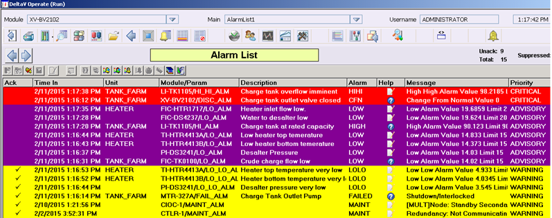
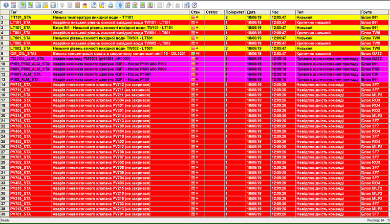
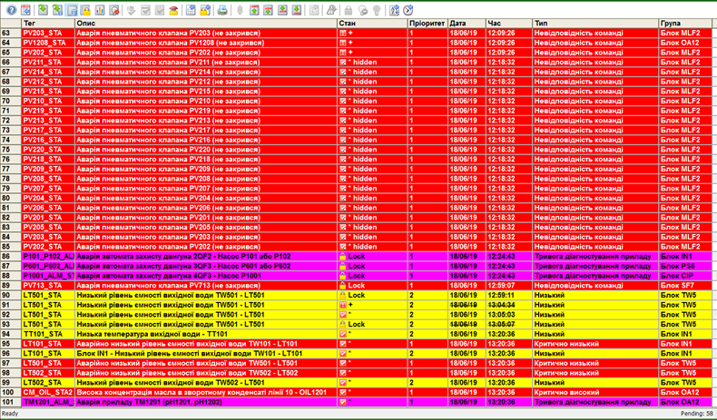
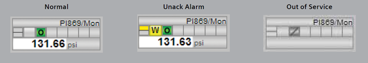
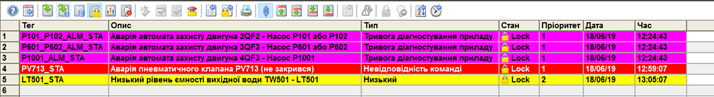
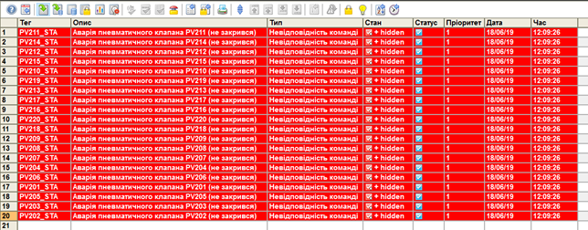

[Головна](README.md) > [6.Розроблення підсистеми тривожної сигналізації](6.md)

# 6.8. Людино-машинний інтерфейс для систем тривожної сигналізації

## 6.8.1. Загальні концепції

​     Враховуючи, що саме людина є ключовим елементом контуру тривожної сигналізації, велика увага в її організації надається людино-машинному інтерфейсу. Він повинен чітко відображати неблоковані активні тривоги із зазначенням їх станів, пріоритетів, типів та іншої додаткової інформації. Крім відображення, HMI повинен надати можливість операторові здійснювати такі дії:

‒    індивідуально підтвердити тривогу (квітувати);

‒    заглушити звукове оповіщення тривоги без дії підтвердження;

‒    виводити тривоги з обслуговування; 

‒    змінювати параметри тривог; 

‒    ініціювати відтермінування тривоги;

‒    підтримувати функцію проектно-блокованих тривог;

‒    відображати повідомлення тривог за запитом;

‒    розмежовувати доступ до функцій різним користувачам.

Для забезпечення цих функцій відображення та дій HMI має надавати певні інструментальні засоби. Стандарт передбачає підтримку, як мінімум, таких засобів HMI:

‒    дисплей зведення тривог (alarm summary);

‒    відображення тривог на дисплеях процесів (мнемосхемах);

‒    відображення (індикація) тривог у дисплеях деталізації тегів;

‒    дисплей зведення відтермінованих тривог;

‒    дисплей зведення проектно-блокованих тривог;

‒    дисплей зведення виведених з обслуговування тривог.

Наведені дисплеї містять відображення стану тривог у вигляді записів. ***Запис тривоги\*** (alarm record) – це набір інформації, який документує зміну стану тривоги. Тобто зміна стану тривоги приводить до формування нового запису (в деяких зведеннях – зміни запису попереднього стану). Згідно з 
 ISA-18.2, запис тривоги повинен мати такі атрибути:

‒    назву тегу для тривоги;

‒    опис тегу або опис тривоги;

‒    стан тривоги;

‒    пріоритет тривоги;

‒    тип тривоги;

‒    час і дату зміни стану тривоги.

‒    Окрім цього, рекомендується, щоб запис тривоги мав такі елементи:

‒    значення змінної процесу в момент записування тривоги;

‒    уставка тривоги;

‒    група тривоги або ділянка процесу;

‒    клас(и) тривоги;

‒    повідомлення тривоги.

## 6.8.2. Оповіщення про стани тривог

Для однозначного розрізнення станів тривог на HMI A-D (див. рис. 6.5) використовуються комбінації візуальних індикаторів та/або звукових сигналів. У цьому параграфі наведено рекомендації до способів оповіщення, які часто використовуються на практиці. 

Нормальний стан не повинен використовувати звуковий сигнал. Візуальна індикація нормального стану має бути такою самою, як і індикації без тривоги. 

У стані непідтвердженої тривоги слід використовувати як звуковий сигнал, так і візуальну індикацію. Звукове оповіщення повинно відключатися командою придушення або командою підтвердження (ACK) оператора. Візуальна індикація має чітко відрізнятися від звичайного стану за допомогою кольорів і символів (наприклад, форми або тексту). Візуальна індикація для непідтвердженої тривоги повинна включати миготливий елемент. 

Стан підтвердженої тривоги не повинен використовувати звукове оповіщення. Візуальна індикація підтвердженого стану тривоги повинна чітко відрізнятися від індикації звичайного стану (не тривожного) за допомогою символів (наприклад, форми або тексту) і повинна бути пов'язана за кольором з індикацією стану непідтвердженої тривоги. Наприклад, червоний миготливий – для непідтвердженої і червоний – для підтвердженої. У візуальній індикації підтвердженої тривоги не повинен використовуватися миготливий елемент.

Стан повернутої до нормального стану, непідтвердженої тривоги не повинен використовувати звуковий сигнал. Візуальна індикація цього стану може бути такою самою, як і звичайний стан, або може вказувати на непідтверджений стан за допомогою миготливого елемента.

Стан блокованих тривог (відтермінованої, проектно-блокованої та виведеної з обслуговування) може бути показаний у HMI візуальними засобами, явно відмінним способом від інших станів. Звукову сигналізацію використовувати для блокованих тривог не дозволяється.

Рекомендації щодо звукової сигналізації та індикації залежно від станів наведено в табл.6.3. 

*Таблиця 6.3**.* 

**Поведінка звукової сигналізації та індикації в залежності від стану тривог.**

| **Стан тривоги**                                | **Звук**   | **Візуальна індикація** |       |      |
| ----------------------------------------------- | ---------- | ----------------------- | ----- | ---- |
| **Колір**                                       | **Символ** | **Миготіння**           |       |      |
| нормальний                                      | ні         | ні                      | ні    | ні   |
| непідтверджена                                  | ТАК        | ТАК                     | ТАК   | ТАК  |
| підтверджена                                    | ні         | ТАК                     | ТАК   | ні   |
| повернена до нормального  стану, непідтверджена | ні         | Комбінація              | Опція |      |
| відтермінована                                  | ні         | Опція                   | н/з   |      |
| проектно-блокована                              | ні         | Опція                   | н/з   |      |
| виведена з обслуговування                       | ні         | Опція                   | н/з   |      |

*Примітка:* н/з показує, що умова не застосовна або не має відношення до стану тривоги; комбінація вказує, що індикація є комбінацією візуальних кольорових і символьних індикацій; опція вказує, що індикація не є обов’язковою.  

 

Звукова сигналізація для непідтверджених тривог може також використовуватися для зазначення пріоритету, ділянки процесу або групи тривог залежно від означеної методології. У середовищах, де звукова сигналізація не є ефективною (наприклад, середовища з високим рівнем шуму), для непідтвердженого стану тривоги слід використовувати чітку візуальну індикацію, яка завжди знаходиться в зоні оператора.

Для виділення пріоритетних тривог у системі необхідно використовувати візуальні індикатори, звукові сигнали або їх поєднання. Усі станції HMI в системі керування, включаючи відокремлені підсистеми, повинні надавати можливість різної індикації принаймні для трьох різних пріоритетів.   

Для кожного пріоритету тривоги слід використовувати окрему кольорову індикацію, за винятком операційних середовищ, де це не є практичним. Першочергові кольори тривоги повинні бути зарезервовані і не повинні використовуватися для інших елементів HMI.

У стандарті даються рекомендації, прийняті в промисловій практиці. Зокрема, для підсилення виділення пріоритету тривоги, окрім кольорової індикації рекомендується використовувати унікальний символ, наприклад фігуру або текст, а також супроводження звуковою сигналізацією. У середовищах, де звукова сигналізація не використовується як індикатор пріоритету, слід застосовувати тільки візуальну індикацію.

Повідомлення тривоги передбачає подальше уточнення тривоги відображенням назви тегу, стану та пріоритету. Він може також включати частину дії оператора або посилання на процедуру відповіді на тривогу.

## 6.8.3. Дисплеї тривог

Стандартом ISA-18.2 передбачено, що у HMI може бути кілька типів дисплеїв, які можна використати для системи тривожної сигналізації. До них входять: 

‒    дисплей зведення тривог (alarm summary display);

‒    дисплей зведення статусу тривог (alarm summary status display);

‒    дисплей журналу тривог (alarm log display);

‒    дисплей процесу (process display);

‒    дисплей інформації про тег (tag detail display);

‒    дисплей тривог системної діагностики (system diagnostic alarm display);

‒    дисплей відтермінованих тривог (shelved alarm display);

‒    дисплей проектно-блокованих тривог (suppressed-by-design alarm display);

‒    дисплей виведених з обслуговування тривог(out-of-service alarm display).

Також для відображення стану тривог можуть використовуватися різні дисплейні елементи, наприклад тривогові банери, які з’являються у вигляді смуг на екрані (над усіма вікнами) з відображенням останньої тривоги. 

Згідно з вимогами стандарту, потрібен щонайменше один ***дисплей зведення тривог\*** (alarm summary display) що також називається ***дисплей\*** ***списку тривог*** (alarm list display), який надає список неблокованих активних тривог. Існує кілька обов’язкових і рекомендованих функцій для дисплея зведення тривог, які наведені в табл.6.4. Приклад дисплея зведення тривог показано на рис. 6.7 та 6.8. 

*Таблиця 6.4**.* 

**Функції дисплея зведення тривог**

| **Відображення на дисплеї**                                  | **Функції керування**                                        |
| ------------------------------------------------------------ | ------------------------------------------------------------ |
| Для кожної тривоги повинні відображатися:  ‒     назва тегу для тривоги;   ‒     опис тегу або опис тривоги;  ‒     стан тривоги (alarm state), включаючи статус підтвердження;  ‒     пріоритет тривоги;   ‒     час/дата, коли тривога стала активною;  ‒     тип тривоги.      Рекомендується:  ‒     плинне значення змінної процесу;   ‒     уставка тривоги;   ‒     група тривоги або ділянка процесу;   ‒     повідомлення тривоги.      Для всього списку   рекомендується:  ‒     кількість тривог у зведеному списку;  ‒     кількість непідтверджених тривог у  зведеному списку | Повинні бути:  ‒     упорядкування тривог за хронологічним порядком;  ‒     упорядкування тривог за пріоритетом;  ‒     індивідуальне підтвердження кожної тривоги;   ‒     підтвердження кількох тривог з методами керування доступом, якщо це  допускається в методології тривог.     Рекомендується:  ‒     навігаційне посилання на відповідний дисплей процесу;  ‒     доступ до процедур реагування на тривогу;  ‒     фільтрація тривог за часом сигналу;  ‒     фільтрація тривог за пріоритетом;  ‒     фільтрація тривог за типом;  ‒     фільтрація тривог за групою або ділянкою процесу; |

*Продовження табл. 6.4*

|      | ‒     фільтрація тривог за назвою тегу;  ‒     часові обмеження для фільтрів;  ‒     упорядкування тривог за назвою тегу.      При задіянні фільтрів це повинно чітко відоб­ражатися  на дисплеї. Також може викорис­товуватися   лімітування за часом, коли фільтр видаляється після закінчення періоду  часу |
| ---- | ------------------------------------------------------------ |
|      |                                                              |

                               

*Рис. 6.7.* Приклад дисплея зведення тривог у DeltaV від Emerson 

 

*Р**ис. 6.8*. Приклад дисплея зведення тривог у WinCC v.7.3

Повинен бути наданий ***дисплей зведення статусу тривог\*** (alarm summary status display), який показує кількість непідтверджених активних тривог за вибраним пріоритетом для кожної ділянки процесу. Зокрема, для кожної ділянки процесу рекомендується показувати:

‒    кількість тривог для кожного пріоритету тривоги;

‒    кількість непідтверджених тривог для кожного пріоритету;

‒    відображення того, чи непідтверджені тривоги.

Повинен бути наданий ***дисплей журналу тривог\*** (alarm log display), який забезпечує доступ до записів тривог в архіві для кожної зміни стану (наприклад, підтвердження, повернення до нормального стану і т. п.). Функції дисплея журналу тривог показані в табл. 6.5, а приклад – на рис. 6.9.

*Таблиця 6.5**.* 

**Функції дисплея журналу тривог.**

| **Відображення  на дисплеї**                                 | **Функції  керування**                                       |
| ------------------------------------------------------------ | ------------------------------------------------------------ |
| Для  кожної тривоги рекомендується відображати  ‒     ім’я тегу для  тривоги;  ‒     опис тегу або  тривоги;   ‒     стан тривоги  (включаючи статус підтвердження);  ‒     пріоритет  тривоги;  ‒     дата і час  тривоги;  ‒     дата і час  підтвердження;  ‒     дата і час  повернення до нормального стану;  ‒     тип тривоги | рекомендується  забезпечувати фільтрацію по:  ‒     імені;  ‒     часу або  зміні стану;  ‒     стану тривоги;  ‒     пріоритету;  ‒     типу тривоги;  ‒     групі тривоги  або ділянки процесу |

 

*Рис. 6.9*. Приклад дисплея журналу тривог 

Дисплей процесу забезпечує інформацію про тривоги через контекст елементів. На ньому рекомендується відображати:

‒    ім’я тегу через текст або інші методи доступу;

‒    стан тривоги, включаючи статус підтвердження;

‒    пріоритет тривоги;

‒    статус блокування;

‒    тип тривоги. 

Приклад відображення інформації про тривогу на дисплеї процесу показано на рис. 6.10.

 

*Рис. 6.10*. Приклад відображення інофрмації про тривогу на дисплеї процесу 

Дисплей інформації про тег (tag detail display) повинен забезпечувати детальний опис тегу тривоги. У ньому рекомендується надавати таку інформацію:

‒    стан тривоги (включаючи статус підтвердження);

‒    пріоритет тривоги;

‒    групу тривоги;

‒    уставку тривоги;

‒    статус блокування тривоги;

‒    плинне значення або стан змінної процесу.

У системі тривожної сигналізації повинен бути передбачений ***дисплей відтермінованих тривог\*** (shelved alarm display) та ***дисплей виведених з обслуговування триво\****г* (out-of-service alarm display). ***Дисплей проектно-блокованих тривог\*** (suppressed-by-design alarm display) має бути тільки у випадку використання цих типів тривог. Наведені дисплеї блокованих тривог повинні забезпечувати виконання функцій, зазначених у табл.6.6. На рис. 6.11 показано приклад відображення дисплея проектно-блокованих тривог, а на рис. 6.12 – відтермінованих тривог.

*Таблиця 6.6**.* 

**Функції дисплеїв блокованих тривог**

| **Тип дисплею**                  | **На дисплеї  повинні відображатися**                        | **Функції  керування**                                       |
| -------------------------------- | ------------------------------------------------------------ | ------------------------------------------------------------ |
| Дисплей  усіх блокованих тривог  | ‒     назва тега  тривоги;  ‒     опис тегів  або опис тривоги;  ‒     тип тривоги;  ‒     статус  тривоги (тобто активна чи неактивна) ;  ‒     пріоритет  тривоги | Повинні  забезпечувати:  ‒     упорядкування  тривог за хронологічним порядком або за часом блокування;  ‒     упорядкування  тривог за пріоритетом.  Шлях  розблокування при активному статусі тривоги (перехід в стан):   ‒     при ручному  розблокуванні – в активний підтверджений стан;  ‒     при  автоматичному – в непідтверджений стан |
| Дисплей  відтерміно-ваних тривог | Додатково:  ‒     час, що  залишився, або час і дата виникнення тривоги | Повинен  забезпечувати додатково:  ‒     індивідуальне  розблокування тривог.  Рекомендується:  ‒     упорядкування  тривог за тегом |

*Продовження табл. 6.6*

| Дисплей  відтерміно-ваних тривог             | Додатково:  ‒     час, що  залишився, або час і дата виникнення тривоги | Повинен  забезпечувати додатково:  ‒     індивідуальне  розблокування тривог.  Рекомендується:  ‒     упорядкування  тривог за тегом  ‒     фільтрацію  тривог за пріоритетом;  ‒     фільтрацію  тривог за станом тривоги;  ‒     фільтрація  тривог за ділянкою процесу;  ‒     записування  оператора про причину відтермінування тривоги;  ‒     групове  розблокування тривог;  ‒     навігаційне  посилання на дисплей технологічного процесу;  ‒     навігаційне  посилання на дисплей інформації про тег |
| -------------------------------------------- | ------------------------------------------------------------ | ------------------------------------------------------------ |
| Дисплей  виведених із обслуго-вування тривог | Додатково:  ‒     час і дата,  коли тривога була виведена з обслуговування | Повинен  забезпечувати додатково:  ‒     упорядкування  тривог за статусом тривоги (наприклад активні чи неактивні) ;  ‒     упорядкування  тривог за ділянкою процесу;  ‒     індивідуальне  розблокування тривоги.  Рекомендується:  ‒     введення  оператором причини виведення тривоги з обслуговування |
| Дисплей  проектно-блокованих тривог          | Додатково:  ‒     час і дата  блокування;   ‒     інформація  про метод блокування, наприклад, спроекто­ване блокування (рекомендується) | Повинен  забезпечувати додатково:  ‒     упорядкування  тривог за статусом тривоги (наприклад активні чи неактивні) ;  ‒     упорядкування  тривог за ділянкою процесу;  Рекомендується:    ‒     можливість  розблокування оператором тривоги або відключення функції проектного  блокування |

 

*Рис. 6.11*. Приклад відображення дисплея проектно-блокованих тривог 

 

*Рис. 6 .12.* Приклад відображення дисплею відтермінованих тривог у WinCC v.7.3