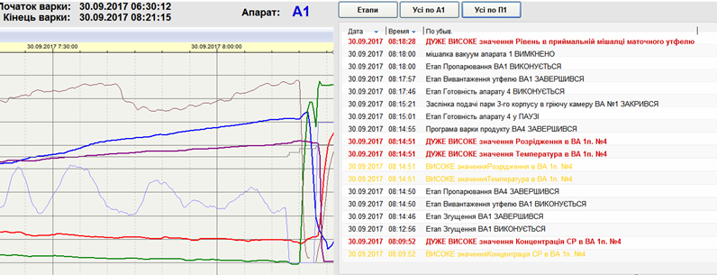

[Головна](README.md) > [6.Розроблення підсистеми тривожної сигналізації](6.md)

# 6.9. Розширені та прогресивні методи організації тривог

Розширені (enhanced) та прогресивні (advanced) методи організації тривог забезпечують додаткову функціональність системи тривожної сигналізації. Згідно зі стандартом ISA-18.2, ці методи передбачають додаткові шари логіки, програмування або моделювання, які використовуються для зміни атрибутів тривог. ***Прогресивне керування тривогами*** (***Advanced alarming***) передбачає зміну поведінки тривоги, ґрунтуючись на різних методах. У багатьох випадках воно використовується для позбавлення або пом'якшення ефекту переповнення тривог, які не забезпечують базові методи розроблення тривоги. До методів прогресивного керування тривогами входять: 

- керування тривогами на основі логіки (logic based alarming);

- динамічне керування тривогами (dynamic alarming);

- стано-орієнтоване керування тривогами, наприклад, на підставі стану (state-based alarming) або режиму (i.e., mode-based alarming);

- адаптивні тривоги (adaptive alarms).

У доповнення до цього – ***розширене керування тривогами*** (***enhanced*** ***alarming***). Воно надає операторові додаткову інформацію з інших підсистем або/та перенаправляє тривогу вказаному отримувачу в іншій підсистемі.

Розширені та прогресивні методи керування тривогами часто використовуються в тому випадку, коли базовий функціонал тривожної сигналізації не досягає цілей продуктивності, зазначених у методології системи тривожної сигналізації. Складність розширених і прогресивних методів керування тривогами потребує додаткових ресурсів для проектування, впровадження та обслуговування. Щоб зменшити залежність реалізації методик від можливостей SCADA/HMI, розробники нерідко реалізовують ці функції на рівні ПЛК, зокрема, як це робиться в PAC Framework [[8](https://github.com/pupenasan/PACFramework)], [9].  

Системи тривожної сигналізації можуть бути посилені розширеними методами прив'язування до інформації в основній базі даних тривоги (наприклад, дії оператора або наслідку). Це розширення надає можливість при виникненні тривоги надати операторові інформацію з центральної бази даних тривоги, або навпаки – занести туди проведені дії оператора. Інформація також може бути пов'язана з іншими джерелами, включаючи: операційні процедури, журнали операторів, історію обслуговування або проектні документи. 

Деяким розширеним і прогресивним методам керування тривогами потрібно мати можливість змінювати певні атрибути тривоги (наприклад, змінити уставку або пріоритет тривоги). Така модифікація потребується з причини зміни умов експлуатації процесу або установки. До таких належить стано-орієнтоване керування тривогами – прогресивний метод, який змінює атрибути тривоги на підставі означених робочих станів для устатковання або процесів. Стани часто визначаються через:

- статус змінної;

- означену змінну процесу, яка досягає певної межі;

- логіку, яка розглядає багато змінних і показників; 

- вибір оператора.

На окрему увагу заслуговує керування тривогами для Batch процесів для багато-рецептурних виробництв. Batch виробництво (порційне, багаторецептурне) – це виробництво, в якому кожен продукт виготовляється поетапно за окремим рецептом (див. також параграф 8.4.2). По суті, рецепт означує набір етапів та задані параметри. Тут є багато особливостей, які характерні саме для таких процесів і які треба враховувати якщо порівнювати з неперервними виробництвами:

- установка не завжди працює, а отже, багато вимірювальних величин будуть поза нормальними межами;  

- задані значення параметрів залежать від рецепта;

- деякі технологічні тривоги залежать від рецепта і задаються при його створенні.

Це тільки деякі з особливостей Batch-керування, більше про це можна прочитати в стандарті ISA-88, коротко про це описано в [10]. У будь-якому випадку тривоги у Batch-процесах потребують зміни атрибутів залежно від умов, станів та етапів процесу. Якщо це не враховується, система тривожної сигналізації приречена на переповнення тривог. Крім того, у звичайних системах тривожної сигналізації дані та записи тривоги зазвичай фіксують календарний час. Для інформативності журналів тривог для Batch процесів більш важливим є відносний час, тобто час від початку партії або кроку процесу. У цьому випадку особливістю прогресивних методів є можливість фіксувати календарні відмітки часу початку кроку або етапу партії і виводити тривоги відносно цього часу. Слід також враховувати, що такі виробництва часто потребують прив’язки записів тривог до номера партії. У такому випадку при виборі номера партії можна вивести усі записи тривог та повідомлення, які відбувалися під час виготовлення продукту.  

Крім того, у звичайних системах тривожної сигналізації дані та записи тривоги зазвичай фіксують календарний час. Для інформативності тривог для Batch процесів важливішим є відносний час, тобто час від початку партії або кроку процесу. У цьому випадку особливістю прогресивних методів є можливість фіксувати календарні відмітки часу початку кроку або етапу партії і виводити тривоги відносно цього часу. Крім того, такі виробництва часто потребують прив’язки записів тривог до номера партії. У такому випадку при виборі номера партії можна вивести усі записи тривог та повідомлення, які відбувалися під час виготовлення продукту (рис. 6.13).   

Деякі методи ґрунтуються на змінах атрибутів одних тривог від стану інших. До таких належать ***першо-причинні тривоги*** (***first-out alarms***) – тривоги, що визначаються першими для виведення їх як причини виникнення у випадку виникнення послідовності тривог. 

До прогресивних методів належить також ***керування тривогами на базі моделей*** (***Model-based alarming***), які можуть бути використані в тих областях, де потрібна складніша система сповіщення про тривогу, наприклад:

- можуть дати результат комплексні параметри процесу, розраховані (змодельовані) на основі декількох вимірювальних параметрів;

- з моделі можна отримати оцінку або прогнозування стану установки. 

 

*Рис. 6.13.* Приклад відображення дисплею тривог, сформованих за ідентифікатором партії BatchID

У віддалених системах тривожної сигналізації (remote alarm system) оператор не перебуває безпосередньо в пункті керування. У таких системах для відправлення повідомлень може використовуватися пейджинговий зв'язок, SMS-оповіщення, електронна пошта тощо. У віддалених системах тривожної сигналізації важливою проблемою є надійність доставки повідомлень. Для підвищення надійності слід використовувати періодичні тестові повідомлення, може також виявитися необхідним забезпечити віддалене підтвердження. Зокрема, система може передбачати після відправки SMS додзвон до оператора і очікування взяття трубки з передачею голосового повідомлення. Якщо оператор не піднімає трубку, додзвон може відбуватися іншому оператору.  

Якщо основна система тривожної сигналізації не може забезпечити виконання необхідного функціоналу, стандарт передбачає використовувати додаткові системи тривожної сигналізації (Supplementary alarm systems), наприклад, експертна система. 

[<-- 6.8. Людино-машинний інтерфейс для систем тривожної сигналізації](6_8.md)

[--> 6.10. Події](6_10.md)