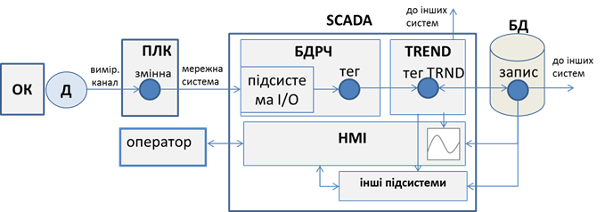

[Головна](README.md) > [7.Розроблення підсистеми трендів](7.md)

# 7.1. Модель трендового контуру 

Підсистема трендів призначена для ведення історії зміни значень числових величин у часі з можливістю їх подальшого вилучення для перегляду або додаткового оброблення. Якщо розглядати цю підсистему через призму функціонального призначення, то слід виділити такі функції (рис. 7.1):

- вимірювання значення даних з об’єкта керування;

- оброблення даних на пристрої збору (наприклад ПЛК);

- зчитування даних з пристрою збору та їх обробка в базі даних реального часу (БДРЧ);

- зчитування даних з бази даних реального часу та їх обробка в підсистемі трендів; 

- записування даних в архівну базу даних (БД);

- зчитування архівних даних з БД із зазначенням певних критеріїв, їх обробка та відображення. 

*Рис. 7.1* Модель трендового контуру для однієї змінної процесу 

Ці функції формують ланцюжок, який у цьому посібнику будемо називати ***трендовим контуром\***. Схема моделі трендового контуру для однієї змінної процесу показана на рис. 7.1. Вона може відрізнятися залежно від реалізації, тим не менше представляє більшість процесів, які відбуваються в SCADA та в деяких операторських панелях для формування архівних записів та доступу до них. Така модель дає можливість звернути увагу на певні нюанси налаштувань, тому може бути корисною читачеві для розуміння. 

З моделі видно, що підсистема трендів (позначена як TREND) не функціонує сама по собі. Дані надходять з інших підсистем, як правило (але не обов’язково), з бази даних реального часу (БДРЧ). У деяких SCADA підсистема виділяється як окремий трендовий сервер, тому в ній є свої трендові теги (на рис. 7.1 позначений як "тег TRND").  Тег у базі даних реального часу для змінної процесу зчитується через підсистему введення/виведення з контролера або аналогічного пристрою (позначений як ПЛК). Той отримує значення з каналу вимірювання. Отримані значення підсистема трендів зберігає в певній базі даних. Збережені дані використовуються надалі для різних підсистем. Найпростіший випадок, коли дані відображаються у вигляді трендів у підсистемі HMI. Тим не менше архівні дані можуть використовуватися для аналітичних функцій чи інших цілей. Зрештою контур замикається через оператора, який, отримавши необхідну інформацію приймає певні рішення і виконує дії, які для спрощення не показані на рис. 7.1.       

Таким чином, проектування та розроблення підсистеми трендів можна розглядати в 2-х площинах – серверній, де відбуваються операції записування та вилучення даних в/з базу даних історії, та клієнтській, де відбувається їх представлення зацікавленій особі. Серверна частина по суті представляє собою спеціалізовану СКБД (систему керування базами даних), а клієнтська, як правило, реалізована у вигляді спеціальних засобів для перегляду даних трендів (у графічному або табличному вигляді), підсистеми звітів або інших підсистем. Підсистема звітів розглядається в підрозділі 8.5; у цьому розділі зупинимося тільки на графічних переглядачах.  

За необхідності збирання великої кількості даних, наприклад з кількох відділень виробництва, для їх попереднього оброблення і передачі на верхні рівні керування використовуються спеціалізовані програмні засоби, які прийнято називати Historian (Істориками). Враховуючи, що Historian мають набагато більшу функціональність, ніж збирання і архівування трендових даних, а їх призначення – інтеграція з верхніми рівнями керування, вони розглядаються в підрозділі 9.3 посібника.   