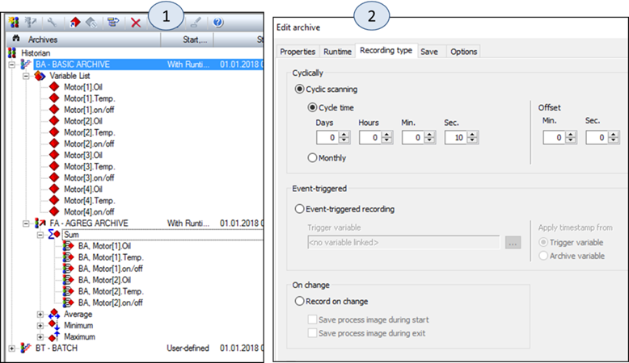
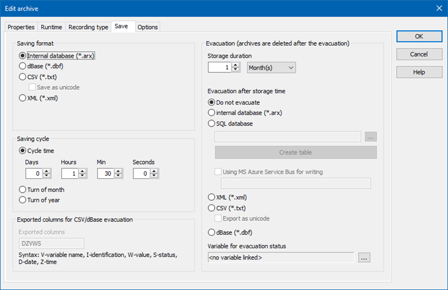
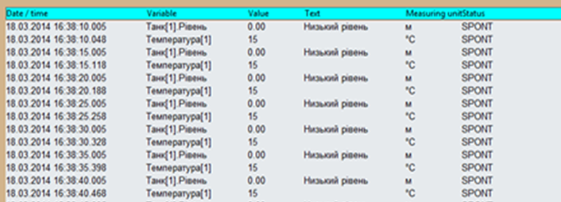
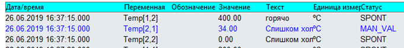
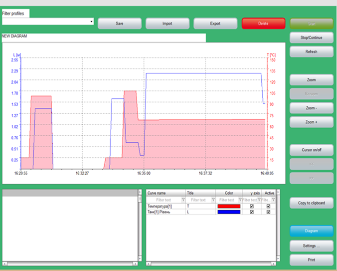
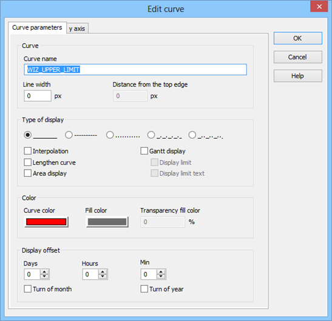
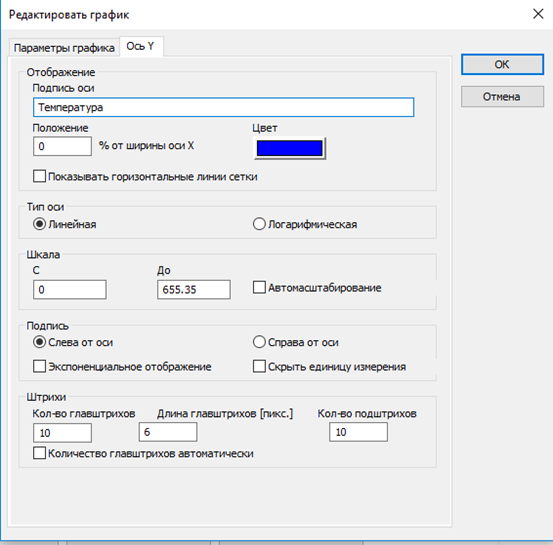
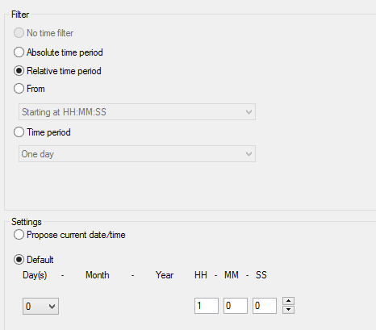

[Головна](README.md) > [7.Розроблення підсистеми трендів](7.md)

# 7.5. Підсистема трендів в SCADA zenon

У SCADA zenon трендовий сервер доступний як модуль Historian. Дані, які будуть записані в архів можуть бути доступні з інших модулів та засобів:

- Archive revision screen – перегляд та редагування трендового архіву у вигляді таблиці;  

- Extended Trend – перегляд трендового архіву у вигляді графіків трендів; 

- Report Generator – формування звітів за даними трендів;

- Report Viewer – формування простих звітів за даними трендів;

- zenon Analyzer – аналітичний модуль;

- data evacuation – перенесення даних;

- data export – експортування даних.  

Таким чином, у zenon підтримується класичний 2-етапний підхід до конфігурування підсистеми трендів – налаштування збереження та відображення. Тим не менше, явно виділеного сервера трендів у zenon немає, трендові функції є частиною SCADA серверу.  

Трендові дані зберігаються в архівах, для яких налаштовуються спільні властивості за способом збереження, періодичністю, місцем тощо. Historian підтримує так званий каскадний спосіб ведення архівів. Значення змінних пишуться в ***базові*** (base) архіви (рис. 7.12,1). Тому при їх конфігуруванні користувач вибирає ті змінні, які він планує зберігати в даному архіві. Збережена історія в базових архівах може бути оброблена з використанням статистичних функцій підсумовування, усереднення, мінімуму і максимуму, а результат зберігатися в ***агрегованих архівах*** (aggregation archive). Глибина і періодичність записування для базового та агрегованого архівів налаштовується окремо. Таким чином, на дуже великих проміжках часу можна зберігати тільки статистичну інформацію, що значно зменшує час доступу до БД та обсяг цих даних.

Запис даних в архів може відбуватися постійно, коли середовище виконання працює або проводитися за запитом користувача. Останнє дає змогу формувати записи тільки за необхідності, наприклад, за подією запуску установки і до її зупинки. 

Також zenon може зчитувати з ПЛК попередньо збережені там архіви. Це –архіви ***RDA*** (Real Time Data Acquisition), які потрібні в таких ситуаціях:

- за відсутності постійного зв’язку з ПЛК;

- за необхідності збереження даних в архіві з дуже маленьким проміжком часу, який неможливо зчитувати із заданою періодичністю; zenon дає змогу зчитувати змінні з періодичністю понад 100 мс (без урахування обмежень комунікацій).

*Рис. 7.12.* Налаштування архівів в zenon: *1* – типи, *2* – налаштування подій записування

Таким чином zenon буде зчитувати весь блок архіву при зміні значення вказаної змінної. 

Дані можуть бути записані в архів різними методами (див. рис. 7.12,2): 

- циклічним (Cyclical): дані будуть писатися з указаною періодичністю;

- за тригером (Event-triggered): дані будуть писатися тоді, коли змінюється значення тригерної змінної (0->1); при цьому відмітку часу можна брати як із змінної, що пишеться, так і з тригерної змінної; 

- за зміною значення (On-change). 

SCADA zenon підтримує збереження даних в архівах різного типу (рис. 7.13):

- у внутрішньому форматі (arx);

- текстовому (csv);

- dBase (dbf);

- XML-форматі;

- безпосередньо в базі даних SQL.

У налаштуваннях "Saving cycle" вказується, як часто буде створюватися новий архівний файл. Параметр "Storage Duration" у розділі "Evacuation" вказує на глибину архіву. Таким чином, кількість файлів буде рівною "storage duration", поділеною на "Cycle time". Старі файли zenon можна евакуювати, тобто перенести у вказане місце. При цьому дані можуть бути перетворені в формат SQL (у тому числі для розміщення в хмарному сервісі MS Azure), XML, CSV або dBase. 

Розміщення архівних файлів задається в налаштуваннях середовища виконання, що доступні у властивостях проекту.

Слід зазначити, що zenon пише не тільки значення змінної і відмітку часу, а й додаткові властивості тексту і біти стану змінної. Таким чином при перегляді історії можна побачити достовірність даних, причину зміни значення. 

*Рис. 7.13* Налаштування формату збереження, евакуації та експорту архівів у zenon 

SCADA zenon окремо підтримує lot-архіви (раніше називалися Batch-архівами). Це архіви, які запускаються і зупиняються користувацькою функцією під час відповідно початку та закінчення виробництва певної партії продукту. Назва партії означується спеціальною змінною (lot variable), за значенням якої можна буде зробити фільтрацію при вибірці необхідних трендових даних. Така організація архівування дає можливість швидко доступитися до даних конкретної партії продукту по її імені. 

Для перегляду трендових даних у zenon пропонується два типи екранів: 

- Archive revision – перегляд та редагування трендового архіву у вигляді таблиці;  

- Extended Trend – перегляд трендового архіву у вигляді графіків трендів . 

Процес створення цих екранів у zenon практично не відрізняється від створення інших спеціальних типів екранів: спеціальні елементи керування розміщуються за шаблоном. Інші налаштування проводяться при створенні функції виклику екрана.  

Екран Archive revision надає можливість відобразити поля архіву у вигляді таблиці (рис. 7.14). Такий вигляд може знадобитися не так для перегляду тенденції зміни, як для перегляду значень та статусів змінних. Статус вказує на причину зміни та якість змінної.       

Екран Archive revision дає оператору можливість замінювати збережене в архіві значення або вставляти новий запис. Це може знадобитися, наприклад, у тому випадку, коли записуване значення не було достовірним і вимірювання проводилося іншими засобами, наприклад, неавтоматичними приладами. Тоді ці значення можна ввести пост-фактум. Звичайно, за таких можливостей оператори могли б "підмінити" архівні дані недійсними значеннями задля своєї мети. Однак, по-перше, в zenon є можливість обмежити доступ до цієї функції тільки авторизованим користувачам, по-друге, значення статусу для цього запису зміниться на MAN_VAL (рис. 7.15).

Екран типу Extended Trend дає можливість відображати тренди у вигляді графіків (рис. 7.16). 

*Рис. 7.14*. Приклад елемента табличного перегляду Archive revision

*Рис. 7.15.* Показ статусу у Archive revision.

*Рис. 7.16.* Приклад екрану Extended Trend.

У zenon реалізовані достатньо потужні механізми відображення трендів, зокрема:

- налаштування всіх параметрів відображення як у середовищі розроблення, так і в середовищі виконання;

- відображення даних:
  - у реальному часі;

  - архівних з трендового архіву;

  - з блока;

- добавлення на тренд кривих реального часу та з архіву:

  - числових змінних;

  - дискретних змінних; 

- відображення кривої (curve) тренду у вигляді (рис. 7.17):

  - ліній різного кольору, товщини та формату:неперервної, штрихової, пунктирної і т. п.;

  - заповненої області (area) із зазначенням прозорості;

  - інтерполяції даних;

  - відображення у вигляді діаграми Ганта;

  - відображення даних зі зміщенням;

- відображення та налаштування по осі Y для кожної кривої (рис. 7.18):

  - сітки і поділок; 

  - лінійного або логарифмічного вигляду;

  - діапазону, можливість автомасштабування;

  - переміщення шкали по горизонталі в будь-якому місці діаграми;

- відображення та налаштування по осі X

  - сітки і поділок; 

  - перемотування вперед/назад;

- масштабування;

- відображення та керування курсором;

- виведення легенди з можливістю швидкої зміни основних властивостей кривих;

- збереження заданих налаштувань як профілю із зазначеним ім’ям для можливості відкриття налаштувань звичайним вибором;

- задавання необхідного діапазону часу для відображення (рис. 7.19):

  - абсолютними величинами;

  - відносно плинного часу; 

- задавання фільтрів для відображення даних за ім'ям партії (lot).

Додатково Extended Trend має можливість відображати залежності X від Y у форматі графіка. 

Усі ці налаштування для Extended Trend і Archive revision можна провести кількома способами:

- при використанні функції відкриття екрана в середовищі розроблення;

- при відкритті екрана в середовищі виконання;

- за допомогою спеціальної командної кнопки в середовищі виконання.

Таки чином, у середовищі виконання оператор може налаштувати відображення трендів.

*Рис.7.17.* Налаштування кривої

*Рис. 7.18.* Налаштування осі Y для кривої

*Рис. 7.19.* Налаштування часу для відображення даних для Extended Trend і Archive revision

[<-- 7.4. Підсистема трендів в SCADA Citect](7_4.md)

[--> 7.6. Підсистема трендів у WinCC Comfort ](7_6.md)