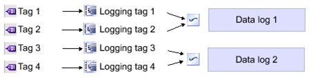
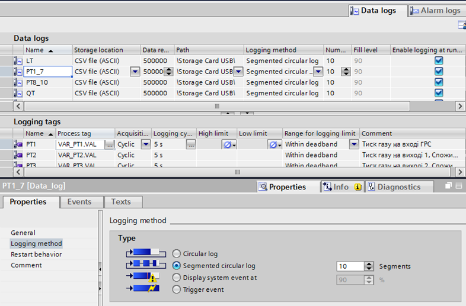
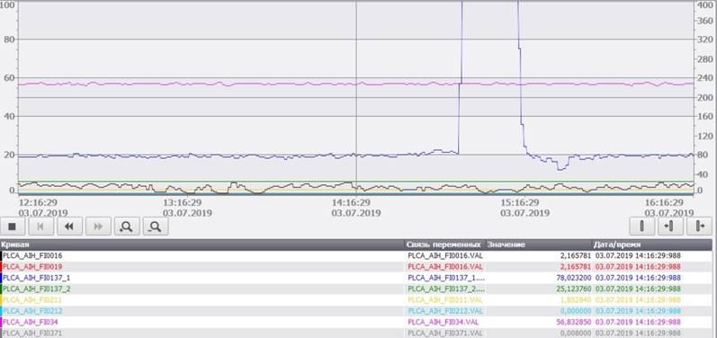

[Головна](README.md) > [7.Розроблення підсистеми трендів](7.md)

# 7.6. Підсистема трендів у WinCC Comfort 

У WinCC для Comfort Panels підсистема трендів організована з використанням двох частин: записування даних у журнали даних (Data log) та відображення даних з використанням спеціальних елементів керування (Trend View).

Конфігурування збереження даних для трендів, так само як і тривог, проводиться в розділі проекту Historical data. За ведення історії відповідає ***журнальний тег*** (Logging Tag), який отримує значення з тегу і формує за певною подією запис у ***журналі даних*** (Data log) (див. рис. 7.20). 

*Рис. 7.20*. Принципи архівування даних для трендів у WinCC

Можна створити кілька журналів даних (Data log), для кожного з яких:

- створюються журнальні теги та налаштовуються його властивості;
  - означується тип файлу журналу (Storage Location):

  - RDB File – пропрієтарний формат з максимальною продуктивністю, але не відтворюваний сторонніми переглядачами; 

  - CSV File (ASCII) – текстовий файл у форматі CSV і кодуванням символів ASCII (не підтримує кирилицю і т. п.), доступний для читання сторонніми переглядачами (наприклад Excel);

  - TXT File (Unicode) – текстовий файл у форматі CSV і кодуванням символів Unicode (підтримує кирилицю), доступний для читання сторонніми переглядачами (наприклад Excel); для журналювання даних трендів не має сенсу; 

- означується глибина історії шляхом задавання кількості записів на один журнал (Data record per Log);

- місце розташування файлів історії (Path);

- метод ведення журналу (Logging method, рис. 7.21), що означує порядок дій при переповненні:

  - кільцевий журнал (Circular log) – коли досягається максимальна кількість записів, видаляються 20% найстаріших, які замінюються новими записами;  

  - сегментований кільцевий журнал (Segmented circular log) – ділиться на сегменти; коли досягається максимальна кількість записів, видаляється найстаріший сегмент; 

  - із відображенням системного повідомлення про заповнення (Display system event at) – не видаляє самостійно старих записів; коли досягається вказаний відсоток від максимальної кількості записів, у системному журналі з’являється попереджувальне повідомлення; 

  - із формуванням події переповнення (Trigger Event) – не видаляє самостійно старих записів; коли досягається максимальна кількість записів, формується подія Overflow, обробник якої вказується у вкладці Events цього журналу;  

- означується поведінка при старті:

  - необхідність запуску журналювання; 

  - дописуваня даних в журнал, чи записування нового журналу. 

Джерело даних та подія для запису вказується в журнальному тегу (Logging Tag), зокрема (див. рис. 7.21):

- тег, з якого береться значення (Process Tag);

- режим ініціювання архівування (acquisition mode);

  - On change – за зміною значення тегу;

  - Cyclic – циклічно (періодично) з указаним періодом;

  - On demand – значення буде записуватися при виклику спеціальної функції LogTag;

- межі, в яких, або навпаки – за якими, значення змінної буде архівуватися (Dqadband limits).

- Таким чином, глибина збереження вказується шляхом конфігурування двох параметрів:

- максимальною кількістю записів на журнал (Data record per Log);

- Logging cycle або частотою спрацювання Event.

*Рис. 7.21*. Налаштування журналу даних у WinCC

Файли журналу можна копіювати системними функціями, через файлову систему або через FTP. Перегляд трендових даних на панелі проводиться з використанням спеціального елемента керування – переглядача трендів (Trend View). Він має такі можливості (рис. 7.22):

- налаштовувати тільки в середовищі розроблення;

- відображати до 8 кривих; 

- відображати дані:

  - у реальному часі;

  - архівних із журналу даних;

- прив’язувати криві до лівої або правої шкали масштабу;

- у режимі виконання автоматично змінювати колір тренду при виході за вказаний діапазон або при зміні якості;

- відображати легенду (Table) та значення в позиції курсора на ній;

- відображати криву тренду у вигляді (див. рис. 7.17):

  - ліній різного кольору, товщини та формату: неперервної або штрихової;

  - інтерполяції даних або без неї;

  - відображати у вигляді стовпчиків, точок; 

- відображати та налаштовувати по осі Y для лівої та правої шкали:

  - сітку і поділки; 

  - діапазон, можливість автомасштабування;

  - переміщувати шкали по горизонталі в будь-якому місці діаграми;

- відображати та налаштовувати по осі X:

  - сітку і поділки; 

  - перемотувати вперед/назад;

- масштабування;

- відображення та керування курсором.

*Рис. 7.22.* Загальний вигляд переглядача трендів у WinCC (для Comfort Panels)

Слід розуміти, що вище розглянуті можливості WinCC, які наявні саме в операторських панелях, а не SCADA-програмі. Порівняно з операторськими панелями багатьох інших виробників, панелі Simatic Comfort Panels мають багатий функціонал. Тим не менше, за необхідності обробки і відображення великої кількості даних необхідно передбачувати в проекті SCADA-програми.

