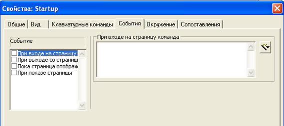
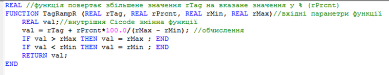
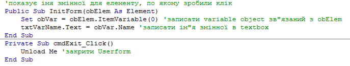
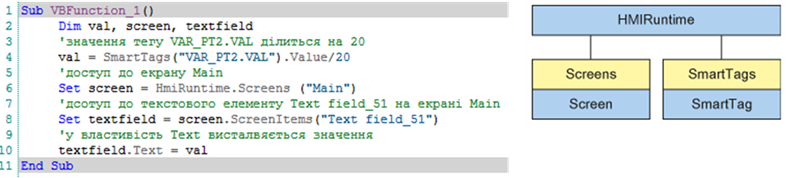

[Головна](README.md) > [8.Інші підсистеми SCADA/HMI](8.md)

# 8.1. Підсистема скриптів

Постачальники інструментальних засобів SCADA/HMI намагаються доповнити свої інструменти максимальною функціональністю, яка потрібна розробникові АСКТП. Тим не менше, для більшості проектів все одно знаходяться завдання, які потребують індивідуального підходу з використанням програмування. З цієї причини постачальники SCADA/HMI впроваджують у програмні середовища розроблення та виконання підсистеми створення, відлагодження та виконання скриптів. Підсистема скриптів може включати:

‒    середовище програмування для певної мови;

‒    окреме середовище виконання – ***інтерпретатор\*** програм, у випадку якщо скрипти не компілюються в інтегрований код середовища виконання SCADA/HMI;

‒    клієнтський інтерфейс доступу до API середовища виконання SCADA/HMI для можливості взаємодії з об'єктами.  

Окрім добавлення свого функціоналу до середовища виконання, деякі пакети SCADA/HMI надають можливість використовувати скрипти для автоматизації рутинної роботи в середовищах розроблення. Це, наприклад, може бути створення великої кількості об’єктів за певним алгоритмом. 

Середовища програмування та інтерпретатор можуть бути як стандартними так і власними. У SCADA великої популярності у свій час набрало середовище та мова VBA (Visual Basic for Application). Також деякі SCADA/HMI підтримують VBScript, C, JavaScript. Враховуючи зміну парадигми компонентної автоматизації, зараз популярними стають мови та середовища, що базуються на .NET, наприклад MS C# та VB.NET. Тим не менше, велика кількість SCADA/HMI підтримують свої мови та середовища програмування. 

Нижче наведено деякі приклади використання вбудованих скриптоподібних мов у різних середовищах SCADA/HMI. Слід розуміти, що розгляд кожної мови потребує великого обсягу матеріалу що не може вміститися в об’єм цього посібника. Приклади наведені для демонстрації використання..  

## 8.1.1. Citect Cicode

У Citect левова частка анімації та деякі функції серверного оброблення для середовища виконання реалізовані через вирази та команди, написані в форматі вбудованої мови програмування Cicode. 

***Cicode\*** – це повноцінна мова програмування, яка має можливості роботи з власними змінними, підтримує умовні оператори, оператори циклів, багатопоточність та багато чого іншого. Cicode надає прямий доступ до тегів (змінних тегів, трендів, тривог) через їх назву. 

***Cicode вирази\*** (Cicode expressions) – це вирази, написані мовою Cicode, результатом виконання яких є певне значення, що може бути використане при анімації. Виразом може бути проста змінна чи константа або рядок з арифметичними, логічними операціями чи конкатенацією. 

***Cicode команди\*** (Cicode commands) – це інструкція або набір інструкцій (операторів) для виконання, написаних мовою Cicode. Інструкції розділяються крапкою з комою і можуть викликати функції та змінювати значення змінних. Cicode команди можуть викликатися певними діями операторів (кліками миші чи натисканням клавіші при відкриванні/закриванні/відображенні сторінок (рис. 8.1), при спрацюванні/відключенні тривоги, при формуванні звіту, при реєстрації користувача в системі. Також Cicode команди можна запускати з кожним перерахунком сторінки, помістивши на неї елемент "Объект Cicode". 

                               

*Рис. 8.1* Налаштування команд на різні події на сторінці

У виразах та командах мови Cicode доступні операнди для таких операцій:

‒    арифметичні операції: "+" (додавання), "-" (віднімання), "/" (ділення), "*" (множення), "MOD" (остача від ділення);

‒    логічні операції: "AND", "OR", "NOT";

‒    побітові логічні операції: "BITAND", "BITOR", "BITXOR";

‒    операції порівняння: ">" , "<", "=", "<>", ">=", "<=";

‒    конкатенація: "+" (з'єднання двох рядків типу STRING).

У Cicode-виразах та командах доступний виклик функцій, які можуть бути вбудованими в систему, або написані власноруч за допомогою редактору Cicode. Власні функції Cicode потрібні у тому випадку, коли необхідно створити багаторазово викликуваний код з передачею параметрів, або коли необхідний набір інструкцій, що не може вміститися в полі введення команди Cicode. Вони створюються у файлах Cicode (приклад функції приведений на рис. 8.2).

 

*Рис. 8.2.* Приклад функції Cicode

Функціональність Citect багато в чому побудована на базі Cicode функцій, які надають гнучкості цій SCADA-програмі. Деяка частина функцій доступна у включених проектах та створена для реалізації вибраного стилю. Ці функції доступні для перегляду та зміни у відповідних файлах через редактор Cicode. Інші функції є системними (нативними) і є частиною API (програмного інтерфейсу). Усі системні функції поділені на категорії для зручності доступу до їх опису в довідковій системі. 

Починаючи з Citect 2016, з’явився новий тип драйвера з ім'ям Cicode, для тегів якого у полі адреси вказується вирази Cicode, що дає можливість створювати обраховувані змінні. 

Альтернативою мові Cicode в Citect є вбудована мова VBA (Visual Basic for Application).

## 8.1.2. VBA у zenon

У SCADA zenon є кілька підтримуваних мов та редакторів: VBA та VSTA (C# або VB.NET). Вони можуть використовуватися як для середовища виконання, так і для середовища розроблення. Останні використовуються для автоматизації процесу створення проекту. Наприклад, майстри імпорту текстів перекладів реалізовані саме з використанням таких макросів.

Редактор VBA є повноцінним редактором від Microsoft, який нічим не відрізняється від того, який є частиною MS Office. Він інтегрується з SCADA zenon через інтерфейс OLE Automation. Для використання у своєму проекті люди, які мають навички роботи з VBA, повинні ознайомитися з бібліотекою zenon. Виклик процедур та функцій VBA можуть відбуватися за різними подіями елементів на екранах ЛМІ або інших об’єктів. На рис. 8.3 показано приклад процедур VBA для відображення прив’язаної до об’єкта змінної.

  

*Рис. 8.3.* Приклад коду в VBA

У SCADA zenon практично вся діяльність відбувається без використання мов програмування. Більшість проектів можна зробити, не написавши жодного рядка коду. Однак при необхідності інтегрування додаткових функцій, наприклад для складного оброблення даних та взаємодії з базами даних може знадобитися VBA або VSTA. 

## 8.1.3. VBScript у WinCC Comfort

У WinCC Comfort у якості скриптової мови для середовища виконання використовується VBScript. Власні функції та процедури VBScript можуть викликатися через певні події об’єктів (Events). Це можуть бути події планувальника, елемента на екрані, тривоги тощо. Доступ до інших підсистем середовища виконання відбувається через спеціальні об’єкти. Наприклад, "HmiRuntime" надає доступ до екранів та тегів (рис. 8.4). 

 

 

*Рис. 8.4.* Приклад коду в VBScript (ліворуч) та об’єкт HMIRunntime (праворуч) у WinCC Comfort

VBScript підтримує функцію CreateObject, яка надає доступ через інтерфейс OLEAutomation до зареєстрованих у системі бібліотек. Це суттєво розширює можливості операторських панелей, оскільки дає можливість користуватися ресурсами Windows CE.