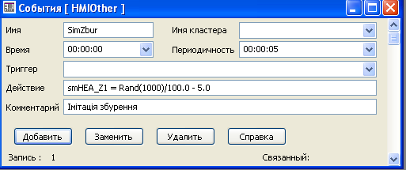
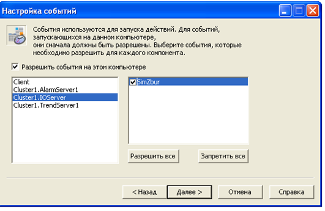
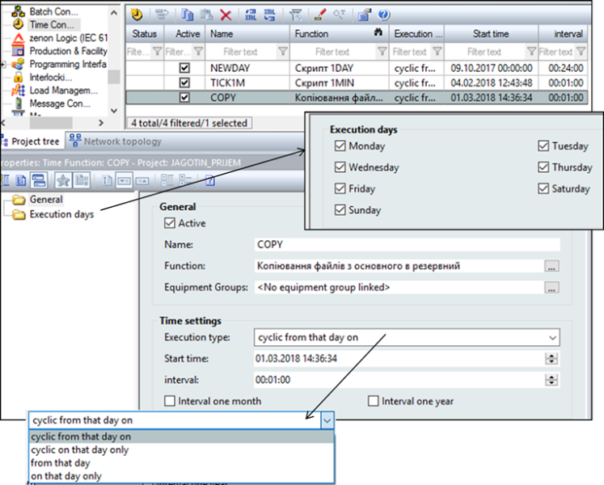
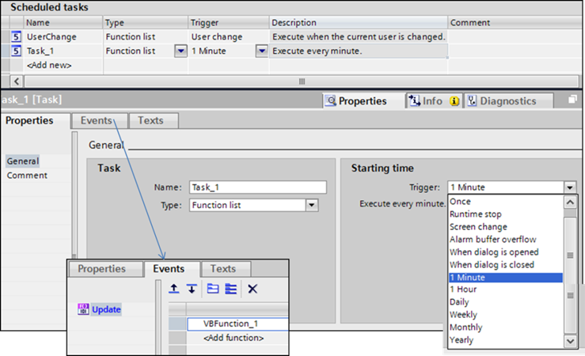
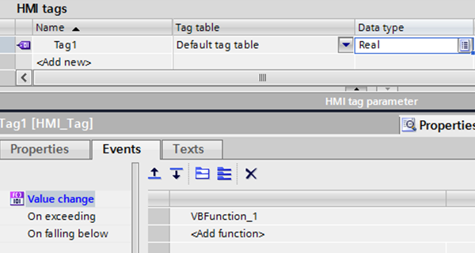

[Головна](README.md) > [8.Інші підсистеми SCADA/HMI](8.md)

# 8.2. Підсистема генерування подій

Події дають можливість виконувати певну дію, що ініціюється тригером. ***Тригер*** – це умова, виконання якої приводить до дії. У загальному випадку умовою може бути будь-який вираз, який дає булевий результат (істина або хибність). Частковим випадком спрацювання по тригеру є проходження певного періоду часу відносно заданого. У деяких засобах ця функціональність виділена в окрему підсистему, або часово-генероване завдання. 

Окрім тригера, задається дія, яка буде виконуватися. Це може бути виклик функції, зміна тегу, тощо. 

Наявні функції в скриптах можуть мати дуже велику кількість додаткових генераторів та обробників подій. 

## 8.2.1. Підсистема генерування подій у Citect 

У Citect усі події означуються в однойменному розділі (Events, События). Дія означується Cicode командою за виконанням певної умови або періодичності виконання. Події створюються в редакторі проекту "Система->События". Для події вказується ім’я (рис. 8.5), періодичність та час, відносно якого проводиться синхронізація періодичності (рос. лок."Время"). Якщо період не вказаний, він приймається рівним 1 с. 

                               

*Рис. 8.5.* Налаштування властивостей події

Тригер вказує на умову, яка запускає виконання дії. Якщо тригер не вказаний, то дія буде виконуватися з періодичністю, означеною полями "Время" і "Перио­дичность". Якщо тригер вказаний, але не вказані поля "Время" і "Периодичность", то дія буде виконуватися по передньому фронту спрацювання тригера.

Події можуть виконуватися в контексті будь-якого процесу Citect, чи то сервері, чи клієнті або в усіх. Місце виконання подій налаштовуються в майстрі налаштування комп’ютера (рис. 8.6). Події з ім'ям "GLOBAL" виконуються на всіх комп’ютерах у системі Citect. 

 

*Рис. 8.6.* Налаштування виконання події на різних частинах системи Citect

## 8.2.2. Підсистема генерування подій у SCADA zenon 

У SCADA zenon генерування подій за часом проводиться з використанням функцій Time Control. Для кожної часової функції задається час, відносно якого генерується виклик функції, періодичність (один раз, періодично з указаного часу, періодично в зазначений день), період, а також функція zenon, яка буде викликатися (рис. 8.7). Можна також задати дні тижня, в які виконуватиметься вказана функція. 

 

*Рис. 8.7.* Налаштування часових функцій у zenon

Генерування подій за тригером, що формується в результаті зміни, значення задається в налаштуваннях змінної через границі (див. підрозділ 3.12) або матрицю реакцій (див. параграф 6.12.2), де в полі Function задається необхідна функція, яка буде викликатися при спрацюванні. 

## 8.2.3. Підсистема генерування подій у WinCC Comfort

У WinCC Comfort події можна генерувати використовуючи планувальник задач (Scheduled tasks) (рис. 8.8). Планувальник у цій редакції WinCC передбачає в якості тригеру вказівку (вибір) тільки системних подій. Функція, яка повинна виконуватися при спрацюванні тригера, вказується на вкладці Events.

Для генерування періодичних подій можна вибрати один із існуючих тригерів: 1 Minute, 1 Hour і т. д. Якщо необхідно генерувати події з іншою періодичністю можна використовувати теги з ПЛК, які будуть змінюватися із зазначеною періодичністю. Для цього для вказаного тегу у властивості Events->Value change необхідно вказати функцію, яка буде викликатися (рис. 8.9). Аналогічно можна викликати події, пов’язані з іншими тригерами, перевіряючи їх при зміні значення. 

 

*Рис.8.8* Налаштування подій через Scheduled tasks 

 

*Рис. 8.9.* Налаштування обробників подій для тегів 

[<-- 8.1. Підсистема скриптів](8_1.md)

[--> 8.3. Доступ до баз даних зі SCADA/HMI](8_3.md)