[Головна](README.md) > [8.Інші підсистеми SCADA/HMI](8.md)

# 8.3. Доступ до баз даних зі SCADA/HMI

## 8.3.1. Використання баз даних у SCADA/HMI

У SCADA/HMI бази даних (***БД***) використовуються для ведення журналів подій та тривог, а також збереження значень даних для трендів. Тим не менше, бази даних можуть використовуватися і для інших завдань, наприклад:

- збереження даних рецептів;

- збереження агрегованих даних про виготовлення продукції;

- збереження даних звітів;

- в якості проміжного буфера для обміну з іншими підсистемами. 

Під терміном "база даних" у цьому підрозділі розуміється зовнішнє по відношенню до SCADA/HMI джерело даних, зв'язок з яким відбувається через систему керування базою даних (***СКБД***). Сюди не входить база даних реального часу, яка є частиною середовища виконання SCADA, і база даних проекту, яка є частиною середовища розроблення. 

У контексті використання БД в SCADA/HMI можна виділити дві найбільш уживані функції доступу до даних: записування (добавлення нових записів або зміна існуючих) та читання. Інші функції, зокрема адміністрування та створення таблиць, можна виконувати засобами СКБД і не налаштовувати безпосередньо в SCADA/HMI. 

Враховуючи велику кількість форматів баз даних, засоби SCADA/HMI часто підтримують стандартні технології доступу до баз даних. Серед них можна виділити використання СКБД з підтримкою стандартної мови запитів SQL, а також стандартних інтерфейсів доступу до баз даних ODBC, JDBC, OLEDB, ADO, ADO.NET. Нижче розглядаються деякі з них.

Перед тим, як реалізувати підключення до БД в засобах SCADA/HMI, варто спробувати це зробити з використанням спеціалізованих програмних утиліт. У мережі Інтернет можна знайти велику кількість безкоштовних засобів подібного типу. Серед універсальних тестових утиліт можна виділити DbVisualizer https://www.dbvis.com, яка має платну і безкоштовну редакцію. Вона працює на Java і може підключатися до будь-яких джерел даних, що підтримують JDBC. При використанні джерел даних на MS SQL Server можна скористатися безкоштовним менеджером SQL Server Management Studio (завантажується з офіційного сайту Microsoft). 

## 8.3.2. Мова SQL

***SQL*** (Structured Query Language – мова структурованих запитів) – це універсальна мова для створення, модифікації та керування даними в реляційних базах даних. Ця мова описана в ряді стандартів ANSI, ISO/IEC і на момент написання останньою версією є SQL:2019. На сьогоднішній день практично всі відомі СКБД підтримують цей стандарт з деяким розширеннями до нього для адаптації під свої формати даних та функціональні можливості серверів. Такі мови називають діалектами SQL. Так, діалект СКБД MS SQL Server має назву "Transact-SQL", а MySQL – "SQL/PSM". Перед використанням SQL для конкретної СКБД варто ознайомитися з підтримуваними командами.

SQL використовується для створення структури бази даних, маніпуляції з даними, тобто їх вибірки і модифікації, та для їх адміністрування. Будь-яка операція по вибірці, модифікації, визначенню або адмініструванню виконується за допомогою ***оператора*** (***statement***) або ***команди*** (***command***) SQL.

Є дві можливості операцій по маніпуляції з даними – ***вибірка даних*** (data retrieval) і ***модифікація даних*** (data modification). Вибірка – це пошук необхідних даних, а модифікація означає добавлення, знищення або заміна даних. Операції по вибірці називають ***SQL запитами*** (***SQL*** ***queries***). Вони проводять пошук у базі даних, найбільш ефективно вибирають необхідну інформацію і відображають її. В усіх запитах SQL використовується ключове слово SELECT. Операції по модифікації виконуються відповідно з використанням ключових слів INSERT, DELETE та UPDATE. 

На практиці найчастіше приходиться робити вибірку даних, для чого використовується оператор SELECT. Спрощена його конструкція має вигляд:

```sql
SELECT список_стовпчиків
FROM список_таблиць
[WHERE умови]
```

де слова в квадратних дужках [] – не обов’язкові.

У списку стовпчиків (полів записів) вказуються ті поля таблиці, які повертаються після оброблення запиту. Список таблиць вказує, з яких таблиць необхідно проводити вибірку, а в умовах вказують умови для вибірки рядків. 

Розглянемо приклад, у якому необхідно зробити запит для вибірки даних з поля (колонки) "Value" таблиці "Group_1_1" бази даних "Difuzija_1", які були записані після 19 вересня 2018 року. Дата запису знаходиться в полі "Group_1_1.TDate". Запит матиме такий вигляд:

```sql
SELECT Value 
FROM Difuzija_1.Group_1_1 
WHERE Group_1_1.TDate>'2018-09-19 00:00:00'
```

Якщо необхідно вибрати усі поля, то запис буде такий: 

```sql
SELECT * 
FROM Difuzija_1.Group_1_1 
WHERE Group_1_1.TDate>'2018-09-19 00:00:00'
```

Повний синтаксис оператора SELECT має такий вигляд:

```sql
SELECT [ALL|DISTINCT] список_стовпчиків
[INTO нова_таблиця]
FROM {таблиця | курсор}[,{таблиця | курсор}…] 
[WHERE умови]
[GROUP BY стовпчик [, стовпчик…]]
 [HEAVING умови]
[ORDER BY {ім’я_стовпчика | список_вибору}[ASC|DESC] ... ]
```

У списку `SELECT` вказуються ті поля (стовпчики), які необхідно повернути із запитом. Є можливість зробити деякі операції над полями перед відображенням: +, -, *, /. 

Ключове слово `INTO` вказує на необхідність створення нової таблиці з указаним ім'ям. 

Умови в `WHERE` задаються операторами порівняння (=, <, >, >=, <=, != або <>), логічними (AND, OR, NOT), визначення діапазону (`BETWEEN` і `NOT BETWEEN`), символьного порівняння за шаблоном (LIKE) та ін.

Ключове слово ORDER BY дає змогу упорядковувати знайдені записи за вказаним стовпчиком по зростанню ASC або по спаданню DESC.

Для створення нового запису у таблиці БД використовується оператор INSERT. Короткий синтаксис оператора:

```sql
INSERT INTO таблиця (стовпчик [, стовпчик…]) VALUES (значення1, [значення2, ...]) 
```

Для модифікації існуючих записів в таблиці використовується оператор UPDATE, який має такий синтаксис: 

```sql
UPDATE [top(x)] <об'єкт>
SET <присвоєння1 [, присвоєння2, ...]>
[WHERE <умова>]
[OPTION <хінт1 [, хінт2, ...]>]
```

де top (x) — команда виконується тільки х разів; <об'єкт> — об'єкт, над яким виконується дія (таблиця або подання (views)); <присвоєння> — присвоєння, яке буде виконуватися при кожному виконанні умови <умова>, або для кожного запису, якщо немає частини WHERE; <умова> — умова виконання команди, <хінт> — інструкція програмі, як виконати запит.

Якщо необхідно використовувати мови SQL в SCADA/HMI для доступу до даних, варто перевірити роботу SQL-запитів у тестових утилітах. Наприклад, Microsoft SQL Server Management Studio дає можливість не лише виконувати запити SQL, але й надає інструменти для їх побудови (Query Designer). На рис. 8.10 показаний приклад перевірки SQL-запиту. 

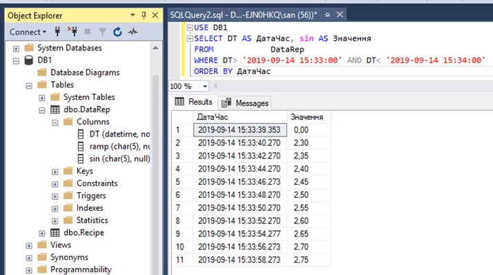                               

*Рис. 8.10.* Перевірка SQL-запиту в Microsoft SQL Server Management Studio 

Мова SQL задає тільки формат повідомлень запитів та відповідей між застосунком-клієнтом та сервером. Однак яким чином цей запит передається, як формується з’єднання між застосунками, створюється та розриваються сеанси і т. п., вирішується на інших рівнях взаємодії. Крім того, мова SQL розроблена для взаємодії з реляційними БД для інших типів, вона не завжди застосовна. Нижче розглянуті стандартні програмні технології взаємодії з БД. 

## 8.3.3. ODBC, DAO, JDBC

***ODBC*** (Open Database Connectivity) – один із стандартних інтерфейсів доступу до реляційних баз даних, які засновані на мові SQL. Архітектуру ODBC показано на рис. 8.11. 

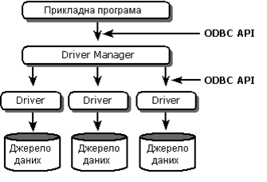 

*Рис. 8.11*. Архітектура ODBC

Зв’язок з різними джерелами даних проводиться за допомогою драйверів ODBC, які оформлені у вигляді динамічних бібліотек (DLL) і підтримують єдиний інтерфейс ODBC API, що ґрунтується на виконанні SQL-запитів. Тобто, незалежно від типу джерела даних прикладна програма генерує SQL-запити, які відправляються потрібному драйверу, що працює з даним джерелом. Драйвер забезпечує потрібне перетворення цих запитів на мову джерела або сам виконує необхідні операції, що вказані в запиті.

Для користувача цієї технології необхідно зробити таку послідовність операцій. У ***Адміністраторі ODBC*,** який знаходиться в панелі керування адміністратора Windows, створюється ***DSN*** (Data Source Name) для необхідного джерела даних:

- вибирається тип DSN: System DSN (доступний усім користувачам), User DSN (доступний плинному користувачу), File DSN (настройки зберігаються в окремому файлі);

- вказується ім’я DSN;

- вибирається драйвер ODBC;

- налаштовується драйвер для конкретного джерела даних.

У клієнтській прикладній програмі в якості джерела даних вказується ім’я DSN. З’єднання прикладної програми з необхідним джерелом даних забезпечиться Диспетчером Драйверів (Driver Manager), який реалізований у вигляді бібліотеки ODBC.DLL (див. рис. 8.11). 

При написанні прикладних програм з використання ODBC більш зручний доступ до ODBC реалізовується через RDO та DAO (рис. 8.12). RDO (Remote Data Object) – об’єктний інтерфейс доступу до джерел даних ODBC. DAO (Data Access Object) – об’єктний СОМ-інтерфейс до процесора баз даних Jet (Joint Engine Technology database engine), а також до надбудовою над RDO-інтерфейсом. 

Розглянемо конфігурування ODBC на прикладі. Припустимо для SCADA необхідно зберігати рецепти в базі даних MS SQL Server. Для створення та конфігурування БД можна скористатися утилітою "MS SQL Server Management Studio". Після створення бази даних, створюється та налаштовується таблиця, як наприклад це показано на рис. 8.13. Також добавляється користувач, наприклад "G1" з паролем "1", та налаштовується доступ до бази даних, таблиці та інших об’єктів серверу. 

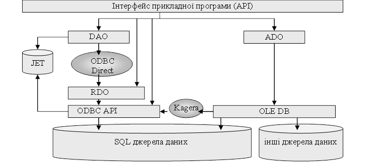 

*Рис. 8.12.* Принцип доступу до джерел даних через стандартні інтерфейси

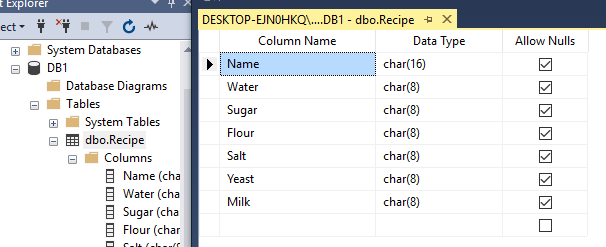 

*Рис. 8.13.* Приклад налаштування таблиці в БД

Після створення та налаштування користувачів, бази даних і таблиці налаштовується ODBC DSN, наприклад з ім'ям "ExmplDataBase". У цьому випадку вибирається драйвер SQL Server та вказуються усі необхідні налаштування (рис. 8.14).

Схоже до ідеї ODBC, ***JDBC*** (Java DataBase Connectivity – з'єднання з базами даних на Java), прикладний програмний інтерфейс Java, який означує методи, за допомогою яких програмне забезпечення на Java здійснює доступ до бази даних. JDBC — це платформо-незалежний промисловий стандарт взаємодії Java-застосунків із різноманітними СКБД, реалізований у вигляді пакета java.sql, що входить до складу Java SE. В основі JDBC лежить концепція так званих драйверів, що дозволяють отримувати з'єднання з базою даних по спеціально описаному URL. Драйвери можуть завантажуватись динамічно (під час роботи програми). Завантажившись, драйвер сам реєструє себе й викликається автоматично, коли програма вимагає URL, що містить протокол, за який драйвер "відповідає". Приклад використання JDBC можете подивитися у параграфі 8.5.1.

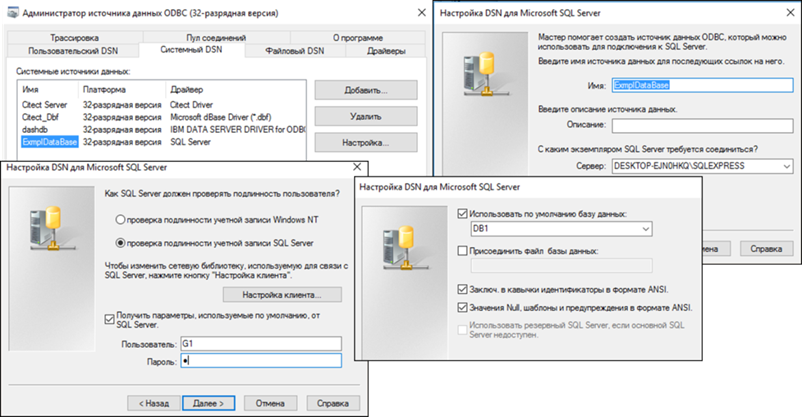 

*Рис. 8.14*. Приклад налаштування DSN в ODBC

## 8.3.4. OLE DB, ADO та ADO.NET

Альтернативою ODBC є ***OLE DB*** – це об’єктно-орієнтована технологія доступу до даних, яка ґрунтується на COM. Спеціалісти Microsoft у свій час запропонували стратегію універсального доступу до будь-яких джерел даних UDA (Universal Data Access), де драйвери OLE DB займають нижній щабель ієрархії (рис. 8.15). У цій архітектурі виділяються OLE DB Consumers (OLE DB Споживачі) – це будь-яка частина прикладної програми, яка *користується* OLE DB-інтерфейсами, та OLE DB Providers (OLE DB Провайдери) – це частина прикладної програми, яка *надає* свої послуги через OLE DB-інтерфейси.

Розрізняють два види OLE DB Провайдерів: OLE DB Провайдер Даних (OLE DB Data Provider), OLE DB Провайдер Сервісів (OLE DB Service Provider). OLE DB Провайдер даних надає послуги доступу до власних баз даних. Провайдер Сервісів не має власних даних, однак як провайдер – він надає набір послуг (сервісів). Споживачі користуються цими сервісами, частина з яких використовує Провайдерів Даних для доступу до даних. Тобто Провайдер Сервісів по відношенню до Провайдерів Даних виступає як споживач. 

На відміну від ODBC, який надає доступ тільки до реляційних даних, OLE DB може надати доступ до будь-якого джерела даних, оскільки ґрунтується на об’єктній моделі, яка спроектована для представлення даних довільного формату. Для сумісності з розробленими ODBC драйверами, OLE DB має інтерфейс доступу до них через Провайдера ODBC. 

Інтерфейс OLE DB – складний в реалізації і призначений для розроблення драйверів для нового типу джерела даних. Для кінцевого користувача необхідно мати зручний і легко зрозумілий прикладний інтерфейс (API), яким служить технологія ADO.

 

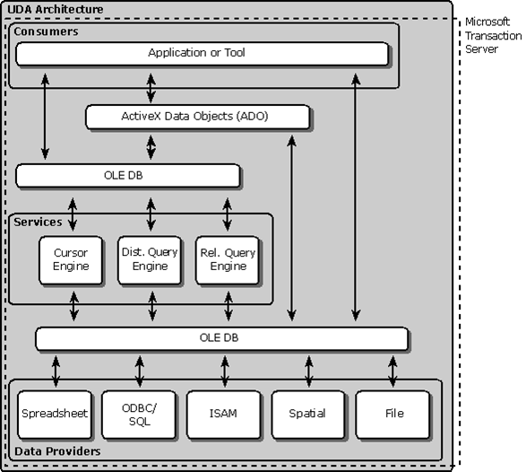 

*Рис.* *8.15.* UDA Архітектура

***ADO*** (ActiveX Data Object) означує модель програмування – послідовність дій, які необхідні для отримання доступу та модифікації джерела даних. Це об’єктна модель, тобто являє собою набір об’єктів зі своїми методами, властивостями та подіями. 

Модель ґрунтується на наступних ключових поняттях.

1) Connection (Підключення) – це джерело даних, з яким необхідно з’єднатися. Може бути представлене у вигляді символьного Рядка Підключення (Connection String) або Uniform Resource Locator (URL). У рядку вказується вся послідовність (транзакція) підключення, частини (кроки) якої розділені спеціальними роздільниками. В Рядку Підключення спочатку вказується Провайдер OLE DB, а потім всі інші параметри, які відрізняються залежно від Провайдера. Слід зазначити, що транзакція виконується повністю або не виконується взагалі, тобто виконання підключення до частини вказаної в Рядку Підключення неможливе. 

2) Command (Команда) – вказує операцію, яку необхідно зробити з джерелом даних визначених Підключенням (добавити, видалити, модифікувати, знайти дані за заданими параметрами). Розрізняють декілька типів команд: 

- по замовченню: тип команди визначається самим Провайдером; 

- текст (SQL) : команда записується у вигляді SQL-виразу;

- таблиця: команда являє собою назву таблиці, всі колонки якої повертаються із запитом;

- збережена процедура (stored procedure) – назва процедури, яка повинна бути викликана;

- файл: вказується ім’я файлу, з яким необхідно з’єднатися. 

3) Parameters (Параметри) – це параметри команди, які можуть змінюватися. Команда може виступати як функція, тобто частина команди незмінна, а інша частина виступає в якості параметрів (параметричні запити).

4) Recordset – це об’єкт, за допомогою якого можна доступитись до рядків таблиці, які повертає Команда-запит. 

5) Field (Поле) – об’єкт, який надає доступ до полів об’єкта Recordset. 

6) Error (Помилка) – об’єкт, який містить у собі інформацію про помилку. Ці об’єкти асоціюються з кожним Підключенням.

7) Property (Властивість) – кожний ADO-об’єкт має набір динамічних та статичних властивостей.

8) Record (Запис) – це об’єкт, який надає доступ до даних, які представляються у вигляді контейнера (container) та місткості (content). Для прикладу, у файловій системі каталоги – це контейнери, які можуть вміщувати інші каталоги (контейнери) або файли (місткість). Цей об’єкт дає можливість працювати з нереляційними даними.

9)  Stream(Потік) – це об’єкт, за допомогою якого можна працювати з потоками байтів файлів чи буферів пам’яті (дані content).

10) Collection (Колекція) – це об’єкт, який вміщує декілька об’єктів одного типу, до яких можна доступитися за іменем, чи індексом. 

11) Event (Подія).

Таким чином, для доступу до даних за допомогою ADO, та їх модифікації необхідно провести таку послідовність:

1) вказати джерело даних для Підключення, тобто його розміщення в Рядку Підключення або в URL. Виконати з’єднання із зазначеним джерелом;

2) означити Команду для доступу до джерела даних, її тип та, за необхідності, параметри. Виконати команду;

3) Для реляційних баз даних результати виконання команди у вигляді таблиці записуються в кеш. У разі потреби їх можна модифікувати за допомогою об’єкта Recordset.

Технологія ADO (як інтерфейс OLE DB) надає стандартні сервіси та методи роботи з даними незалежно від Провайдера даних. Однак у зв’язку зі специфікою останніх можливі деякі особливості при їх використанні. Відмінності, як правило, стосуються Рядка Підключення (Connection String), використання Команди та об’єкта Recordset. Зупинимося на основних правилах формування Рядка Підключення та Команди. 

Рядок Підключення (Connection String) формується з послідовності виразів типу *аргумент=значення*, розділених крапкою з комою. Типові аргументи наведені в табл. 8.1.

Команда (Command) вказується за допомогою текстового рядка. Правила його формування залежать від типу команди. Зазвичай це команда SQL, діалект якої залежить від провайдера даних, однак це може бути інший текст.

На сьогоднішній день найбільш використовують такі Провайдери Даних: Microsoft OLE DB Provider for ODBC, OLE DB Provider for Microsoft Jet, Microsoft OLE DB Provider for SQL Server. Для детальнішої інформації щодо викладеного матеріалу та використання описаних технологій в інструментах програмування можна звернутися до довідкової інформації на docs.microsoft.com. 

*Таблиця 8.1* 

**Типові аргументи ADO**

| Аргумент            | Пояснення                                                    |
| ------------------- | ------------------------------------------------------------ |
| *Provider**=*       | Назва Провайдера даних                                       |
| *File* *Name**=*    | Назва файлу,  де зберігаються наперед означені налаштування Підключення |
| *Remote  Provider=* | Назва  віддаленого Провайдера (тільки для Remote Data Service) |
| *Remote  Server=*   | Шлях до  віддаленого сервера (тільки для Remote Data Service) |
| *URL=*              | URL-шлях до файлу чи папки                                   |

Усе більше застосовується технологія .NET, яка лягла в основу стандартного механізму доступу до даних під назвою ***ADO.NET***. Так само, як ADO базується на OLE DB, ADO.NET базується на ***.NET*** ***Framework***. Принципи застосування залишилися однакові. На момент написання посібника відомі такі провайдери від Microsoft: 

- Провайдер даних .NET Framework для SQL-сервера;

- Провайдер даних .NET Framework для OLE DB;

- Провайдер даних .NET Framework для ODBC;

- EntityClient Провайдер даних .NET Framework для застосунків Entity Data Model (EDM);

- Провайдер даних .NET Framework для SQL Server Compact 4.0

Як видно зі списку, технологія ADO.NET підтримує сумісність із OLE DB та ODBC.

## 8.3.5. Доступ до БД з Citect

Citect SCADA підтримує обмін з двома типами баз даних dBASE та SQL (через ODBC). Однак слід розуміти, що Cicode та Citect VBA надають можливість взаємодіяти з бібліотеками, які можуть надавати доступ до інших джерел даних. Крім того, на сторінках Citect можна використовувати компонент палітри "Data Exchange" (взаємодіє через ADO), приклад використання якого наведений у параграфі 8.4.3. 

Доступ до баз даних може проводитися з використанням пристроїв системного введення/виведення (Devices, див. параграф 6.11.6) або використовуючи Cicode функції з розділу SQL. Перший спосіб простіший у використанні і у багатьох випадках може не потребувати написання коду, наприклад, при записуванні в базу даних SQL журналів тривог або подій. Нижче наведемо приклад записування в базу даних саме через цей механізм. 

Одним із типів DEVICE є ODBC джерело даних типу таблиця. Citect підтримує роботу тільки із символьним (текстовим) типом даних. Перед використанням у Device бази даних, її треба створити разом з таблицею в ній, а також налаштувати ODBC. 

Візьмемо для прикладу налаштування запису рецепта в таблицю бази даних, означену в прикладі з параграфа 8.3.3. Для роботи в Citect з DEVICE типу SQL необхідно сконфігурувати такі поля (рис. 8.16): 

*Name* – довільна назва пристрою, наприклад *DevDB;* 

*Format* – формат таблиці, тобто назва та ширина в символах колонок таблиці. 

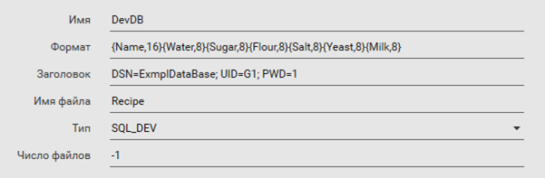 

*Рис. 8.16.* Вікно конфігурації Device в Citect

Наприклад, формат для цього прикладу (див. рис. 8.13) буде *{Name,16}{Water,8}{Sugar,8}{Flour,8}{Salt,8}{Yeast,8}{Milk,8}*. Зрештою, формат означуватиме таблицю, яка виглядатиме, як на рис. 8.17.

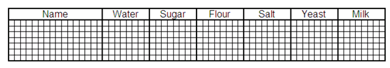 

*Рис. 8.17.* Вигляд полів у таблиці БД

*Header* – для SQL типу пристрою вказується рядок підключення, наприклад:

```
DSN=ExmplDataBase; UID=G1; PWD=1
```

вказує на ім’я DSN "ExmplDataBase", ім’я користувача (UID) рівним "G1", пароль (PWD) рівним "1"; 

*FileName* – ім’я таблиці в базі даних, до якої необхідно підключитись, наприклад "Recipe"; 

*Type* – для SQL типу пристрою вибирається SQL_DEV; 

*NoFiles* – кількість файлів, для SQL типу пристрою дорівнює -1.

Після означення в проекті пристрою, його можна використати в Cicode. Добавлення нових записів у CiCode проводиться через функції DevAppend, зміна значень полів запису – через функцію DevSetField. Робота цих функцій з конкретним Device проводиться через дескриптор (handle), який повертається функцією DevOpen, що відкриває зв'язок із джерелом даних. 

Роботу функцій розглянемо через функцію користувача FnWriteToSQL, яка заносить новий запис в DEVICE з ім’ям DevDB та полями Name, Water, Sugar, Flour, Salt, Yeast, Milk. На рис. 8.18 показано лістинг цієї функції. 

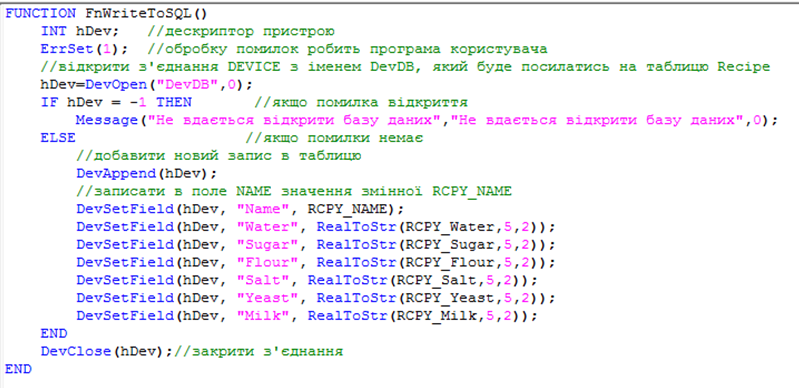 

*Рис. 8.18.* Лістинг функції Cicode записування нових записів в БД 

## 8.3.6. Доступ до БД зі SCADA zenon

Для роботи із зовнішніми базами даних для записування та читання в довільному форматі у SCADA zenon необхідно скористатися скриптами у VBA або VSTA з підключенням відповідних бібліотек. 

Наприклад, для записування значень у таблицю, що означена в прикладі з параграфа 8.3.3 через інтерфейс ADO необхідно у VBA підключити бібліотеку ADODB (рис. 8.19) 

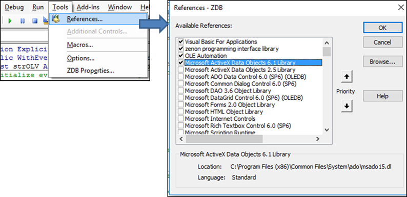 

*Рис. 8.19.* Підключення до VBA бібліотеки ADODB

На рис. 8.20 показано приклад функції FnWriteToSQL, яка заносить новий запис через об’єкт Recordset та полями Name, Water, Sugar, Flour, Salt, Yeast, Milk. 

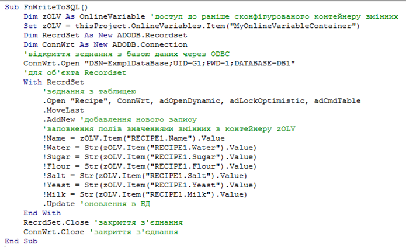 

*Рис. 8.20.* Лістинг програми добавлення нових записів рецепту у VBA

Для роботи з БД з VBA можна використовувати й інші бібліотеки, що підтримують інтерфейси OLEAutomation та ActiveX. SCADA zenon має можливість працювати з ODBC через драйвер SQLDRV. Однак цей драйвер дає можливість зчитувати та записувати значення змінних у наперед сконфігуровані у відповідному форматі таблиці RECEIVE та SEND. Цей драйвер можна використовувати як інтеграційну ланку з іншими застосунками. 

[<-- 8.2. Підсистема генерування подій](8_2.md)

[--> 8.4. Підсистема роботи з рецептами](8_4.md)