[Головна](README.md) > [8.Інші підсистеми SCADA/HMI](8.md)

# 8.4. Підсистема роботи з рецептами

## 8.4.1. Загальні підходи

Як зазначено в розділі 1, ***рецепт*** (recipe) є сукупністю технологічних параметрів, які зчитуються, записуються, зберігаються як єдине ціле. Рецепти дають можливість операторові зберегти в системі задані значення певних технологічних параметрів для приготування конкретного продукту. Якщо SCADA/HMI підтримує функціональність рецептів, вона повинна надавати в середовищі виконання, як мінімум, такі функції:

- створювати нові рецепти та модифікувати існуючі;

- видаляти або позначати як застарілі існуючі рецепти;

- зберігати та зачитувати рецепти з носія;

- записувати дані рецепта в контролер (теги);

- зчитувати дані з контролера (тегів).

Інші можливості залежать від інструментів. У SCADA/HMI, які не підтримують функціональність рецептів, можуть надаватися можливості реалізувати їх самостійно через підсистему скриптів та/або роботу з базами даних. 

## 8.4.2. Керування рецептами згідно з IEC-61512 та ISA-88

 Виробництва, які виготовляють продукт невеликими порціями (партіями) за окремим рецептом, де порція речовини одночасно проходить певну послідовність оброблення називається порційним (Batch Production). Згідно зі стандартом керування процесами порційного виробництва IEC-61512 [[1](https://webstore.iec.ch/publication/5528)] та його аналога ISA-88, рецепт включає не тільки параметри процесу (так звану формулу), а й послідовність технологічних кроків (так звану процедуру). Одна із ідей стандарту полягає в тому, щоб у системі керування устаткуванням (наприклад в ПЛК) реалізовувати технологічні кроки, а не всю технологічну послідовність. Це дає змогу означувати технологічну програму в процедурі майстер-рецепта (прототип) для кожного типу продукту (рис. 8.21) 

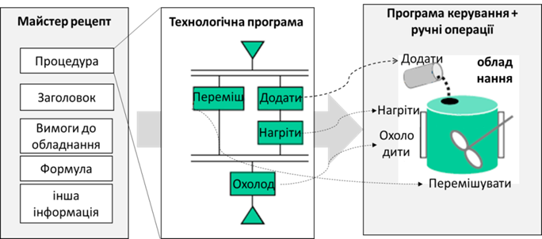 

*Рис. 8.21.* Взаємодія рецепта і керування устаткованням

   Весь стандарт не можна описати кількома реченнями. Детальніше про керування процесами порційного виробництва ви можете прочитати, наприклад, в [2] або з матеріалів ТДА [[3](http://www.tda.in.ua)]. Тут зупинимося на деяких особливостях, які стосуються означення рецептів.

Оскільки в рецепті означується технологічна програма (процедура), засоби SCADA/HMI повинні надавати можливість забезпечувати створення, редагування та контроль виконання процедури рецепта. Це може мати такий вигляд, як на рис. 8.22. Такі засоби надають можливість створювати процедуру з паралельно-послідовним виконанням, умовні переходи та ін. Тому, зазвичай для цього в програмному пакеті SCADA/HMI повинен бути присутній спеціалізований модуль, або ця функціональність реалізовується у вигляді окремого програмного пакету типу "Batch Control".

Простіші варіанти потребують означення номера процедури етапу (найменшої технологічної діяльності) на кожному з кроків технологічної програми (рис. 8.23). Це дає змогу реалізувати керування згідно зі стандартами Batch Control без використання спеціалізованих модулів. 

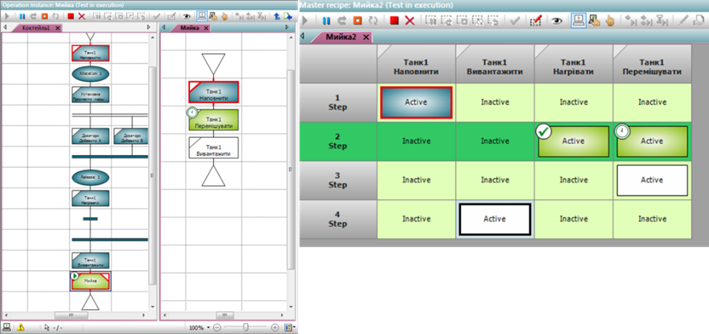 

*Рис. 8.22.* Приклади процедури рецепта в режимі виконання, описані мовою PFC (ліворуч) та у вигляді таблиці (праворуч) 

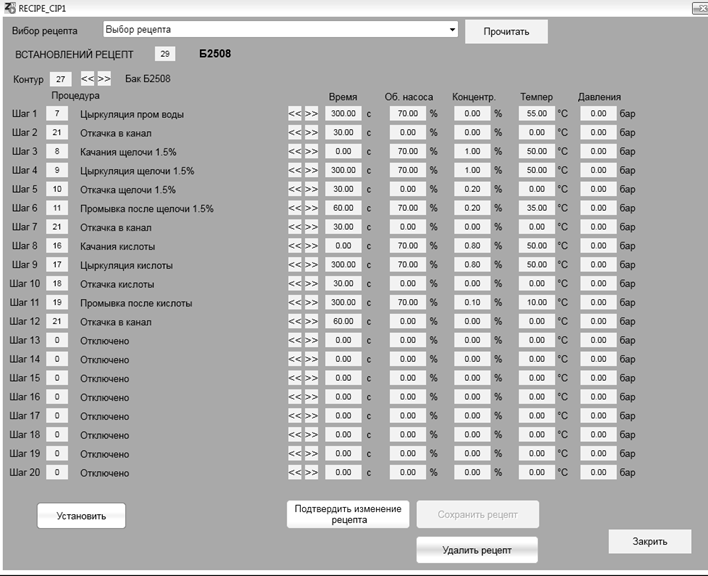 

*Рис.8.23.* Приклад варіанта налаштування рецепта означенням номера процедури на кожному кроці

У будь-якому випадку стандарт IEC-61512 потребує методики керування версіями рецепта. На початку майстер-рецепт знаходиться в режимі редагування, який можна перевірити шляхом тестових запусків, але не виробляти продукту. Після перевірки рецепт переходить у режим робочого аж до тих пір, поки його не виведуть із обслуговування. Робочий рецепт не можна змінювати, тому що на ньому зав’язана вся історія виготовлення партій продукції, що проводилася згідно цього рецепту. 

## 8.4.3. Підсистема рецептів у SCADA Citect 

У SCADA Citect явно виділеної підсистеми для керування рецептами немає. Найпростішим з точки зору реалізації способів є використання вбудованого в палітру ActiveX елемента компоненту "DataBase Exchange". До його функцій належать (рис. 8.24):

- відображати вибрані за певними критеріями (задається у Filter) дані із джерела у вигляді таблиці; 

- редагувати дані записів у табличному вигляді;

- завантажувати дані з вибраного запису у прив’язані теги (Download);

- вивантажувати дані з прив’язних тегів у записи (Upload);

- друкувати. 

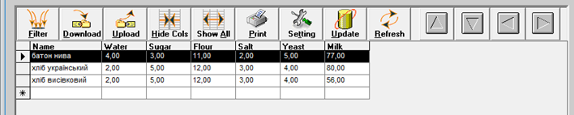 

*Рис .8.24.* Зовнішній вигляд ActiveX компоненту DataBase Exchange в режимі виконання

По суті, компонент є звичайним табличним редактором даних з БД, оформлений під керування рецептами. Ґрунтується він на технології ADO, тому при редагуванні вказується рядок підключення (рис. 8.25).

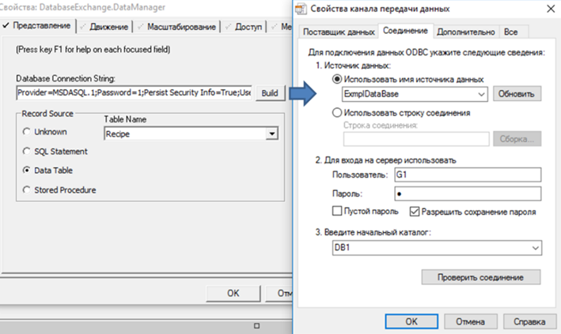 

*Рис. 8.25.* Налаштування джерела даних для DataBase Exchange

Далі вказується прив’язка полів (колонок) до тегів (рис. 8.26) подібно до інших ActiveX в Citect.

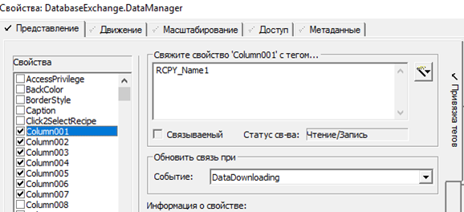 

*Рис. 8.26.* Налаштування зв’язку полів запису DataBase Exchange

Для реалізації інших функцій рецептів можна скористатися Cicode.

## 8.4.4. Підсистема рецептів у SCADA zenon 

У SCADA zenon рецепти реалізовані у вигляді двох модулів:

- стандартні рецепти (Standard Recipes) – входять в стандартну поставку;

- адміністратор груп рецептів (Recipegroup Manager) – додатковий модуль.

Окрім того, SCADA zenon має модуль керування порційним виробництвом згідно з IEC-61512. Розгляд цього модуля виходить за рамки посібника, детальніше з його роботою можна ознайомитися з лабораторного практикуму [4]. Тут зупинимося на функціях стандартних рецептів та груп рецептів. 

Рецепти в SCADA zenon можна створювати та модифікувати як у середовищі виконання, так і в середовищі розроблення. Для того, щоб при перенесенні проекту рецепти середовища розроблення не замінили рецептів, створених в середовищі виконання, за замовченням у налаштуваннях проекту "Runtime Changeable Date" для параметра "Standard Recipe" стоїть значення "Do not generate and transfer" (не генерувати і не переносити). SCADA zenon також дає змогу переносити рецепти із середовища виконання в середовище розроблення.

У середовищі розроблення стандартні рецепти створюються в однойменному розділі проекту (рис. 8.27). Для рецепта вибираються необхідні змінні та задаються задані значення. 

Записування значень рецепта в змінні, зчитування, імпорт і експорт можна виконати через відповідні функції zenon (рис. 8.28). 

Для створення, модифікації та видалення рецептів у середовищі виконання в SCADA zenon є спеціальний тип екрана "Standard Recipes" (рис. 8.29). Використовуючи дані екрани, оператор у змозі виконати усі операції з рецептами, включаючи добавлення нових змінних. SCADA zenon також підтримує імпорт і експорт рецептів, завдяки чому їх можна переносити на інші робочі станції. 

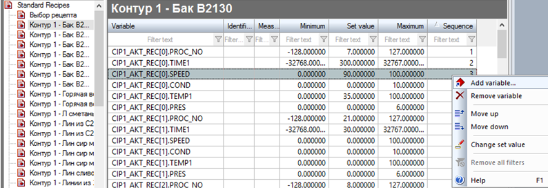 

*Рис. 8.27.* Налаштування стандартних рецептів у середовищі розроблення

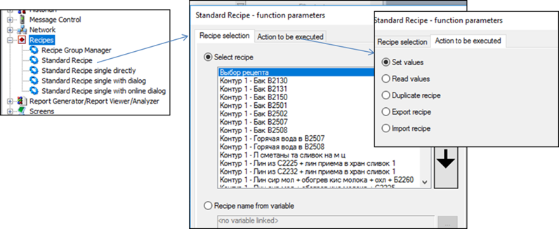 

*Рис. 8.28.* Функції для керування рецептами 

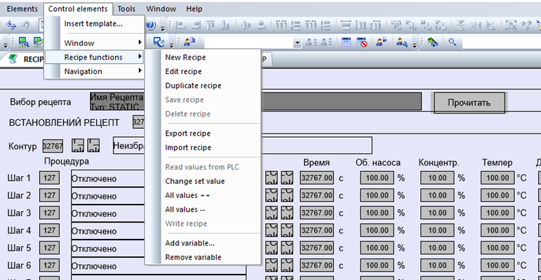 

*Рис. 8.29.* Наповнення екрана типу "Standard Recipes" 

Адміністратор груп рецептів (Recipegroup Manager) підтримує додаткові можливості по керуванню рецептами. Зокрема, він дає можливість групувати рецепти разом за певною ознакою. Стандартні рецепти надають операторові можливість вибрати рецепт серед усіх існуючих. У більшості випадків рецепти означуються для певної групи устатковання. Наприклад, якщо рецепти необхідно розподілити між трьома контурами CIP-мийки, то бажано створити окремі групи для кожного контуру, щоб операторові зручно було вибирати потрібний рецепт. Для кожної групи задається свій набір змінних (рис. 8.30).

Другою особливістю модуля Recipegroup Manager є можливість керувати версіями та статусом рецепту. Можна означувати свої статуси, наприклад "у розробці", "робочий" та "застарілий", які будуть надаватися рецепту на певному етапі. Цей статус рецепта можна використовувати як фільтра для відображення рецептів у переліках. Також виконання рецептів можна блокувати. 

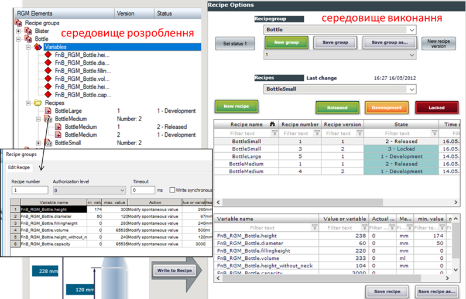 

*Рис. 8.30.* Налаштування групи рецептів модуля "Recipegroup Manager" у середовищі розроблення та середовищі виконання 

Групи рецептів також можна налаштовувати як у середовищі розроблення так, і в середовищі виконання. Доступні різноманітні дії з рецептами через налаштування єдиної функції Recipegroup Manager (рис. 8.31), а також через однойменний тип екрана. 

Крім цього, адміністратор груп рецептів дає можливість керувати рецептами опосередковано через змінні, імпортувати та експортувати рецепти через XML.

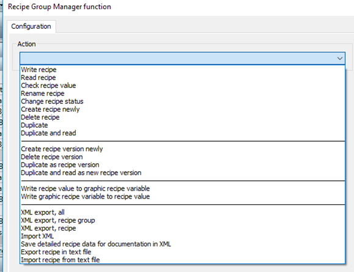 

*Рис. 8.31.* Налаштування функції "Recipegroup Manager" 

## 8.4.5. Підсистема рецептів у WinCC Comfort

У WinCC Comfort рецепт (Recipe) більше нагадує групу рецептів. У довідниковій системі TiA Portal рецепти порівнюють із шухлядою з рецептурними карточками (рис. 8.32). Для рецепта означують набір рецептурних елементів, кожен з яких прив’язується до тегу і має налаштування значення за замовченням, мінімум та максимум. Конкретний рецепт, що належить до цієї групи з однаковим набором елементів, становить один ***рецептурний запис*** (***recipe data record***). При налаштуванні рецепта в середовищі виконання, спочатку вибирають рецепт (групу рецептів), а потім вибирають/створюють/видаляють рецептурний запис, в якому змінюють значення елементів. 

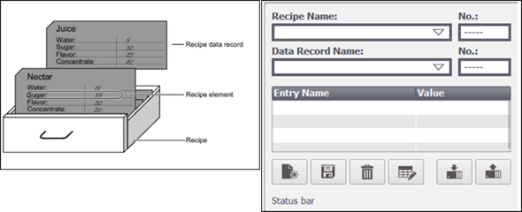 

*Рис. 8.32.* Структура рецепта (ліворуч) та його налаштування (праворуч) у WinCC Comfort 

Рецепт створюється в середовищі розроблення через однойменний розділ проекту. У ньому означується місце зберігання рецептурних записів, максимальна їх кількість, рецептурні елементи з прив’язуванням до тегів (рис. 8.33). У середовищі розроблення також можна задати рецептурні записи, щоб використовувати їх після завантаження проекту в ОП.

Також є можливість задавати значення рецепта не звичайним уведенням значення, а вибором із випадаючого списку. Для цього при створенні рецепта для його елемента, для якого планується вибір значення з випадаючого списку, необхідно у властивостях Basic Settings підв’язати Text list (див. рис. 8.33). Тоді в середовищі виконання замість поля для введення буде поле з вибором значення. 

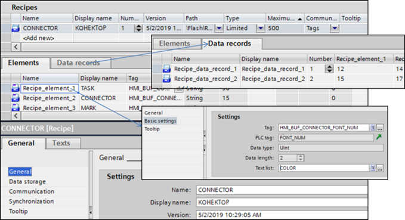 

*Рис. 8.33*. Налаштування рецепта в середовищі розроблення WinCC Comfort 

У середовищі виконання рецепти можна відобразити й редагувати з використанням компонентів переглядача рецептів (Recipe view) або створювати власні рецептурні екрани (Recipe screen) з прив’язуванням до тегів, що пов’язані з рецептом та використанням функцій (рис. 8.34). Переглядачі рецептів дають можливість відкривати й редагувати (при виставленій опції "Edit Mode") рецепти у табличному вигляді. При редагуванні рецепта значення зберігаються в рецептурних записах ОП. Запис чи читання з ПЛК (тегів) відбувається через функції, наведені на рис. 8.34.

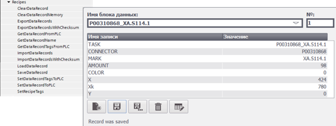 

*Рис. 8.34.* Функції керування рецептом (ліворуч) та приклад переглядача рецептів (праворуч)

[<-- 8.3. Доступ до баз даних зі SCADA/HMI](8_3.md)

[--> 8.5. Підсистема звітів](8_5.md)