[Головна](README.md) > [8.Інші підсистеми SCADA/HMI](8.md)

# 8.5. Підсистема звітів

## 8.5.1. Загальні підходи

Для аналізу подій і тривог, тенденції зміни технологічних параметрів протягом певного часу можна скористатися відповідними переглядачами. Крім виведення на екран, вони дають змогу виводити тренди та журнали на принтер. Не дивлячись на те, що в цей спосіб можна вивести багато корисної детальної інформації, вона не є достатньо обробленою для отримання показників ефективності роботи процесу чи установки. Для виведення загальних показників застосовують звіти. 

***Звіт*** (Report) – це документ або сторінка, сформовані на основі означеного для нього формату та статистично оброблених плинних чи історичних даних. У ***форматі звіту*** позначується розміщення та призначення полів, а при генеруванні звіту ці поля заповнюються конкретними значеннями. Крім полів, вміст яких залежить від даних, формат звіту може вміщувати статичну графічну та текстову інформацію.

Звіти можуть генеруватися автоматично, наприклад, у разі виникнення події чи тривоги, або періодично в зазначений астрономічний час. Також вони можуть генеруватися за запитом оператора. Звіт може мати вигляд надрукованого документа, файлу формату PDF, RTF, TXT, CSV, HTML сторінки або таблиці Excel чи якоїсь бази даних. Звіти у вигляді текстових документів насамперед цікавлять керівний персонал, якому вони потрібні для аналізу технологічного процесу. Електронні таблиці потрібні для ведення автоматизованого загальновиробничого обліку (наприклад, передача на рівень керування виробництвом та підприємством). Наприклад, кількість спожитої теплоенергії можна використати для розрахунку собівартості продукції. Звіти можуть бути оформлені у вигляді онлайн сторінки з основними показниками (наприклад, для відображення KPI) – це так звані ***Dashboard***. 

Підсистема звітів може бути частиною SCADA/HMI або реалізована зовнішніми програмними засобами, як правило, набагато функціональнішими. Зовнішня підсистема звітів може бути оформлена у вигляді окремого програмного сервера з Веб-доступом, який приймає запити на формування звіту через HTPP API і генерує їх у форматі HTML. 

У будь-якому випадку вхідними для підсистеми звітів є:

- джерело даних, яке використовується для вибірки та представлення необхідної інформації у звіті; 

- формат звіту, який указує, як саме виглядатиме звіт (наприклад файл RTF, XML);

- параметри, які використовуються у форматі звіту для уточнення того, як слід генерувати звіт (наприклад, діапазон дат, за який необхідно вивести звіт, або назва даних). 

Джерелом даних можуть бути як дані реального часу, так і база даних або файли (наприклад XML, CSV). Доступ до цих даних із підсистеми звітів може проводитися з використанням технологій, розглянутих у 8.3. Часто для формування вибірки використовується мова SQL.

Формат звіту, як правило, створює окремий редактор. Це може бути файл або для онлайн звітів – онлайн форма. У ряді підсистем формат звіту можна не задавати, користувач на льоту налаштовує вигляд звіту (Dashboard) через онлайн сторінку. Формат звіту включає означення даних (поля), які будуть використовуватись у звіті. При використанні даних з БД вказується джерело даних та фільтри для запиту (наприклад, запит мовою SQL). У форматі налаштовується зовнішній вигляд, який може включати кілька розділів, які задають позицію і зміст звіту. Оскільки офлайн звіт – це окремий документ, він може містити усі частини такого документа. Тому можна виділити кілька типів розділів: 

- титул (title), або титульний аркуш (title page), з якого починається звіт;

- заключна сторінка (back page, last page);

- сторінки, кожна з яких може включати:

  - заголовок, колонтитул (header), який повторюється зверху кожної сторінки; 

  - деталі, безпосередньо зміст сторінки (detail);

  - нижній колонтитул (footer), який повторюється внизу кожної сторінки;

- фон.

Деталі сторінки можуть включати таблиці, які можуть потребувати заголовки (header), що повторюватимуться на кожній сторінці, і рядок зведення (summary), який буде заключним.

Параметри звіту можна сприймати як формальні параметри функції, яка генерує звіт. 

У наступних параграфах розглянемо приклад налаштування звітів у різних редакторах SCADA/HMI та сторонньому – Jaspersoft.

## 8.5.2. Підсистема звітів з використанням Jaspersoft

Використання спеціалізованих застосунків для звітності розглянемо на прикладі програм Jaspersoft [5]. На момент написання посібника до проектів Jaspersoft входить кілька застосунків:

- JasperReports Library – популярний рушій для звітів з відкритим кодом, написаний на Java, що вміє генерувати звіти в різних форматах, у тому числі HTML, PDF, Excel, OpenOffice та Word; 

- Jaspersoft Studio – редактор шаблонів звітів, що базується на eclipse; 

- JasperReports Server – сервер звітів;

- Jaspersoft ETL – рушій для інтеграції даних з різних джерел; вміє оброблювати дані відповідно до вказаних правил і завантажувати в єдину БД для звітності; 

- JasperReports IO – сервіси для формування звітів та візуалізації даних на базі хмарних обчислень; 

- VISUALIZE.JS – програмний каркас для javascript на базі бібліотек Jaspersoft, призначений для вбудовування звітів, візуалізації та аналітики в застосунок. 

Багато з наведених вище ресурсів мають дві редакції: Community Edition (безкоштовний) і Commercial Edition (платний з додатковими функціональними можливостями). Для формування звітів з використанням JasperReports Library необхідно розроблювати власний код на Java, що не входить в компетенцію спеціалістів з автоматизації. Те саме, очевидно, стосується JasperReports IO і VISUALIZE.JS. З наведених вище для формування звітів для SCADA може використовуватися тільки два застосунки – Jaspersoft Studio та JasperReports Server. 

Редактор Jaspersoft Studio призначений для розроблення формату (шаблону) звіту, в якому означується, що саме повинно виводитись у звіті (ресурси даних) і в якій формі. Цей редактор зберігає шаблон звіту у вигляді XML файлу з розширенням *.jrxml. Редактор дає змогу зробити повноцінне тестування роботи звіту, тому по суті має вбудовані засоби для генерування звіту. Однак останнє потрібно тільки з метою відлагодження формату звіту, а не для формування під час роботи.

Генерування звіту проводиться рушієм JasperReports Engine. Для цього попередньо файл проекту шаблону звіту (jrxml) компілюється у файл *.jasper. Цей файл, а також вказівка на джерело даних передається рушію, який формує звіт у вказаному форматі (рис. 8.35). Рушію також можна передати параметри, які можуть вказувати на додаткову інформацію, що потребується для формування звіту і змінюється (типу фактичних параметрів функції). 

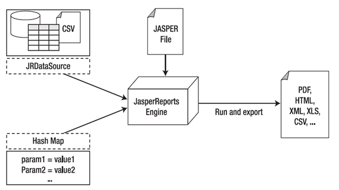 

*Рис. 8.35.* Принципи формування звітів з використанням застосунків Jaspersoft

JasperReports Server якраз і займається процесом генерування звітів. Він є WEB-застосунком, який вміщує шаблони звітів, має доступ до джерел даних та може формувати онлайн звіти. Також він має функції планувальника, дає змогу робити інтерактивні звіти тощо. Доступ до даних може проводитись через різноманітні адаптери даних (рис. 8.36, ліворуч), розроблені під Java, зокрема через JDBC. 

Отже, якщо необхідно побудувати підсистему звітності з використанням Jaspersoft, необхідно:

1) забезпечити збереження необхідних даних в БД, що підтримується адаптерами, наприклад одним із драйверів JDBC; налаштувати джерело даних для доступу;

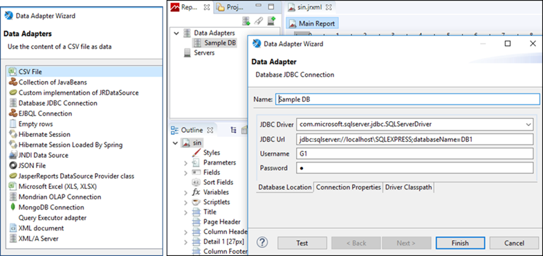 

*Рис. 8.36.* Налаштування адаптера JDBC (праворуч) 
 та перелік доступних адаптерів даних (ліворуч) 

2) розробити шаблон звіту з використанням JasperReports Engine; скомпілювати шаблон звіту;

3) інсталювати та налаштувати JasperReports Server, попередньо помістивши туди скомпільований шаблон звіту та всі необхідні додаткові ресурси (наприклад рисунки);

4) ініціювати генерування звіту через візуальний ВЕБ-інтерфейс серверу або API. 

   Якщо звіти необхідно формувати локально на одному ПК зі SCADA/HMI замість JasperReports Server, то можна використати програму JasperStarter [6], яка реалізує команди генерування звіту через командний рядок. Це не альтернатива сервера і не підтримує його функції, а є, радше, локальним замінником генератора звіту. 

Далі розглянемо приклад формування шаблону звіту в Jaspersoft Studio та використання JasperStarter для генерування звіту. Для прикладу вважатимемо, що SCADA записує дані змінних "sin" та "ramp" у таблицю DataRep бази даних DB1 (див. параграф 8.3.3) на MS SQL Server Express. Звіт повинен генеруватися за запитом і вміщувати таблицю та тренд за вказаним діапазоном часу.

Формат таблиці показано на рис. 8.37. Він включає в себе одне поле DT, в якому пишеться дата та час записування (означено в полі Default Value or Binding), і два поля для змінних "ramp" та "sin", в які записуються значення змінних. Зверніть увагу, що значення з плаваючою комою для цих змінних пишеться як текст з 5-ма символами (DataType = char(5)), з яких два символи йдуть після коми. Це пов’язано з тим, що вибрана для прикладу SCADA (у даному випадку Citect) не вміє писати в SQL в іншому форматі. Тому надалі доведеться враховувати два аспекти:

- текстовий формат поля;

- використання "." або "," як роздільників цілої і дробової частин залежно від налаштувань операційної системи.

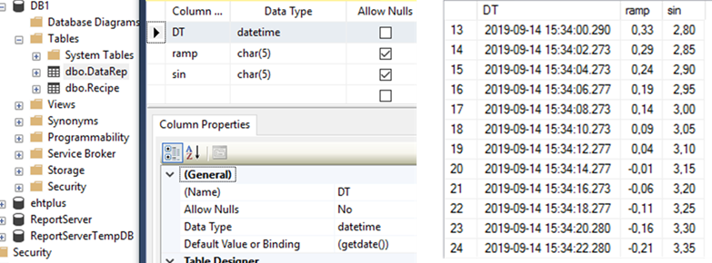 

*Рис. 8.37.* Поля таблиці DataRep 

Для формування шаблону звіту у Jaspersoft Studio створюється проект, в якому означується шаблон звіту. Для перевірки працездатності шаблону необхідно до Jaspersoft Studio підключити драйвери, означити адаптери, через які в проектах будуть підключатися джерела даних. Це робиться в закладці репозитарію (рис. 8.38). У нашому випадку використовується JDBC драйвер для MS SQL Server. Попередньо драйвери JDBC для MS SQL Server необхідно завантажити з сайту Microsoft у довільну директорію, яку вказати в налаштуваннях адаптера Driver Classpath (див. рис. 8.38). У налаштуваннях адаптера вказується JDBC Url, де зазначається адреса й назва екземпляра СКБД та ім’я бази даних. Тут же вказується ім’я користувача та пароль. Слід розуміти, що для застосунку, який генеруватиме звіт на основі розробленого шаблону, також доведеться конфігурувати адаптер. У репозитарію, окрім адаптера, можна вказати розміщення JasperReports Server, в який з цього редакторові можна буде пересилати шаблони й додаткові ресурси.

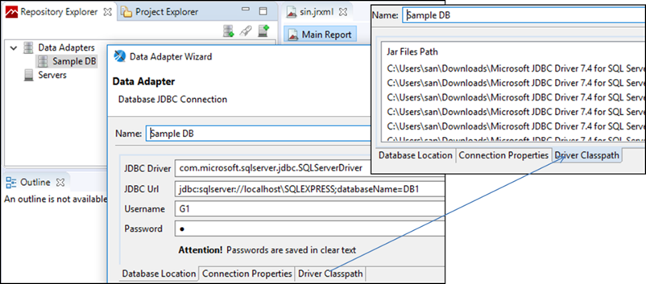 

*Рис. 8.**38.* Налаштування адаптера БД та розміщення драйверів 

Для створеного проекту необхідно налаштувати джерела даних, що робиться через "Dataset and Query" (рис. 8.39). У цьому прикладі вибирається потрібна таблиця (DataRep) з підключеного адаптера. Необхідні дані (вибірка) вказуються через SQL-запит. Враховуючи що необхідно формувати звіт за вказаним діапазоном часу, в проекті попередньо в розділі Parameters створюються та налаштовуються параметри звіту. 

Нагадаємо, що параметри звіту дають можливість при генеруванні звіту передати в рушій додаткові необхідні дані. У цьому прикладі створено чотири параметри "FROMs", "TOs", "FROM1" та "TO1". Причиною 4-х параметрів замість 2-х (початкова і кінцева дата) є неможливість передачі параметрів рушію JasperStarter з типом, відмінним від STRING. Параметри "FROM1" та "TO1" мають спеціальний тип “net.sf.jasperreports.types.date.TimestampRange” який можна використовувати у функції BETWEEN. У запиті спеціальні виклики $X (див. рис. 8.39), дає можливість викликати функцію BETWEEN, яка повертає істину, якщо значення поля DT (дата та час) входить у діапазон FROM1 та TO1. Таким чином, вибірка буде проводитися тільки для записів із зазначеним діапазоном. Якщо параметри не передаються, вони будуть розраховуватися за замовченням відповідно до властивості "Default Value Expression". У цьому прикладі значення цих параметрів за замовченням розраховується на основі "FROMs" та "TOs" (див. рис. 8.39), де $P{параметер} – це звернення до вказаного параметру. Слід також звернути увагу, що параметри мають властивість "Evaluation Time" = EARLY, що вказує на необхідність їх розрахунку до використання в запиті. 

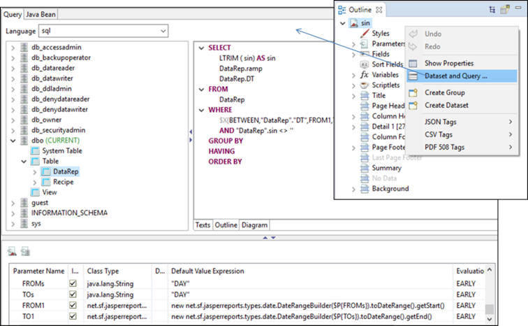 

*Рис. 8.39.* Налаштування джерел даних

Також в запиті необхідно видалити усі пробіли (LTRIM) та вилучити з результату записи з пустими полями. На рис. 8.39 це зроблено тільки для поля "sin", але бажано це зробити і для інших полів.

Шаблон звіту означується набором різних елементів. Для прикладу на рис. 8.40 показано, як налаштовуються деякі з елементів. Для звернення до конкретних полів з означених джерел даних використовується синтаксис $F{поле}, для параметрів – $P{параметр}, для змінних – $V{}. Для трендів у полі Value треба задати поле зі значенням, однак, як сказано вище, поля мають текстовий формат, крім цього вони можуть вміщувати в якості розділювача як крапку, так і кому. Тому для поля Value використовується вираз, який спочатку замінює усі коми на крапки, а потім робить перетворення в FLOAT (див. рис. 8.40). 

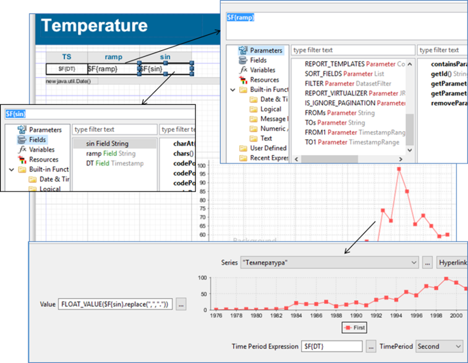 

*Рис. 8.40.* Налаштування елементів шаблону звіту

Після означення шаблону звіту його можна перевірити через вкладку Preview, де перед генеруванням треба задати поля (рис. 8.41). 

Після створення і перевірки шаблону звіту його необхідно скомпілювати (Build Project), в результаті чого в папці проекту з’явиться файл з розширенням *.jasper. Тепер цей файл можна використовувати для генерування звітів в JasperReports Server або в JasperStarter. Останній керується з командного рядка. Для простоти його використання в цьому прикладі створено файл *.cmd, який генерує командний рядок на основі  2-х вхідних параметрів, що вказують на діапазон часу, для якого треба згенерувати звіт. Для зручності коментування рядок розбито на частини, до кожної з яких наводиться коментар (рис. 8.42).

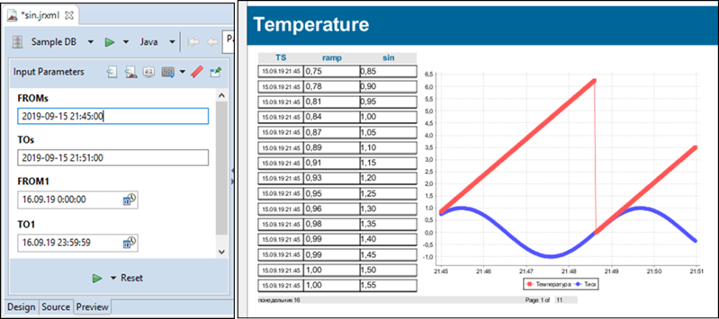 

*Рис. 8.41.* Перевірка роботи звіту

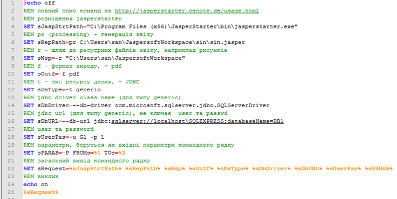 

*Рис. 8.42.* Командний файл для виклику JasperStarter

Приклад виклику звіту через командний рядок:

```
C:\tmp\rep.cmd "2019-09-15 21:45:00" "2019-09-15 21:51:00"
```

## 8.5.3. Підсистема звітів у Citect

Вбудована в Citect підсистема звітів дає змогу досить швидко розробити прості звіти за даними тегів, однак має обмежену функціональність. Проектування звітності проходить за класичним принципом:

- розроблення формату (шаблону) звіту;

- означення звіту, в якому вказується формат, пристрій, куди буде виводитися звіт, та умова, при якій буде відбуватися виведення;

- генерування звіту через виклик функції (опційно).

Формат звіту можна задавати у двох виглядах: текстовому (ASCII-файл) та RTF. Останній дає можливість зробити форматування кольору, шрифтів, вставляти рисунки і OLE-об’єкти. ASCII-файл, по суті, є звичайним текстовим файлом, який не вміщує форматування. Однак на його базі можна робити формати для виведення html-сторінок. Крім того, в ASCII-файлі формату підтримується додаткова можливість по оброблення Cicode.

Незалежно від того, який вибрано тип формату звіту, він включає звичайний текст та замінники, які виділяються фігурними дужками. Вміст фігурних дужок сприймається як Cicode-вираз. Наприклад, вираз {LOOP_1_PV:#-###.#EU} означає, що в цьому місці шаблону буде вставлене значення тегу LOOP_1_PV. У шаблон можна вставляти розділ з програмою Cicode, яка може попередньо оброблювати дані:

```
{CICODE}
Cicode_програма;
{END}
```

Для шаблону типу ASCII-файл дозволяється використовувати Cicode змінні, а для RTF – ні. 

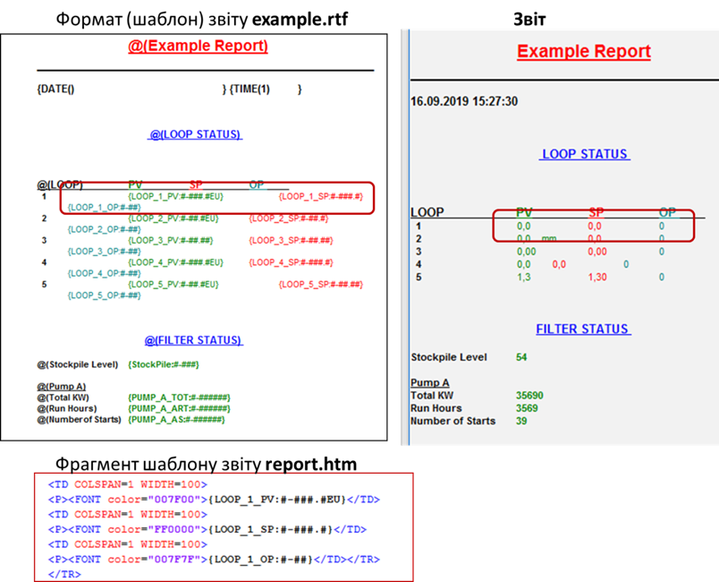 

*Рис. 8.43.* Приклад означення форматів звіту у вигляді rtf та html (ліворуч) та вигляд звіту (праворуч)

Звіт означується в однойменному розділі проекту. Для звіту вказується ім’я, формат, попередньо створений пристрій виведення (див. параграф 6.11.6) та час/період або/та подія для генерування (рис. 8.44). Звіт також можна генерувати з використанням Cicode функції "Report". 

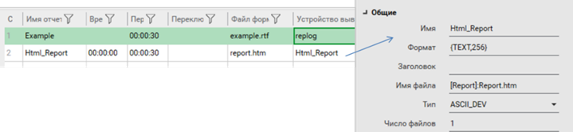 

*Рис. 8.44.* Означення звіту в Citect та пристрою виведення

Описаним вище способом досить просто робляться звіти для виведення тегів у вказаному форматі. Якщо необхідно виводити дані історії, звіти потребують написання Cicode з використанням функцій доступу до трендів, такі як TrnGetTable(). У будь-якому випадку для створення потужних звітів без програмування необхідно використовувати сторонні сервіси типу Jaspersoft або впроваджувати підсистему централізованого збору даних та звітності типу Historian (див. підрозділ 9.3). 

У випадку використання Jaspersoft через JasperStarter, як це описано в параграфі 8.5.2, можна скористатися Cicode функцією Exec, як це показано на рис. 8.45. 

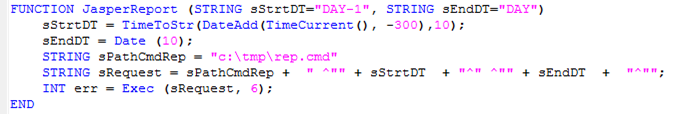 

*Рис. 8.45 .*Запуск звіту JasperStarter через командний файл з Cicode

## 8.5.4. Підсистема звітів у zenon

SCADA zenon підтримує два типи звітів: 

- Report Generator;

- Report Viewer.

**Report Generator** 

Генератор звітів (Report Generator) розраховує дані та виводить на звіт інформацію за даними процесу та архівними даними. Конфігурування звітів відбувається в кілька етапів:

- означення формату (шаблону) звіту в розділі Report Generator; 

- створення функції для генерування звіту або/та створення спеціального для виведення звіту.

Формат звіту ґрунтується на основі комірок, у кожній з яких можна задати певну функцію та формат. У режимі виведення звіту інформацію можна не тільки виводити, а й змінювати. Серед функцій комірок є загальні (подібні до функцій Excel) та спеціалізовані, які належать до однієї з груп: функції роботи з базами даних; функції дати й часу; логічні; доступу до архіву і журналів; статистичні; математичні та тригонометричні; текстові; функції керування групами рецептів та ін.

На рис. 8.46 показано приклад налаштування формату звіту. Для комірок з виведенням даних з архівів вказуються:

- функція archive, яка вибирає дані з означеного архіву з відповідним номером;

- властивість запису архіву, наприклад, “time” для виведення часу або “value” для виведення збереженого значення;

- куди будуть записуватися вилучені з архіву значення (bottom – вниз); кількість виведених даних залежатимуть від параметрів дати та часу, що задаються при виконанні звіту. 

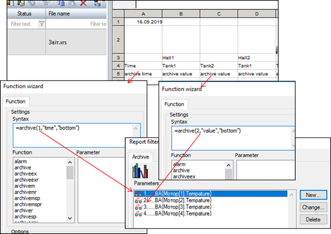 

*Рис. 8.46.* Налаштування формату (шаблону) звіту 

Для генерування звіту можна викликати функцію "Report Generator: execute", в якій задати формат звіту, діапазон часу і за необхідності – додаткові параметри (див. рис. 8.47).

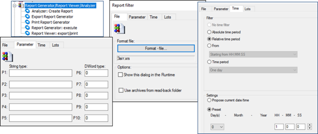 

*Рис. 8.47.* Налаштування функцій Report Generator 

Можна також створити екран з типом "Report Generator", в якому доступні аналогічні функції. 

**Report Viewer**

Переглядач звітів (Report Viewer) призначений для генерування та відображення звітів у SCADA zenon у форматі RDL. Report Definition Language (***RDL***) (мова означення звітів) — стандарт, що пропонує Microsoft для означення звітів. Аналогічно, як звіти Jasper використовують формат jrxml, служби звітів Microsoft використовують файли RDL. RDL – це XML файл, який, як правило, використовується сервісами генерування звітів – Microsoft SQL Server Reporting Services (SSRS). Цей формат можна створювати та редагувати MS Visual Studio або іншими редакторами, наприклад, безкоштовним MS Report Builder.

RDL вміщує:

- поля, які відображають дані з джерела даних, формул, змінних;

- розмітку сторінки;

- параметри. 

Спочатку у відповідному розділі проекту zenon створюється файл RDL (див.рис. 8.48). При створенні вказуються необхідні набори даних (Data Sets) та параметри. SCADA zenon за замовчуванням означує формат звіту самостійно. Після створення файл RDL редагується стороннім реактором (наприклад, MS Report Builder). Також можна підключити створений до цього файл. Далі для формування та відображення звіту використовується спеціальний тип екрана Report Viewer (див. рис. 8.48). На екрані можна розмістити спеціальні кнопки, наприклад, для виведення звіту на друк, PDF або Excel файл. 

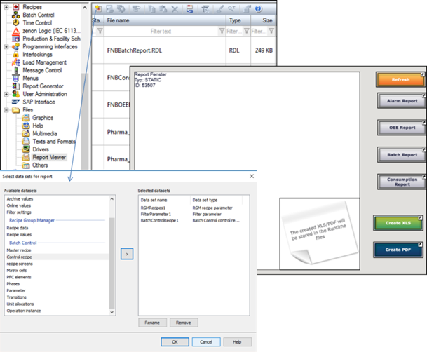 

*Рис. 8.48.* Створення файлів RDL (ліворуч) та зовнішній вигляд екрана типу Report Viewer (праворуч) 

Далі створюють функцію виклику екрана, в яку передають назву файлу звіту, переозначують за необхідності набори даних, параметри фільтрів та інші параметри. Report Viewer може використовуватися для відображення архівних даних, тривог AML, журналів CEL, плинних змінних та інших даних. Для цього ці дані передаються через набори Data Sets (рис. 8.49), які вибираються через модулі zenon. Для кожного набору вказуються додаткові налаштування, наприклад, для архівів – змінні, які необхідно передати у звіт. Після вибору набору даних означуються фільтри: часові та залежні від модуля набору даних. 

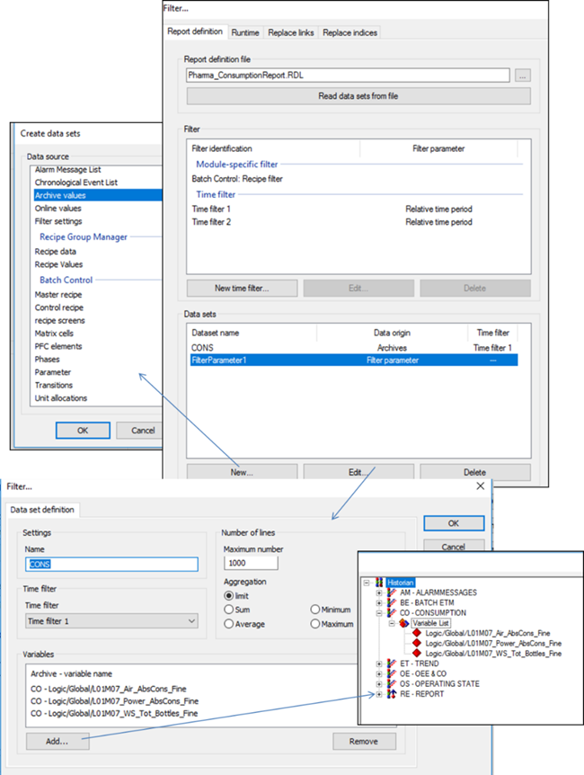 

*Рис. 8.49.* Означення наборів даних та фільтрів для Report Viewer

Редагування RDL файлу у MS Report Builder схоже на аналогічні дії в Jasper Studio (рис. 8.50). Означені набори даних передаються у форматі XML, з яких вибираються необхідні поля і використовуються при відображенні даних. 

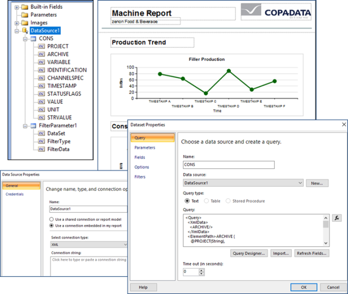 

*Рис. 8.50.* Означення формату для RDL у MS Report Builder

## 8.5.5. Підсистема звітів у WinCC Comfort

У WinCC Comfort формат звітів створюються у однойменному розділі проекту. Він включає кілька секцій:

- титульний аркуш (title page), з якого починається звіт;

- заключна сторінка (back page);

- деталізовані сторінки (Detail pages);

- верхні колонтитули (Headers) та нижні колонтитули (footers) для деталізованих сторінок.

На сторінках можна виводити різні анімовані об’єкти, а також деякі спеціальні елементи та компоненти: 

- номер сторінки;

- audit trail – попередньо сконфігурований журнал, який записує дії оператора зі змінними та рецептами, а також логування/розлогування;

- recipe report – записи рецептів;

- alarm report – записи журналу тривог (за вказаний діапазон часу) або буфер активних тривог; час початку і кінця для виведення журналу задається змінними. 

Звіт можна вивести тільки на принтер, використовуючи функцію PrintReport, куди передається формат звіту. 

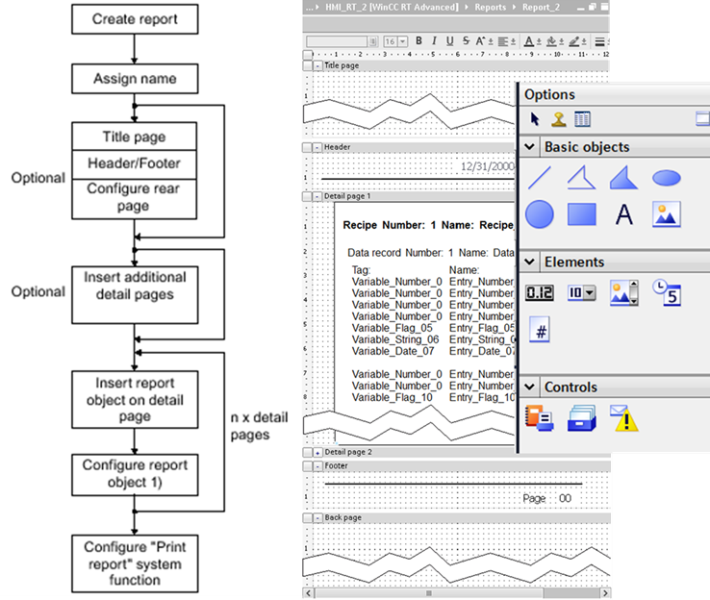 

*Рис. 8.51.* Означення звіту у WinCC Comfort