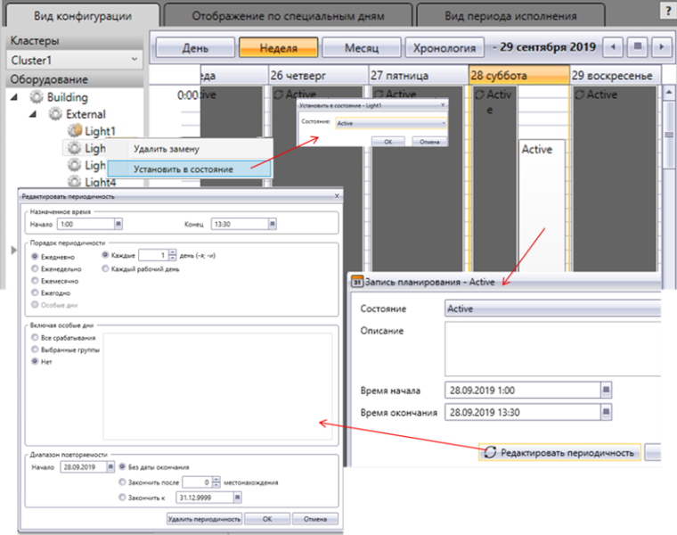
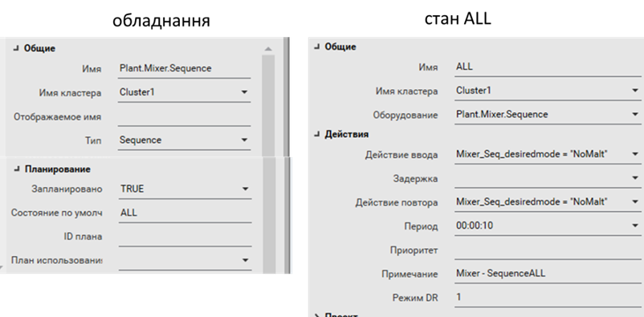
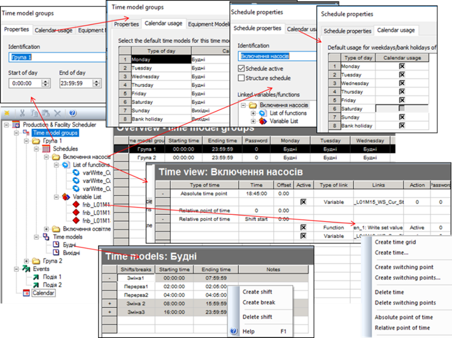
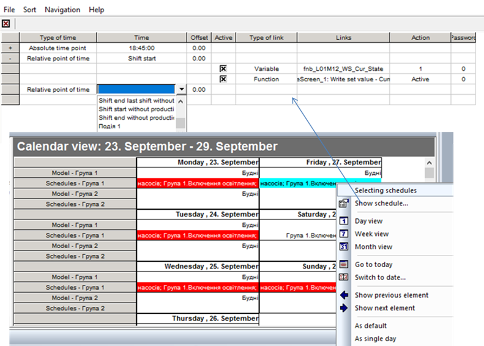

[Головна](README.md) > [8.Інші підсистеми SCADA/HMI](8.md)

# 8.6. Підсистема календарного виконання

## 8.6.1. Загальні підходи

Для ряду об’єктів повинно бути передбачене керування установками згідно з календарним графіком та астрономічним часом. Наприклад, у системах керування водо- та теплопостачанням може знадобитися вмикання та вимикання насосів згідно зі встановленим графіком. Це задача для спеціальних підсистем SCADA/HMI, які називаються ***планувальниками*** (Scheduler). 

Особливістю планувальника є можливість означення календарного плану в середовищі виконання. Іншими словами, час та дії, які повинні відбуватися в цей час, налаштовує не розробник системи керування, а оператор. 

Планувальники можуть надавати такі можливості в середовищі виконання:

- означення абсолютного часу для виконання дій, наприклад 23.10.2020 о 18:00;

- означення відносного часу для виконання дій, наприклад кожного понеділка о 18:00;

- означення спеціальних днів у календарі, тобто в яких виконується особливий план;

- означення дій у вигляді зміни тегів (змінних) або запуску функцій. 

## 8.6.2. Підсистема календарного керування у Citect

У Citect підсистема календарного керування ґрунтується на механізмі ієрархії устатковання (Equipment), що описаний у параграфі 9.2.3. Для устатковання повинні бути зконфігуровані ***Стани*** (Equipment States), у властивостях яких вказано що саме необхідно робити при активації та активності цього Стану. Для устатковання, яке повинно керуватися з планувальника, має бути виставлена в TRUE властивість "Заплановано" (Scheduled). 

Для реалізації графічного інтерфейсу на одній із дисплейних сторінок необхідно розмістити ActiveX компонент "Scheduler" (рос. лок. "Планировщик"), який є на палітрі компонентів Citect. Він не потребує конфігурування в середовищі розроблення, це може знадобитися хіба що для прив’язки певних властивостей до змінних. Уся діяльність налаштовується у Планувальнику в режимі виконання (рис. 8.52). На ньому доступні кілька вкладок, які дають можливість налаштовувати календарний план (у вигляді дня, тижня, місяця, хронології), контролювати кінцевий стан планування. Можна також добавляти спеціальні дні в календарі, для яких можна окремо конфігурувати поведінку устатковання.

У дереві відображається все доступне для планування устаткування (що має властивість Scheduled=TRUE). При виділенні устатковання, у календарному плані можна подивитися, встановити та змінити дату й час переходу на конкретний стан. 

Устатковання може перебувати в різних режимах, які відображаються відповідним символом:

- автоматичний (automatic) – режим, в якому стан задається планувальником відповідно до означеного календарного плану;

- заміщення (Override), також називається ручним, – коли станом керує оператор через контекстне меню. 

У контекстному меню устатковання є відповідні команди переходу в режим та в стан (у режимі Override). Перехід у режим та стан доступний також через функцію Cicode "EquipSetProperty". Функція "EquipGetProperty" дає можливість отримати активний режим та стан.

У Citect стани та режими поширюються вниз за ієрархією. Це значить, що устатковання нижчого рівня переходить в той самий стан та режим, що й вищий. Поширення стану справедливе тільки у випадку, якщо устатковання, нижче за ієрархією, не вказане в календарному плані на цей час або пріоритет його стану нижче за пріоритет батьківського. Дочірні елементи можна переводити в режим незалежно.

                               

*Рис. 8.52.* Зовнішній вигляд планувальника в Citect

Для устатковання, яке необхідно використовувати в підсистемі календарного планування, необхідно вказати перелік Станів, для кожного з яких треба зазначити (рис. 8.53):

- дію при вході в стан (Entry Action, рос.лок "Действие ввода") – дія, яка буде виконуватися в момент переходу в цей Стан; 

- затримку (Delay, рос. лок. "Задержка") – час, який повинен пройти після активації стану до виконання дії; це може знадобитися тоді, коли прийшов час на активацію кількох одиниць устатковання і треба уникнути одночасності, наприклад для зменшення сплесків струмів при вмиканні кількох двигунів;

- повторювана дія (Repeat Action, рос. лок. "Действие повтора") – дія, яка буде повторюватися з указаним періодом при активності стану; 

- період (Period) – час, через який буде виконуватися повторювана дія;

- пріоритет (Priority) – число, що вказує пріоритет стану, якщо кілька станів виникають одночасно (при поширенні станів);

- Режим DR (DR Mode) дає можливість задати кілька станів з різними діями на основі вибраного режиму споживання (Demand and Response); можна змінювати також через функцію EquipSetProperty.  

 

*Рис. 8.53.* Налаштування устатковання та Станів для нього. 

## 8.6.3. Підсистема календарного керування у zenon

У SCADA zenon підсистема календарного планування представлена двома модулями: 

- Scheduler – іде в стандартній редакції; 

- PFS (Production and Facility Scheduler) – є розширенням, замінює стандартний Scheduler, якщо наявна ліцензія. 

PFS є поліпшеною версією Scheduler. Тобто у нього наявні усі функції Scheduler та додаткові, зокрема:

- зазначення планових годин відносно початку та кінця змін, перерв та ін.;

- події, означені користувачем.

Тобто прив’язку дій (записування значення змінних або запуск функцій) можна робити не тільки до абсолютного часу, а й до вказаної події. Далі розглянемо основні функції PFS.

PFS можна конфігурувати як у середовищі розроблення, так і в середовищі виконання. Для того щоб при перенесенні налаштування PFS середовища розроблення не замінювали існуючі в середовищі виконання, необхідно в налаштуваннях проекту "Runtime Changeable Date" для параметра "Scheduler" поставити значення "Do not generate and transfer" (не генерувати і не переносити). SCADA zenon також дає змогу переносити налаштування PFS із середовища виконання в середовище розроблення.

Розглянемо, яким чином проводиться конфігурування в середовищі розроблення (рис. 8.54). У PFS календарні плани групуються за часовими інтервалами. Це дає можливість конфігурувати короткострокові плани (на добу) або відносно певної події, які пізніше можна добавляти до календаря. Кожна група часової моделі (time model group) включає календарні плани (Schedule) та часові моделі (Time models). 

Календарний план (Schedule) включає в себе перелік функцій та змінних, які в ньому використовуються, а також перелік дій, які відбуваються при активності плану. Наприклад, план "Включення насосів" включає три змінні та три функції, які можна використовувати в ньому. Дії задаються в часових точках (time), які можуть задаватися як в абсолютних одиницях часу (absolute point of time), так і відносно певної події (relative point of time). Подіями можуть бути:

- Start of cycle – щодня опівночі; Start of cycle without production – щодня опівночі, якщо не активна жодна зі змін або коли закінчуються усі зміни; Start of cycle with production - щодня опівночі, якщо активна хоча б одна зі змін;

- Begin of production – початок зміни, якщо до цього не було активної жодної зміни; End of production – кінець останньої зміни, якщо після цього не буде активною жодна зміна;

- Shift start – початок зміни; Shift end – кінець зміни;

- Start of break – початок перерви в зміні; End of break – кінець перерви в зміні;

- User-defined event – початок вказаної події користувача;

- інші. 

Параметр Offset задає зміщення в часі відносно події. Дії задаються точками перемикання (switching point). 

 

*Рис. 8.54.* Налаштування планувальника в PFS 

Об’єкт часової моделі (time model) включає означення змін (Shift) та перерв (Break), що потребуються для відповідних відносних подій у цій групі. Наприклад, на рис. 8.54 означено дві часові моделі: "Будні" та "Вихідні", для кожної з яких вказані зміни, а в межах змін є перерви. Початок та кінець змін та перерв можна використовувати в якості відносної точки події, як це описано раніше. 

Окрім стандартних подій, можна задавати користувацькі (User events), які можна викликати функцією "Execute PFS event". Користувацькі події задаються для всього планувальника.

Абсолютні та відносні часові точки, що означені в календарному плані, не мають фактичного відношення до конкретних днів календаря, оскільки для них означені лише часові налаштування. Календар дає змогу користувачам вказати, в які дні повинен бути виконаний певний календарний план. З цією метою користувачі можуть виділяти активну модель та активні календарні плани на кожен день, для кожної з перелічених груп моделей. Календар пропонує різні види, які можна вибрати відповідно до рівня деталізації, необхідної для інформації (рис. 8.55). Також zenon дає можливість налаштувати кольор залежно від стану та типу календарного плану. 

 

*Рис. 8.55.* Відображення календаря в PFS 

Для роботи з календарним планом у середовищі виконання, необхідно створити екран типу "Production & Facility Scheduler". Налаштування календарного плану проводиться так само як у середовищі розроблення. 